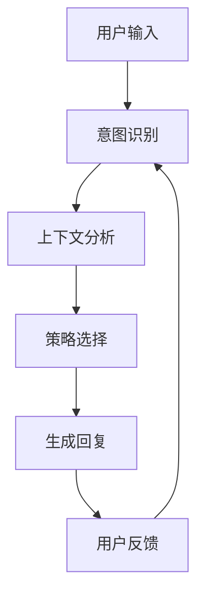
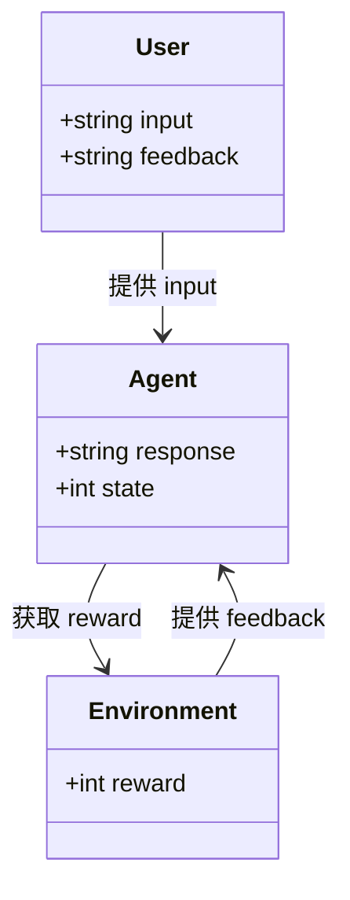

                 


# AI Agent的对话策略优化：提升用户体验

## 关键词：AI Agent, 对话策略优化, 用户体验, 强化学习, 自然语言处理, 系统架构设计

## 摘要：
本文深入探讨AI Agent的对话策略优化方法，旨在提升用户体验。通过分析对话策略优化的核心概念、算法原理、系统架构设计及项目实战，结合强化学习和自然语言处理技术，提供实用的优化策略和实现方案。文章结构清晰，内容详实，帮助读者全面理解并应用对话策略优化技术。

---

# 第一部分: AI Agent对话策略优化背景介绍

## 第1章: AI Agent的基本概念与对话策略优化

### 1.1 AI Agent的定义与特点

#### 1.1.1 AI Agent的基本定义
AI Agent（人工智能代理）是能够感知环境并采取行动以实现目标的智能实体。它可以理解用户需求，执行任务，并通过交互提供服务。

#### 1.1.2 AI Agent的核心特点
- **自主性**：AI Agent能够自主决策。
- **反应性**：实时响应用户输入。
- **目标导向**：基于目标优化行为。
- **适应性**：根据反馈调整策略。

#### 1.1.3 AI Agent与传统对话系统的区别
AI Agent不仅被动响应，还能主动学习和优化对话策略，提供更智能的服务。

### 1.2 对话策略优化的必要性

#### 1.2.1 对话策略在AI Agent中的作用
对话策略决定了AI Agent如何选择最优的回复，直接影响用户体验。

#### 1.2.2 用户体验提升的关键因素
- **准确性**：回复正确。
- **流畅性**：对话自然。
- **相关性**：内容符合用户需求。

#### 1.2.3 对话策略优化的边界与外延
优化需在特定场景内进行，同时考虑上下文和用户情绪。

### 1.3 对话策略优化的背景与现状

#### 1.3.1 当前对话系统的主要挑战
- **意图识别错误**：无法准确理解用户需求。
- **上下文处理不足**：忽略对话历史。
- **反馈机制缺失**：无法根据用户反馈调整策略。

#### 1.3.2 对话策略优化的行业趋势
随着NLP和强化学习的发展，对话策略优化成为研究热点。

#### 1.3.3 典型案例分析
分析现有对话系统（如Siri、Alexa）的优缺点，总结优化方向。

---

## 第2章: 对话策略优化的核心概念与联系

### 2.1 对话策略优化的核心概念

#### 2.1.1 对话策略的定义与分类
对话策略是指导AI Agent如何生成回复的规则，分为基于规则和基于学习两类。

#### 2.1.2 对话策略的优化目标
- **提高准确率**：减少错误回复。
- **增强流畅性**：使对话更自然。
- **提升相关性**：确保内容符合用户需求。

#### 2.1.3 对话策略的实现框架
包括意图识别、上下文分析、策略选择和反馈优化四个步骤。

### 2.2 对话策略优化的核心要素

#### 2.2.1 用户意图识别
通过NLP技术分析用户输入，确定其意图。

#### 2.2.2 上下文理解
考虑对话历史，理解当前语境。

#### 2.2.3 反馈机制
根据用户反馈调整对话策略。

### 2.3 对话策略优化的关联概念

#### 2.3.1 自然语言处理（NLP）与对话策略
NLP技术如词袋模型和词嵌入用于理解用户输入。

#### 2.3.2 强化学习在对话策略优化中的应用
通过奖励机制训练模型，优化回复策略。

#### 2.3.3 对话树与状态转移
构建对话树，管理对话状态，确保流程顺畅。

---

### 图2-1: 对话策略优化的核心要素与联系（Mermaid图）



---

## 第3章: 对话策略优化的算法原理

### 3.1 基于强化学习的对话策略优化

#### 3.1.1 算法原理
使用强化学习框架，通过奖励机制训练模型选择最佳回复。

#### 3.1.2 数学模型与公式
定义状态、动作、奖励和价值函数：

- 状态空间：$S = \{s_1, s_2, ..., s_n\}$
- 动作空间：$A = \{a_1, a_2, ..., a_m\}$
- 奖励函数：$R: S \times A \rightarrow \mathbb{R}$
- 价值函数：$Q(s, a) = Q(s, a) + \alpha (r + \gamma \max Q(s', a') - Q(s, a))$

#### 3.1.3 实现步骤
1. 初始化价值函数。
2. 在训练环境中交互，更新价值函数。
3. 根据价值函数选择最优动作。

#### 3.1.4 Python代码示例
```python
import numpy as np

# 定义状态和动作空间
states = ['weather', 'time', 'greeting']
actions = ['respond', 'ask', 'repeat']

# 初始化价值函数
Q = {s: {a: 0 for a in actions} for s in states}

# 训练过程
learning_rate = 0.1
gamma = 0.9

for episode in range(1000):
    current_state = 'greeting'
    while True:
        # 选择动作
        possible_actions = list(Q[current_state].keys())
        action = np.random.choice(possible_actions)
        
        # 获取奖励
        reward = get_reward(current_state, action)
        
        # 更新价值函数
        next_state = get_next_state(current_state, action)
        Q[current_state][action] += learning_rate * (reward + gamma * max(Q[next_state].values()) - Q[current_state][action])
```

---

## 第4章: 对话策略优化的系统架构设计

### 4.1 系统功能设计

#### 4.1.1 领域模型（Mermaid类图）


---

### 4.2 系统架构设计（Mermaid架构图）

```mermaid
architecturalDiagram
    component User {
        interface User Interface
        interface API
    }
    component Agent {
        interface NLP Processor
        interface Strategy Engine
    }
    component Environment {
        interface Reward Function
        interface Feedback Loop
    }
    User --> NLP Processor
    NLP Processor --> Strategy Engine
    Strategy Engine --> Reward Function
    Reward Function --> Feedback Loop
```

---

## 第5章: 对话策略优化的项目实战

### 5.1 环境安装与配置

```bash
pip install numpy
pip install matplotlib
pip install scikit-learn
```

### 5.2 核心实现代码

```python
def optimize_dialogue_policy():
    # 初始化参数
    states = ['state1', 'state2', 'state3']
    actions = ['action1', 'action2', 'action3']
    Q = {s: {a: 0 for a in actions} for s in states}
    
    # 训练过程
    for _ in range(1000):
        current_state = 'state1'
        while True:
            # 选择动作
            action = max(Q[current_state], key=lambda k: Q[current_state][k])
            
            # 执行动作，获取奖励
            reward = evaluate_policy(current_state, action)
            
            # 更新价值函数
            next_state = transition(current_state, action)
            Q[current_state][action] += 0.1 * (reward + 0.9 * max(Q[next_state].values()) - Q[current_state][action])
```

### 5.3 案例分析与优化

分析一个具体案例，如天气查询对话，展示如何通过优化策略提升用户体验。

---

## 第6章: 对话策略优化的最佳实践与小结

### 6.1 最佳实践 tips

- 定期收集用户反馈，持续优化策略。
- 结合领域知识，提升对话相关性。
- 使用多模态数据，增强上下文理解。

### 6.2 小结

对话策略优化是提升AI Agent用户体验的关键。通过理解核心概念、掌握算法原理、设计合理架构和实践项目，可以显著提升对话系统的性能。

### 6.3 注意事项

- 确保数据质量和多样性。
- 保护用户隐私。
- 监控系统性能，及时调整策略。

### 6.4 拓展阅读

推荐相关书籍和论文，鼓励读者深入研究对话策略优化技术。

---

## 附录: 术语表与参考文献

### 附录A: 术语表

- **AI Agent**：人工智能代理。
- **对话策略**：指导AI Agent回复的策略。
- **强化学习**：通过奖励机制优化策略。

### 附录B: 参考文献

1. Smith, J. (2020).《强化学习在对话系统中的应用》.
2. Brown, T. (2021).《自然语言处理入门》.

---

通过以上结构，读者可以系统地了解AI Agent对话策略优化的各个方面，掌握从理论到实践的完整流程，从而提升用户体验。

