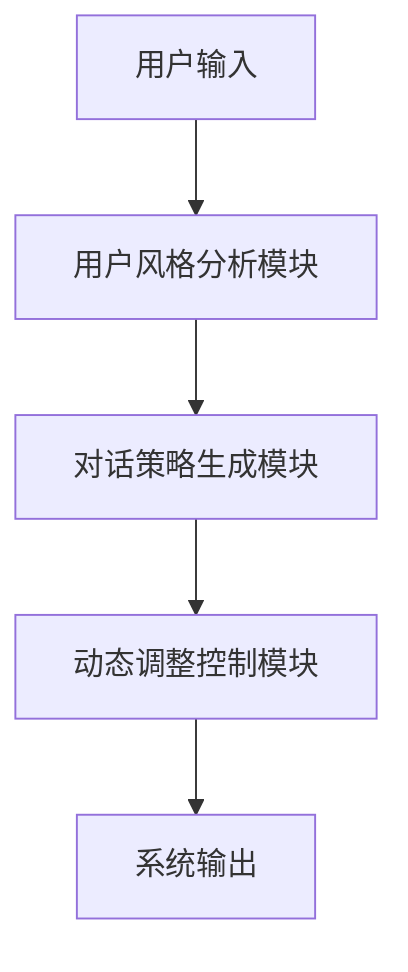
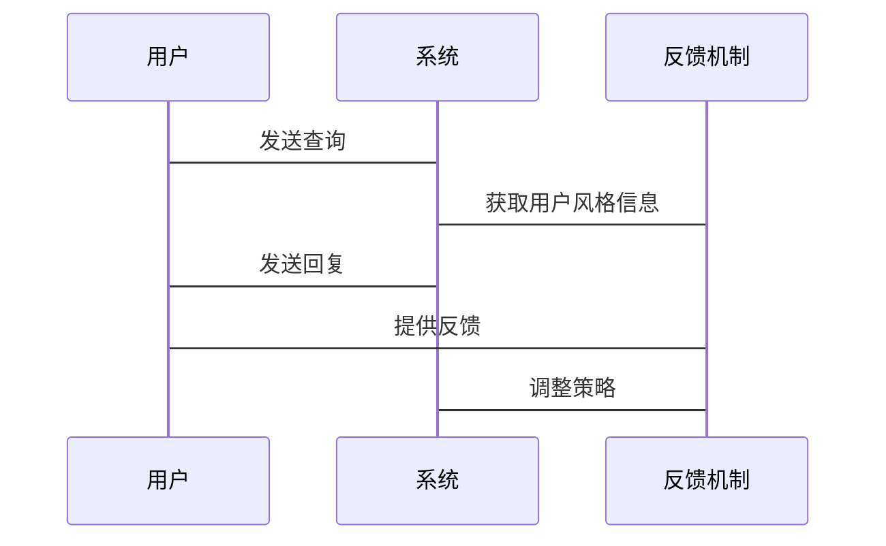

                 

# AI Agent的对话策略动态调整：适应用户风格

## 关键词：AI Agent，对话策略，用户风格，动态调整，强化学习，对话系统

## 摘要：  
本文探讨AI Agent在对话过程中如何根据用户风格动态调整对话策略，以实现更自然、更高效的交互。通过分析用户风格的多样性，结合强化学习和自然语言处理技术，提出了一种动态调整对话策略的框架，并通过实际案例展示了其在不同场景中的应用。

---

## 第一部分: AI Agent与对话策略概述

### 第1章: AI Agent与对话策略概述

#### 1.1 AI Agent的基本概念
##### 1.1.1 AI Agent的定义与特点
AI Agent（人工智能代理）是指能够感知环境并采取行动以实现特定目标的智能实体。它具备以下特点：
- **自主性**：能够独立决策和行动。
- **反应性**：能够实时感知环境并做出反应。
- **目标导向**：所有行为都围绕实现特定目标展开。
- **社交能力**：能够与人类或其他Agent进行交互。

##### 1.1.2 对话系统的基本原理
对话系统是一种AI Agent的重要形式，通过自然语言处理技术实现与用户的交互。其基本原理包括：
- **语言理解**：通过NLP技术理解用户的输入。
- **上下文管理**：跟踪对话的上下文，保持对话连贯性。
- **策略生成**：根据当前对话状态生成合适的回复。

##### 1.1.3 动态调整的核心概念
动态调整是指在对话过程中，根据用户的行为、情感和风格实时调整对话策略，以更好地适应用户的偏好和需求。这种调整是动态的、实时的，并且需要结合反馈机制进行优化。

---

#### 1.2 对话策略的基本框架
##### 1.2.1 对话策略的分类
对话策略可以分为以下几类：
- **基于规则的策略**：通过预定义的规则生成回复。
- **基于统计的策略**：通过数据分析生成概率化的回复。
- **基于模型的策略**：通过深度学习模型生成回复。

##### 1.2.2 基于规则的对话策略
基于规则的策略通过预定义的规则来生成回复。例如：
- 如果用户提到“天气”，则回复当前天气情况。
- 如果用户表达不满，则回复道歉和解决方案。

##### 1.2.3 基于模型的对话策略
基于模型的策略通过深度学习模型（如Transformer）生成回复。这种策略能够捕捉到对话的上下文信息，生成更自然的回复。

---

#### 1.3 动态调整的必要性
##### 1.3.1 用户风格的多样性
用户在对话中的风格各异，例如：
- **正式风格**：用户倾向于使用正式的语言，期望得到专业、严谨的回复。
- **随意风格**：用户倾向于使用非正式语言，期望得到亲切、随意的回复。
- **急躁风格**：用户表达急切，期望快速得到解决方案。

##### 1.3.2 对话场景的复杂性
在实际对话中，场景可能复杂多变，例如：
- 用户可能在不同场景下切换风格。
- 对话可能涉及多个主题，需要动态调整策略。

##### 1.3.3 动态调整的挑战与意义
动态调整的挑战在于如何快速识别用户风格并实时调整策略。其意义在于：
- 提高对话效率。
- 增强用户体验。
- 实现更自然的交互。

---

## 第2章: 用户风格分析与建模

### 2.1 用户风格的定义与特征
#### 2.1.1 用户风格的分类
用户风格可以分为以下几类：
- **语言风格**：包括词汇选择、句式结构等。
- **情感倾向**：包括情感色彩、情绪强度等。
- **行为风格**：包括对话频率、问题类型等。

#### 2.1.2 不同风格的特征分析
通过分析用户的历史对话数据，可以提取以下特征：
- **词汇频率**：高频词汇的使用情况。
- **句式复杂度**：句子的长度和复杂性。
- **情感强度**：情感表达的强烈程度。

#### 2.1.3 风格分析的数学模型
可以使用以下数学模型进行用户风格分析：
- **TF-IDF模型**：用于提取关键词。
- **情感分析模型**：用于分析情感倾向。
- **聚类分析模型**：用于将用户分为不同的风格类别。

---

### 2.2 用户风格分析的算法原理
#### 2.2.1 基于统计的风格分析
基于统计的风格分析通过分析用户的语言特征来判断其风格。例如：
- 使用TF-IDF模型提取关键词。
- 使用词袋模型进行文本表示。

#### 2.2.2 基于深度学习的风格分析
基于深度学习的风格分析通过神经网络模型（如LSTM、Transformer）进行文本表示和分类。例如：
- 使用BERT模型进行风格分类。
- 使用预训练的语言模型进行风格分析。

#### 2.2.3 风格分析的对比分析
通过对比分析不同算法的性能，选择最优的风格分析方法。例如：
- 对比TF-IDF和BERT在风格分类任务中的准确率。
- 对比LSTM和Transformer在情感分析任务中的效果。

---

## 第3章: 对话策略动态调整的核心算法

### 3.1 动态调整的算法框架
#### 3.1.1 基于反馈的策略调整
基于反馈的策略调整通过用户的实时反馈调整对话策略。例如：
- 用户对回复的满意度评分。
- 用户的行为反馈（如点赞、举报）。

#### 3.1.2 基于上下文的策略调整
基于上下文的策略调整通过分析对话的上下文信息调整策略。例如：
- 根据对话历史调整回复的语气。
- 根据当前话题调整回复的内容。

#### 3.1.3 基于强化学习的策略调整
基于强化学习的策略调整通过强化学习算法优化对话策略。例如：
- 使用Q-Learning算法进行策略优化。
- 使用策略梯度算法进行策略调整。

---

### 3.2 强化学习在动态调整中的应用
#### 3.2.1 强化学习的基本原理
强化学习是一种通过试错机制优化行为策略的技术。其基本原理包括：
- **状态空间**：描述当前环境的状态。
- **动作空间**：描述可能采取的动作。
- **奖励机制**：定义每种动作的奖励值。

#### 3.2.2 在对话策略中的应用
在对话策略中，强化学习可以用于以下场景：
- 动态调整回复的语气。
- 实时优化回复的内容。
- 自适应调整对话的节奏。

#### 3.2.3 实验与结果分析
通过实验验证强化学习在动态调整中的效果。例如：
- 对比强化学习和基于规则的策略在对话任务中的准确率。
- 分析强化学习在不同风格用户中的适应性。

---

## 第4章: 系统架构设计

### 4.1 系统功能模块划分
#### 4.1.1 用户风格分析模块
用户风格分析模块负责分析用户的语言风格和情感倾向。例如：
- 使用预训练的风格分类模型。
- 分析用户的对话历史数据。

#### 4.1.2 对话策略生成模块
对话策略生成模块负责根据用户风格生成合适的回复。例如：
- 使用基于规则的策略生成回复。
- 使用深度学习模型生成回复。

#### 4.1.3 动态调整控制模块
动态调整控制模块负责实时调整对话策略。例如：
- 根据用户的反馈调整回复的语气。
- 根据对话的上下文调整回复的内容。

---

### 4.2 系统架构的Mermaid图

---

### 4.3 系统接口与交互设计

#### 4.3.1 系统接口设计
系统接口包括：
- **输入接口**：接收用户的对话输入。
- **输出接口**：发送系统的回复。
- **反馈接口**：接收用户的反馈信息。

#### 4.3.2 交互流程的Mermaid图

---

## 第5章: 项目实战与案例分析

### 5.1 电商客服中的对话策略动态调整
#### 5.1.1 项目背景
在电商客服场景中，用户风格多样，需要动态调整对话策略以提高用户体验。

#### 5.1.2 系统实现
- 使用预训练的风格分类模型分析用户风格。
- 根据用户风格生成相应的回复。
- 实时调整对话策略以适应用户风格。

#### 5.1.3 实验结果
实验结果显示，动态调整策略能够显著提高用户的满意度和对话效率。

---

## 第6章: 总结与展望

### 6.1 总结
本文探讨了AI Agent在对话策略动态调整中的应用，分析了用户风格的多样性，并提出了基于强化学习的动态调整框架。

### 6.2 展望
未来的研究方向包括：
- 更高效的风格分析算法。
- 更智能的动态调整策略。
- 更广泛的场景应用。

---

## 参考文献
（此处列出相关文献和资源）

---

## 附录
（此处列出代码示例和其他补充材料）

--- 

以上是一个详细的目录和文章内容的框架，您可以根据实际需求进一步扩展每个部分的内容。

