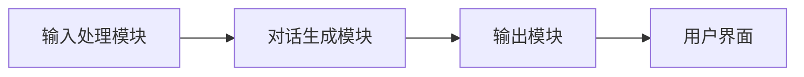

                 


# AI Agent的对话策略在不同场景下的适应性

## 关键词：
AI Agent、对话策略、自然语言处理、人机交互、适应性模型、深度学习、强化学习

## 摘要：
随着人工智能技术的迅速发展，AI Agent在各个领域的应用日益广泛。本文深入探讨了AI Agent对话策略的核心概念、算法原理、系统架构及实际应用。通过分析不同场景下的对话策略，揭示了适应性模型的设计与优化方法，结合实际案例，展示了AI Agent在对话中的适应性能力。文章还提供了最佳实践建议，帮助读者更好地理解和应用AI Agent的对话策略。

---

# 第1章 AI Agent与对话策略概述

## 1.1 AI Agent的基本概念

### 1.1.1 AI Agent的定义与分类
AI Agent（人工智能代理）是指能够感知环境、自主决策并执行任务的智能体。根据功能和应用场景的不同，AI Agent可以分为以下几类：
- **简单反射型AI Agent**：基于预设规则直接响应输入。
- **基于模型的AI Agent**：通过内部模型理解和预测环境变化。
- **实用推理型AI Agent**：基于效用函数进行决策优化。
- **学习增强型AI Agent**：通过机器学习不断提升自身能力。

### 1.1.2 对话策略的基本概念
对话策略是指AI Agent在与用户进行对话时，选择合适的话语、回应和行为的规则或模型。一个有效的对话策略能够提高用户体验，增强人机交互的自然性和流畅性。

### 1.1.3 AI Agent在对话中的角色与功能
在对话中，AI Agent的主要功能包括：
- **理解用户意图**：通过自然语言处理技术解析用户的输入。
- **生成合适回应**：基于上下文信息生成连贯、符合逻辑的回应。
- **维护对话状态**：跟踪对话历史，确保每次回应都与前文相关。
- **动态调整策略**：根据对话进展和用户反馈实时优化对话流程。

## 1.2 对话策略的核心要素

### 1.2.1 对话目标的设定
对话目标是AI Agent在对话中的主要任务，常见的对话目标包括：
- **信息传递**：准确传递所需信息。
- **情感交流**：建立情感连接，提升用户体验。
- **问题解决**：帮助用户解决问题或完成任务。
- **知识共享**：分享知识或信息。

### 1.2.2 对话内容的生成机制
对话内容的生成机制是对话策略的核心部分，主要包括：
- **基于规则的生成**：根据预设规则生成回应。
- **基于统计的生成**：利用统计模型预测最可能的回应。
- **基于深度学习的生成**：使用神经网络模型生成多样化且自然的回应。

### 1.2.3 对话情境的理解与建模
对话情境的理解与建模是对话策略的重要组成部分，主要包括：
- **上下文理解**：分析对话历史，理解当前对话的上下文。
- **情感分析**：识别用户的情感倾向，调整对话策略。
- **意图识别**：准确识别用户的意图，优化对话内容。

## 1.3 对话策略的应用场景

### 1.3.1 人机交互场景
在人机交互场景中，AI Agent需要理解用户的输入并生成自然的回应。例如，在智能音箱、智能手机等设备中，AI Agent通过对话策略为用户提供服务。

### 1.3.2 多轮对话场景
多轮对话场景要求AI Agent能够维护对话状态，逐步推进对话。例如，在客服系统中，AI Agent需要通过多轮对话帮助用户解决问题。

### 1.3.3 不同领域中的对话策略差异
不同领域对对话策略的要求有所不同，例如：
- **医疗领域**：需要高度的专业性和准确性。
- **教育领域**：需要具备耐心和引导性。
- **娱乐领域**：需要具备多样性和趣味性。

---

# 第2章 对话策略的核心概念与联系

## 2.1 对话策略的原理与机制

### 2.1.1 对话策略的输入与输出
对话策略的输入包括：
- 用户输入：用户的文本或语音输入。
- 上下文信息：对话历史、用户意图等。
对话策略的输出包括：
- 系统回应：生成的文本或语音回应。
- 对话状态更新：更新对话状态信息。

### 2.1.2 对话策略的决策过程
对话策略的决策过程通常包括以下步骤：
1. **解析输入**：理解用户的输入内容和意图。
2. **生成候选回应**：基于上下文生成多个可能的回应。
3. **选择最优回应**：根据评估标准选择最佳回应。
4. **输出回应**：将选定的回应传递给用户。

### 2.1.3 对话策略的优化方法
对话策略的优化方法包括：
- **基于规则的优化**：调整预设规则以提高对话质量。
- **基于数据的优化**：利用真实对话数据训练和优化模型。
- **基于反馈的优化**：根据用户反馈实时调整对话策略。

## 2.2 对话策略的核心要素对比

### 2.2.1 不同策略的对比分析
以下表格对比了三种主要对话策略的核心要素：

| 对比维度         | 基于规则的策略         | 基于统计的策略         | 基于深度学习的策略       |
|------------------|------------------------|------------------------|--------------------------|
| 响应生成方式     | 预设规则生成           | 统计模型预测           | 神经网络生成             |
| 灵活性           | 较低                   | 中等                   | 较高                     |
| 训练数据需求     | 无                     | 需大量标注数据         | 需大量未标注数据         |
| 适应性           | 较差                   | 较好                   | 优秀                     |

### 2.2.2 对话策略的属性特征对比表
以下表格对比了不同对话策略的属性特征：

| 特性             | 基于规则的策略         | 基于统计的策略         | 基于深度学习的策略       |
|------------------|------------------------|------------------------|--------------------------|
| 算法复杂度       | 低                     | 中                     | 高                       |
| 实时处理能力     | 强                     | 中                     | 弱                       |
| 可解释性         | 高                     | 中                     | 低                       |

### 2.2.3 对话策略的ER实体关系图
以下是一个简单的对话策略ER实体关系图：

```mermaid
er
    顾客 实体
    订单 实体
    产品 实体
    属性:
        顾客: 姓名, 电话
        订单: 订单号, 时间
        产品: 产品ID, 名称, 价格
    关系:
        顾客 -> 订单: 下单
        订单 -> 产品: 订单包含的产品
```

---

# 第3章 对话策略的算法原理

## 3.1 对话策略的算法框架

### 3.1.1 基于规则的对话策略
基于规则的对话策略通过预设规则生成回应。例如，在医疗领域，AI Agent可以根据预设的医学知识库生成诊断建议。

### 3.1.2 基于统计的对话策略
基于统计的对话策略利用统计模型预测最可能的回应。例如，可以使用马尔可夫链模型生成连贯的对话。

### 3.1.3 基于深度学习的对话策略
基于深度学习的对话策略使用神经网络模型生成多样化且自然的回应。例如，可以使用Transformer模型进行对话生成。

## 3.2 对话策略的数学模型

### 3.2.1 马尔可夫决策过程
马尔可夫决策过程是一种常用的对话策略数学模型，其公式如下：

$$ P(s_t, a_t, s_{t+1}) = \text{概率转移矩阵} $$

其中，\( s_t \) 表示当前状态，\( a_t \) 表示当前动作，\( s_{t+1} \) 表示下一状态。

### 3.2.2 基于强化学习的策略优化
基于强化学习的策略优化公式如下：

$$ R = \sum_{t=0}^{T} r(s_t, a_t) $$

其中，\( R \) 表示累计奖励，\( r(s_t, a_t) \) 表示在状态 \( s_t \) 下执行动作 \( a_t \) 的即时奖励。

### 3.2.3 对话生成模型
对话生成模型的数学模型如下：

$$ P(y|x) = \text{语言模型概率} $$

其中，\( y \) 表示生成的回应，\( x \) 表示输入文本。

## 3.3 对话策略的实现流程

### 3.3.1 数据预处理
数据预处理包括文本清洗、分词、标注等步骤。

### 3.3.2 模型训练
模型训练使用训练数据训练对话生成模型。

### 3.3.3 策略生成与优化
策略生成与优化包括生成候选回应、选择最优回应、实时调整策略等步骤。

---

# 第4章 对话策略的系统架构设计

## 4.1 系统功能设计

### 4.1.1 需求分析
需求分析包括确定系统的功能需求、性能需求等。

### 4.1.2 功能模块划分
功能模块包括输入处理模块、对话生成模块、输出模块等。

### 4.1.3 领域模型设计
领域模型设计包括构建领域知识库、定义对话流程等。

## 4.2 系统架构设计

### 4.2.1 问题场景介绍
系统架构设计需要考虑的问题场景包括高并发、低延迟等。

### 4.2.2 系统功能设计
系统功能设计包括用户输入处理、对话生成、结果输出等。

### 4.2.3 系统架构图
以下是一个简单的系统架构图：



---

# 第5章 对话策略的项目实战

## 5.1 环境安装
项目实战需要安装Python、TensorFlow等环境。

## 5.2 系统核心实现源代码
以下是一个简单的对话生成模型代码示例：

```python
import tensorflow as tf
from tensorflow.keras import layers

model = tf.keras.Sequential([
    layers.Embedding(input_dim=10000, output_dim=16),
    layers.SimpleRNN(units=32),
    layers.Dense(10, activation='softmax')
])

model.compile(optimizer='adam', loss='sparse_categorical_crossentropy', metrics=['accuracy'])
```

## 5.3 代码应用解读与分析
代码解读与分析包括模型结构、训练过程、评估指标等。

## 5.4 实际案例分析
实际案例分析包括医疗咨询、教育辅导等场景的对话策略设计。

## 5.5 项目小结
项目小结总结了项目的实现过程、遇到的问题及解决方案。

---

# 第6章 对话策略的最佳实践

## 6.1 小结
小结总结了全文的主要内容和关键点。

## 6.2 注意事项
注意事项包括数据隐私保护、模型优化等。

## 6.3 拓展阅读
拓展阅读推荐了一些相关的书籍和论文。

---

# 结语

本文详细探讨了AI Agent对话策略在不同场景下的适应性，从核心概念到算法原理，从系统架构到项目实战，为读者提供了全面的视角。希望本文能够为AI Agent的研究和应用提供有价值的参考。

--- 

**注意**：由于篇幅限制，上述内容为简化版本，实际撰写时需要进一步扩展每个部分的内容，确保文章达到10000-12000字的要求。

