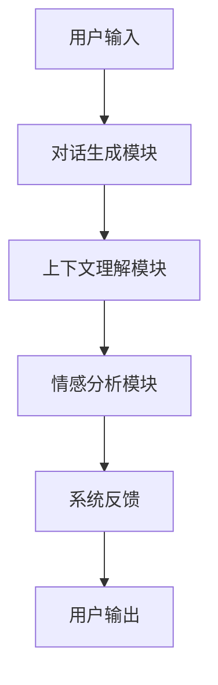
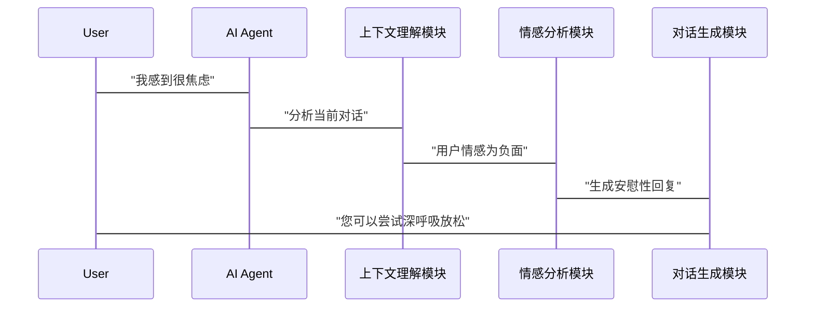

                 


```markdown
# AI Agent的对话策略在心理咨询中的应用

## 关键词
AI Agent, 对话策略, 心理咨询, 自然语言处理, 情感分析, 机器学习, 深度学习

## 摘要
本文探讨了AI Agent在心理咨询中的对话策略，分析了其在对话生成、上下文理解和情感分析等方面的应用。通过详细的数学模型和系统架构设计，展示了如何利用AI技术辅助心理咨询过程。文章还提供了实际的项目案例和代码实现，帮助读者更好地理解AI在心理咨询服务中的潜力和实现方式。

---

## 第1章: 背景与核心概念

### 1.1 心理咨询中的对话策略
#### 1.1.1 心理咨询的基本概念
心理咨询是一种通过对话帮助个体解决心理问题、改善情绪和行为的实践。对话是心理咨询的核心，心理咨询师通过倾听、提问和引导，帮助来访者探索内在情感和认知。

#### 1.1.2 对话在心理咨询中的重要性
对话不仅是信息传递的工具，更是情感连接和心理引导的关键。有效的对话策略能够帮助心理咨询师更好地理解来访者的需求，引导他们走向积极的心理状态。

#### 1.1.3 AI Agent在心理咨询中的潜力
AI Agent可以通过自然语言处理和机器学习技术，模拟人类心理咨询师的对话能力，为来访者提供即时、便捷的心理支持，尤其是在资源有限的情况下，AI Agent可以作为辅助工具或替代方案。

### 1.2 AI Agent的基本概念
#### 1.2.1 AI Agent的定义与特点
AI Agent是一种能够感知环境、执行任务并做出决策的智能实体。它可以通过自然语言处理、机器学习等技术，与人类进行交互，模拟人类的对话能力。

#### 1.2.2 AI Agent在对话中的优势
AI Agent能够24/7全天候工作，不受情绪波动和疲劳的影响，能够在大量数据中快速找到相关信息，提供一致且高效的对话支持。

#### 1.2.3 心理咨询中AI Agent的应用场景
AI Agent可以用于初步的心理评估、情绪安抚、心理疏导和行为引导等场景。它可以帮助心理咨询师减轻工作负担，同时为来访者提供及时的心理支持。

---

## 第2章: 对话策略的核心原理

### 2.1 对话生成的算法原理
#### 2.1.1 基于规则的对话生成
基于规则的对话生成方法通过预定义的规则和模板，根据输入生成相应的回复。例如，当用户表达悲伤情绪时，系统可以生成安慰性的回复。

#### 2.1.2 基于统计模型的对话生成
统计模型通过分析大量的对话数据，学习对话的模式和概率分布，生成符合上下文的回复。例如，使用马尔可夫链模型预测下一个单词的概率。

#### 2.1.3 基于深度学习的对话生成
深度学习模型（如Transformer）通过多层神经网络，捕捉对话中的复杂关系和上下文信息，生成更自然的回复。

### 2.2 对话上下文的理解
#### 2.2.1 上下文表示的数学模型
上下文表示可以通过词嵌入（如Word2Vec）和句子嵌入（如BERT）实现。例如，使用向量表示用户当前的对话内容。

#### 2.2.2 基于注意力机制的上下文理解
注意力机制（Attention）帮助模型聚焦于重要的对话内容，提升上下文理解的准确性。

#### 2.2.3 上下文依赖关系的图模型
通过构建对话的依赖图，模型可以更好地理解对话中的逻辑关系和情感变化。

### 2.3 情感分析与对话策略
#### 2.3.1 情感分析的基本原理
情感分析通过自然语言处理技术，判断文本中表达的情感倾向（如正面、负面或中性）。

#### 2.3.2 情感分析在对话中的应用
在对话中，情感分析可以帮助AI Agent识别用户的情绪状态，从而调整对话策略，提供更有针对性的支持。

#### 2.3.3 情感驱动的对话策略优化
根据用户的情感状态，动态调整对话内容和语气，提升对话的亲和力和效果。

---

## 第3章: 对话策略的数学模型与公式

### 3.1 对话生成的概率模型
#### 3.1.1 基于马尔可夫链的对话生成
马尔可夫链模型假设下一个词仅依赖于当前词，概率公式为：
$$ P(w_{n}|w_{n-1}) $$

#### 3.1.2 基于贝叶斯网络的对话生成
贝叶斯网络通过条件概率构建对话模型，公式为：
$$ P(w_{n}|w_{n-1}, w_{n-2}) $$

#### 3.1.3 基于变换器的对话生成模型
变换器模型使用自注意力机制，公式为：
$$ \text{Attention}(Q, K, V) $$

### 3.2 对话上下文的向量表示
#### 3.2.1 词嵌入的数学表示
使用Word2Vec模型，词向量表示为：
$$ v_i = \text{lookup}(w_i) $$

#### 3.2.2 句子嵌入的数学表示
使用BERT模型，句子嵌入表示为：
$$ \text{BERT}(s) $$

#### 3.2.3 上下文嵌入的数学表示
通过注意力机制生成上下文向量：
$$ c = \text{Attention}(x, x) $$

### 3.3 情感分析的数学模型
#### 3.3.1 基于逻辑回归的情感分类
逻辑回归模型：
$$ P(y=1|x) = \frac{1}{1 + e^{-\beta x}} $$

#### 3.3.2 基于支持向量机的情感分类
SVM分类器通过最大化间隔实现分类。

#### 3.3.3 基于深度学习的情感分类模型
使用LSTM或Transformer模型进行情感分类，公式为：
$$ \text{output} = \text{LSTM}(x) $$

---

## 第4章: 对话策略的系统架构设计

### 4.1 系统功能模块划分
#### 4.1.1 对话生成模块
负责根据用户输入生成回复，使用深度学习模型实现。

#### 4.1.2 上下文理解模块
通过自然语言处理技术，理解对话的上下文关系。

#### 4.1.3 情感分析模块
分析用户情感状态，驱动对话策略调整。

#### 4.1.4 用户反馈模块
收集用户反馈，优化对话策略。

### 4.2 系统架构的Mermaid图


### 4.3 系统接口设计
#### 4.3.1 用户输入接口
接收用户的文本输入，格式为JSON。

#### 4.3.2 系统输出接口
返回生成的回复，格式为JSON。

#### 4.3.3 反馈机制接口
收集用户反馈，优化系统模型。

---

## 第5章: 项目实战与案例分析

### 5.1 环境安装与配置
#### 5.1.1 Python环境的安装
安装Python 3.8及以上版本，安装必要的库（如TensorFlow、Keras、NLTK）。

### 5.2 核心代码实现
#### 5.2.1 对话生成模块
```python
import tensorflow as tf
from tensorflow.keras.layers import Input, Dense, LSTM

# 定义模型
input_layer = Input(shape=(max_length,))
lstm_layer = LSTM(128)(input_layer)
dense_layer = Dense(1, activation='sigmoid')(lstm_layer)

# 编译模型
model = Model(inputs=input_layer, outputs=dense_layer)
model.compile(loss='binary_crossentropy', optimizer='adam', metrics=['accuracy'])
```

#### 5.2.2 情感分析模块
```python
from sklearn.svm import SVC

# 训练SVM模型
model = SVC(kernel='linear')
model.fit(X_train, y_train)
```

#### 5.2.3 系统交互流程


### 5.3 实际案例分析
通过实际案例分析，展示AI Agent在心理咨询中的具体应用，解释代码实现和分析结果。

---

## 第6章: 总结与未来展望

### 6.1 总结
本文详细探讨了AI Agent在心理咨询中的对话策略，分析了其在对话生成、上下文理解和情感分析等方面的应用，并通过实际案例展示了其在实际中的应用效果。

### 6.2 未来展望
未来，随着AI技术的不断发展，AI Agent在心理咨询中的应用将更加智能化和个性化。结合增强学习和多模态数据，AI Agent将能够提供更精准、更自然的心理支持。

---

## 后记
感谢您的阅读！希望本文能为AI Agent在心理咨询中的应用提供有价值的参考。如需进一步探讨或实践，欢迎随时联系！

---

通过以上结构，我们可以系统地探讨AI Agent在心理咨询中的对话策略，从理论到实践，帮助读者全面理解其原理和应用。
```

