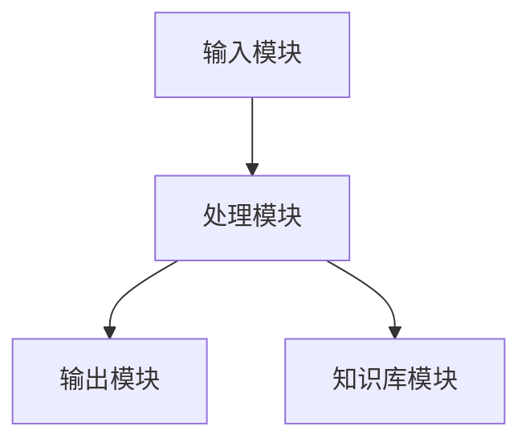
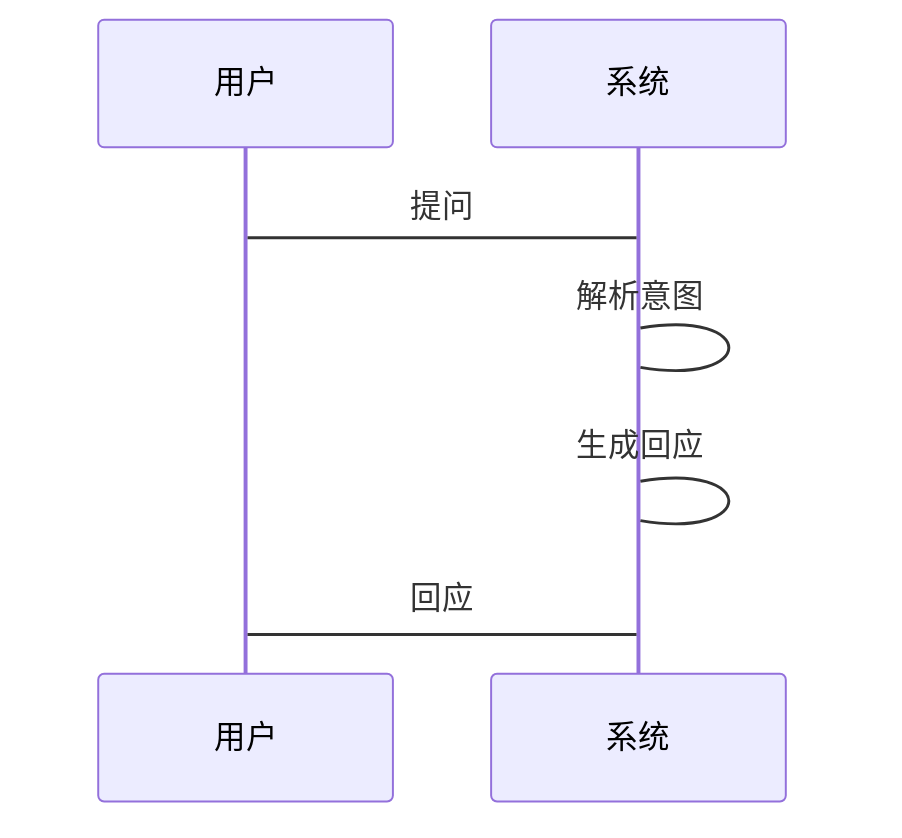

                 


```markdown
# AI Agent的对话策略在教育辅导中的应用

> **关键词**：AI Agent，对话策略，教育辅导，自然语言处理，机器学习

> **摘要**：本文详细探讨了AI Agent在教育辅导中的对话策略应用。从AI Agent的基本概念出发，分析了对话策略的设计原理和实现方法，结合教育心理学和学习者特征，提出了优化对话策略的思路。同时，通过系统架构设计和项目实战，展示了如何将AI Agent应用于实际教育场景，为教育技术的未来发展提供了重要参考。

---

# 第二章：AI Agent基础

## 2.1 AI Agent的核心概念

### 2.1.1 AI Agent的定义与分类
AI Agent（人工智能代理）是指能够感知环境并采取行动以实现目标的智能体。在教育辅导场景中，AI Agent通常表现为对话系统，通过自然语言处理技术与用户交互。

**分类**：
- **基于规则的AI Agent**：通过预定义的规则和脚本进行对话。
- **基于机器学习的AI Agent**：利用机器学习模型（如神经网络）进行对话生成。
- **混合型AI Agent**：结合规则和机器学习的双重优势。

### 2.1.2 对话系统的基本原理
对话系统的核心是自然语言处理（NLP），包括以下步骤：
1. **语音或文本输入**：用户通过语音或文本输入问题。
2. **语言理解（NLU）**：系统解析用户的意图和实体信息。
3. **对话管理（DM）**：根据理解生成适当的回应。
4. **语言生成（NLG）**：将回应转换为自然语言输出。

### 2.1.3 教育辅导中的对话策略特点
在教育辅导场景中，对话策略需要具备以下特点：
- **知识密集性**：需要覆盖特定领域的知识。
- **个性化**：根据学习者的特点（如年龄、兴趣、学习水平）调整对话内容。
- **情感敏感性**：能够识别并回应学习者的情感状态。

---

## 2.2 自然语言处理技术

### 2.2.1 NLP基础概念
自然语言处理（NLP）是研究人机交互中自然语言理解和生成的理论和方法。关键任务包括：
- **分词**：将连续文本分割为词语或短语。
- **词性标注**：给每个词语标注其词性（如名词、动词）。
- **句法分析**：分析句子的语法结构。
- **语义理解**：理解文本的深层含义。

### 2.2.2 常见的NLP模型与工具
- **分词工具**：jieba（中文）、spaCy（多语言）。
- **词向量模型**：Word2Vec、GloVe。
- **序列模型**：RNN、LSTM、Transformer（如BERT）。

### 2.2.3 对话系统的NLP实现
对话系统的NLP实现通常包括以下步骤：
1. **输入预处理**：对用户输入进行分词和词性标注。
2. **意图识别**：通过机器学习模型识别用户的意图。
3. **实体识别**：提取对话中的关键实体信息。
4. **对话生成**：基于意图和实体生成合适的回应。

---

## 2.3 教育心理学与学习者特征

### 2.3.1 学习者认知模型
学习者认知模型描述了学习者在学习过程中的心理过程和认知特点。关键要素包括：
- **学习目标**：学习者希望通过对话实现的具体目标。
- **知识水平**：学习者的现有知识储备。
- **学习风格**：学习者偏好的学习方式（如视觉型、听觉型）。

### 2.3.2 学习者情感与需求分析
在教育辅导中，AI Agent需要具备情感计算能力，能够识别和回应学习者的情感状态。关键步骤包括：
1. **情感识别**：通过语调、语速、关键词等判断学习者的情感状态。
2. **情感分析**：分析情感的强度和类型（如愤怒、悲伤、快乐）。
3. **情感回应**：根据情感状态调整对话策略，提供情感支持。

### 2.3.3 教育场景中的对话策略优化
在教育场景中，对话策略需要结合学习者的认知特点和情感需求。例如：
- 对于知识水平较低的学习者，可以采用逐步引导的方式。
- 对于情绪低落的学习者，可以采用鼓励性语言。

---

## 2.4 对话策略的数学模型

### 2.4.1 基于概率论的对话模型
概率论是对话策略的重要数学基础。例如，可以使用贝叶斯定理计算条件概率：

$$ P(A|B) = \frac{P(B|A) \cdot P(A)}{P(B)} $$

其中，$A$表示“学习者理解问题”，$B$表示“系统生成的解释”。

### 2.4.2 基于图论的对话网络
图论可以用于构建对话网络。例如，使用图的遍历算法（如深度优先搜索、广度优先搜索）生成对话流程。

### 2.4.3 基于强化学习的策略优化
强化学习是一种有效的策略优化方法。例如，可以使用Q-learning算法：

$$ Q(s, a) = r + \gamma \cdot \max_{a'} Q(s', a') $$

其中，$s$表示当前状态，$a$表示动作，$r$表示奖励，$\gamma$表示折扣因子。

---

## 2.5 系统架构设计

### 2.5.1 系统模块划分
对话系统可以划分为以下模块：
1. **输入模块**：接收用户输入。
2. **处理模块**：包括NLU、DM、NLG。
3. **输出模块**：生成并输出对话回应。
4. **知识库模块**：存储领域知识和学习者信息。

### 2.5.2 系统架构图
以下是一个简单的系统架构图：



### 2.5.3 接口设计
系统接口设计需要考虑以下方面：
- **输入接口**：支持文本和语音输入。
- **输出接口**：支持文本和语音输出。
- **知识库接口**：支持知识查询和更新。

### 2.5.4 交互流程图
以下是一个对话系统的交互流程图：



---

## 2.6 项目实战

### 2.6.1 环境配置与安装
以下是一个简单的Python环境配置示例：

```bash
pip install numpy
pip install pandas
pip install jieba
pip install transformers
```

### 2.6.2 核心代码实现
以下是一个基于BERT的对话生成示例代码：

```python
from transformers import BertTokenizer, BertModel

tokenizer = BertTokenizer.from_pretrained('bert-base-chinese')
model = BertModel.from_pretrained('bert-base-chinese')

def generate_response(input_text):
    inputs = tokenizer(input_text, return_tensors='np')
    outputs = model(**inputs)
    return tokenizer.decode(outputs.last_hidden_state[0, 0, :].argmax())

response = generate_response("如何学习Python？")
print(response)
```

### 2.6.3 测试与优化
测试对话系统时，需要注意以下方面：
- **准确性**：对话系统是否准确理解用户意图。
- **流畅性**：对话是否自然流畅。
- **情感支持**：对话系统是否能够提供情感支持。

### 2.6.4 案例分析
以下是一个实际案例分析：

假设学习者提问：“我不明白这个公式，能再解释一下吗？”

系统通过解析意图，识别出学习者的需求是理解公式。然后，系统会根据知识库生成一个更简化的解释，并通过自然语言生成模块生成回应。

---

## 2.7 小结与最佳实践

### 2.7.1 小结
本章介绍了AI Agent的核心概念、自然语言处理技术、教育心理学与学习者特征，以及对话策略的数学模型和系统架构设计。通过实际案例分析，展示了如何将AI Agent应用于教育辅导场景。

### 2.7.2 最佳实践
- 在设计对话系统时，需要结合学习者的认知特点和情感需求。
- 使用多种技术手段（如规则和机器学习）优化对话策略。
- 定期更新知识库，确保对话内容的准确性和丰富性。

---

## 2.7.3 注意事项
- 对话系统的设计需要考虑系统的可扩展性和可维护性。
- 在实际应用中，需要注意数据隐私和安全问题。
- 对话系统的训练数据需要多样化，避免偏见和歧视。

---

## 2.7.4 拓展阅读
- 《自然语言处理实战：基于Python的机器学习与深度学习》
- 《教育技术：理论与实践》
- 《强化学习：理论与应用》

---

通过本章的学习，读者可以全面了解AI Agent在教育辅导中的对话策略应用，并能够结合实际场景进行优化和改进。

