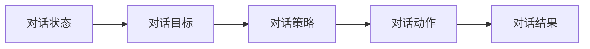
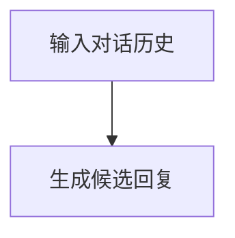
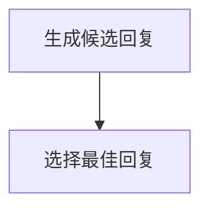
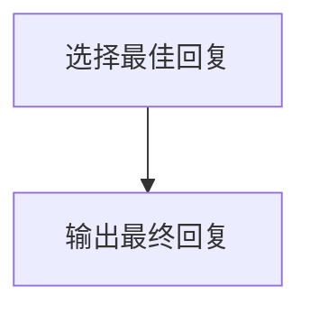
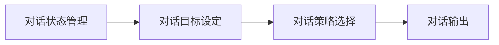

                 


# AI Agent的对话管理系统：设计与实现

## 关键词：AI Agent，对话管理，自然语言处理，强化学习，系统设计

## 摘要：  
本文系统性地探讨了AI Agent对话管理系统的原理与实现。从对话管理的基本概念出发，详细分析了对话管理的核心算法、系统架构设计以及实际项目实现。通过理论与实践相结合的方式，深入阐述了如何设计和实现一个高效、智能的对话管理系统。文章内容涵盖对话状态表示、对话目标设定、对话策略选择等核心问题，并结合实际案例，给出了完整的对话管理系统实现方案。

---

# 第一部分: AI Agent与对话管理概述

## 第1章: AI Agent的基本概念

### 1.1 什么是AI Agent
AI Agent（人工智能代理）是指能够感知环境、自主决策并执行任务的智能实体。它可以是一个软件程序，也可以是嵌入在物理设备中的智能系统，其核心目标是通过与用户或其他系统的交互，完成特定任务。

#### 1.1.1 AI Agent的核心特征
- **自主性**：AI Agent能够自主决策，无需外部干预。
- **反应性**：能够实时感知环境变化并做出响应。
- **目标导向**：基于明确的目标执行任务。
- **学习能力**：通过数据和经验不断优化自身行为。

### 1.2 对话管理的背景与问题背景
对话管理是AI Agent实现人机交互的核心技术，其目标是通过自然语言处理技术，理解用户的意图并生成合适的回复。

#### 1.2.1 对话管理的定义
对话管理是指在对话过程中，系统根据当前对话状态和用户输入，生成合适的回复或执行相应操作的过程。

#### 1.2.2 对话管理的核心问题
- **对话状态表示**：如何表示当前对话的状态，以便系统理解上下文。
- **对话目标设定**：如何确定对话的目标，并根据目标选择合适的回复。
- **对话策略选择**：在多个可能的回复中选择最优的回复。

#### 1.2.3 对话管理的边界与外延
对话管理的边界包括对话的开始和结束，外延则涉及对话前的初始化和对话后的结果处理。

### 1.3 对话管理的实现方式
对话管理可以通过多种方式实现，以下是三种主要方法：

#### 1.3.1 基于规则的对话管理
基于规则的对话管理通过预定义的规则来匹配用户输入，并生成相应的回复。这种方法简单易懂，适用于规则明确的场景。

#### 1.3.2 基于统计模型的对话管理
基于统计模型的对话管理利用概率模型，根据历史对话数据生成回复。这种方法能够处理复杂场景，但需要大量数据支持。

#### 1.3.3 基于深度学习的对话管理
基于深度学习的对话管理利用神经网络模型，通过大量数据训练生成回复。这种方法能够捕捉复杂的语言模式，但实现较为复杂。

---

## 第2章: 对话管理的核心概念与联系

### 2.1 对话管理的核心原理
对话管理的核心原理包括对话状态表示、对话目标设定和对话策略选择。

#### 2.1.1 对话状态表示
对话状态表示是对话管理的基础，通常通过状态向量来表示。

#### 2.1.2 对话目标设定
对话目标是对话管理的指导，决定了对话的方向和终点。

#### 2.1.3 对话策略选择
对话策略选择是在多个可能的回复中选择最优的回复，通常基于预定义的规则或算法。

### 2.2 对话管理的实体关系图
以下是对话管理的实体关系图：



### 2.3 对话管理的核心算法原理
对话管理的核心算法包括基于状态机的对话管理、基于规则的对话管理和基于强化学习的对话管理。

#### 2.3.1 基于状态机的对话管理
基于状态机的对话管理通过状态转移来实现对话流程的控制。

#### 2.3.2 基于规则的对话管理
基于规则的对话管理通过预定义的规则来匹配用户输入并生成回复。

#### 2.3.3 基于强化学习的对话管理
基于强化学习的对话管理通过训练神经网络模型来生成回复。

---

## 第3章: 对话管理的算法原理

### 3.1 对话生成的算法
对话生成的算法可以通过以下步骤实现：

#### 3.1.1 输入对话历史


#### 3.1.2 生成候选回复


#### 3.1.3 选择最佳回复


#### 3.1.4 代码示例
```python
def generate_reply(dialog_history):
    # 生成候选回复
    candidates = generate_candidates(dialog_history)
    # 选择最佳回复
    best_reply = select_best_reply(candidates, dialog_history)
    return best_reply
```

### 3.2 对话理解的算法
对话理解的算法可以通过以下步骤实现：

#### 3.2.1 基于词袋模型的对话理解
词袋模型将对话内容表示为词袋，忽略词语顺序。

#### 3.2.2 基于序列模型的对话理解
序列模型（如LSTM）能够捕捉对话中的序列信息。

#### 3.2.3 基于预训练模型的对话理解
预训练模型（如BERT）能够理解复杂的对话上下文。

#### 3.2.4 代码示例
```python
def understand_dialog(dialog):
    # 使用词袋模型进行对话理解
    vectorizer = BagOfWordsVectorizer()
    dialog_vector = vectorizer.transform(dialog)
    return dialog_vector
```

### 3.3 对话管理的数学模型
对话管理的数学模型包括对话状态表示的向量空间模型和对话目标的损失函数。

#### 3.3.1 对话状态表示的向量空间模型
$$v_i = \sum_{j=1}^{n} w_{ij} \cdot v_j$$

#### 3.3.2 对话目标的损失函数
$$L = \sum_{i=1}^{m} (y_i - \hat{y}_i)^2$$

---

## 第4章: 对话管理的系统分析与架构设计

### 4.1 系统架构设计
对话管理系统的架构设计包括系统功能设计、系统架构图、系统接口设计和系统交互设计。

#### 4.1.1 系统功能设计
系统功能设计包括对话状态管理、对话目标设定和对话策略选择。

#### 4.1.2 系统架构图
以下是系统架构图：



#### 4.1.3 系统接口设计
系统接口设计包括对话输入接口、对话输出接口和对话状态接口。

#### 4.1.4 系统交互设计
系统交互设计包括用户输入、系统处理和用户输出。

---

## 第5章: 对话管理的项目实战

### 5.1 环境安装
安装所需的依赖库：

```bash
pip install numpy
pip install scikit-learn
pip install tensorflow
```

### 5.2 核心功能实现
#### 5.2.1 对话状态管理
对话状态管理实现：

```python
def manage_dialog_state(dialog_history):
    state = initialize_state()
    for message in dialog_history:
        update_state(state, message)
    return state
```

#### 5.2.2 对话目标设定
对话目标设定实现：

```python
def set_dialog_goal(state, goal):
    state['goal'] = goal
    return state
```

#### 5.2.3 对话策略选择
对话策略选择实现：

```python
def choose_dialog_strategy(state):
    if state['intent'] == 'information':
        return 'inform'
    elif state['intent'] == 'confirmation':
        return 'confirm'
    else:
        return 'default'
```

### 5.3 案例分析
以下是一个对话管理系统的实际案例分析：

#### 5.3.1 对话案例
用户：你好，我需要帮助。

系统：你好，请问有什么可以帮助你的？

用户：我需要查询天气。

系统：请告诉我你所在的地点。

用户：北京。

系统：北京的天气今天是晴天，温度在20℃左右。

用户：谢谢。

系统：不客气，再见。

---

## 第6章: 总结与展望

### 6.1 总结
本文详细探讨了AI Agent对话管理系统的原理与实现，涵盖了对话状态表示、对话目标设定和对话策略选择等核心问题，并结合实际案例，给出了完整的对话管理系统实现方案。

### 6.2 未来展望
未来，对话管理将更加智能化和个性化，随着深度学习和自然语言处理技术的进步，对话系统将更加贴近人类的自然对话方式。

### 6.3 最佳实践 Tips
- 在实现对话管理系统时，建议先明确对话目标和策略。
- 对话状态管理是对话管理的核心，需要仔细设计。
- 在选择对话生成算法时，可以根据具体需求选择合适的方法。

---

以上是《AI Agent的对话管理系统：设计与实现》的完整内容，涵盖了对话管理的核心概念、算法原理、系统设计和项目实战，希望对读者有所帮助。

