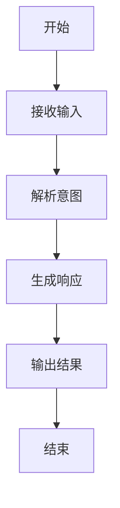
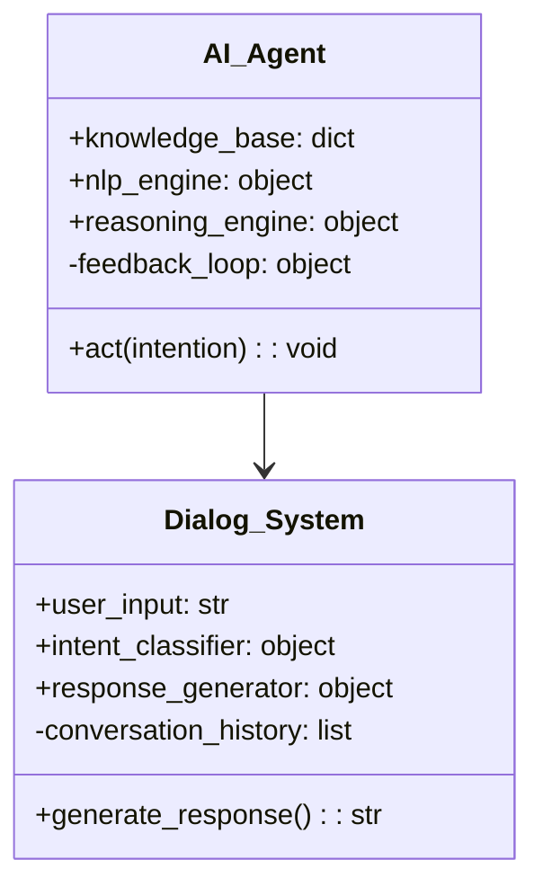
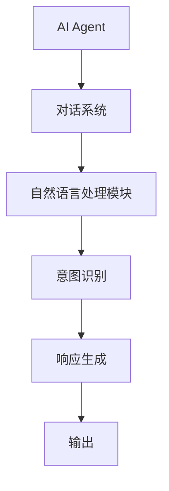
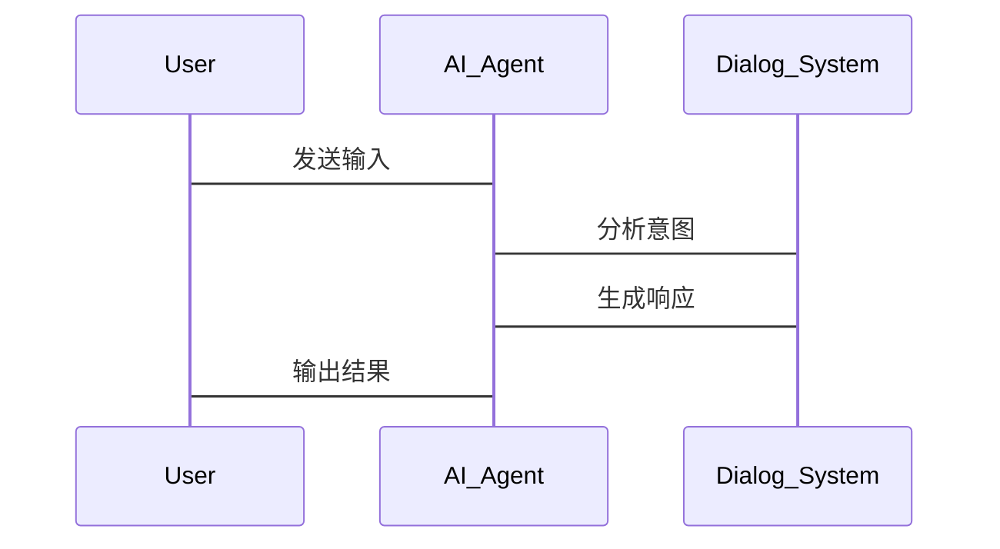

                 


# AI Agent的对话系统在危机干预中的应用

> 关键词：AI Agent，对话系统，危机干预，自然语言处理，机器学习，系统架构

> 摘要：本文深入探讨了AI Agent在对话系统中的应用，特别是在危机干预中的重要性。通过分析核心概念、算法原理、系统架构以及实际案例，展示了如何利用AI技术提升危机处理的效率和效果。文章结合理论与实践，为读者提供了全面的技术解读。

---

# 第一部分：AI Agent的对话系统在危机干预中的应用概述

## 第1章：背景介绍

### 1.1 核心概念

#### 1.1.1 问题背景

危机干预是一种在紧急情况下提供支持和解决方案的过程，旨在帮助个体或组织应对突发问题。AI Agent（人工智能代理）是一种能够执行任务的智能实体，通过对话系统与用户交互，提供实时支持。

#### 1.1.2 问题描述

传统危机干预依赖于人工处理，存在效率低、响应慢的问题。特别是在紧急情况下，人类可能无法及时做出最优决策。AI Agent通过自然语言处理（NLP）技术，能够快速分析问题并提供解决方案。

#### 1.1.3 问题解决

AI Agent通过对话系统可以实时分析用户情绪、意图和需求，提供个性化的支持。例如，在自杀干预中，AI Agent能够识别用户的绝望情绪，并引导其寻求专业帮助。

#### 1.1.4 边界与外延

AI Agent的应用边界包括数据隐私、伦理问题和系统稳定性。其外延则涉及多语言支持、跨平台应用和情感计算。

#### 1.1.5 核心要素组成

AI Agent的构成要素包括自然语言处理模块、知识库、推理引擎和反馈机制。对话系统的功能模块包括输入解析、意图识别、响应生成和输出反馈。

---

## 第2章：核心概念与联系

### 2.1 核心概念原理

AI Agent通过自然语言处理技术，将用户输入转化为结构化数据，进行分析和推理，生成合适的响应。对话系统则通过实时交互，帮助用户解决问题。

### 2.2 核心概念对比表格

| 比较维度 | AI Agent | 对话系统 | 危机干预 |
|----------|----------|----------|----------|
| 核心功能 | 智能决策 | 自然语言处理 | 危机应对 |
| 优势 | 高效性 | 交互性 | 精准性 |
| 局限性 | 数据依赖 | 理解能力有限 | 伦理问题 |

### 2.3 ER实体关系图

```mermaid
er
actor(AI Agent) -[1..n]-> conversation(session)
actor(session) -[1..1]-> crisis_type
actor(session) -[1..n]-> response(action)
```

---

## 第3章：算法原理讲解

### 3.1 算法流程



### 3.2 Python代码示例

```python
import nltk
from sklearn import svm

# 情感分析模型训练
def train_model(train_data):
    X = []
    y = []
    for text, label in train_data:
        X.append(nltk.word_tokenize(text))
        y.append(label)
    model = svm.SVC()
    model.fit(X, y)
    return model

# 对话系统实现
class DialogSystem:
    def __init__(self, model):
        self.model = model

    def generate_response(self, input_text):
        # 分词和转换
        features = nltk.word_tokenize(input_text)
        # 预测
        prediction = self.model.predict([features])
        # 生成响应
        return self.get_response(prediction)

    def get_response(self, prediction):
        if prediction == 'sad':
            return "我很抱歉你现在感到如此难过，建议你寻求专业帮助。"
        elif prediction == 'happy':
            return "很高兴你感到开心！"
        else:
            return "请提供更多细节，我将更好地帮助你。"
```

### 3.3 数学模型与公式

情感分析模型可以使用支持向量机（SVM）进行训练：

$$
\text{SVM: } \text{minimize} \frac{1}{2}||\mathbf{w}||^2 + C\sum_{i=1}^{n} \xi_i
$$

其中，$\mathbf{w}$ 是权重向量，$C$ 是正则化参数，$\xi_i$ 是松弛变量。

---

## 第4章：系统分析与架构设计

### 4.1 问题场景介绍

危机干预场景包括自杀干预、危机事件处理等。AI Agent需要实时分析用户输入，提供有效支持。

### 4.2 系统功能设计



### 4.3 系统架构设计



### 4.4 接口设计与交互流程



---

## 第5章：项目实战

### 5.1 环境安装

安装Python和必要的库：

```bash
pip install nltk
pip install scikit-learn
pip install matplotlib
```

### 5.2 核心代码实现

```python
import nltk
from sklearn import svm
import numpy as np

def train_model(train_data):
    X = []
    y = []
    for text, label in train_data:
        X.append(nltk.word_tokenize(text))
        y.append(label)
    model = svm.SVC()
    model.fit(X, y)
    return model

class DialogSystem:
    def __init__(self, model):
        self.model = model

    def generate_response(self, input_text):
        features = nltk.word_tokenize(input_text)
        prediction = self.model.predict([features])
        return self.get_response(prediction)

    def get_response(self, prediction):
        if prediction == 'sad':
            return "我很抱歉你现在感到如此难过，建议你寻求专业帮助。"
        elif prediction == 'happy':
            return "很高兴你感到开心！"
        else:
            return "请提供更多细节，我将更好地帮助你。"
```

### 5.3 案例分析

**案例：自杀干预**

用户输入：“我感到绝望，生活没有意义。”

系统处理：
1. 分析情绪为“sad”。
2. 生成响应：“我很抱歉你现在感到如此难过，建议你尽快联系心理医生。”

---

## 第6章：最佳实践与总结

### 6.1 最佳实践

- 数据隐私保护：确保用户数据安全。
- 系统稳定性：建立容错机制。
- 情感计算：引入情感分析模型。

### 6.2 小结

AI Agent的对话系统在危机干预中具有巨大潜力，能够显著提升处理效率和精准度。

### 6.3 注意事项

- 避免过度依赖AI：确保人类专家的最终决策权。
- 定期模型更新：保持系统的准确性。

### 6.4 拓展阅读

- 建议阅读《深度学习》（Ian Goodfellow）和《自然语言处理入门》（Nathanael Kamnitzen）。

---

通过以上目录结构，文章详细讲解了AI Agent在对话系统中的应用，结合理论与实践，为读者提供了全面的技术解读。

