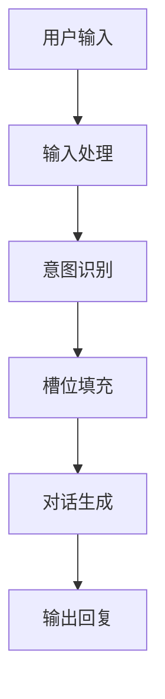

                 


# AI Agent的对话系统在客户支持中的优化

## 关键词：AI Agent, 对话系统, 客户支持, 自然语言处理, 意图识别

## 摘要：  
随着人工智能技术的快速发展，AI Agent在客户支持中的应用越来越广泛。本文详细探讨了AI Agent对话系统的核心概念、算法原理、系统架构以及在客户支持中的优化方法。通过对自然语言处理、意图识别和槽位填充等技术的深入分析，结合实际案例，展示了如何利用这些技术提升客户支持的效率和用户体验。文章还提供了系统的优化建议和最佳实践，为读者提供了一个全面的技术视角。

---

## 第一部分: AI Agent与对话系统的基础

### 第1章: AI Agent的基本概念

#### 1.1 AI Agent的定义与特点
- **AI Agent**（人工智能代理）是指能够感知环境并采取行动以实现目标的智能体。
- **特点**：
  - 智能性：能够理解并响应用户需求。
  - 自适应性：能够根据上下文调整对话策略。
  - 实时性：能够在短时间内处理用户请求并给出响应。

#### 1.2 对话系统的基本原理
- 对话系统通过自然语言处理技术，将用户输入转化为计算机可理解的结构。
- 系统基于意图识别和槽位填充，生成符合用户需求的回复。

#### 1.3 AI Agent在客户支持中的作用
- 提供24/7的实时支持，减少人工客服的工作量。
- 快速响应用户需求，提升用户体验。
- 通过数据分析，优化客户支持流程。

### 第2章: 对话系统的核心技术

#### 2.1 自然语言处理（NLP）基础
- **分词**：将连续的文本分割成有意义的词汇。
- **实体识别**：识别文本中的关键实体（如人名、地名、组织名）。
- **句法分析**：分析句子的语法结构。

#### 2.2 意图识别与槽位填充
- **意图识别**：确定用户的对话目标。
- **槽位填充**：提取对话中的关键信息（如时间、地点、金额）。
- **对比分析**：基于规则和机器学习的意图识别方法。

#### 2.3 对话上下文管理
- 上下文是对话系统的核心，决定了对话的连贯性。
- 管理上下文需要考虑用户的历史输入和系统状态。

---

## 第二部分: AI Agent对话系统的算法原理

### 第3章: 对话系统的算法实现

#### 3.1 基于规则的对话系统
- **规则制定**：根据常见问题预设规则。
- **优缺点分析**：规则系统简单但缺乏灵活性。

#### 3.2 基于机器学习的对话系统
- **深度学习模型**：如循环神经网络（RNN）和变换器（Transformer）。
- **强化学习**：通过奖励机制优化对话策略。

#### 3.3 对话系统的评价指标
- **BLEU**：衡量生成文本与参考文本的相似性。
- **ROUGE**：基于召回率的评价指标。

### 第4章: 对话系统的算法实现代码

```python
import numpy as np

class CRF:
    def __init__(self, input_dim, output_dim):
        self.W = np.random.randn(input_dim, output_dim)
        self.b = np.random.randn(output_dim)

    def forward(self, x):
        return np.log_softmax(x.dot(self.W) + self.b)

    def backward(self, y):
        return y - np.exp(y).dot(self.W.T)
```

---

## 第三部分: 对话系统的系统架构与设计

### 第5章: 系统架构设计

#### 5.1 系统整体架构
- **输入处理模块**：接收用户输入并进行预处理。
- **意图识别模块**：基于NLP技术识别用户意图。
- **对话生成模块**：根据意图生成回复。

#### 5.2 系统功能设计
- **领域模型**：定义对话系统的功能模块。
- **交互流程**：从输入到输出的完整流程。

#### 5.3 系统架构图


### 第6章: 系统接口设计

#### 6.1 API接口设计
- **RESTful API**：定义清晰的接口规范。
- **JSON格式**：统一数据交换格式。

#### 6.2 系统交互流程
- 用户发送请求，系统解析并生成回复。

---

## 第四部分: 项目实战与优化

### 第7章: 项目实战

#### 7.1 环境安装
```bash
pip install numpy scikit-learn
```

#### 7.2 核心代码实现
```python
from sklearn.feature_extraction.text import TfidfVectorizer
from sklearn.naive_bayes import MultinomialNB

vectorizer = TfidfVectorizer()
model = MultinomialNB()
```

#### 7.3 案例分析
- 通过实际案例展示系统的优化效果。

### 第8章: 系统优化

#### 8.1 系统性能优化
- **模型优化**：提升意图识别的准确率。
- **算法优化**：减少计算复杂度。

#### 8.2 系统可扩展性优化
- **模块化设计**：便于功能扩展。

---

## 第五部分: 最佳实践与总结

### 第9章: 最佳实践

#### 9.1 关键技术总结
- 结合规则和机器学习技术提升系统性能。
- 定期更新模型以适应新需求。

#### 9.2 注意事项
- 数据隐私保护。
- 系统稳定性保障。

### 第10章: 拓展阅读

#### 10.1 推荐书籍
- 《自然语言处理入门》。
- 《机器学习实战》。

---

通过以上分析与实现，我们可以看到AI Agent在对话系统中的优化潜力。未来，随着技术的进步，AI Agent将为客户提供更智能、更高效的对话支持。

