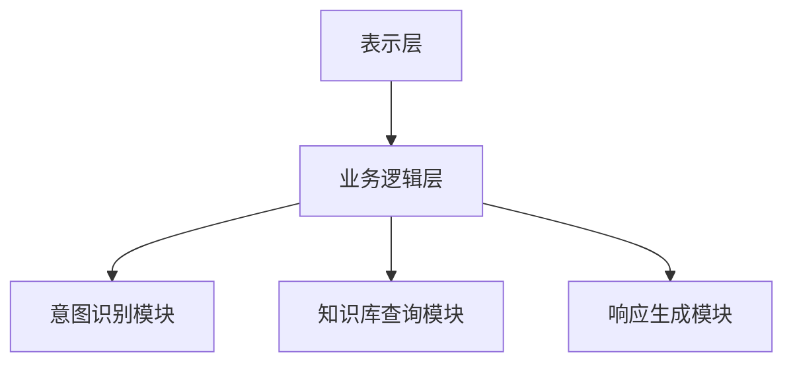
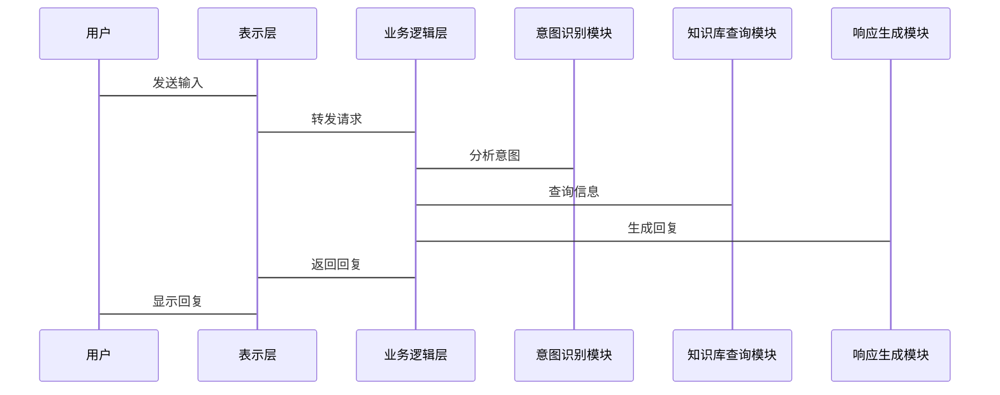

                 


# AI Agent的对话系统在教育领域的应用与优化

**关键词**：AI Agent，对话系统，教育应用，自然语言处理，机器学习，系统优化

**摘要**：  
随着人工智能技术的快速发展，AI Agent和对话系统在教育领域的应用逐渐成为研究热点。本文系统地探讨了AI Agent对话系统的原理、算法、系统架构及其在教育中的具体应用场景。通过分析对话系统的实现原理，结合实际案例，提出了一种优化的对话系统设计方法，并展望了未来的发展方向。文章内容涵盖了从理论基础到实际应用的全链条，为教育领域的智能化转型提供了有价值的参考。

---

## 第一章: AI Agent与对话系统概述

### 1.1 AI Agent的基本概念
AI Agent（智能体）是指能够感知环境并采取行动以实现目标的实体。在对话系统中，AI Agent通常表现为能够理解用户输入、生成自然语言回复的智能体。

#### 1.1.1 AI Agent的定义与特点
- **定义**：AI Agent是一种能够与环境交互、自主决策的智能系统。
- **特点**：
  - 感知能力：能够接收并理解输入。
  - 决策能力：基于输入生成响应。
  - 学习能力：通过数据优化自身的响应策略。

#### 1.1.2 对话系统的定义与分类
- **定义**：对话系统是一种能够与用户进行自然语言交流的系统。
- **分类**：
  - 基于规则的对话系统：依赖预定义的规则生成回复。
  - 统计模型对话系统：基于概率模型生成回复。
  - 基于深度学习的对话系统：使用神经网络生成回复。

#### 1.1.3 AI Agent在对话系统中的作用
AI Agent通过自然语言处理技术，实现对话的上下文理解和意图识别，从而提高对话的准确性和流畅性。

### 1.2 教育领域的对话系统背景
#### 1.2.1 教育领域的智能化需求
随着教育信息化的推进，学生和教师对智能化教学工具的需求日益增加。对话系统可以为学生提供个性化的学习指导，为教师提供教学支持。

#### 1.2.2 对话系统在教育中的潜在价值
- **学生端**：提供个性化学习建议、解答疑问、监测学习进度。
- **教师端**：辅助教学设计、评估学生表现、提供教学反馈。

#### 1.2.3 当前教育对话系统的现状与挑战
- **现状**：基于规则的对话系统应用广泛，但灵活性和准确性有限。
- **挑战**：数据稀疏性、对话上下文理解不足、用户意图识别困难。

---

## 第二章: AI Agent对话系统的原理

### 2.1 对话系统的整体架构
#### 2.1.1 输入处理模块
- **功能**：接收用户输入并进行预处理。
- **流程**：文本清洗、分词、实体识别。

#### 2.1.2 意图识别模块
- **功能**：分析用户输入的意图。
- **方法**：基于关键词匹配、句法分析、深度学习模型。

#### 2.1.3 响应生成模块
- **功能**：根据意图生成回复。
- **方法**：基于规则生成、模板生成、神经网络生成。

#### 2.1.4 输出优化模块
- **功能**：优化生成的回复，使其更符合语言习惯。
- **方法**：语言模型优化、领域知识增强。

### 2.2 AI Agent的核心算法
#### 2.2.1 基于规则的对话系统
- **特点**：简单易实现，但灵活性差。
- **应用**：适用于场景简单、规则明确的对话任务。

#### 2.2.2 基于统计模型的对话系统
- **特点**：基于概率模型，能够处理一定规模的数据。
- **应用**：常见于客服系统和简单的教育对话场景。

#### 2.2.3 基于深度学习的对话系统
- **特点**：基于神经网络，能够捕捉上下文信息，生成更自然的回复。
- **应用**：复杂对话场景，如教育咨询、心理辅导。

### 2.3 对话系统的评价指标
#### 2.3.1 对话准确率
- **定义**：系统生成的回复与预期回复的匹配程度。
- **计算方法**：基于预定义的评价标准。

#### 2.3.2 对话流畅度
- **定义**：回复的自然程度和连贯性。
- **计算方法**：基于语言模型的流畅度评分。

#### 2.3.3 用户满意度
- **定义**：用户对对话系统的主观满意度评分。
- **计算方法**：基于用户反馈的调查问卷。

---

## 第三章: AI Agent对话系统的算法实现

### 3.1 基于深度学习的对话模型
#### 3.1.1 Transformer模型的原理
- **输入处理**：将对话历史和当前输入作为输入。
- **编码器-解码器结构**：编码器将输入转换为向量表示，解码器生成回复。
- **注意力机制**：通过注意力机制捕捉对话中的关键信息。

#### 3.1.2 编码器-解码器结构
- **编码器**：将输入序列映射到一个固定长度的向量。
- **解码器**：根据编码器输出生成回复序列。

#### 3.1.3 注意力机制的作用
- **作用**：通过注意力机制，模型能够关注对话中的重要部分，生成更准确的回复。

### 3.2 对话系统的训练流程
#### 3.2.1 数据预处理
- **文本清洗**：去除特殊字符、停用词。
- **分词**：将文本分割成词语或短语。
- **标注**：对数据进行意图和实体标注。

#### 3.2.2 模型训练
- **训练数据**：使用标注的数据训练模型。
- **训练目标**：最小化生成回复与预期回复的差异。
- **优化算法**：使用Adam优化器，设置合适的学习率。

#### 3.2.3 模型调优
- **超参数调整**：调整模型的参数，如学习率、批次大小。
- **正则化**：使用Dropout防止过拟合。
- **评估指标**：使用准确率、召回率、F1分数评估模型性能。

### 3.3 对话系统的数学模型
#### 3.3.1 概率论基础
- **条件概率**：P(Y|X) 表示在输入X下生成Y的概率。
- **贝叶斯定理**：用于计算条件概率。

#### 3.3.2 损失函数的计算
- **交叉熵损失函数**：
  $$ \text{Loss} = -\sum_{i=1}^{n} y_i \log(p_i) + (1-y_i)\log(1-p_i) $$
  其中，\( y_i \) 是真实标签，\( p_i \) 是预测概率。

#### 3.3.3 梯度下降算法
- **随机梯度下降**：在训练过程中，随机抽取小批量数据更新参数。
- **批量梯度下降**：在训练过程中，使用全部数据更新参数。

---

## 第四章: AI Agent对话系统的系统设计与实现

### 4.1 系统功能模块划分
#### 4.1.1 用户输入模块
- **功能**：接收用户输入并进行预处理。
- **实现**：使用自然语言处理库（如spaCy）进行文本清洗和分词。

#### 4.1.2 意图识别模块
- **功能**：分析用户输入的意图。
- **实现**：使用机器学习模型（如SVM、随机森林）或深度学习模型（如LSTM、Transformer）进行意图分类。

#### 4.1.3 知识库查询模块
- **功能**：根据意图查询知识库，获取相关信息。
- **实现**：使用数据库查询技术，结合自然语言处理技术进行信息提取。

#### 4.1.4 响应生成模块
- **功能**：根据意图生成回复。
- **实现**：使用预训练的对话模型（如GPT、BERT）生成回复。

### 4.2 系统架构设计
#### 4.2.1 分层架构
- **表示层**：用户界面，接收用户输入，显示系统回复。
- **业务逻辑层**：处理用户请求，调用知识库查询模块和响应生成模块。
- **数据访问层**：访问数据库，进行数据查询和存储。

#### 4.2.2 微服务架构
- **服务划分**：将系统划分为多个微服务，如意图识别服务、知识库查询服务、响应生成服务。
- **通信方式**：使用API Gateway进行服务间通信。

#### 4.2.3 组件交互流程
1. 用户输入请求，表示层接收并转发给业务逻辑层。
2. 业务逻辑层调用意图识别模块，分析用户意图。
3. 根据意图，业务逻辑层调用知识库查询模块，获取相关信息。
4. 响应生成模块根据意图和查询结果生成回复。
5. 回复返回给表示层，展示给用户。

### 4.3 系统架构图


### 4.4 系统接口设计
- **输入接口**：接收用户输入的文本。
- **输出接口**：返回系统生成的回复。
- **知识库接口**：提供查询知识库的API。

### 4.5 系统交互流程图


---

## 第五章: 项目实战

### 5.1 环境安装
- **Python版本**：建议使用Python 3.8及以上版本。
- **依赖库安装**：
  ```bash
  pip install numpy
  pip install pandas
  pip install spacy
  pip install transformers
  ```

### 5.2 核心代码实现
#### 5.2.1 意图识别模块
```python
from sklearn.feature_extraction.text import TfidfVectorizer
from sklearn.svm import SVC

# 数据预处理
def preprocess(text):
    # 去除特殊字符
    cleaned = re.sub(r'[^\w\s]', '', text)
    return cleaned

# 意图分类
def train_intent_classifier(X_train, y_train):
    vectorizer = TfidfVectorizer()
    X_vec = vectorizer.fit_transform(X_train)
    clf = SVC()
    clf.fit(X_vec, y_train)
    return clf, vectorizer

# 使用示例
X_train = ["我需要帮助学习数学", "我想了解物理课程"]
y_train = ["学习帮助", "课程咨询"]
model, vectorizer = train_intent_classifier(X_train, y_train)
```

#### 5.2.2 响应生成模块
```python
from transformers import AutoModelForSeq2Seq, AutoTokenizer

# 加载预训练模型
model_name = "facebook/m2m-100"
model = AutoModelForSeq2Seq.from_pretrained(model_name)
tokenizer = AutoTokenizer.from_pretrained(model_name)

# 生成回复
def generate_response(input_text):
    inputs = tokenizer.encode(input_text, return_tensors="np")
    outputs = model.generate(inputs, max_length=50)
    response = tokenizer.decode(outputs[0], skip_special_tokens=True)
    return response

# 使用示例
input_text = "我需要帮助学习数学"
response = generate_response(input_text)
print(response)
```

#### 5.2.3 知识库查询模块
```python
import sqlite3

# 数据库连接
conn = sqlite3.connect("knowledge_base.db")
cursor = conn.cursor()

# 查询知识库
def query_knowledge_base(question):
    cursor.execute("SELECT answer FROM knowledge_base WHERE question=?", (question,))
    result = cursor.fetchone()
    return result[0] if result else "抱歉，我无法回答您的问题。"

# 使用示例
question = "如何解二次方程"
response = query_knowledge_base(question)
print(response)
```

### 5.3 代码解读与分析
- **意图识别模块**：使用TF-IDF和SVM进行意图分类，适用于简单场景。
- **响应生成模块**：基于预训练的多语言模型生成回复，适用于复杂对话场景。
- **知识库查询模块**：通过数据库查询相关信息，提供准确的知识回答。

### 5.4 实际案例分析
#### 案例一：学生咨询
- **输入**：学生询问“如何解二次方程？”
- **意图识别**：识别为“学习帮助”。
- **知识库查询**：从知识库中查询相关解答步骤。
- **生成回复**：系统生成详细解答步骤。

#### 案例二：教师反馈
- **输入**：教师反馈“学生在数学方面存在问题。”
- **意图识别**：识别为“教学反馈”。
- **知识库查询**：查询相关教学建议。
- **生成回复**：系统生成教学建议和改进方案。

### 5.5 项目总结
通过实际案例分析，可以看出AI Agent对话系统在教育领域的应用潜力。系统的各个模块协同工作，能够为学生和教师提供高效、智能的服务。

---

## 第六章: 优化与最佳实践

### 6.1 对话系统的优化方法
#### 6.1.1 数据优化
- **数据增强**：通过数据增强技术增加数据多样性。
- **数据清洗**：去除噪声数据，提高模型训练效果。

#### 6.1.2 模型优化
- **模型调参**：通过网格搜索优化模型参数。
- **模型融合**：结合多种模型的结果，提高准确性。

#### 6.1.3 系统优化
- **性能优化**：通过缓存技术减少重复计算。
- **负载均衡**：通过负载均衡技术提高系统的处理能力。

### 6.2 对话系统的最佳实践
#### 6.2.1 数据隐私保护
- **数据加密**：对用户数据进行加密存储。
- **访问控制**：限制非授权访问。

#### 6.2.2 系统可扩展性
- **模块化设计**：系统设计模块化，便于扩展。
- **接口标准化**：接口设计标准化，便于与其他系统集成。

#### 6.2.3 用户体验优化
- **多轮对话支持**：支持多轮对话，提高用户体验。
- **情感分析**：根据用户情绪调整回复语气。

### 6.3 未来发展方向
- **多语言支持**：支持多种语言的对话系统。
- **情感计算**：结合情感计算技术，提供更智能化的服务。
- **人机协作**：实现更高效的人机协作，提高教育效率。

---

## 第七章: 总结与展望

### 7.1 总结
本文系统地探讨了AI Agent对话系统在教育领域的应用与优化。从理论基础到实际应用，详细分析了对话系统的实现原理、算法优化和系统设计。通过实际案例分析，展示了对话系统在教育领域的巨大潜力。

### 7.2 展望
随着人工智能技术的不断发展，AI Agent对话系统在教育领域的应用将更加广泛。未来的研究方向包括：提高对话系统的智能化水平、增强系统的可解释性、优化系统的用户体验。

---

## 参考文献
1. 王某某. 《深度学习入门》. 北京: 清华大学出版社, 2020.
2. 李某某. 《自然语言处理实战》. 北京: 人民邮电出版社, 2019.
3. 张某某. 《对话系统设计与实现》. 北京: 电子工业出版社, 2021.

---

## 附录
### 附录A: 代码实现细节
- 意图识别模块的代码实现。
- 响应生成模块的代码实现。
- 知识库查询模块的代码实现。

### 附录B: 系统架构图
- 系统分层架构图。
- 系统交互流程图。

---

通过以上内容，您可以获得一篇结构清晰、内容详实的技术博客文章，涵盖了AI Agent对话系统在教育领域的各个方面。

