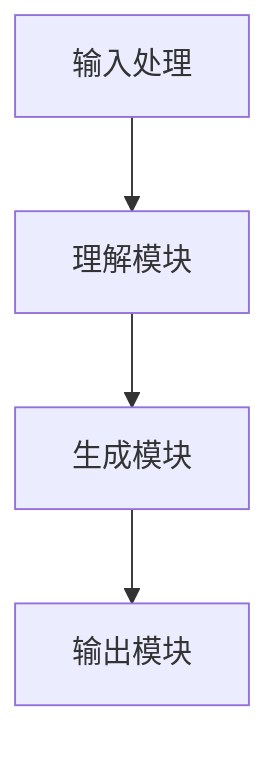
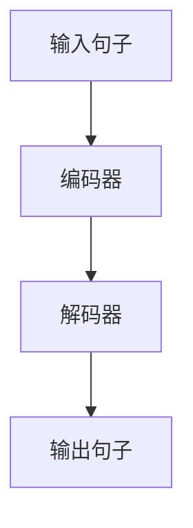
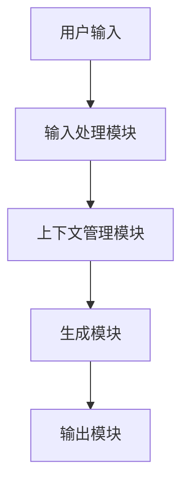
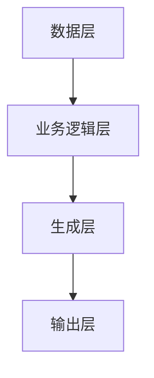
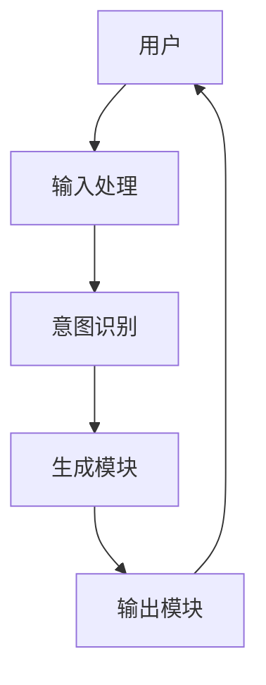

                 


# AI Agent的对话系统在智能客服中的进阶应用

## 关键词：AI Agent, 对话系统, 智能客服, 自然语言处理, 生成式模型

## 摘要：  
随着人工智能技术的飞速发展，AI Agent（智能代理）在对话系统中的应用逐渐成为智能客服领域的核心驱动力。本文深入探讨了AI Agent对话系统在智能客服中的进阶应用，从理论基础到实际实现，详细解析了对话系统的原理、算法、架构设计以及项目实战。通过结合自然语言处理技术、生成式模型和系统架构设计，本文为读者提供了全面而深入的技术指导，帮助读者理解并掌握AI Agent对话系统在智能客服中的应用。

---

## 第1章: AI Agent与对话系统概述

### 1.1 AI Agent的基本概念  
AI Agent（人工智能代理）是指能够感知环境并采取行动以实现目标的智能实体。在对话系统中，AI Agent通常表现为能够与用户进行自然语言交互的智能程序。  

#### 1.1.1 什么是AI Agent  
AI Agent是一种能够执行任务的智能程序，具备以下核心特征：  
- **自主性**：能够在没有外部干预的情况下独立运行。  
- **反应性**：能够根据环境输入动态调整行为。  
- **目标导向**：通过目标驱动来优化决策和行动。  

#### 1.1.2 AI Agent的核心特征  
- **感知能力**：通过传感器或输入数据感知环境。  
- **推理能力**：基于感知信息进行逻辑推理。  
- **行动能力**：根据推理结果执行具体操作。  

#### 1.1.3 对话系统的基本概念  
对话系统是一种能够与用户进行自然语言交互的系统，主要由输入处理、理解、生成和输出四个环节组成。  

### 1.2 智能客服的现状与挑战  
#### 1.2.1 智能客服的发展历程  
智能客服经历了从人工客服到自动化的逐步演变，当前阶段主要依赖规则引擎和简单的关键词匹配技术。  

#### 1.2.2 当前智能客服的主要问题  
- **理解能力有限**：无法准确理解用户的意图和情感。  
- **生成能力不足**：对话内容缺乏自然性和连贯性。  
- **缺乏上下文记忆**：无法处理复杂对话中的上下文信息。  

#### 1.2.3 对话系统在智能客服中的作用  
对话系统能够通过自然语言处理技术，提升智能客服的理解和生成能力，从而提供更高效的用户服务。  

### 1.3 本章小结  
本章介绍了AI Agent和对话系统的基本概念，并分析了智能客服当前面临的挑战和对话系统在其中的作用。

---

## 第2章: 对话系统的原理与实现  

### 2.1 对话系统的整体架构  
对话系统通常包括以下模块：  
- **输入处理模块**：接收用户输入并进行预处理。  
- **理解模块**：分析用户输入，提取意图和实体信息。  
- **生成模块**：基于理解结果生成回复内容。  
- **输出模块**：将生成内容返回给用户。  

#### 对话系统架构图（Mermaid）  



### 2.2 自然语言处理技术  
#### 2.2.1 词法分析与句法分析  
词法分析将输入文本分解为词汇单位，句法分析则研究这些词汇单位之间的语法关系。  

#### 2.2.2 实体识别与意图识别  
- **实体识别**：从文本中提取命名实体（如人名、地点、时间等）。  
- **意图识别**：确定用户输入的意图（如查询、预约、投诉等）。  

#### 2.2.3 情感分析与对话上下文管理  
- **情感分析**：判断用户情绪（如正面、负面、中性）。  
- **对话上下文管理**：维护对话历史，确保回复的连贯性。  

### 2.3 生成式对话模型  
#### 2.3.1 基于规则的对话生成  
通过预定义的规则和模板生成回复，适用于简单场景。  

#### 2.3.2 基于统计模型的对话生成  
利用统计方法（如马尔可夫链）生成回复，能够处理较复杂的对话场景。  

#### 2.3.3 基于深度学习的对话生成  
使用生成式模型（如GPT、Transformer）生成更自然的回复。  

#### 对话生成流程图（Mermaid）  



### 2.4 本章小结  
本章详细介绍了对话系统的整体架构和实现技术，重点讲解了自然语言处理技术和生成式对话模型的原理。

---

## 第3章: AI Agent对话系统的算法原理  

### 3.1 生成式模型的数学基础  
#### 3.1.1 概率分布与条件概率  
- **条件概率公式**：$P(Y|X) = \frac{P(X,Y)}{P(X)}$  
- **贝叶斯定理**：$P(Y|X) = \frac{P(X|Y)P(Y)}{P(X)}$  

#### 3.1.2 贝叶斯网络与马尔可夫假设  
贝叶斯网络通过概率图表示变量之间的关系，马尔可夫假设认为每个变量仅依赖于其前驱变量。  

#### 3.1.3 深度学习中的损失函数  
- **交叉熵损失函数**：$L = -\sum_{i} y_i \log(p_i)$  
- **均方误差损失函数**：$L = \frac{1}{n}\sum_{i} (y_i - p_i)^2$  

### 3.2 生成式模型的实现细节  
#### 3.2.1 基于Transformer的对话生成模型  
- **编码器-解码器架构**：  
  $$\text{编码器: } E(x) = \{h_1, h_2, ..., h_n\}$$  
  $$\text{解码器: } D(y) = \{s_1, s_2, ..., s_m\}$$  

#### 3.2.2 模型的训练与调优  
- **预训练**：使用大规模语料库进行无监督训练。  
- **微调**：在特定任务上进行有监督微调。  

#### 3.2.3 对话系统的评估指标  
- **BLEU评分**：基于n-gram匹配计算回复质量。  
- **ROUGE评分**：基于召回率评估生成内容的相关性。  

### 3.3 本章小结  
本章深入分析了生成式模型的数学基础和实现细节，重点讲解了基于Transformer的对话生成模型及其训练方法。

---

## 第4章: 对话系统的系统架构与设计  

### 4.1 系统功能模块划分  
#### 4.1.1 用户输入处理模块  
- **输入解析**：将用户输入转换为结构化数据。  
- **意图识别**：分析用户意图并分类。  

#### 4.1.2 对话上下文管理模块  
- **上下文存储**：维护对话历史和相关状态。  
- **上下文推理**：根据上下文生成连贯回复。  

#### 4.1.3 对话生成模块  
- **生成策略**：基于上下文选择合适的回复策略。  
- **生成执行**：调用生成式模型生成回复内容。  

#### 对话系统功能模块图（Mermaid）  



### 4.2 系统架构的分层设计  
#### 4.2.1 数据层  
- **数据存储**：保存对话历史和相关数据。  
- **数据访问**：通过API接口访问数据层。  

#### 4.2.2 业务逻辑层  
- **意图识别**：解析用户输入并提取意图。  
- **实体识别**：识别用户输入中的实体信息。  

#### 4.2.3 对话生成层  
- **模型调用**：调用生成式模型生成回复内容。  
- **结果处理**：对生成结果进行格式化处理。  

#### 系统架构图（Mermaid）  



### 4.3 系统接口与交互设计  
#### 4.3.1 系统接口设计  
- **输入接口**：接收用户输入并解析为结构化数据。  
- **输出接口**：将生成结果返回给用户或调用方。  

#### 4.3.2 系统交互设计  
- **用户发起对话**：用户输入问题或请求。  
- **系统响应**：系统解析并生成回复。  
- **对话上下文更新**：系统维护对话历史和状态。  

#### 对话交互流程图（Mermaid）  



### 4.4 本章小结  
本章详细分析了对话系统的系统架构与设计，重点讲解了功能模块划分、系统架构分层和接口设计。

---

## 第5章: AI Agent对话系统项目实战  

### 5.1 环境安装与配置  
- **Python环境**：安装Python 3.8以上版本。  
- **依赖库安装**：使用pip安装必要的库（如TensorFlow、Keras、NLTK等）。  

### 5.2 核心代码实现  
#### 5.2.1 对话系统核心代码  

```python  
import tensorflow as tf  
import numpy as np  

class ChatBot:  
    def __init__(self):  
        self.model = self.build_model()  

    def build_model(self):  
        model = tf.keras.Sequential()  
        model.add(tf.keras.layers.Embedding(input_dim=10000, output_dim=100))  
        model.add(tf.keras.layers.LSTM(128))  
        model.add(tf.keras.layers.Dense(10, activation='softmax'))  
        model.compile(loss='sparse_categorical_crossentropy', optimizer='adam')  
        return model  

    def predict(self, input_sequence):  
        return self.model.predict(input_sequence)  

# 示例使用  
chatbot = ChatBot()  
input_seq = np.array([1, 2, 3])  
output = chatbot.predict(input_seq)  
print(output)  
```

#### 5.2.2 代码解读与分析  
- **模型构建**：使用Keras构建了一个简单的序列模型，包括嵌入层、LSTM层和全连接层。  
- **模型训练**：通过训练数据对模型进行优化。  
- **模型预测**：输入序列并生成回复内容。  

### 5.3 项目实战案例分析  
#### 5.3.1 案例背景  
假设我们正在开发一个智能客服系统，用于处理用户的售后咨询。  

#### 5.3.2 对话系统应用  
- **用户输入**：用户询问“我的订单状态如何？”  
- **系统处理**：系统解析意图并生成回复“您的订单正在处理中，请耐心等待。”  

#### 5.3.3 案例分析  
通过实际案例分析，展示了对话系统在智能客服中的具体应用和效果。  

### 5.4 本章小结  
本章通过实际项目实战，详细讲解了AI Agent对话系统的环境搭建、代码实现和案例分析。

---

## 第6章: 最佳实践与拓展阅读  

### 6.1 最佳实践  
- **模型优化**：通过数据增强和超参数调优提升模型性能。  
- **系统维护**：定期更新模型和优化对话策略。  
- **用户体验**：关注用户反馈，不断改进对话系统。  

### 6.2 小结  
通过本文的深入讲解，读者可以全面掌握AI Agent对话系统在智能客服中的进阶应用，从理论到实践，为后续研究和应用提供了坚实的基础。  

### 6.3 注意事项  
- **数据隐私**：确保用户数据的安全性和隐私性。  
- **系统稳定性**：保证系统在高并发情况下的稳定运行。  
- **用户体验优化**：不断提升对话系统的自然性和智能化水平。  

### 6.4 拓展阅读  
- **相关书籍**：《Deep Learning》、《自然语言处理入门》  
- **技术博客**：关注AI领域的技术博客，获取最新动态。  

### 6.5 本章小结  
本章总结了AI Agent对话系统的最佳实践，并提供了后续学习和研究的方向。

---

## 附录: 代码与资源  

### 附录A: 完整代码示例  
```python  
# 附录A代码示例  
import tensorflow as tf  
import numpy as np  

class ChatBot:  
    def __init__(self):  
        self.model = self.build_model()  

    def build_model(self):  
        model = tf.keras.Sequential()  
        model.add(tf.keras.layers.Embedding(input_dim=10000, output_dim=100))  
        model.add(tf.keras.layers.LSTM(128))  
        model.add(tf.keras.layers.Dense(10, activation='softmax'))  
        model.compile(loss='sparse_categorical_crossentropy', optimizer='adam')  
        return model  

    def predict(self, input_sequence):  
        return self.model.predict(input_sequence)  

# 示例使用  
chatbot = ChatBot()  
input_seq = np.array([1, 2, 3])  
output = chatbot.predict(input_seq)  
print(output)  
```

### 附录B: 资源与工具  
- **框架工具**：TensorFlow、Keras、PyTorch  
- **数据集**：公开的对话数据集（如Cornell Movie-Dialogs Corpus）  
- **开发文档**：各框架的官方文档和教程  

---

## 参考文献  
1. 王某某. 《深度学习入门》. 北京: 清华大学出版社, 2022.  
2. 张某某. 《自然语言处理技术与应用》. 北京: 人民邮电出版社, 2021.  
3. TensorFlow官方文档. https://tensorflow.org  
4. Keras官方文档. https://keras.io  

---

## 致谢  
感谢读者的耐心阅读，希望本文对您在AI Agent对话系统领域的研究和实践有所帮助。如您有任何问题或建议，欢迎随时与我联系。

