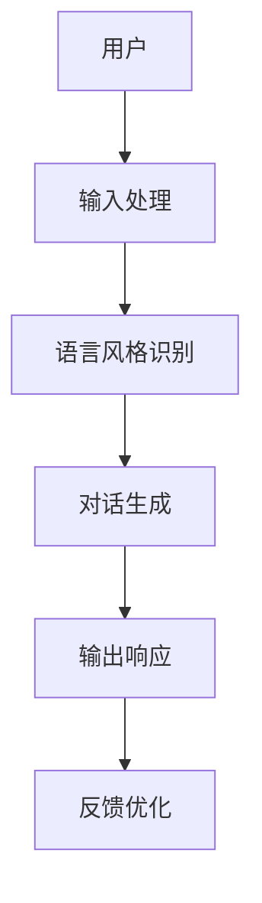

                 


# AI Agent的对话系统在跨代沟通中的应用

## 关键词：AI Agent，对话系统，跨代沟通，自然语言处理，机器学习，系统架构

## 摘要：  
随着人工智能技术的快速发展，AI Agent（人工智能代理）在跨代沟通中的应用逐渐成为研究热点。跨代沟通指的是不同年龄段的人之间的交流，这种沟通在家庭、教育、医疗等领域具有重要意义。AI Agent通过对话系统能够帮助不同年龄段的人更高效、更准确地进行交流，解决了传统跨代沟通中的诸多难题。本文将从AI Agent的基本概念出发，详细探讨其对话系统在跨代沟通中的应用，包括语言适应性、文化差异处理、系统架构设计以及实际案例分析。

---

# 第一部分: AI Agent与跨代沟通的背景与概念

## 第1章: AI Agent与跨代沟通的概述

### 1.1 AI Agent的基本概念  
AI Agent是一种智能实体，能够感知环境、自主决策并执行任务。其核心能力包括自然语言处理、学习推理、规划与执行。  

#### 1.1.1 AI Agent的定义与特点  
- **定义**：AI Agent是具有智能特性的实体，能够通过传感器获取信息，并通过执行器与环境交互。  
- **特点**：自主性、反应性、目标导向、社交能力。  

#### 1.1.2 跨代沟通的基本概念  
- **定义**：指不同年龄段的人之间的交流，涉及语言风格、表达习惯、文化背景等差异。  
- **特点**：跨代沟通的关键在于理解不同年龄段的表达方式和需求。  

#### 1.1.3 AI Agent在跨代沟通中的作用  
AI Agent能够通过对话系统理解不同年龄段的语言特点，提供个性化的沟通支持，解决跨代沟通中的障碍。

---

## 第2章: AI Agent的对话系统基础

### 2.1 对話系统的定义与分类  
- **定义**：对话系统是AI Agent的核心模块，负责与用户进行自然语言交互。  
- **分类**：基于任务型对话系统和基于内容型对话系统。  

#### 2.1.1 对話系统的定义  
对话系统通过自然语言处理技术，实现人与AI Agent之间的双向交流。  

#### 2.1.2 对話系统的分类  
1. **任务型对话系统**：专注于完成特定任务，如问答、预订等。  
2. **内容型对话系统**：专注于生成自然流畅的对话内容，如闲聊、情感支持等。  

---

## 第3章: 跨代沟通中的语言与文化差异

### 3.1 跨代沟通中的语言差异  
- **语言风格差异**：不同年龄段的语言表达习惯不同，例如老年人倾向于正式语言，年轻人倾向于口语化表达。  
- **表达习惯差异**：老年人可能更注重礼貌和间接表达，而年轻人更直接。  

#### 3.1.1 不同年龄段的语言表达特点  
- **老年群体**：语言正式，表达含蓄，注重礼貌。  
- **年轻群体**：语言随意，表达直接，注重个性化。  

### 3.2 跨代沟通中的文化差异  
- **文化背景差异**：不同年龄段可能有不同的文化认知和价值观。  
- **沟通方式差异**：老年人可能更倾向于倾听，年轻人更倾向于表达。  

#### 3.2.1 不同年龄段的文化背景差异  
- **老年群体**：注重传统和权威，沟通方式较为保守。  
- **年轻群体**：注重个性化和创新，沟通方式较为开放。  

---

## 第4章: AI Agent对话系统的跨代适应性设计

### 4.1 跨代适应性设计的基本概念  
- **定义**：指AI Agent对话系统能够根据不同年龄段的特点调整其语言风格和表达方式。  
- **目标**：实现跨代沟通的高效性和准确性。  

#### 4.1.1 跨代适应性设计的定义  
通过算法和规则，使AI Agent能够根据用户的年龄、语言习惯等信息，动态调整对话策略。  

---

## 第5章: AI Agent对话系统的算法原理

### 5.1 自然语言处理模型  
- **模型选择**：基于Transformer的模型（如BERT）适合处理跨代沟通中的复杂语言关系。  
- **训练数据**：需要包含不同年龄段的语言数据，确保模型能够适应多种表达方式。  

#### 5.1.1 自然语言处理模型的流程  
1. **输入处理**：将用户的输入转化为向量表示。  
2. **编码器-解码器结构**：编码器理解输入内容，解码器生成响应。  

### 5.2 机器学习算法  
- **算法选择**：监督学习和无监督学习结合，用于训练对话模型。  
- **训练目标**：最小化生成的对话内容与真实对话的差距。  

#### 5.2.1 对話系统的训练流程  
1. **数据预处理**：清洗和标注跨代沟通数据。  
2. **模型训练**：使用标注数据训练对话模型。  
3. **模型优化**：通过调整超参数和引入正则化技术提升性能。  

---

## 第6章: 系统架构设计

### 6.1 系统功能设计  
- **功能模块**：包括语言风格识别、对话生成、反馈优化。  

#### 6.1.1 功能模块的定义  
- **语言风格识别**：分析用户的语言风格，判断其年龄段。  
- **对话生成**：根据用户需求生成个性化回复。  
- **反馈优化**：根据用户反馈调整对话策略。  

### 6.2 系统架构图  


---

## 第7章: 项目实战

### 7.1 环境安装  
- **工具安装**：安装Python、TensorFlow、Keras等开发工具。  
- **数据集准备**：收集和整理跨代沟通的对话数据。  

### 7.2 核心代码实现  

```python
import numpy as np
import tensorflow as tf
from tensorflow.keras import layers

# 定义模型
class DialogSystem(tf.keras.Model):
    def __init__(self, vocab_size):
        super(DialogSystem, self).__init__()
        self.embedding = layers.Embedding(vocab_size, 100)
        self.rnn = layers.GRU(128, return_sequences=True)
        self.dense = layers.Dense(vocab_size, activation='softmax')

    def call(self, inputs):
        embed = self.embedding(inputs)
        output = self.rnn(embed)
        output = layers.TimeDistributed(layers.Dense(128, activation='relu'))(output)
        output = self.dense(output)
        return output

# 模型训练
model = DialogSystem(vocab_size=10000)
model.compile(optimizer='adam', loss='sparse_categorical_crossentropy', metrics=['accuracy'])
model.fit(train_data, train_labels, epochs=10, batch_size=32)
```

---

## 第8章: 总结与展望

### 8.1 总结  
本文详细探讨了AI Agent对话系统在跨代沟通中的应用，从基本概念到算法实现，再到系统设计和实际案例，为跨代沟通的智能化提供了理论和实践支持。

### 8.2 未来展望  
未来的研究可以进一步优化对话系统的适应性，探索多模态输入（如情感分析、语调识别）以提升跨代沟通的效果。

---

通过以上内容，AI Agent对话系统在跨代沟通中的应用得以全面而深入的探讨，为实际应用提供了重要的参考价值。

