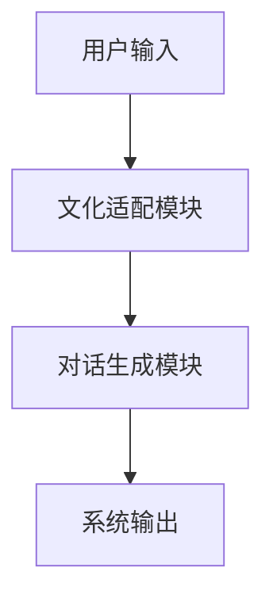

                 


# AI Agent的对话系统在跨文化交流中的应用

> 关键词：AI Agent, 对话系统, 跨文化交际, 自然语言处理, 文化适配

> 摘要：本文探讨AI Agent对话系统在跨文化交流中的应用，从技术原理、系统架构到实际案例，详细分析其在多语言支持、文化适配和对话生成中的实现方法，提出一种基于Transformer模型的跨文化对话生成算法，并通过实际案例展示其在跨文化客服系统中的应用。

---

## 第1章: AI Agent与对话系统基础

### 1.1 AI Agent的基本概念
#### 1.1.1 AI Agent的定义与特点
AI Agent（人工智能代理）是一种能够感知环境并采取行动以实现目标的智能实体。其特点包括：
- **自主性**：能够在没有外部干预的情况下运行。
- **反应性**：能够实时感知环境并做出反应。
- **目标导向性**：所有行动都以实现特定目标为导向。

#### 1.1.2 对话系统的基本原理
对话系统通过自然语言处理技术实现人与机器之间的交流。其基本原理包括：
1. **输入处理**：接收用户的输入，解析其意图。
2. **对话生成**：根据输入生成自然语言回复。
3. **上下文管理**：维护对话的上下文，确保对话连贯。

#### 1.1.3 跨文化对话的核心要素
跨文化交流中的对话需要考虑以下要素：
- **语言差异**：不同语言的语法、词汇和表达习惯。
- **文化背景**：文化差异对沟通方式的影响，例如间接与直接表达。
- **非语言因素**：肢体语言、语气等在不同文化中的差异。

---

## 第2章: 跨文化交际的技术挑战

### 2.1 跨文化交际中的AI Agent应用
#### 2.1.1 跨文化客服系统
AI Agent可以用于跨国公司的客服系统，为全球用户提供多语言支持。

#### 2.1.2 跨文化教育辅助工具
帮助学习者在跨文化环境中更好地理解和交流。

#### 2.1.3 跨文化社交平台
在社交平台上，AI Agent可以辅助用户进行跨文化社交，避免文化冲突。

### 2.2 跨文化对话系统的技术挑战
#### 2.2.1 多语言支持的技术难点
- 多语言模型训练的难度。
- 不同语言间的语义转换问题。

#### 2.2.2 文化适配的算法挑战
- 如何建模文化差异。
- 如何动态调整对话策略以适应不同文化背景。

#### 2.2.3 对话系统中的情感计算
跨文化对话中需要考虑情感差异，例如在某些文化中，间接表达负面情绪是礼貌的体现。

---

## 第3章: 跨文化对话系统的架构设计

### 3.1 系统模块划分
#### 3.1.1 自然语言处理模块
负责对输入文本的解析和生成。

#### 3.1.2 文化适配模块
根据用户的文化背景调整对话内容。

#### 3.1.3 对话管理模块
维护对话上下文，确保对话的连贯性。

### 3.2 系统接口设计
#### 3.2.1 输入接口设计
用户输入的文本经过预处理后进入系统。

#### 3.2.2 输出接口设计
生成的回复经过后处理后输出给用户。

#### 3.2.3 跨文化适配接口
根据用户的文化背景调整对话策略。

---

## 第4章: 跨文化对话系统的算法原理

### 4.1 自然语言处理模型
#### 4.1.1 Transformer模型简介
Transformer模型由编码器和解码器组成，广泛应用于自然语言处理任务。

#### 4.1.2 BERT模型在对话系统中的应用
BERT模型用于对话系统的上下文理解和生成。

#### 4.1.3 GPT系列模型的对话生成
GPT模型用于生成自然流畅的对话回复。

### 4.2 跨文化适配算法
#### 4.2.1 文化特征提取算法
通过统计和机器学习方法提取不同文化的语言特征。

#### 4.2.2 跨文化对话生成算法
基于Transformer模型的跨文化对话生成算法如下：



#### 4.2.3 文化适配度评估算法
通过用户反馈和对话上下文动态调整文化适配参数。

---

## 第5章: 跨文化对话系统的实现

### 5.1 系统环境安装
#### 5.1.1 开发环境搭建
需要安装Python、TensorFlow、PyTorch等开发工具。

#### 5.1.2 依赖库安装
安装自然语言处理相关的库，如spaCy、jieba等。

#### 5.1.3 数据集准备
准备多语言对话数据集，如多语言Wikipedia数据。

### 5.2 系统核心代码实现
#### 5.2.1 自然语言处理模块实现
```python
def preprocess(text):
    # 文本预处理函数
    return text.lower().split()
```

#### 5.2.2 跨文化适配模块实现
```python
def cultural_adaption(user_id, text):
    # 根据用户文化背景调整对话内容
    return adapted_text
```

#### 5.2.3 对话管理模块实现
```python
def manage_dialogue(history, text):
    # 维护对话历史
    return response
```

---

## 第6章: 项目实战与案例分析

### 6.1 跨文化客服系统案例
#### 6.1.1 系统功能设计
设计一个多语言客服系统，支持中英文对话。

#### 6.1.2 系统实现与测试
实现客服系统的对话功能，并进行测试优化。

#### 6.1.3 案例分析与优化
分析用户反馈，进一步优化对话系统。

### 6.2 跨文化对话系统优化
#### 6.2.1 系统性能优化
优化模型训练速度和对话生成效率。

#### 6.2.2 对话准确率提升
通过引入更多跨文化数据提高对话准确率。

#### 6.2.3 用户反馈分析
根据用户反馈进一步优化对话系统。

---

## 第7章: 最佳实践与未来展望

### 7.1 跨文化对话系统的最佳实践
#### 7.1.1 开发规范与注意事项
遵循自然语言处理的开发规范，注意数据隐私保护。

#### 7.1.2 系统维护与更新
定期更新模型和数据，保持系统的先进性。

#### 7.1.3 用户体验优化
通过用户调研不断优化用户体验。

### 7.2 跨文化对话系统的未来展望
#### 7.2.1 新技术的应用前景
如多模态对话系统的应用。

#### 7.2.2 跨文化对话系统的扩展方向
如支持更多语言和文化背景。

#### 7.2.3 未来研究的热点领域
如文化敏感性对话生成算法的研究。

---

## 第8章: 总结与小结

### 8.1 全书内容回顾
本文详细介绍了AI Agent对话系统在跨文化交流中的应用，从技术原理到实际案例进行了全面分析。

### 8.2 未来研究方向
未来可以进一步研究文化适配算法的优化和多模态对话系统的应用。

---

通过以上内容，本文系统地介绍了AI Agent对话系统在跨文化交流中的应用，从理论到实践，为相关领域的研究和开发提供了参考。

