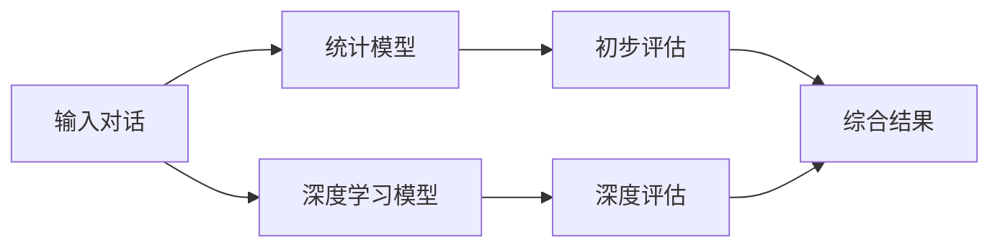
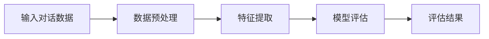
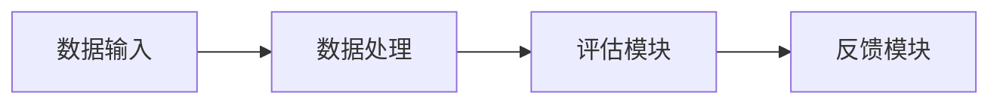

                 


# AI Agent的对话质量评估体系设计

> 关键词：AI Agent、对话质量评估、自然语言处理、深度学习、系统架构

> 摘要：本文详细探讨了AI Agent对话质量评估体系的设计，从核心概念、算法原理到系统架构，结合实际案例，全面分析了对话质量评估的关键环节和实现方法。

---

## 第1章 AI Agent的基本概念与背景

### 1.1 AI Agent的定义与核心特征

AI Agent（人工智能代理）是指能够感知环境并采取行动以实现目标的智能体。它通过与用户的交互，提供信息查询、任务执行等服务。AI Agent的核心特征包括：

- **智能性**：能够理解用户需求并生成合理的响应。
- **自主性**：无需外部干预，自主决策。
- **反应性**：实时感知环境变化并调整行为。

### 1.2 对话质量评估的背景与意义

对话质量评估是衡量AI Agent对话能力的重要指标。随着AI Agent在客服、教育等领域的广泛应用，对话质量直接影响用户体验和系统价值。当前，对话质量评估面临数据多样性不足、评估指标不统一等挑战。未来，随着技术进步，对话质量评估将更加智能化和个性化。

---

## 第2章 对话质量评估的核心概念

### 2.1 对话质量评估的指标体系

对话质量评估指标体系包括：

- **基础指标**：如准确率、响应时间。
- **高级指标**：如情感分析、上下文连贯性。
- **综合指标**：结合多维度评估结果，给出综合评分。

**对比表格**：

| 指标类型 | 示例指标 | 说明 |
|----------|----------|------|
| 基础指标 | 准确率 | 对话内容的正确性 |
| 高级指标 | 情感分析 | 对话情感的准确性 |
| 综合指标 | 综合评分 | 综合多因素的评分 |

### 2.2 对话质量评估的模型框架

模型框架包括统计模型和深度学习模型。

- **统计模型**：基于频率分析，简单但效果有限。
- **深度学习模型**：如Transformer，效果更优。

**Mermaid模型框架图**：



### 2.3 系统架构

系统架构包括数据流分析和模块划分。

- **数据流分析**：输入对话数据，经过预处理、特征提取，输出评估结果。
- **模块划分**：数据预处理、特征提取、模型评估。

**Mermaid系统架构图**：



---

## 第3章 对话质量评估的传统算法

### 3.1 统计方法

统计方法基于频率分析，简单但效果有限。

- **基于频率的统计方法**：计算词频，判断对话质量。
- **基于概率的统计方法**：如贝叶斯定理，计算条件概率。

**贝叶斯定理公式**：

$$ P(A|B) = \frac{P(B|A)P(A)}{P(B)} $$

### 3.2 基于规则的评估方法

基于预定义规则，简单但灵活性低。

- **规则的制定**：如关键词匹配。
- **规则的实现**：如正则表达式匹配。

**规则匹配示例**：

```python
import re

def check_rule(text):
    pattern = r'\bhello\b'
    return re.search(pattern, text) is not None
```

---

## 第4章 基于深度学习的对话质量评估

### 4.1 神经网络模型

深度学习模型如RNN、LSTM、Transformer。

- **RNN模型**：适合处理序列数据，但存在梯度消失问题。
- **LSTM模型**：通过门控机制解决梯度消失问题。
- **Transformer模型**：基于自注意力机制，效果更优。

**Transformer模型结构**：

$$ \text{Attention}(Q, K, V) = \text{softmax}\left(\frac{QK^T}{\sqrt{d_k}}\right)V $$

### 4.2 深度学习模型的训练流程

训练流程包括数据预处理、模型训练、模型调优。

- **数据预处理**：如分词、去除停用词。
- **模型训练**：使用训练数据优化模型参数。
- **模型调优**：如调整学习率、批量大小。

**训练代码示例**：

```python
import torch
from torch import nn

class TransformerModel(nn.Module):
    def __init__(self):
        super(TransformerModel, self).__init__()
        self.embedding = nn.Embedding(input_size, embedding_size)
        self.transformer = nn.Transformer(embedding_size, num_heads, hidden_size)

    def forward(self, x):
        x = self.embedding(x)
        x = self.transformer(x)
        return x

model = TransformerModel()
criterion = nn.CrossEntropyLoss()
optimizer = torch.optim.Adam(model.parameters(), lr=0.001)

for epoch in range(num_epochs):
    for batch in batches:
        outputs = model(batch)
        loss = criterion(outputs, labels)
        optimizer.zero_grad()
        loss.backward()
        optimizer.step()
```

### 4.3 深度学习模型的评估指标

评估指标包括准确率、召回率、F1值。

- **准确率**：正确预测的比例。
- **召回率**：真实为正类的预测为正类的比例。
- **F1值**：准确率和召回率的调和平均数。

$$ F1 = \frac{2 \cdot \text{准确率} \cdot \text{召回率}}{\text{准确率} + \text{召回率}} $$

---

## 第5章 系统分析与架构设计

### 5.1 系统功能设计

系统功能模块包括数据输入、处理、评估和反馈。

- **数据输入模块**：接收对话数据。
- **数据处理模块**：预处理数据，提取特征。
- **评估模块**：运行模型，输出评估结果。
- **反馈模块**：优化模型，提升性能。

**功能模块划分图**：



---

## 第6章 项目实战

### 6.1 环境安装

安装Python和相关库，如TensorFlow、PyTorch。

### 6.2 核心实现

实现数据预处理、模型训练和评估。

**数据预处理代码示例**：

```python
import pandas as pd

def preprocess(data):
    # 分词
    data['tokens'] = data['text'].apply(lambda x: x.split())
    return data
```

### 6.3 案例分析

分析实际对话数据，评估模型效果。

---

## 第7章 最佳实践与总结

### 7.1 最佳实践

- 选择合适的评估指标。
- 持续优化模型参数。

### 7.2 小结

对话质量评估是提升AI Agent性能的关键，通过本文的分析，读者可以掌握从概念到实现的全过程。

### 7.3 注意事项

- 数据质量影响评估结果。
- 模型选择需结合实际需求。

### 7.4 拓展阅读

推荐阅读《深度学习》、《自然语言处理入门》等书籍。

---

通过以上内容，读者可以系统地了解AI Agent对话质量评估的设计与实现，掌握关键技术和实践方法。

