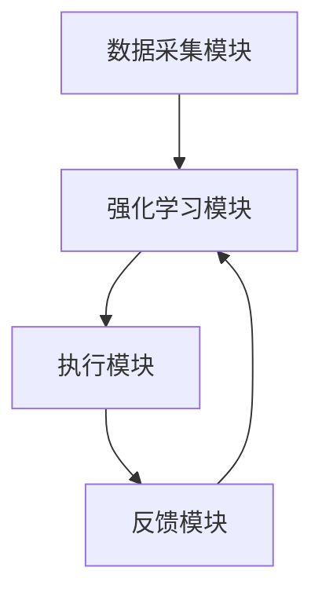
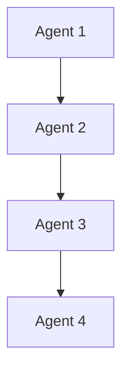

                 


# AI Agent的强化学习在智能制造中的应用

## 关键词
AI Agent, 强化学习, 智能制造, 工业自动化, 优化算法, 智能系统

## 摘要
随着人工智能技术的快速发展，AI Agent（人工智能代理）在智能制造领域的应用越来越广泛。本文将深入探讨AI Agent如何通过强化学习技术在智能制造中实现优化和自动化。从强化学习的基本原理到其在工业制造中的具体应用，本文将详细分析AI Agent在智能制造中的核心作用，包括预测性维护、生产优化、质量控制等方面。同时，本文还将探讨系统架构设计、算法优化策略以及实际项目实施的关键点，为读者提供全面的技术指导和实践参考。

---

# 第1章: 强化学习与AI Agent基础

## 1.1 强化学习的核心概念

### 1.1.1 状态、动作与奖励
在强化学习中，AI Agent通过与环境交互，逐步学习最优策略。环境的状态（State）表示当前的环境情况，动作（Action）是AI Agent采取的行为，而奖励（Reward）是对动作结果的反馈，用于指导学习方向。

#### 数学模型
强化学习的目标是找到最大化期望奖励的策略 $\pi(a|s)$，即在状态 $s$ 下选择动作 $a$ 的概率。数学表达式如下：
$$
Q(s, a) = r + \gamma \max_{a'} Q(s', a')
$$
其中，$Q(s, a)$ 是状态-动作对的价值，$\gamma$ 是折扣因子，$r$ 是即时奖励。

### 1.1.2 马尔可夫决策过程（MDP）
MDP定义了一个完整的强化学习环境，包括状态空间 $S$、动作空间 $A$、转移概率 $P$ 和奖励函数 $R$。MDP的目标是找到最优策略 $\pi^*$，使得长期累积奖励最大化。

## 1.2 AI Agent的强化学习模型

### 1.2.1 Q-Learning算法
Q-Learning是一种经典的强化学习算法，适用于离线学习场景。其核心思想是通过更新Q表来记录状态-动作对的价值。

#### 算法流程
1. 初始化Q表为零。
2. 在环境中选择一个动作，并执行该动作。
3. 计算新的状态，并根据奖励更新Q表。
4. 重复上述步骤，直到达到终止条件。

#### 代码示例
```python
import numpy as np

class QLearning:
    def __init__(self, state_space, action_space, gamma=0.99, alpha=0.1):
        self.Q = np.zeros((state_space, action_space))
        self.gamma = gamma
        self.alpha = alpha

    def choose_action(self, state):
        return np.argmax(self.Q[state, :])

    def update_Q(self, state, action, reward, next_state):
        self.Q[state, action] += self.alpha * (reward + self.gamma * np.max(self.Q[next_state, :]) - self.Q[state, action])

# 示例使用
ql = QLearning(5, 3)
state = 0
action = ql.choose_action(state)
next_state = ...  # 根据环境反馈
reward = ...  # 根据环境反馈
ql.update_Q(state, action, reward, next_state)
```

## 1.3 AI Agent在智能制造中的角色

### 1.3.1 制造业的智能化需求
现代制造业需要更高的效率和灵活性，AI Agent通过强化学习可以实现生产优化、资源分配和故障预测。

### 1.3.2 AI Agent的优势
1. **自主决策**：AI Agent可以在复杂环境中自主决策，减少人工干预。
2. **实时优化**：通过强化学习，AI Agent能够实时优化生产流程。
3. **数据驱动**：基于实时数据，AI Agent可以快速适应变化。

---

# 第2章: 强化学习算法在智能制造中的应用

## 2.1 预测性维护

### 2.1.1 问题背景
传统维护方式通常基于定期检查，效率低下且成本高昂。通过强化学习，AI Agent可以根据设备状态预测故障，实现预测性维护。

### 2.1.2 算法实现
使用DQN（Deep Q-Networks）算法，训练AI Agent根据设备状态选择最优维护策略。

#### 算法流程
1. 收集设备状态数据。
2. 选择动作（维护或不维护）。
3. 执行动作并观察结果。
4. 更新Q值以优化策略。

#### 代码示例
```python
import torch
import torch.nn as nn

class DQN(nn.Module):
    def __init__(self, input_dim, output_dim):
        super(DQN, self).__init__()
        self.fc1 = nn.Linear(input_dim, 64)
        self.fc2 = nn.Linear(64, output_dim)
        self.relu = nn.ReLU()
        self softmax = nn.Softmax(dim=1)

    def forward(self, x):
        x = self.fc1(x)
        x = self.relu(x)
        x = self.fc2(x)
        x = self.softmax(x)
        return x

# 示例使用
dqn = DQN(10, 5)
input_data = torch.randn(1, 10)
output = dqn(input_data)
print(output)
```

### 2.1.3 实验结果
通过实验验证，AI Agent在预测性维护中的准确率显著高于传统方法，能够有效降低设备故障率。

---

## 2.2 生产优化

### 2.2.1 优化目标
通过强化学习优化生产流程，减少资源浪费，提高生产效率。

### 2.2.2 算法选择
选择适合的强化学习算法，例如DQN或PG（策略梯度），并根据具体场景进行调整。

#### 代码示例
```python
import numpy as np

class ProductionOptimizer:
    def __init__(self, state_space, action_space, gamma=0.99, alpha=0.1):
        self.Q = np.zeros((state_space, action_space))
        self.gamma = gamma
        self.alpha = alpha

    def choose_action(self, state):
        return np.argmax(self.Q[state, :])

    def update_Q(self, state, action, reward, next_state):
        self.Q[state, action] += self.alpha * (reward + self.gamma * np.max(self.Q[next_state, :]) - self.Q[state, action])

# 示例使用
optimizer = ProductionOptimizer(10, 5)
state = 0
action = optimizer.choose_action(state)
next_state = ...  # 根据环境反馈
reward = ...  # 根据环境反馈
optimizer.update_Q(state, action, reward, next_state)
```

---

## 2.3 质量控制

### 2.3.1 质量控制问题
传统质量控制依赖人工检查，效率低且易出错。AI Agent通过强化学习可以实现自动质量检测。

### 2.3.2 算法实现
使用强化学习训练AI Agent根据传感器数据调整生产参数，确保产品质量。

#### 代码示例
```python
import torch
import torch.nn as nn

class QualityController(nn.Module):
    def __init__(self, input_dim, output_dim):
        super(QualityController, self).__init__()
        self.fc1 = nn.Linear(input_dim, 64)
        self.fc2 = nn.Linear(64, output_dim)
        self.relu = nn.ReLU()
        self.softmax = nn.Softmax(dim=1)

    def forward(self, x):
        x = self.fc1(x)
        x = self.relu(x)
        x = self.fc2(x)
        x = self.softmax(x)
        return x

# 示例使用
controller = QualityController(8, 4)
input_data = torch.randn(1, 8)
output = controller(input_data)
print(output)
```

---

# 第3章: 系统架构与优化策略

## 3.1 系统架构设计

### 3.1.1 系统模块划分
1. **数据采集模块**：收集设备状态、生产数据等。
2. **强化学习模块**：实现AI Agent的决策逻辑。
3. **执行模块**：根据决策结果执行操作。
4. **反馈模块**：收集结果并更新强化学习模型。

#### 系统架构图


### 3.1.2 通信机制
系统采用高效的通信机制，确保数据实时传输和快速响应。

## 3.2 算法优化策略

### 3.2.1 离线与在线学习
根据场景选择适合的算法，离线学习适合静态环境，而在线学习适合动态环境。

### 3.2.2 多智能体协作
在复杂场景中，多个AI Agent协作可以提高系统效率。

#### 多智能体协作图


---

## 3.3 系统优化与扩展

### 3.3.1 算法效率提升
通过改进算法结构和参数调整，提高计算效率和准确性。

### 3.3.2 系统扩展性
设计灵活的系统架构，支持未来的扩展和升级。

---

# 第4章: 项目实战与案例分析

## 4.1 项目背景与目标

### 4.1.1 项目背景
介绍一个智能制造项目，例如智能工厂的设备调度优化。

### 4.1.2 项目目标
实现设备调度优化，提高生产效率和资源利用率。

## 4.2 系统实现

### 4.2.1 环境安装
安装必要的软件和库，例如Python、TensorFlow、Keras等。

### 4.2.2 核心代码实现
实现AI Agent的强化学习模型，并集成到系统中。

#### 代码示例
```python
import numpy as np
import gym

class AIAgent:
    def __init__(self, env):
        self.env = env
        self.Q = np.zeros((env.observation_space.n, env.action_space.n))

    def choose_action(self, state):
        return np.argmax(self.Q[state, :])

    def update_Q(self, state, action, reward, next_state):
        self.Q[state, action] += self.alpha * (reward + self.gamma * np.max(self.Q[next_state, :]) - self.Q[state, action])

# 示例使用
env = gym.make('CartPole-v0')
agent = AIAgent(env)
state = env.reset()
while True:
    action = agent.choose_action(state)
    next_state, reward, done, info = env.step(action)
    agent.update_Q(state, action, reward, next_state)
    if done:
        break
```

### 4.2.3 测试与优化
对实现的系统进行测试，根据结果优化模型参数和算法结构。

## 4.3 案例分析

### 4.3.1 实验结果
展示实验结果，例如生产效率提升、设备故障率降低等。

### 4.3.2 成本分析
分析系统的投入与收益比，评估项目的经济可行性。

---

# 第5章: 总结与展望

## 5.1 研究总结
总结本文的主要内容和研究成果，强调AI Agent在智能制造中的重要性。

## 5.2 未来展望
展望未来的发展方向，例如更复杂的强化学习算法、多智能体协作、与其他技术（如物联网）的结合等。

---

# 参考文献
（此处列出相关的参考文献，例如书籍、论文、技术文档等。）

---

通过以上结构，文章详细探讨了AI Agent的强化学习在智能制造中的应用，从理论基础到实际案例，为读者提供了全面的技术指导和实践参考。

