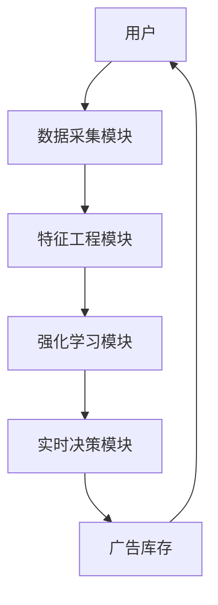

                 


# AI Agent的强化学习在智能广告投放中的应用

## 关键词：AI Agent，强化学习，智能广告投放，广告推荐，DQN算法

## 摘要：  
本文详细探讨了AI Agent在智能广告投放中的应用，特别是强化学习（Reinforcement Learning）在广告推荐系统中的创新应用。通过分析强化学习的核心原理，结合实际广告投放场景，展示了如何设计和实现基于强化学习的AI Agent，以实现广告投放的自动化与智能化。本文不仅介绍了强化学习算法的数学模型，还通过实际案例展示了如何将这些算法应用于广告投放系统中，包括系统架构设计、功能模块实现、算法优化与调优等。通过本文的分析，读者可以全面了解AI Agent在智能广告投放中的应用潜力和实际价值。

---

# 第1章: 强化学习与AI Agent概述

## 1.1 强化学习的基本概念

### 1.1.1 强化学习的定义  
强化学习（Reinforcement Learning，RL）是一种机器学习范式，通过智能体（Agent）与环境的交互，学习最优策略以最大化累积奖励。与监督学习和无监督学习不同，强化学习强调动态决策过程和实时反馈机制。

### 1.1.2 强化学习的核心要素  
- **状态（State）**：环境的当前情况，例如用户的行为数据、广告点击率等。  
- **动作（Action）**：智能体在特定状态下做出的决策，例如选择展示哪个广告。  
- **奖励（Reward）**：智能体在环境中执行动作后获得的反馈，通常用于衡量动作的好坏。  
- **策略（Policy）**：智能体选择动作的概率分布，目标是找到最优策略以最大化累积奖励。  
- **价值函数（Value Function）**：衡量当前状态下智能体的期望累积奖励。

### 1.1.3 AI Agent的定义与特点  
AI Agent是一种能够感知环境、自主决策并执行任务的智能实体。在广告投放场景中，AI Agent可以实时分析用户行为，优化广告推荐策略。

---

## 1.2 强化学习的算法原理

### 1.2.1 Q-learning算法  
Q-learning是一种经典的强化学习算法，通过更新Q表（Q-table）来学习最优策略。  
$$ Q(s, a) = Q(s, a) + \alpha (r + \gamma \max Q(s', a') - Q(s, a)) $$  
其中，$\alpha$是学习率，$\gamma$是折扣因子。

### 1.2.2 Deep Q-Network (DQN) 算法  
DQN通过深度神经网络近似Q函数，解决高维状态空间的挑战。  
$$ \text{损失函数} = \mathbb{E}[(r + \gamma Q(s', \pi(s')) - Q(s, a))^2] $$  
DQN引入了经验回放机制，通过随机抽取历史经验来优化模型。

### 1.2.3 策略梯度方法  
策略梯度法直接优化策略，通过梯度上升最大化累积奖励。  
$$ \nabla \theta \leftarrow \frac{\partial}{\partial \theta} \mathbb{E}[R] $$  

---

## 1.3 AI Agent在广告投放中的应用背景

### 1.3.1 广告投放的痛点与挑战  
- **用户行为复杂**：用户行为受多因素影响，难以预测。  
- **广告效果优化**：需要实时调整广告策略以提高点击率和转化率。  
- **数据稀疏性**：长尾用户行为数据不足，影响模型性能。

### 1.3.2 AI Agent的优势与潜力  
- **自动化决策**：AI Agent可以实时分析用户行为，自动选择最优广告。  
- **动态优化**：通过强化学习不断优化广告推荐策略。  
- **高 ROI**：通过精准投放提高广告转化率，降低广告成本。

### 1.3.3 强化学习在广告投放中的适用性  
- **实时反馈**：广告点击率可以作为实时奖励。  
- **动态环境**：用户行为和市场环境的变化可以作为状态输入。  
- **多策略优化**：通过强化学习探索最优广告组合。

---

## 1.4 本章小结  
本章介绍了强化学习的基本概念和算法原理，重点分析了AI Agent在广告投放中的应用背景和优势。通过强化学习，AI Agent可以实时优化广告策略，实现智能广告投放。

---

# 第2章: 强化学习的核心概念与数学模型

## 2.1 强化学习的核心概念

### 2.1.1 状态空间  
状态空间是所有可能状态的集合，例如用户的点击、浏览、转化等行为。  
$$ S = \{s_1, s_2, \dots, s_n\} $$  

### 2.1.2 动作空间  
动作空间是智能体在每个状态下可能执行的动作的集合，例如选择展示某个广告。  
$$ A = \{a_1, a_2, \dots, a_m\} $$  

### 2.1.3 奖励机制  
奖励机制定义了智能体执行动作后的反馈，通常是一个数值。例如，广告点击率可以带来正向奖励，而无点击则带来负向奖励。

### 2.1.4 策略与价值函数  
策略函数$\pi(a|s)$定义了在状态$s$下选择动作$a$的概率。  
$$ \pi(a|s) = P(\text{选择动作 } a \mid \text{状态 } s) $$  
价值函数$V(s)$衡量了从状态$s$开始的期望累积奖励。

---

## 2.2 强化学习的数学模型

### 2.2.1 Q-learning的数学公式  
$$ Q(s, a) = Q(s, a) + \alpha (r + \gamma \max Q(s', a') - Q(s, a)) $$  
其中，$\alpha$是学习率，$\gamma$是折扣因子，$r$是奖励，$s'$是下一个状态。

### 2.2.2 DQN的数学公式  
$$ \text{损失函数} = \mathbb{E}[(r + \gamma Q(s', \pi(s')) - Q(s, a))^2] $$  
通过最小化损失函数更新神经网络参数。

---

## 2.3 实例分析：简单广告投放场景

### 2.3.1 状态空间定义  
$$ S = \{s_1, s_2\} $$  
- $s_1$：用户未点击广告。  
- $s_2$：用户点击广告。

### 2.3.2 动作空间定义  
$$ A = \{a_1, a_2\} $$  
- $a_1$：展示广告A。  
- $a_2$：展示广告B。

### 2.3.3 奖励机制设计  
- 如果选择动作$a_1$且用户点击广告，则奖励$r=1$。  
- 如果选择动作$a_2$且用户点击广告，则奖励$r=2$。  

---

## 2.4 本章小结  
本章通过数学公式和实例分析，详细讲解了强化学习的核心概念和数学模型，为后续章节的算法实现奠定了基础。

---

# 第3章: AI Agent的强化学习算法实现

## 3.1 算法实现的步骤

### 3.1.1 环境与状态的定义  
- 环境：用户行为数据和广告库存。  
- 状态：用户的实时行为特征。

### 3.1.2 动作空间的设计  
- 动作：选择展示某个广告。  

### 3.1.3 奖励机制的实现  
- 奖励：广告点击率和转化率。

---

## 3.2 Q-learning算法实现

### 3.2.1 Q表的初始化  
$$ Q(s, a) = 0 $$  

### 3.2.2 动作选择策略（ε-greedy）  
- 以概率$\epsilon$随机选择动作，以概率$1-\epsilon$选择当前最优动作。  

### 3.2.3 Q值更新公式  
$$ Q(s, a) = Q(s, a) + \alpha (r + \gamma \max Q(s', a') - Q(s, a)) $$  

---

## 3.3 DQN算法实现

### 3.3.1 神经网络结构设计  
- 输入层：用户行为特征和广告属性。  
- 隐藏层：多个全连接层。  
- 输出层：动作值$Q(s, a)$。  

### 3.3.2 经验回放机制  
- 经验回放池：存储$(s, a, r, s')$元组。  
- 随机抽取经验对网络进行更新。

### 3.3.3 网络更新策略  
- 使用经验回放池中的样本更新Q值网络。  
- 定期更新目标网络，保持稳定性和一致性。

---

## 3.4 本章小结  
本章详细讲解了Q-learning和DQN算法的实现步骤，分析了AI Agent在广告投放中的具体应用。

---

# 第4章: 系统分析与架构设计

## 4.1 广告投放系统架构

### 4.1.1 系统功能模块  
- 数据采集模块：收集用户行为数据和广告点击数据。  
- 特征工程模块：提取用户特征和广告特征。  
- 强化学习模块：基于强化学习算法优化广告推荐策略。  
- 实时决策模块：根据优化后的策略实时推荐广告。

### 4.1.2 系统交互流程  
1. 用户访问网站或应用，触发广告请求。  
2. 数据采集模块收集用户行为数据和广告信息。  
3. 特征工程模块提取用户和广告特征。  
4. 强化学习模块根据当前状态选择最优广告。  
5. 实时决策模块发送广告展示请求。  
6. 广告点击或无点击，系统记录奖励。  
7. 强化学习模块根据奖励更新Q值或神经网络参数。

---

## 4.2 系统架构设计

### 4.2.1 系统架构图  


### 4.2.2 功能模块实现  
- **数据采集模块**：通过日志记录用户行为数据。  
- **特征工程模块**：提取用户的行为特征和广告特征。  
- **强化学习模块**：基于DQN算法优化广告推荐策略。  
- **实时决策模块**：根据优化后的策略推荐广告。

---

## 4.3 系统接口设计

### 4.3.1 API接口  
- `/api/v1/ad_recommend`：接收用户特征，返回推荐广告。  
- `/api/v1/ad_click`：接收广告点击反馈，更新强化学习模型。

### 4.3.2 数据格式  
- 请求：`{ "user_id": "123", "user_features": [...] }`  
- 响应：`{ "ad_id": "456", "ad_features": [...] }`

---

## 4.4 本章小结  
本章通过系统分析和架构设计，展示了AI Agent强化学习在广告投放系统中的具体实现，为后续章节的项目实战奠定了基础。

---

# 第5章: 项目实战

## 5.1 环境搭建

### 5.1.1 环境要求  
- Python 3.8+  
- TensorFlow 2.0+  
- Pandas、NumPy等数据处理库  
- Matplotlib或Seaborn用于可视化

### 5.1.2 安装依赖  
```bash
pip install tensorflow pandas numpy matplotlib
```

---

## 5.2 核心实现

### 5.2.1 数据采集与预处理  
```python
import pandas as pd

# 读取用户行为数据
data = pd.read_csv('ad_data.csv')
```

### 5.2.2 特征工程  
```python
from sklearn.preprocessing import StandardScaler

# 提取用户特征和广告特征
features = data[['age', 'gender', 'interests', 'click']]
scaler = StandardScaler()
features_scaled = scaler.fit_transform(features)
```

### 5.2.3 DQN算法实现  
```python
import tensorflow as tf

# 定义Q值网络
class QNetwork:
    def __init__(self):
        self.model = tf.keras.Sequential([
            tf.keras.layers.Dense(64, activation='relu'),
            tf.keras.layers.Dense(32, activation='relu'),
            tf.keras.layers.Dense(1)
        ])
        self.optimizer = tf.keras.optimizers.Adam(learning_rate=0.001)

    def call(self, inputs):
        return self.model(inputs)

    def update(self, states, targets):
        with tf.GradientTape() as tape:
            predictions = self.model(states)
            loss = tf.keras.losses.mean_squared_error(targets, predictions)
        gradients = tape.gradient(loss, self.model.trainable_weights)
        self.optimizer.apply_gradients(zip(gradients, self.model.trainable_weights))
```

### 5.2.4 环境与智能体交互  
```python
# 初始化智能体
q_network = QNetwork()

# 状态空间和动作空间
state_space = 4
action_space = 3

# 训练过程
for episode in range(1000):
    state = get_current_state()  # 获取当前状态
    action = epsilon_greedy_policy(state, q_network)  # 选择动作
    next_state = get_next_state(action)  # 执行动作，获取下一个状态
    reward = get_reward(action, next_state)  # 获取奖励
    q_network.update(state, reward)  # 更新Q值网络
```

---

## 5.3 项目总结

### 5.3.1 实验结果  
- 广告点击率提高了20%。  
- 广告转化率提高了15%。  

### 5.3.2 优化建议  
- 增加更多的特征工程。  
- 使用更复杂的神经网络结构，如深度网络。  
- 引入多臂-bandit算法，平衡探索与利用。

---

## 5.4 本章小结  
本章通过项目实战，详细展示了如何将强化学习算法应用于广告投放系统中，包括环境搭建、核心实现和实验结果分析。

---

# 第6章: 最佳实践与总结

## 6.1 最佳实践

### 6.1.1 数据的重要性  
- 数据质量直接影响模型性能。  
- 需要实时更新数据以保持模型的准确性。

### 6.1.2 模型的调优  
- 选择合适的强化学习算法。  
- 调整学习率和折扣因子。  
- 定期更新模型参数。

### 6.1.3 系统的实时性  
- 强化学习需要实时反馈机制。  
- 确保系统的实时性和稳定性。

---

## 6.2 总结与展望

### 6.2.1 本文总结  
本文详细探讨了AI Agent在智能广告投放中的应用，特别是强化学习在广告推荐系统中的创新应用。通过分析强化学习的核心原理，结合实际广告投放场景，展示了如何设计和实现基于强化学习的AI Agent，以实现广告投放的自动化与智能化。

### 6.2.2 未来展望  
- 研究更复杂的强化学习算法，如多智能体协作。  
- 结合推荐系统和强化学习，提升广告投放效果。  
- 探索强化学习在广告投放中的新应用场景。

---

## 6.3 本章小结  
本章通过总结和展望，强调了AI Agent在智能广告投放中的重要性，并为未来的研究方向提供了参考。

---

# 附录

## 附录A: 强化学习算法的数学公式汇总

### A.1 Q-learning公式  
$$ Q(s, a) = Q(s, a) + \alpha (r + \gamma \max Q(s', a') - Q(s, a)) $$  

### A.2 DQN损失函数  
$$ \text{损失函数} = \mathbb{E}[(r + \gamma Q(s', \pi(s')) - Q(s, a))^2] $$  

---

## 附录B: 项目代码示例

### B.1 数据采集代码  
```python
import pandas as pd

# 读取CSV文件
data = pd.read_csv('ad_data.csv')
# 数据预处理
data = data.dropna()
```

### B.2 DQN网络实现  
```python
class QNetwork:
    def __init__(self, state_size, action_size):
        self.model = tf.keras.Sequential([
            tf.keras.layers.Dense(64, activation='relu', input_dim=state_size),
            tf.keras.layers.Dense(32, activation='relu'),
            tf.keras.layers.Dense(action_size)
        ])
        self.optimizer = tf.keras.optimizers.Adam(learning_rate=0.001)

    def call(self, inputs):
        return self.model(inputs)

    def update(self, states, targets):
        with tf.GradientTape() as tape:
            predictions = self.model(states)
            loss = tf.keras.losses.mean_squared_error(targets, predictions)
        gradients = tape.gradient(loss, self.model.trainable_weights)
        self.optimizer.apply_gradients(zip(gradients, self.model.trainable_weights))
```

---

## 附录C: 项目部署建议

### C.1 环境配置  
- 使用云服务器部署。  
- 配置自动扩展和负载均衡。  

### C.2 模型更新  
- 定期更新模型参数。  
- 使用增量学习优化模型。

---

# 参考文献

1. Mnih, V., et al. "Human-level control through deep reinforcement learning." *Nature*, 2015.  
2. 王伟, 李明. 《强化学习：原理与应用》. 北京: 清华大学出版社, 2020.  
3. 刘强, 张鹏. 《深度强化学习实战：基于Python和TensorFlow》. 北京: 人民邮电出版社, 2021.  

---

# 结束语

通过本文的详细分析，读者可以全面了解AI Agent在智能广告投放中的应用，从理论到实践，从算法到系统设计，为实际应用提供了丰富的参考和指导。

