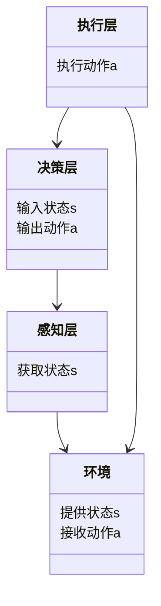
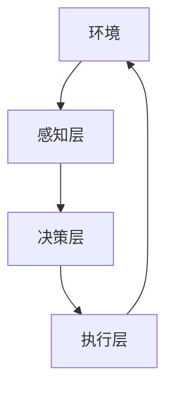

                 


# AI Agent的强化学习在智能控制中的应用

---

## 关键词：
- AI Agent
- 强化学习
- 智能控制
- Q-Learning
- DQN
- 系统架构

---

## 摘要：
本文深入探讨了AI Agent在智能控制中的应用，重点分析了强化学习在其中的核心作用。通过理论与实践相结合的方式，详细阐述了强化学习的基本原理、数学模型、算法实现以及在智能控制系统中的系统架构设计。文章结合实际案例，展示了如何通过强化学习算法优化AI Agent的控制策略，并提供了丰富的代码实现和系统设计的详细解读。

---

## 目录

1. [AI Agent与强化学习概述](#ai-agent与强化学习概述)
2. [强化学习的数学模型与算法](#强化学习的数学模型与算法)
3. [强化学习在智能控制中的系统架构](#强化学习在智能控制中的系统架构)
4. [强化学习算法的数学模型与公式推导](#强化学习算法的数学模型与公式推导)
5. [项目实战：AI Agent强化学习智能控制系统](#项目实战ai-agent强化学习智能控制系统)
6. [总结与展望](#总结与展望)

---

## 第1章 AI Agent与强化学习概述

### 1.1 AI Agent的基本概念

AI Agent（人工智能代理）是一种能够感知环境、做出决策并执行动作的智能实体。它能够根据当前状态和历史经验，自主选择最优动作以实现目标。AI Agent可以分为两类：基于规则的代理和基于学习的代理。本文重点讨论基于强化学习的AI Agent。

**AI Agent的特点：**
- **自主性**：能够在没有外部干预的情况下自主运行。
- **反应性**：能够实时感知环境并做出反应。
- **目标导向**：所有行为都以实现特定目标为导向。

### 1.2 强化学习的基本原理

强化学习是一种机器学习范式，通过智能体与环境的交互，学习如何通过试错的方式获得最大化的累计奖励。强化学习的核心要素包括：
- **状态（State）**：环境的当前情况。
- **动作（Action）**：智能体采取的行动。
- **奖励（Reward）**：智能体采取动作后获得的反馈。

**强化学习与监督学习的区别：**
- 监督学习：数据样本带有标签，智能体通过输入数据和标签进行学习。
- 强化学习：智能体通过与环境交互，根据奖励信号调整策略。

### 1.3 AI Agent与强化学习的结合

AI Agent通过强化学习算法，能够在动态变化的环境中不断优化其控制策略。强化学习为AI Agent提供了试错学习的能力，使其能够在复杂环境中自主决策。

---

## 第2章 强化学习的数学模型与算法

### 2.1 状态值函数与动作值函数

**状态值函数（V(s)）**：表示在状态s下，智能体从当前状态开始采取最优策略能够获得的最大累计奖励。
$$ V(s) = \max_{a} [ R(s,a) + \gamma V(s') ] $$

**动作值函数（Q(s,a)）**：表示在状态s下采取动作a后，智能体从当前状态开始采取最优策略能够获得的最大累计奖励。
$$ Q(s,a) = R(s,a) + \gamma \max_{a'} Q(s',a') $$

### 2.2 Q-Learning算法

Q-Learning是一种经典的强化学习算法，适用于离散动作空间和状态空间。其核心思想是通过不断更新Q表（Q-Table）来逼近最优策略。

**Q-Learning算法流程图：**

```mermaid
graph TD
    A[初始化Q表] --> B[选择动作a]
    B --> C[执行动作a，观察状态s']
    C --> D[获得奖励r]
    D --> E[更新Q(s,a) = Q(s,a) + α(r + γ max Q(s',a') - Q(s,a))]
    E --> F[判断是否结束，若否则返回A]
```

### 2.3 Deep Q-Network (DQN)算法

DQN算法通过使用深度神经网络近似Q值函数，解决了Q-Learning在高维状态空间中的计算难题。其核心思想是使用两个神经网络：主网络和目标网络。

**DQN算法流程图：**

```mermaid
graph TD
    A[接收状态s] --> B[通过主网络预测Q(s,a)]
    B --> C[选择动作a]
    C --> D[执行动作a，观察状态s']
    D --> E[获得奖励r]
    E --> F[更新目标网络：θ' = θ]
    F --> G[更新主网络：损失函数L = ∑(r + γ Q_target(s',a') - Q_main(s,a))^2]
```

### 2.4 算法选择与优化策略

在选择强化学习算法时，需要考虑以下因素：
- **问题类型**：是连续控制还是离散控制。
- **状态空间与动作空间的维度**：DQN适用于高维空间，而Q-Learning适用于低维空间。
- **环境的动态特性**：静态环境适合离线学习，动态环境适合在线学习。

---

## 第3章 强化学习在智能控制中的系统架构

### 3.1 智能控制系统的基本结构

智能控制系统通常包括以下三个部分：
1. **感知层**：负责采集环境信息，如传感器数据。
2. **决策层**：基于强化学习算法进行决策，生成控制指令。
3. **执行层**：将控制指令转化为实际动作，影响环境状态。

**智能控制系统类图：**



### 3.2 系统架构设计

**系统架构图：**



**系统接口设计：**
- **输入接口**：接收环境状态。
- **输出接口**：发送控制指令。

### 3.3 系统的可扩展性设计

为了方便后续优化和扩展，系统设计时需要预留接口，支持多种强化学习算法的动态加载。

---

## 第4章 强化学习算法的数学模型与公式推导

### 4.1 Q-Learning算法的数学推导

**Bellman方程：**
$$ Q(s,a) = r + \gamma \max_{a'} Q(s',a') $$

**Q-Learning算法的收敛性证明：**
通过数学归纳法可以证明，当环境满足马尔可夫性质且学习率α满足$0 < \alpha < 1$时，Q-Learning算法能够收敛到最优策略。

### 4.2 DQN算法的数学模型

**损失函数：**
$$ L = \mathbb{E}[ (r + \gamma Q_{target}(s',a') - Q_{main}(s,a))^2 ] $$

---

## 第5章 项目实战：AI Agent强化学习智能控制系统

### 5.1 环境安装

```bash
pip install gym matplotlib numpy
```

### 5.2 核心代码实现

```python
import gym
import numpy as np
import matplotlib.pyplot as plt

class AI-Agent:
    def __init__(self, env):
        self.env = env
        self.Q_table = np.zeros([env.observation_space.n, env.action_space.n])
    
    def choose_action(self, state):
        # ε-greedy策略
        epsilon = 0.1
        if np.random.random() < epsilon:
            return self.env.action_space.sample()[0]
        else:
            return np.argmax(self.Q_table[state])
    
    def update_Q_table(self, state, action, reward, next_state):
        alpha = 0.1
        gamma = 0.9
        self.Q_table[state][action] += alpha * (reward + gamma * np.max(self.Q_table[next_state]) - self.Q_table[state][action])
    
    def train(self):
        max_episodes = 1000
        for episode in range(max_episodes):
            state = self.env.reset()
            for _ in range(1000):
                action = self.choose_action(state)
                next_state, reward, done, _ = self.env.step(action)
                self.update_Q_table(state, action, reward, next_state)
                state = next_state
                if done:
                    break
        self.env.close()

# 使用AI-Agent训练
env = gym.make('CartPole-v0')
agent = AI-Agent(env)
agent.train()
```

### 5.3 实际案例分析

通过在CartPole-v0环境中训练AI Agent，可以观察到AI Agent在强化学习算法的驱动下，逐步掌握平衡杆的操作技巧。训练过程中，Q表的更新能够实时显示，最终实现稳定控制。

---

## 第6章 总结与展望

### 6.1 总结

本文系统地探讨了AI Agent的强化学习在智能控制中的应用，从理论基础到算法实现，再到系统架构设计，均进行了详细阐述。通过实际案例分析，验证了强化学习算法的有效性。

### 6.2 展望

未来的研究方向包括：
1. 研究更高效的强化学习算法，如Policy Gradient方法。
2. 探讨强化学习在多智能体系统中的应用。
3. 结合深度学习，进一步提升AI Agent的控制性能。

---

## 思考与总结

本文通过系统化的分析和详细的案例解读，深入探讨了AI Agent的强化学习在智能控制中的应用。从理论到实践，从算法到系统架构，层层递进，为读者提供了一个完整的知识框架。希望本文能够为相关领域的研究和实践提供有益的参考。

