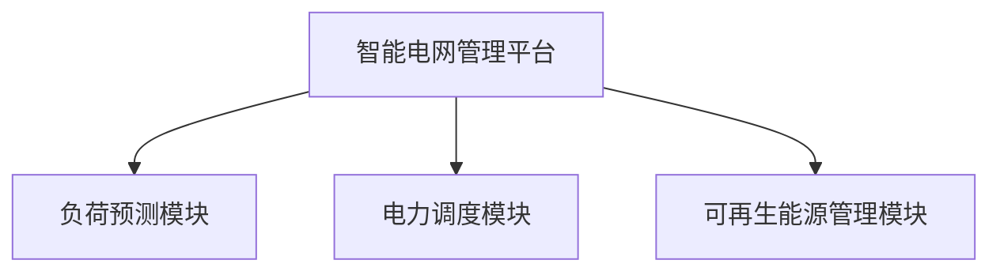

                 


# AI Agent的强化学习在智能电网管理中的应用

> 关键词：AI Agent，强化学习，智能电网，电力系统，能源管理，优化算法

> 摘要：本文探讨了AI Agent在智能电网管理中的应用，特别是强化学习算法在电力系统优化中的作用。通过分析AI Agent的定义、强化学习的核心原理以及它们在智能电网中的具体应用，本文详细讲解了如何利用强化学习算法优化电力系统的负荷预测、电力调度和可再生能源整合。同时，本文提供了具体的数学模型、Python代码实现和实际案例分析，帮助读者更好地理解和应用这些技术。

---

## 第1章: AI Agent与强化学习概述

### 1.1 AI Agent的基本概念

#### 1.1.1 AI Agent的定义与分类

AI Agent（人工智能代理）是指在计算机系统中，能够感知环境并采取行动以实现目标的智能实体。AI Agent可以根据其智能水平和应用场景分为多种类型，包括：

- **简单反射型Agent**：基于当前状态做出反应，适用于简单的决策问题。
- **基于模型的反射型Agent**：维护环境的状态模型，并根据模型进行决策。
- **目标驱动型Agent**：根据预设目标选择最优行动。
- **效用驱动型Agent**：通过最大化效用函数来优化决策。

#### 1.1.2 强化学习的基本原理

强化学习是一种机器学习范式，通过智能体与环境的交互，学习最优策略以最大化累计奖励。其核心概念包括：

- **状态（State）**：智能体所处环境的当前情况。
- **动作（Action）**：智能体基于当前状态采取的行动。
- **奖励（Reward）**：智能体行动后获得的反馈，用于评估行动的好坏。
- **策略（Policy）**：智能体在不同状态下选择行动的概率分布。
- **值函数（Value Function）**：衡量某状态下采取某种行动的期望收益。

#### 1.1.3 AI Agent在智能电网中的应用背景

智能电网是一种现代化的电力系统，通过整合先进的信息通信技术和 renewable energy sources，实现电力的高效管理。AI Agent在智能电网中的应用，可以帮助实现负荷预测、电力调度、可再生能源整合等关键任务。

---

## 第2章: 强化学习在智能电网中的应用

### 2.1 智能电网的基本结构

智能电网由发电、输电、配电、用电和通信五个部分组成。其特点是：

- **可扩展性**：能够适应能源需求的增长。
- **实时性**：能够实时监测和调整电力系统状态。
- **可再生能源整合**：能够有效管理风能、太阳能等可再生能源。

### 2.2 AI Agent在智能电网管理中的作用

#### 2.2.1 负荷预测与优化

AI Agent可以通过强化学习算法，根据历史用电数据和天气状况，预测未来的电力需求，并制定最优的负荷分配策略。

#### 2.2.2 电力调度与分配

在电力调度中，AI Agent可以根据实时电力需求和发电能力，优化电力资源的分配，确保电力系统的稳定运行。

#### 2.2.3 可再生能源的整合与管理

随着可再生能源的广泛应用，AI Agent可以帮助电力系统更好地整合风能、太阳能等不稳定能源，通过动态调整储能和发电计划，实现能源的高效利用。

---

## 第3章: 强化学习算法的数学模型与公式

### 3.1 Q-learning算法的数学模型

Q-learning是一种经典的强化学习算法，适用于离散动作空间的问题。其核心公式为：

$$ Q(s,a) = Q(s,a) + \alpha [r + \gamma \max Q(s',a') - Q(s,a)] $$

其中：
- \( Q(s,a) \) 表示在状态 \( s \) 下采取行动 \( a \) 的期望奖励。
- \( \alpha \) 是学习率。
- \( r \) 是获得的奖励。
- \( \gamma \) 是折扣因子。
- \( Q(s',a') \) 是下一个状态 \( s' \) 下的最大Q值。

### 3.2 Deep Q-learning的网络结构

Deep Q-learning通过深度神经网络近似Q值函数，适用于高维状态空间的问题。其网络结构包括输入层、隐藏层和输出层。

$$ \text{输入} \rightarrow \text{隐藏层} \rightarrow \text{输出} $$

网络权重更新公式为：

$$ \theta_{new} = \theta_{old} - \eta \nabla L $$

其中：
- \( \theta \) 是网络参数。
- \( \eta \) 是学习率。
- \( L \) 是损失函数。

---

## 第4章: AI Agent在智能电网中的系统架构设计

### 4.1 系统功能设计

智能电网管理系统的功能模块包括：

- **负荷预测模块**：基于历史数据和天气预测，预测未来电力需求。
- **电力调度模块**：根据实时电力供需，优化电力资源分配。
- **可再生能源管理模块**：整合风能、太阳能等可再生能源，动态调整储能和发电计划。

### 4.2 系统架构图



### 4.3 系统接口设计

- **API接口定义**：系统通过REST API与外部系统进行数据交互。
- **数据流方向**：从传感器到管理平台，再分发到各个功能模块。

---

## 第5章: AI Agent的强化学习算法实现

### 5.1 算法实现步骤

#### 5.1.1 环境搭建与数据预处理

- 环境搭建：安装必要的Python库（如NumPy、TensorFlow）。
- 数据预处理：将电力系统的数据进行标准化处理。

#### 5.1.2 神经网络模型构建

- 输入层：接收电力系统的状态数据。
- 隐藏层：进行特征提取和非线性变换。
- 输出层：输出每个动作的Q值。

#### 5.1.3 算法训练与优化

- 训练过程：通过与环境交互，更新Q值函数。
- 优化策略：使用策略梯度方法或Actor-Critic方法优化策略。

### 5.2 Python代码实现

#### 5.2.1 Q-learning算法代码

```python
import numpy as np

class QLearning:
    def __init__(self, state_space, action_space):
        self.state_space = state_space
        self.action_space = action_space
        self.Q = np.zeros((state_space, action_space))
    
    def take_action(self, state):
        return np.argmax(self.Q[state])
    
    def update_Q(self, state, action, reward, next_state, gamma=0.99, alpha=0.1):
        self.Q[state][action] += alpha * (reward + gamma * np.max(self.Q[next_state]) - self.Q[state][action])
```

---

## 第6章: 项目实战与案例分析

### 6.1 实战环境搭建

- **硬件环境**：建议使用高性能计算服务器，配备GPU加速。
- **软件环境**：Python 3.8及以上版本，TensorFlow 2.0及以上版本。

### 6.2 项目核心实现

- **负荷预测模块**：使用LSTM神经网络模型，训练历史用电数据，预测未来负荷。
- **电力调度模块**：通过强化学习算法，优化电力资源分配。
- **可再生能源管理模块**：整合风光互补微电网系统，动态调整储能和发电计划。

### 6.3 案例分析

#### 案例背景

某地区风光互补微电网系统，包含风力发电、光伏发电和储能系统。目标是通过AI Agent优化电力系统的运行，减少能源浪费，提高可再生能源利用率。

#### 实施方案

1. 数据收集：收集风速、光照强度、电力需求等数据。
2. 数据预处理：对数据进行归一化处理，提取特征。
3. 模型训练：使用Q-learning算法训练AI Agent。
4. 系统部署：将AI Agent部署到智能电网管理平台，实时监控和调整电力系统运行。

### 6.4 项目小结

通过本案例，我们展示了AI Agent在智能电网管理中的实际应用，验证了强化学习算法在负荷预测、电力调度和可再生能源管理中的有效性。

---

## 总结与展望

本文详细探讨了AI Agent在智能电网管理中的应用，特别是强化学习算法在电力系统优化中的作用。通过分析AI Agent的定义、强化学习的核心原理以及它们在智能电网中的具体应用，我们展示了如何利用强化学习算法优化电力系统的负荷预测、电力调度和可再生能源整合。

未来的研究方向包括：

- **多智能体协作**：研究多个AI Agent协同工作的机制，进一步提高电力系统的效率。
- **实时优化算法**：开发更高效的强化学习算法，适应电力系统实时调整的需求。
- **可扩展性与安全性**：研究如何在大规模电力系统中部署和应用AI Agent。

---

## 注意事项与最佳实践

1. **数据质量**：确保数据的准确性和完整性，避免因数据问题导致模型性能下降。
2. **算法选择**：根据具体问题选择合适的强化学习算法，避免盲目使用复杂算法。
3. **系统安全性**：在实际应用中，确保AI Agent的决策不会对电力系统造成安全隐患。
4. **持续优化**：定期更新模型参数，适应电力系统的变化和新的需求。

---

通过本文的介绍，读者可以深入了解AI Agent和强化学习在智能电网管理中的应用，掌握相关技术的核心原理和实现方法，为实际应用提供参考和指导。

