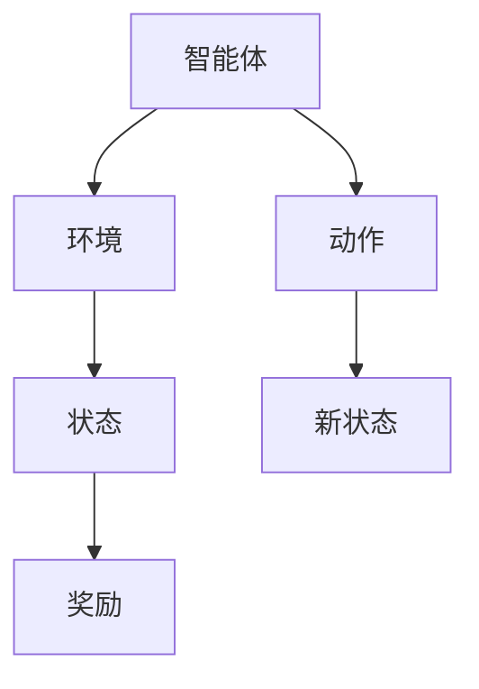
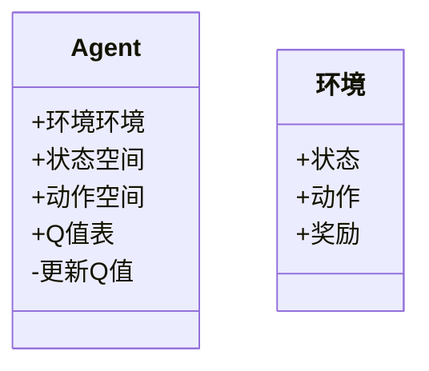

                 


# AI Agent的强化学习在游戏AI中的应用

> 关键词：AI Agent，强化学习，游戏AI，Q-Learning，DQN，神经网络

> 摘要：本文深入探讨了AI Agent在游戏AI中的应用，重点分析了强化学习技术在游戏AI中的原理、算法实现及系统架构。通过具体案例分析和代码实现，展示了如何利用强化学习提升游戏AI的智能性和适应性。

---

## 第一部分: AI Agent与强化学习基础

### 第1章: AI Agent的基本概念

#### 1.1 AI Agent的定义与特点
- **定义**：AI Agent是指能够感知环境并采取行动以实现目标的智能体。
- **特点**：
  1. **自主性**：能够自主决策。
  2. **反应性**：能够实时感知并响应环境变化。
  3. **学习能力**：通过与环境交互不断优化策略。
  4. **社会性**：能够与其他Agent或玩家进行互动。

#### 1.2 强化学习的基本原理
- **定义**：强化学习是一种机器学习范式，通过智能体与环境的交互，学习采取最优动作以最大化累积奖励。
- **核心要素**：
  1. **状态（State）**：智能体所处的环境信息。
  2. **动作（Action）**：智能体采取的行为。
  3. **奖励（Reward）**：智能体行为的价值反馈。
  4. **策略（Policy）**：智能体选择动作的概率分布。
  5. **价值函数（Value Function）**：评估状态或动作价值的函数。

### 第2章: 游戏AI的发展与应用

#### 2.1 游戏AI的定义与分类
- **定义**：游戏AI是指在游戏中模拟人类玩家决策和行为的智能系统。
- **分类**：
  1. **规则驱动AI**：基于预定义规则进行决策。
  2. **脚本驱动AI**：通过脚本模拟简单行为。
  3. **强化学习AI**：通过与环境交互学习最优策略。
  4. **混合驱动AI**：结合多种方法的AI。

#### 2.2 强化学习在游戏AI中的应用
- **优势**：
  1. **自适应性**：能够根据环境变化调整策略。
  2. **复杂决策**：适用于高复杂度的游戏场景。
  3. **无限可能性**：能够探索游戏中的所有可能情况。
- **挑战**：
  1. **计算资源需求高**：强化学习需要大量计算资源。
  2. **训练时间长**：训练一个高效的AI Agent需要大量时间。
  3. **游戏规则复杂**：复杂的游戏规则增加了训练难度。

---

## 第二部分: 强化学习算法原理

### 第3章: 强化学习的核心算法

#### 3.1 Q-Learning算法
- **基本原理**：通过学习Q值表来评估状态-动作对的价值。
- **数学模型**：Q(s, a) = Q(s, a) + α(r + γ * max Q(s', a') - Q(s, a))
- **应用场景**：适用于离散状态和动作空间的小型游戏。

#### 3.2 Deep Q-Networks (DQN)算法
- **基本原理**：使用深度神经网络近似Q值函数。
- **网络结构**：包括输入层、隐藏层和输出层。
- **训练过程**：
  1. 环境提供状态s。
  2. 神经网络输出Q(s, a)。
  3. 采取动作a，并获得奖励r和新状态s'。
  4. 更新Q值：Q(s, a) = r + γ * max Q(s', a')。
  5. 使用梯度下降优化神经网络。

### 第4章: 强化学习的数学模型与公式

#### 4.1 状态、动作与奖励的定义
- **状态空间**：所有可能的状态的集合。
- **动作空间**：所有可能的动作的集合。
- **奖励函数**：定义每个动作的奖励值。

#### 4.2 Q-Learning的数学公式
$$ Q(s, a) = Q(s, a) + \alpha (r + \gamma \max Q(s', a') - Q(s, a)) $$

#### 4.3 DQN的数学模型
- **损失函数**：
$$ \text{损失} = \frac{1}{N} \sum_{i=1}^{N} (y_i - Q(s_i, a_i))^2 $$
其中，$y_i = r_i + \gamma \max Q(s_i', a_i')$。

---

## 第三部分: 游戏AI强化学习的系统架构

### 第5章: 游戏AI的系统架构设计

#### 5.1 游戏AI的感知层设计
- **状态感知**：通过游戏引擎获取当前状态信息。
- **数据处理**：对感知数据进行预处理和特征提取。

#### 5.2 游戏AI的决策层设计
- **决策模型选择**：选择适合的强化学习算法。
- **优化策略**：通过策略梯度或Q-learning优化决策。

### 第6章: 游戏AI的强化学习架构

#### 6.1 强化学习的训练框架
- **环境与代理的交互**：智能体在环境中采取动作，获得奖励。
- **训练过程的流程图**：


#### 6.2 系统架构的实现
- **系统架构的类图**：


---

## 第四部分: 项目实战与优化

### 第7章: 强化学习在游戏AI中的实战应用

#### 7.1 项目环境的安装与配置
- **Python环境**：安装Python 3.8及以上版本。
- **相关库**：安装TensorFlow、Keras、OpenAI Gym等库。

#### 7.2 强化学习算法的实现

##### 7.2.1 Q-Learning的实现
```python
import numpy as np
import gym

# 初始化环境
env = gym.make('CartPole-v1')
env.seed(42)

# 参数设置
alpha = 0.1
gamma = 0.99
epsilon = 0.1

# Q值表初始化
Q = np.zeros([env.observation_space.shape[0], env.action_space.n])

# 训练过程
for episode in range(1000):
    state = env.reset()
    while True:
        if np.random.random() < epsilon:
            action = env.action_space.sample()
        else:
            action = np.argmax(Q[state])
        
        next_state, reward, done, _ = env.step(action)
        
        Q[state][action] = Q[state][action] + alpha * (reward + gamma * np.max(Q[next_state]) - Q[state][action])
        
        if done:
            break
```

##### 7.2.2 DQN的实现
```python
import tensorflow as tf
from tensorflow.keras import layers

# 构建DQN网络
def build_dqn(state_shape, action_shape):
    model = tf.keras.Sequential()
    model.add(layers.Dense(24, activation='relu', input_shape=state_shape))
    model.add(layers.Dense(24, activation='relu'))
    model.add(layers.Dense(action_shape, activation='linear'))
    return model

# 初始化网络
state_shape = (4,)
action_shape = 2
dqn = build_dqn(state_shape, action_shape)
dqn.compile(optimizer=tf.keras.optimizers.Adam(learning_rate=0.001), loss='mean_squared_error')

# 训练过程
for episode in range(1000):
    state = env.reset()
    while True:
        state_tensor = tf.convert_to_tensor(state, dtype=tf.float32)
        prediction = dqn.predict(tf.reshape(state_tensor, [1,4]))[0]
        action = np.argmax(prediction)
        
        next_state, reward, done, _ = env.step(action)
        
        target = reward + gamma * np.max(dqn.predict(tf.reshape(next_state, [1,4]))[0])
        target = tf.reshape(target, [1,1])
        
        dqn.fit(tf.reshape(state_tensor, [1,4]), target, epochs=1, verbose=0)
        
        if done:
            break
```

#### 7.3 项目小结
- **环境安装**：安装必要的库和工具。
- **算法实现**：根据需求选择合适的强化学习算法。
- **案例分析**：通过具体案例理解算法的应用。
- **经验总结**：分析训练过程中的问题并优化。

---

## 第五部分: 最佳实践与总结

### 第8章: 最佳实践与注意事项

#### 8.1 小结
- **算法选择**：根据场景选择合适的算法。
- **计算资源**：确保有足够的计算资源进行训练。
- **训练策略**：合理设置超参数以提高训练效率。

#### 8.2 注意事项
- **过拟合问题**：避免模型过拟合训练数据。
- **奖励设计**：设计合理的奖励机制以引导智能体行为。
- **环境稳定性**：确保训练环境的稳定性和一致性。

#### 8.3 拓展阅读
- **强化学习经典论文**：阅读 Sutton 和 Barto 的《Reinforcement Learning: An Introduction》。
- **游戏AI研究现状**：了解最新的研究成果和应用案例。

---

# 结语

通过本文的详细讲解，读者可以深入了解AI Agent的强化学习在游戏AI中的应用，从基础概念到算法实现，再到系统架构和项目实战，全面掌握相关知识。希望本文能为游戏AI的开发和研究提供有价值的参考。

