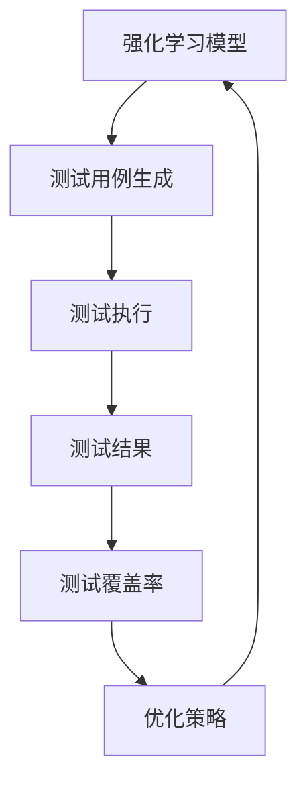

                 


# AI Agent的强化学习在自动化测试中的应用

> 关键词：AI Agent，强化学习，自动化测试，测试用例生成，深度强化学习，Q-Learning，DQN

> 摘要：本文探讨了AI Agent结合强化学习技术在自动化测试中的应用，详细分析了强化学习算法的核心原理，以及如何通过强化学习优化AI Agent的行为决策过程，从而提升自动化测试的效率与质量。本文从理论基础到实际应用，系统地介绍了强化学习在自动化测试中的具体应用场景，并通过案例分析展示了如何利用强化学习算法生成高效的测试用例。文章最后总结了当前研究的成果与未来的发展方向。

---

## 第1章: 强化学习与AI Agent的基础理论

### 1.1 强化学习的基本概念
- 1.1.1 强化学习的定义与特点
  - 强化学习是一种通过试错机制，让智能体在与环境交互中学习最优策略的学习方式。
  - 强化学习的核心要素：状态（State）、动作（Action）、奖励（Reward）、策略（Policy）、值函数（Value Function）。
- 1.1.2 强化学习的核心思想
  - 智能体通过与环境交互，学习如何在给定状态下选择最优动作以最大化累积奖励。
- 1.1.3 强化学习的分类
  - 离线强化学习与在线强化学习。
  - 值函数方法与策略函数方法。

### 1.2 AI Agent的概念与功能
- 1.2.1 AI Agent的定义与分类
  - AI Agent是一个能够感知环境、做出决策并执行动作的智能体。
  - 分为基于规则的Agent和基于学习的Agent。
- 1.2.2 AI Agent的核心功能
  - 感知环境：通过传感器或接口获取环境信息。
  - 决策与规划：基于当前状态，选择最优动作。
  - 执行动作：将决策结果转化为实际操作。
- 1.2.3 AI Agent与强化学习的结合
  - 强化学习为AI Agent提供了行为优化的理论基础。
  - AI Agent为强化学习提供了一个实际的应用场景。

### 1.3 强化学习与AI Agent的结合
- 1.3.1 强化学习在AI Agent行为优化中的作用
  - 通过不断试错，优化AI Agent的决策策略。
  - 提高AI Agent在复杂环境中的适应能力。
- 1.3.2 强化学习与AI Agent的协同工作
  - 状态空间的构建：AI Agent感知环境并转化为强化学习的状态输入。
  - 动作空间的设计：AI Agent根据策略选择具体动作。
  - 奖励机制的设计：AI Agent通过奖励信号优化行为。

---

## 第2章: 强化学习算法的原理与实现

### 2.1 Q-Learning算法
- 2.1.1 Q-Learning的基本原理
  - Q-Learning是一种经典的强化学习算法，属于值函数方法。
  - 学习目标：构建状态-动作价值函数Q(s, a)，即在状态s下执行动作a的期望累积奖励。
- 2.1.2 Q-Learning的算法流程
  1. 初始化Q表（Q(s, a)）。
  2. 进入初始状态s。
  3. 选择动作a：基于ε-greedy策略选择探索或利用。
  4. 执行动作a，观察新的状态s'和奖励r。
  5. 更新Q表：Q(s, a) = Q(s, a) + α(r + γ * max Q(s', a') - Q(s, a))。
  6. 重复步骤2-5，直到满足终止条件。
- 2.1.3 Q-Learning的数学模型
  $$ Q(s, a) = Q(s, a) + \alpha [r + \gamma \max Q(s', a') - Q(s, a)] $$
  - α为学习率，γ为折扣因子。

### 2.2 深度强化学习（DRL）
- 2.2.1 DRL的基本概念
  - 深度强化学习是强化学习与深度学习的结合。
  - 使用深度神经网络近似值函数或策略函数。
- 2.2.2 DQN算法的原理
  - DQN（Deep Q-Network）由Google DeepMind提出。
  - 使用两个神经网络：主网络和目标网络。
  - 动作选择：基于ε-greedy策略。
  - 网络更新：通过经验回放和目标网络同步减少方差。
- 2.2.3 DQN的算法流程
  1. 初始化主网络Q和目标网络Q\_target。
  2. 初始化经验回放池（Experience Replay Buffer）。
  3. 选择动作a：ε-greedy策略。
  4. 执行动作a，观察新状态s'和奖励r。
  5. 将经验(s, a, r, s')存储在回放池。
  6. 从回放池中随机抽取小批量经验，更新Q网络。
  7. 定期同步Q网络和Q\_target网络。
  8. 重复步骤3-7，直到满足终止条件。

### 2.3 算法的优缺点分析
- 2.3.1 Q-Learning的优点
  - 简单易实现，适合小规模问题。
- 2.3.2 Q-Learning的缺点
  - 无法处理高维状态空间和动作空间。
- 2.3.3 DQN的优点
  - 能够处理高维复杂环境。
  - 经验回放减少了样本偏差。
- 2.3.4 DQN的缺点
  - 训练过程可能不稳定。
  - 需要大量计算资源。

---

## 第3章: 自动化测试中的强化学习应用

### 3.1 自动化测试的挑战
- 3.1.1 测试用例生成的难点
  - 测试用例的覆盖率不足。
  - 手动编写测试用例效率低。
- 3.1.2 测试环境的动态性
  - 系统更新频繁，测试用例需要不断调整。
- 3.1.3 测试场景的多样性
  - 需要覆盖不同用户行为和边界条件。

### 3.2 强化学习在测试用例生成中的应用
- 3.2.1 测试用例生成的强化学习模型设计
  - 状态空间：当前测试步骤的状态。
  - 动作空间：可执行的测试动作。
  - 奖励函数：测试用例的覆盖率和发现缺陷的能力。
- 3.2.2 基于强化学习的测试用例生成流程
  1. 初始化强化学习模型。
  2. 选择测试动作：基于策略网络选择下一个测试步骤。
  3. 执行测试动作，观察测试结果。
  4. 更新奖励函数：根据测试覆盖率调整奖励。
  5. 更新策略网络：基于新数据优化模型。
  6. 重复步骤2-5，直到生成足够测试用例。

### 3.3 强化学习在测试执行中的应用
- 3.3.1 测试执行的强化学习优化
  - 基于强化学习优化测试执行顺序。
  - 提高测试效率和覆盖率。
- 3.3.2 测试结果分析的强化学习方法
  - 利用强化学习分析测试结果，优化后续测试策略。

### 3.4 基于强化学习的自动化测试框架
- 3.4.1 框架设计
  - 状态感知模块：感知当前测试环境状态。
  - 动作选择模块：基于强化学习策略选择测试动作。
  - 奖励机制：根据测试结果调整奖励。
- 3.4.2 框架实现
  - 状态空间建模。
  - 动作选择策略设计。
  - 奖励函数设计与实现。

---

## 第4章: 实际案例分析与实现

### 4.1 测试场景介绍
- 4.1.1 测试目标
  - 验证某Web应用的登录功能。
  - 测试用例需要覆盖正常登录、密码错误、用户名错误等场景。
- 4.1.2 测试环境
  - 浏览器：Chrome。
  - 系统：Windows 10。

### 4.2 系统功能设计
- 4.2.1 测试用例生成模块
  - 输入：测试目标和约束条件。
  - 输出：自动生成测试用例。
- 4.2.2 测试执行模块
  - 执行生成的测试用例，记录测试结果。
- 4.2.3 测试结果分析模块
  - 分析测试覆盖率和缺陷发现情况。

### 4.3 系统架构设计


### 4.4 代码实现
- 4.4.1 环境安装
  - Python 3.8及以上。
  - 安装必要的库：TensorFlow、Keras、OpenAI Gym。
- 4.4.2 强化学习模型实现
  ```python
  import numpy as np
  from collections import deque
  import random

  class DQN:
      def __init__(self, state_size, action_size):
          self.state_size = state_size
          self.action_size = action_size
          self.gamma = 0.99
          self.epsilon = 1.0
          self.epsilon_min = 0.01
          self.epsilon_decay = 0.995
          self.batch_size = 64
          self.memory = deque(maxlen=10000)
          # 初始化主网络和目标网络
          self.model = self.build_model()
          self.target_model = self.build_model()

      def build_model(self):
          # 构建DNN模型
          model = keras.Sequential()
          model.add(keras.layers.Dense(64, activation='relu', input_dim=self.state_size))
          model.add(keras.layers.Dense(64, activation='relu'))
          model.add(keras.layers.Dense(self.action_size, activation='linear'))
          model.compile(optimizer='adam', loss='mse')
          return model

      def remember(self, state, action, reward, next_state):
          self.memory.append((state, action, reward, next_state))

      def act(self, state):
          if random.random() < self.epsilon:
              return random.randint(0, self.action_size - 1)
          else:
              q_values = self.model.predict(state)
              return np.argmax(q_values[0])

      def replay(self):
          if len(self.memory) < self.batch_size:
              return
          minibatch = random.sample(self.memory, self.batch_size)
          states = np.array([t[0] for t in minibatch])
          actions = np.array([t[1] for t in minibatch])
          rewards = np.array([t[2] for t in minibatch])
          next_states = np.array([t[3] for t in minibatch])
          
          targets = self.model.predict(states)
          next_q = self.target_model.predict(next_states)
          targets[range(self.batch_size), actions] = rewards + self.gamma * np.max(next_q, axis=1)
          
          self.model.fit(states, targets, epochs=1, verbose=0)
          self.epsilon = max(self.epsilon_min, self.epsilon * self.epsilon_decay)
  ```

---

## 第5章: 总结与展望

### 5.1 本章总结
- 本文详细介绍了AI Agent结合强化学习在自动化测试中的应用。
- 通过Q-Learning和DQN算法，优化了AI Agent的行为决策过程。
- 提出了基于强化学习的测试用例生成框架，并通过实际案例验证了其有效性。

### 5.2 未来研究方向
- 优化强化学习算法，提高测试效率。
- 研究多智能体协同测试的方法。
- 探索强化学习在测试结果分析中的应用。

### 5.3 注意事项
- 强化学习模型的训练需要大量数据支持。
- 测试环境的动态变化可能影响模型性能。
- 需要结合具体场景调整奖励函数设计。

### 5.4 拓展阅读
- 建议读者深入研究DRL在复杂场景中的应用。
- 关注最新的强化学习算法和其在测试领域的创新应用。

---

通过本文的分析，我们可以看到，AI Agent结合强化学习在自动化测试中的应用潜力巨大。随着深度强化学习技术的不断进步，未来自动化测试的效率和质量将得到进一步提升。

