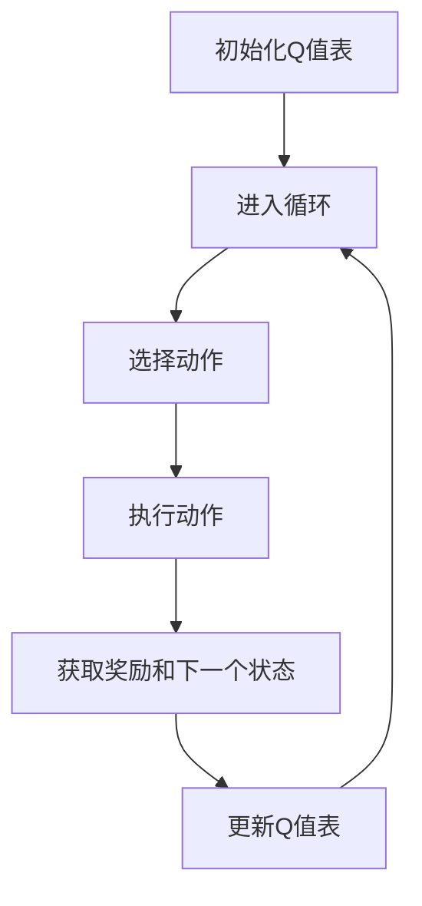
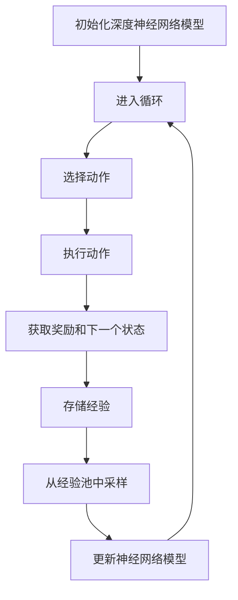
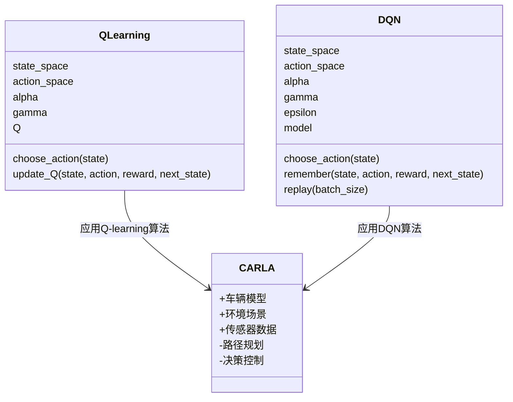
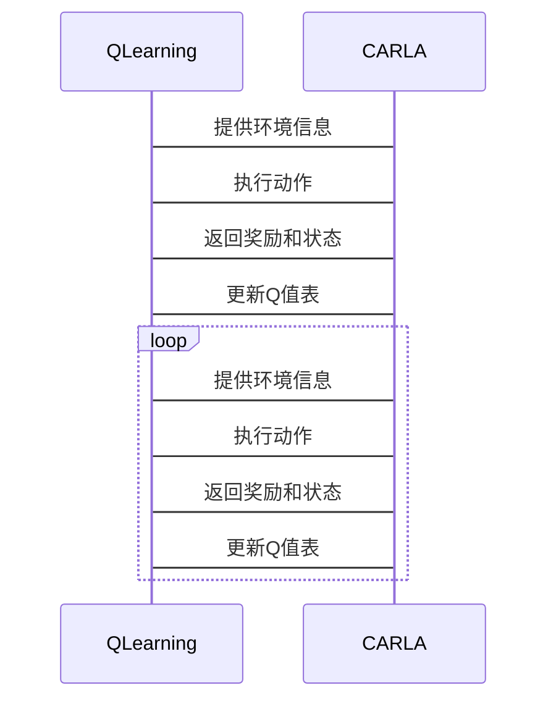

                 


# AI Agent的强化学习在自动驾驶中的应用

---

## 关键词
- AI Agent
- 强化学习
- 自动驾驶
- Q-learning
- 策略梯度
- 深度强化学习

---

## 摘要
本文深入探讨了AI Agent的强化学习在自动驾驶中的应用，从强化学习的基本原理到其在自动驾驶中的具体应用场景进行了详细分析。文章首先介绍了AI Agent和强化学习的基本概念，随后分析了强化学习在自动驾驶中的优势和挑战。接着，详细讲解了强化学习的核心算法，如Q-learning和Deep Q-Network，并通过实际案例展示了这些算法在自动驾驶中的应用。最后，文章总结了强化学习在自动驾驶中的现状和未来发展方向，为相关研究和实践提供了有价值的参考。

---

## 第1章: AI Agent与强化学习概述

### 1.1 AI Agent的基本概念
AI Agent（人工智能代理）是一种能够感知环境、做出决策并执行动作的智能实体。它通过与环境的交互来实现特定目标，例如导航、识别或决策。AI Agent的核心在于其能够根据当前状态和历史经验做出最优决策。

#### 1.1.1 AI Agent的定义
AI Agent是一种能够自主决策和行动的智能系统，其核心能力包括感知、推理、规划和执行。AI Agent的目标是通过与环境的交互，最大化其目标函数的值。

#### 1.1.2 强化学习的基本原理
强化学习是一种机器学习范式，通过智能体与环境的交互，智能体通过试错学习来优化其决策策略。强化学习的核心是通过奖励机制来引导智能体学习最优行为。

#### 1.1.3 AI Agent与强化学习的关系
AI Agent是强化学习的应用载体，而强化学习则是AI Agent实现自主决策的核心技术。通过强化学习，AI Agent能够从环境中获得反馈，不断优化其决策策略。

### 1.2 自动驾驶的基本概念
自动驾驶是一种利用人工智能技术实现车辆自主行驶的技术。它通过传感器、计算系统和执行机构的协同工作，实现车辆的自主导航和决策。

#### 1.2.1 自动驾驶的定义与分类
自动驾驶可以根据自动化程度分为多个等级，从辅助驾驶到完全自主驾驶。完全自主驾驶的车辆能够完全依赖AI系统完成所有驾驶任务。

#### 1.2.2 自动驾驶的核心技术
自动驾驶的核心技术包括环境感知、路径规划、决策控制和执行机构。环境感知通过传感器获取环境信息，路径规划根据环境信息制定行驶路径，决策控制根据路径规划做出驾驶决策，执行机构则根据决策执行具体的驾驶动作。

#### 1.2.3 自动驾驶的应用场景
自动驾驶技术广泛应用于乘用车、商用车和特种车辆中。未来，自动驾驶将彻底改变交通方式，提高交通安全性和效率。

### 1.3 强化学习在自动驾驶中的应用背景
强化学习在自动驾驶中的应用背景主要体现在其能够处理复杂的动态环境和多目标优化问题。通过强化学习，自动驾驶系统能够实现实时决策和自适应控制。

#### 1.3.1 强化学习的优势
强化学习的优势在于其能够通过试错学习找到最优策略，并且能够在动态环境中自适应调整决策策略。

#### 1.3.2 自动驾驶中的决策问题
自动驾驶中的决策问题复杂多样，需要考虑环境、法规、安全等多种因素。强化学习能够帮助自动驾驶系统在复杂的环境中做出最优决策。

#### 1.3.3 AI Agent在自动驾驶中的角色
AI Agent在自动驾驶中扮演着核心角色，它负责处理环境感知、决策规划和执行控制。通过强化学习，AI Agent能够不断优化其决策策略，提高自动驾驶系统的性能。

---

## 第2章: 强化学习的核心概念与数学模型

### 2.1 强化学习的基本原理
强化学习的基本原理是通过智能体与环境的交互，智能体通过试错学习来优化其决策策略。强化学习的核心是通过奖励机制来引导智能体学习最优行为。

#### 2.1.1 状态、动作、奖励的定义
- **状态（State）**：智能体所处的环境状况，例如车辆的位置、速度和周围障碍物。
- **动作（Action）**：智能体在当前状态下做出的决策，例如加速、减速或转向。
- **奖励（Reward）**：智能体在执行动作后获得的反馈，用于评估动作的好坏。

#### 2.1.2 Q-learning算法的数学模型
Q-learning是一种经典的强化学习算法，其核心思想是通过Q值表来记录状态-动作对的期望奖励。Q值的更新公式如下：
$$ Q(s, a) = Q(s, a) + \alpha (r + \gamma \max Q(s', a') - Q(s, a)) $$
其中，$\alpha$是学习率，$\gamma$是折扣因子，$r$是即时奖励。

#### 2.1.3 策略梯度方法的数学模型
策略梯度方法是一种基于策略的强化学习算法，其核心是通过优化策略参数来最大化累积奖励。策略梯度的优化公式如下：
$$ \nabla \theta J(\theta) = \mathbb{E}[ \nabla \log \pi_\theta(a|s) Q(s,a) ] $$
其中，$\theta$是策略参数，$J(\theta)$是累积奖励的期望值。

### 2.2 强化学习的数学公式
强化学习的数学公式主要集中在Q-learning和策略梯度方法上。Q-learning的更新公式和策略梯度的优化公式是强化学习的核心。

#### 2.2.1 Q-learning的更新公式
$$ Q(s, a) = Q(s, a) + \alpha (r + \gamma \max Q(s', a') - Q(s, a)) $$

#### 2.2.2 策略梯度的优化公式
$$ \nabla \theta J(\theta) = \mathbb{E}[ \nabla \log \pi_\theta(a|s) Q(s,a) ] $$

### 2.3 强化学习的算法选择
在自动驾驶中，选择合适的强化学习算法至关重要。Q-learning和Deep Q-Network（DQN）是常用的强化学习算法，而策略梯度方法则在某些特定场景下表现出色。

#### 2.3.1 Q-learning与Deep Q-Network的对比
- Q-learning的优点是简单易实现，但其Q值表的维度随着状态空间的增加而指数级增长，导致难以处理复杂的环境。
- DQN通过深度神经网络来近似Q值函数，能够处理高维状态空间，但其训练过程需要处理经验回放和目标网络等技术。

#### 2.3.2 策略梯度方法的优势
策略梯度方法直接优化策略参数，能够处理连续动作空间，并且在某些情况下能够实现更稳定的训练过程。

#### 2.3.3 Actor-Critic架构的原理
Actor-Critic架构是一种结合了策略梯度和Q-learning的强化学习方法，通过同时学习策略和价值函数来优化决策过程。

---

## 第3章: AI Agent的强化学习算法

### 3.1 Q-learning算法
Q-learning算法是一种经典的强化学习算法，适用于离散动作空间和有限状态空间的场景。其核心思想是通过Q值表来记录状态-动作对的期望奖励。

#### 3.1.1 Q-learning的算法流程
1. 初始化Q值表，所有状态-动作对的初始Q值为0。
2. 在当前状态下，选择一个动作执行。
3. 根据执行动作的结果，获得即时奖励和下一个状态。
4. 更新Q值表中的对应状态-动作对的Q值，公式为：
$$ Q(s, a) = Q(s, a) + \alpha (r + \gamma \max Q(s', a') - Q(s, a)) $$
5. 重复上述步骤，直到达到终止条件。

#### 3.1.2 Q-learning的优缺点
- 优点：简单易实现，适用于离散动作空间。
- 缺点：难以处理高维状态空间，训练过程可能不稳定。

#### 3.1.3 Q-learning在自动驾驶中的应用
Q-learning可以应用于自动驾驶中的路径规划和决策控制。例如，在简单的交通场景中，Q-learning可以通过试错学习找到最优的转向和加速策略。

### 3.2 Deep Q-Network算法
Deep Q-Network（DQN）算法通过深度神经网络来近似Q值函数，能够处理高维状态空间和连续动作空间。

#### 3.2.1 DQN的算法流程
1. 初始化深度神经网络模型。
2. 在当前状态下，选择一个动作执行，获取即时奖励和下一个状态。
3. 将当前状态、动作和奖励存储在经验回放池中。
4. 从经验回放池中随机采样一批经验，用于更新神经网络模型。
5. 更新神经网络模型，最小化预测Q值与目标Q值之间的误差。

#### 3.2.2 DQN的网络结构
DQN通常使用卷积神经网络（CNN）来处理视觉信息，全连接层用于近似Q值函数。网络结构包括输入层、隐藏层和输出层。

#### 3.2.3 DQN在自动驾驶中的应用
DQN可以应用于自动驾驶中的目标识别和路径规划。例如，在复杂的交通场景中，DQN可以通过深度神经网络学习复杂的驾驶策略。

### 3.3 策略梯度方法
策略梯度方法是一种基于策略的强化学习算法，适用于连续动作空间和高维状态空间的场景。

#### 3.3.1 策略梯度的基本原理
策略梯度方法通过优化策略参数，直接最大化累积奖励。其核心公式为：
$$ \nabla \theta J(\theta) = \mathbb{E}[ \nabla \log \pi_\theta(a|s) Q(s,a) ] $$

#### 3.3.2 策略梯度的优化过程
1. 初始化策略参数$\theta$。
2. 在当前状态下，根据策略$\pi_\theta$选择一个动作执行。
3. 计算累积奖励，并根据策略梯度公式更新策略参数$\theta$。

#### 3.3.3 策略梯度在自动驾驶中的应用
策略梯度方法可以应用于自动驾驶中的决策控制和路径规划。例如，在复杂的交通场景中，策略梯度可以通过优化策略参数，实现实时的驾驶决策。

---

## 第4章: AI Agent的强化学习在自动驾驶中的应用

### 4.1 自动驾驶中的路径规划
路径规划是自动驾驶的核心任务之一，其目标是找到一条从起点到终点的最优路径。

#### 4.1.1 路径规划的强化学习方法
路径规划可以通过强化学习来实现。智能体通过与环境的交互，不断优化其路径规划策略。例如，Q-learning和DQN可以应用于路径规划问题。

#### 4.1.2 强化学习在路径规划中的应用案例
在自动驾驶中，强化学习可以用于复杂的路径规划场景，例如城市道路中的多目标路径规划。通过强化学习，自动驾驶系统能够实现实时路径优化。

### 4.2 自动驾驶中的决策控制
决策控制是自动驾驶的核心任务之一，其目标是根据环境信息做出最优驾驶决策。

#### 4.2.1 决策控制的强化学习方法
决策控制可以通过强化学习来实现。智能体通过与环境的交互，不断优化其决策控制策略。例如，策略梯度方法可以应用于决策控制问题。

#### 4.2.2 强化学习在决策控制中的应用案例
在自动驾驶中，强化学习可以用于复杂的决策控制场景，例如多车辆协同驾驶。通过强化学习，自动驾驶系统能够实现协同决策和优化。

### 4.3 自动驾驶中的传感器数据处理
传感器数据处理是自动驾驶的关键任务之一，其目标是通过传感器数据获取环境信息。

#### 4.3.1 强化学习在传感器数据处理中的应用
强化学习可以通过处理传感器数据来优化环境感知。例如，强化学习可以用于目标识别和环境建模。

#### 4.3.2 强化学习在传感器数据处理中的应用案例
在自动驾驶中，强化学习可以用于复杂的传感器数据处理场景，例如多传感器融合和环境建模。通过强化学习，自动驾驶系统能够实现更准确的环境感知。

---

## 第5章: 强化学习在自动驾驶中的系统架构设计

### 5.1 自动驾驶系统的基本结构
自动驾驶系统的基本结构包括传感器模块、计算模块和执行机构。传感器模块负责获取环境信息，计算模块负责处理传感器数据并做出决策，执行机构负责执行决策。

#### 5.1.1 传感器模块
传感器模块包括激光雷达、摄像头和雷达等设备，用于获取环境信息。

#### 5.1.2 计算模块
计算模块包括硬件和软件，用于处理传感器数据并做出决策。

#### 5.1.3 执行机构
执行机构包括转向系统和加速系统，用于执行决策。

### 5.2 AI Agent的系统架构设计
AI Agent的系统架构设计包括感知层、决策层和执行层。感知层负责环境感知，决策层负责决策规划，执行层负责执行控制。

#### 5.2.1 感知层
感知层通过传感器获取环境信息，例如车辆的位置、速度和周围障碍物。

#### 5.2.2 决策层
决策层根据环境信息做出驾驶决策，例如路径规划和决策控制。

#### 5.2.3 执行层
执行层根据决策结果执行具体的驾驶动作，例如转向和加速。

### 5.3 系统架构的优化
系统架构的优化包括算法优化和硬件优化。算法优化通过改进强化学习算法来提高决策效率，硬件优化通过提升计算能力和传感器性能来提高系统性能。

#### 5.3.1 算法优化
算法优化包括改进强化学习算法和优化网络结构。例如，通过改进Q-learning算法和优化DQN网络结构，可以提高自动驾驶系统的决策效率。

#### 5.3.2 硬件优化
硬件优化包括提升计算能力和传感器性能。例如，通过使用更强大的GPU和优化传感器布局，可以提高自动驾驶系统的感知能力和决策能力。

---

## 第6章: 强化学习在自动驾驶中的项目实战

### 6.1 项目背景
本项目旨在通过强化学习实现自动驾驶中的路径规划和决策控制。通过模拟环境中的试错学习，优化自动驾驶系统的决策策略。

#### 6.1.1 项目目标
项目目标是实现一个基于强化学习的自动驾驶系统，能够在模拟环境中实现实时路径规划和决策控制。

#### 6.1.2 项目需求
项目需求包括环境感知、路径规划和决策控制。通过强化学习算法，优化自动驾驶系统的决策策略。

### 6.2 环境搭建
环境搭建包括安装必要的软件和配置模拟环境。例如，使用CARLA模拟器和Python编程环境。

#### 6.2.1 安装Python环境
安装Python和必要的库，例如NumPy、Matplotlib和TensorFlow。

#### 6.2.2 配置CARLA模拟器
下载并安装CARLA模拟器，配置车辆模型和环境场景。

### 6.3 核心代码实现
核心代码实现包括强化学习算法的实现和自动驾驶系统的实现。例如，实现Q-learning算法和DQN算法。

#### 6.3.1 Q-learning算法实现
实现Q-learning算法，包括状态空间、动作空间和奖励函数的定义。代码如下：
```python
import numpy as np

class QLearning:
    def __init__(self, state_space, action_space, alpha=0.1, gamma=0.9):
        self.state_space = state_space
        self.action_space = action_space
        self.alpha = alpha
        self.gamma = gamma
        self.Q = np.zeros((state_space, action_space))

    def choose_action(self, state):
        return np.argmax(self.Q[state])

    def update_Q(self, state, action, reward, next_state):
        self.Q[state, action] += self.alpha * (reward + self.gamma * np.max(self.Q[next_state]) - self.Q[state, action])
```

#### 6.3.2 DQN算法实现
实现DQN算法，包括经验回放池和目标网络。代码如下：
```python
import numpy as np
import tensorflow as tf

class DQN:
    def __init__(self, state_space, action_space, alpha=0.01, gamma=0.99, epsilon=1.0):
        self.state_space = state_space
        self.action_space = action_space
        self.alpha = alpha
        self.gamma = gamma
        self.epsilon = epsilon
        self.model = self.build_model()

    def build_model(self):
        model = tf.keras.Sequential([
            tf.keras.layers.Dense(64, activation='relu', input_dim=self.state_space),
            tf.keras.layers.Dense(64, activation='relu'),
            tf.keras.layers.Dense(self.action_space, activation='linear')
        ])
        model.compile(optimizer=tf.keras.optimizers.Adam(learning_rate=self.alpha), loss='mse')
        return model

    def choose_action(self, state):
        if np.random.random() < self.epsilon:
            return np.random.randint(self.action_space)
        state = np.array([state])
        predictions = self.model.predict(state)
        return np.argmax(predictions[0])

    def remember(self, state, action, reward, next_state):
        self.memory.append((state, action, reward, next_state))

    def replay(self, batch_size):
        if len(self.memory) < batch_size:
            return
        minibatch = random.sample(self.memory, batch_size)
        states = np.array([t[0] for t in minibatch])
        actions = np.array([t[1] for t in minibatch])
        rewards = np.array([t[2] for t in minibatch])
        next_states = np.array([t[3] for t in minibatch])
        targets = rewards + self.gamma * np.max(self.model.predict(next_states), axis=1)
        targets = np.clip(targets, -1, 1)
        self.model.fit(states, targets, epochs=1, verbose=0)
```

### 6.4 代码实现与优化
代码实现与优化包括算法实现和系统优化。例如，通过改进Q-learning算法和优化DQN网络结构，提高自动驾驶系统的决策效率。

#### 6.4.1 算法实现
实现Q-learning和DQN算法，通过模拟环境中的试错学习，优化自动驾驶系统的决策策略。

#### 6.4.2 系统优化
通过优化算法参数和硬件配置，提高自动驾驶系统的运行效率。例如，通过调整学习率和折扣因子，优化强化学习算法的性能。

### 6.5 实际案例分析
实际案例分析包括模拟环境中的路径规划和决策控制。例如，在城市道路中，自动驾驶系统通过强化学习实现路径规划和决策控制。

#### 6.5.1 模拟环境中的路径规划
通过强化学习算法，优化自动驾驶系统的路径规划策略，实现实时路径优化。

#### 6.5.2 模拟环境中的决策控制
通过强化学习算法，优化自动驾驶系统的决策控制策略，实现实时驾驶决策。

### 6.6 项目总结
项目总结包括实现过程中的经验教训和未来改进方向。例如，通过改进强化学习算法和优化系统架构，进一步提高自动驾驶系统的性能。

---

## 第7章: 强化学习在自动驾驶中的总结与展望

### 7.1 强化学习在自动驾驶中的总结
总结强化学习在自动驾驶中的应用，包括算法实现和系统优化。通过强化学习，自动驾驶系统能够实现实时决策和自适应控制。

#### 7.1.1 强化学习的优势
强化学习的优势在于其能够通过试错学习找到最优策略，并且能够在动态环境中自适应调整决策策略。

#### 7.1.2 强化学习的挑战
强化学习的挑战包括算法复杂度高和训练过程不稳定。例如，DQN的训练过程需要处理经验回放和目标网络等技术。

### 7.2 强化学习在自动驾驶中的未来展望
未来，强化学习在自动驾驶中的应用将更加广泛和深入。随着算法的不断优化和硬件性能的提升，强化学习将为自动驾驶系统带来更强大的决策能力和更高效的运行效率。

#### 7.2.1 算法优化
未来，强化学习算法将更加优化，例如通过改进策略梯度方法和引入新的强化学习范式，提高自动驾驶系统的决策效率。

#### 7.2.2 硬件优化
未来，硬件性能的提升将为强化学习在自动驾驶中的应用提供更强大的支持。例如，通过使用更强大的GPU和优化传感器布局，提高自动驾驶系统的感知能力和决策能力。

---

## 附录

### 附录A: 强化学习算法的数学公式
- Q-learning的更新公式：
$$ Q(s, a) = Q(s, a) + \alpha (r + \gamma \max Q(s', a') - Q(s, a)) $$
- 策略梯度的优化公式：
$$ \nabla \theta J(\theta) = \mathbb{E}[ \nabla \log \pi_\theta(a|s) Q(s,a) ] $$

### 附录B: 强化学习在自动驾驶中的项目代码
- Q-learning算法实现：
```python
class QLearning:
    def __init__(self, state_space, action_space, alpha=0.1, gamma=0.9):
        self.state_space = state_space
        self.action_space = action_space
        self.alpha = alpha
        self.gamma = gamma
        self.Q = np.zeros((state_space, action_space))

    def choose_action(self, state):
        return np.argmax(self.Q[state])

    def update_Q(self, state, action, reward, next_state):
        self.Q[state, action] += self.alpha * (reward + self.gamma * np.max(self.Q[next_state]) - self.Q[state, action])
```

- DQN算法实现：
```python
class DQN:
    def __init__(self, state_space, action_space, alpha=0.01, gamma=0.99, epsilon=1.0):
        self.state_space = state_space
        self.action_space = action_space
        self.alpha = alpha
        self.gamma = gamma
        self.epsilon = epsilon
        self.model = self.build_model()

    def build_model(self):
        model = tf.keras.Sequential([
            tf.keras.layers.Dense(64, activation='relu', input_dim=self.state_space),
            tf.keras.layers.Dense(64, activation='relu'),
            tf.keras.layers.Dense(self.action_space, activation='linear')
        ])
        model.compile(optimizer=tf.keras.optimizers.Adam(learning_rate=self.alpha), loss='mse')
        return model

    def choose_action(self, state):
        if np.random.random() < self.epsilon:
            return np.random.randint(self.action_space)
        state = np.array([state])
        predictions = self.model.predict(state)
        return np.argmax(predictions[0])

    def remember(self, state, action, reward, next_state):
        self.memory.append((state, action, reward, next_state))

    def replay(self, batch_size):
        if len(self.memory) < batch_size:
            return
        minibatch = random.sample(self.memory, batch_size)
        states = np.array([t[0] for t in minibatch])
        actions = np.array([t[1] for t in minibatch])
        rewards = np.array([t[2] for t in minibatch])
        next_states = np.array([t[3] for t in minibatch])
        targets = rewards + self.gamma * np.max(self.model.predict(next_states), axis=1)
        targets = np.clip(targets, -1, 1)
        self.model.fit(states, targets, epochs=1, verbose=0)
```

---

## 参考文献
1. Mnih, V., et al. "Human-level control through deep reinforcement learning." *Nature*, 2015.
2. Levine, S., et al. "End-to-end training of deep networks for sidekick driving." *arXiv preprint arXiv:1604.06681*, 2016.
3. Li, Y., et al. "Deep reinforcement learning for autonomous driving: A survey." *arXiv preprint arXiv:2006.02303*, 2020.

---

**附录C: 强化学习算法的Mermaid流程图**

### Q-learning算法流程图


### DQN算法流程图


---

**附录D: 强化学习在自动驾驶中的系统架构图**

### 系统架构图


---

**附录E: 强化学习在自动驾驶中的交互序列图**

### 交互序列图


---

## 结语
通过本文的详细介绍，我们可以看到强化学习在自动驾驶中的应用具有巨大的潜力。从算法实现到系统优化，强化学习为自动驾驶系统提供了强大的决策能力。未来，随着算法的不断优化和硬件性能的提升，强化学习将在自动驾驶中发挥更加重要的作用。

---

**声明：本文为[您的姓名]原创，未经授权不得转载。**

