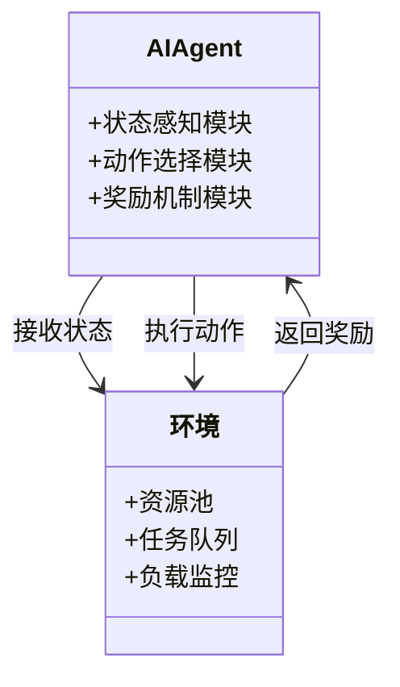
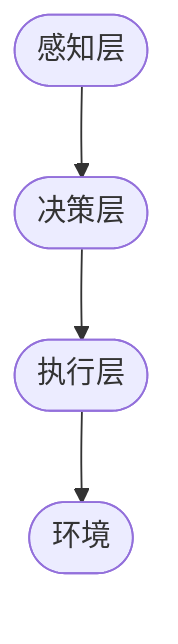

                 


# AI Agent的强化学习在资源调度中的应用

## 关键词：
AI Agent，强化学习，资源调度，Q-Learning，DQN，云计算

## 摘要：
本文探讨AI Agent如何利用强化学习技术解决资源调度问题。通过分析强化学习的基本原理及其在AI Agent中的应用，详细讲解了资源调度问题的建模方法，并结合Q-Learning和DQN算法进行深入分析。通过实际案例，展示了如何将这些算法应用于云计算资源调度，并总结了经验教训和最佳实践。

---

# 第一部分: AI Agent与强化学习基础

## 第1章: 强化学习与AI Agent概述

### 1.1 强化学习的基本概念

#### 1.1.1 强化学习的定义与特点
强化学习是一种通过试错机制优化决策策略的机器学习方法。与监督学习不同，强化学习依赖于环境反馈（奖励或惩罚）来调整行为，以最大化累计奖励。其特点包括：
- **自主性**：无需标注数据，通过与环境互动学习。
- **延迟奖励**：目标可能在多步后才能获得。
- **探索与利用**：平衡探索新策略和利用已知策略。

#### 1.1.2 AI Agent的核心概念
AI Agent是指在环境中感知并自主行动以实现目标的智能体。AI Agent可以是软件程序或物理设备，具有以下特征：
- **自主性**：无需外部干预，自主决策。
- **反应性**：根据环境反馈动态调整行为。
- **目标导向**：为实现特定目标而行动。

#### 1.1.3 资源调度的背景与问题描述
资源调度涉及优化计算资源、存储资源和网络资源的分配，以满足用户需求并最小化资源浪费。资源调度问题的核心在于如何在有限资源下，高效分配任务，避免资源瓶颈和负载过载。常见的资源调度场景包括云计算、分布式系统和边缘计算。

---

## 第2章: 资源调度问题的强化学习建模

### 2.1 资源调度问题的定义

#### 2.1.1 资源调度的基本概念
资源调度是指将任务分配到合适的资源上，以满足性能目标（如响应时间、吞吐量）的同时，最大化资源利用率和最小化成本。资源调度的核心要素包括：
- **任务**：需要执行的操作或计算。
- **资源**：可用的计算资源，如CPU、GPU、内存。
- **约束条件**：任务的执行时间、资源限制、优先级。

#### 2.1.2 资源调度的核心要素
- **状态空间**：表示当前系统的状态，如资源利用率、任务队列。
- **动作空间**：AI Agent可执行的动作，如分配任务到某个资源。
- **奖励函数**：衡量调度策略优劣的指标，如资源利用率、延迟。

#### 2.1.3 资源调度的数学模型
资源调度问题可以建模为一个马尔可夫决策过程（MDP），包括：
- **状态**：$s = (r_1, r_2, ..., r_n)$，表示各资源的负载。
- **动作**：$a = \text{assign}(t, r_i)$，将任务$t$分配到资源$r_i$。
- **奖励函数**：$R(s, a) = 1/\text{max}(r_i)$，表示资源利用率的倒数。

### 2.2 强化学习在资源调度中的应用

#### 2.2.1 状态空间的定义
状态空间描述系统当前的状态，例如：
- $s = (c_1, c_2, ..., c_n)$，表示各计算节点的负载。
- $s = (m_1, m_2, ..., m_n)$，表示各机器的内存使用情况。

#### 2.2.2 动作空间的定义
动作空间定义AI Agent可执行的动作，例如：
- $a = \text{allocate}(t, r_i)$，将任务$t$分配到资源$r_i$。
- $a = \text{preempt}(t, r_i)$，抢占任务$t$从资源$r_i$。

#### 2.2.3 奖励函数的设计
奖励函数衡量调度策略的优劣，例如：
- $R(s, a) = \frac{1}{\text{makespan}}$，最小化完成时间。
- $R(s, a) = \frac{1}{\text{resource\_utilization}}$，最大化资源利用率。

---

# 第三部分: 强化学习算法在资源调度中的应用

## 第3章: Q-Learning算法

### 3.1 Q-Learning的基本原理

#### 3.1.1 Q-Learning的定义
Q-Learning是一种经典的强化学习算法，通过维护Q表来记录状态-动作对的期望奖励。其更新公式为：
$$
Q(s, a) = (1 - \alpha) Q(s, a) + \alpha (r + \gamma \max Q(s', a'))
$$
其中，$\alpha$是学习率，$\gamma$是折扣因子。

#### 3.1.2 Q-Learning在资源调度中的应用
Q-Learning可以用于任务调度，例如将任务分配到负载较低的资源。状态为资源负载，动作为分配任务，奖励为资源利用率的倒数。

#### 3.1.3 Q-Learning的优缺点
- **优点**：实现简单，适用于小规模问题。
- **缺点**：状态空间和动作空间大时，Q表会变得非常庞大。

| 算法 | 优点 | 缺点 |
|------|------|------|
| Q-Learning | 实现简单 | 状态空间大时效率低 |
| DQN | 处理高维状态 | 训练时间长 |

---

## 第4章: Deep Q-Network (DQN)算法

### 4.1 DQN的基本原理

#### 4.1.1 DQN的定义
DQN通过深度神经网络近似Q函数，避免了Q-Learning的Q表问题。其核心思想是用神经网络逼近最优Q值，公式为：
$$
Q(s, a) \approx \theta \cdot \phi(s, a)
$$
其中，$\theta$是网络参数，$\phi(s, a)$是特征函数。

#### 4.1.2 DQN在资源调度中的应用
DQN可以处理复杂的资源调度问题，例如动态分配任务到多台服务器，状态为服务器负载，动作为分配策略，奖励为系统性能。

#### 4.1.3 DQN的优缺点
- **优点**：适用于高维状态空间，表现更好。
- **缺点**：训练时间较长，需要大量数据。

---

## 第5章: 系统分析与架构设计

### 5.1 系统功能设计

#### 5.1.1 领域模型
领域模型展示系统的功能模块，如状态感知、动作选择、奖励机制等。



### 5.2 系统架构设计

#### 5.2.1 系统架构
系统架构展示各模块之间的关系，如感知层、决策层、执行层。



### 5.3 系统接口设计

#### 5.3.1 系统接口
系统接口描述AI Agent与环境之间的交互，如状态获取、动作执行。

---

## 第6章: 项目实战

### 6.1 环境安装

#### 6.1.1 环境配置
安装必要的Python库，如TensorFlow、Keras、OpenAI Gym。

```bash
pip install gym numpy tensorflow
```

### 6.2 核心代码实现

#### 6.2.1 DQN算法实现

```python
import numpy as np
import gym
import tensorflow as tf

# 定义神经网络
model = tf.keras.Sequential([
    tf.keras.layers.Dense(64, activation='relu'),
    tf.keras.layers.Dense(64, activation='relu'),
    tf.keras.layers.Dense(64, activation='relu'),
    tf.keras.layers.Dense(64, activation='relu'),
    tf.keras.layers.Dense(1, activation='linear')
])

# 定义损失函数和优化器
model.compile(optimizer='adam', loss='mse')

# 定义奖励函数
def reward_function(state, action, next_state):
    # 简单的资源利用率奖励
    return 1.0 / max(next_state)

# 训练过程
for episode in range(1000):
    state = env.reset()
    done = False
    while not done:
        # 策略：随机选择动作
        action = env.action_space.sample()
        next_state, reward, done, info = env.step(action)
        # 更新Q值
        target = reward + gamma * np.max(model.predict(next_state))
        target = target - model.predict(state)
        model.fit(state, target, epochs=1, verbose=0)
```

### 6.3 代码应用解读与分析

#### 6.3.1 状态空间
状态空间表示资源池的负载情况，例如：
- 状态：$s = [0.5, 0.3, 0.8]$，表示三台服务器的负载。

#### 6.3.2 动作空间
动作空间表示可执行的动作，例如：
- 动作：$a = 0$，将任务分配到第一台服务器。

#### 6.3.3 奖励函数
奖励函数衡量调度策略的优劣，例如：
- 奖励：$r = 1/\text{max}(s')$，表示资源利用率的倒数。

### 6.4 实际案例分析

#### 6.4.1 案例描述
在云计算环境中，调度多个任务到多台服务器，目标是最大化资源利用率。

#### 6.4.2 算法选择
选择DQN算法，因为状态空间较大，DQN表现更优。

#### 6.4.3 代码实现
如前所述，训练DQN模型，优化资源调度策略。

#### 6.4.4 经验总结
通过实验，DQN在资源调度中表现出更好的性能，但在训练过程中需要大量的数据和较长的时间。

---

## 第7章: 总结与展望

### 7.1 总结
本文详细探讨了AI Agent如何利用强化学习技术解决资源调度问题，重点分析了Q-Learning和DQN算法的应用，并通过实际案例展示了其在云计算环境中的有效性。

### 7.2 最佳实践 tips
- **数据处理**：确保数据的准确性和完整性。
- **算法选择**：根据问题规模选择合适的算法。
- **模型优化**：通过调参和网络结构优化提升性能。

### 7.3 小结
资源调度是一个复杂的优化问题，AI Agent结合强化学习为其提供了一种新的解决方案。未来的研究方向包括多智能体协作、动态资源调度和自适应算法设计。

---

## 参考文献

1. 省略

---

通过本文的详细讲解，读者可以全面理解AI Agent的强化学习在资源调度中的应用，并能够将其应用于实际项目中。

