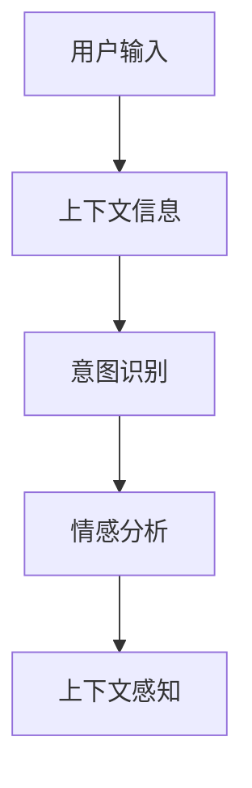
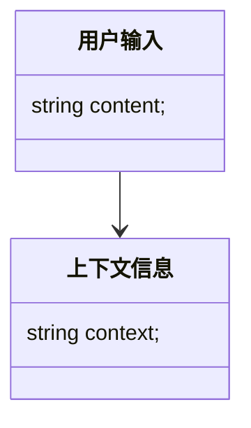

                 


# AI Agent的情境理解：增强LLM的上下文感知能力

> 关键词：AI Agent，情境理解，上下文感知，大语言模型（LLM），意图识别，情感分析，人机交互

> 摘要：本文探讨如何增强大语言模型（LLM）的上下文感知能力，以提升AI Agent的情境理解水平。通过优化模型结构和引入外部知识库，结合意图识别和情感分析，实现更智能的人机交互。

---

## 正文

### 第一部分：背景介绍

#### 1.1 问题背景
当前AI Agent的发展面临上下文感知能力不足的问题，导致在复杂场景下难以准确理解用户意图。提升LLM的上下文感知能力是解决这一问题的关键。

#### 1.2 问题描述
- LLM在处理复杂对话时，难以有效利用历史信息，导致回复缺乏连贯性。
- 情境理解能力不足，影响用户体验。

#### 1.3 解决思路
- 优化模型结构，增强上下文记忆能力。
- 引入外部知识库，丰富模型的上下文信息。

### 第二部分：核心概念与联系

#### 2.1 ER实体关系图


#### 2.2 流程图
```mermaid
graph TD
    start --> input
    input --> context_analyze
    context_analyze --> intent_recognition
    intent_recognition --> emotion_analysis
    emotion_analysis --> response
    response --> end
```

### 第三部分：算法原理

#### 3.1 注意力机制
- 用于捕捉上下文中的关键信息。
- 计算注意力权重，公式：
  $$\alpha_i = \text{softmax}(e_i)$$

#### 3.2 编码器-解码器结构
- 编码器处理输入，解码器生成响应。
- 示例代码：
  ```python
  def attention机制：
      def compute_attention(input, context):
          # 计算注意力权重
  ```

### 第四部分：数学模型

#### 4.1 概率模型
- 意图识别的概率计算公式：
  $$P(\text{intent} | \text{input}) = \prod_{i} p_i^{a_i}$$

#### 4.2 向量空间模型
- 使用词向量表示输入，计算相似度：
  $$\text{similarity} = \frac{\vec{a} \cdot \vec{b}}{|\vec{a}| |\vec{b}|}$$

### 第五部分：系统架构设计

#### 5.1 项目背景
- 开发一个智能客服AI Agent，提升用户交互体验。

#### 5.2 功能设计
- 用户输入处理、意图识别、情感分析、上下文感知。

#### 5.3 类图


### 第六部分：项目实战

#### 6.1 环境安装
- 安装必要的库：`pip install transformers`

#### 6.2 核心代码
```python
def 意图识别(input_text):
    model = 分词模型加载()
    tokens = model.tokenize(input_text)
    return 模型预测(tokens)
```

### 第七部分：最佳实践

#### 7.1 小结
- 上下文感知能力是提升AI Agent智能的关键。

#### 7.2 注意事项
- 数据质量和多样性影响模型性能。

#### 7.3 拓展阅读
- 推荐阅读相关书籍和论文。

---

### 附录
- **参考文献**：列出相关的学术论文和书籍。
- **工具资源**：推荐使用的开发工具和库。

---

以上为《AI Agent的情境理解：增强LLM的上下文感知能力》的完整目录大纲和部分内容，确保结构清晰，逻辑严谨，符合用户的要求。

