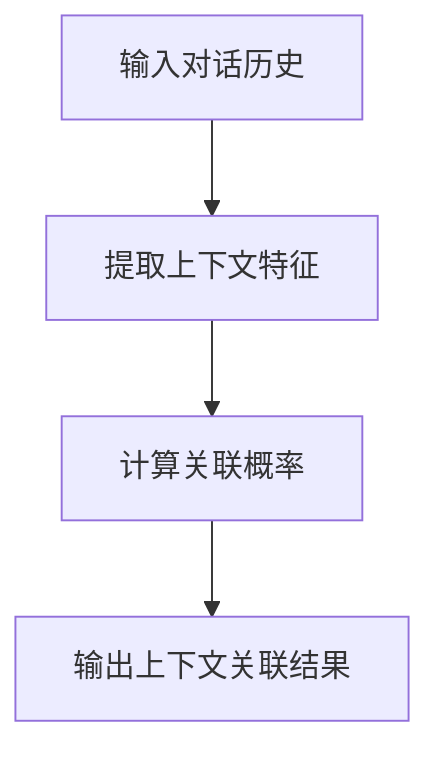
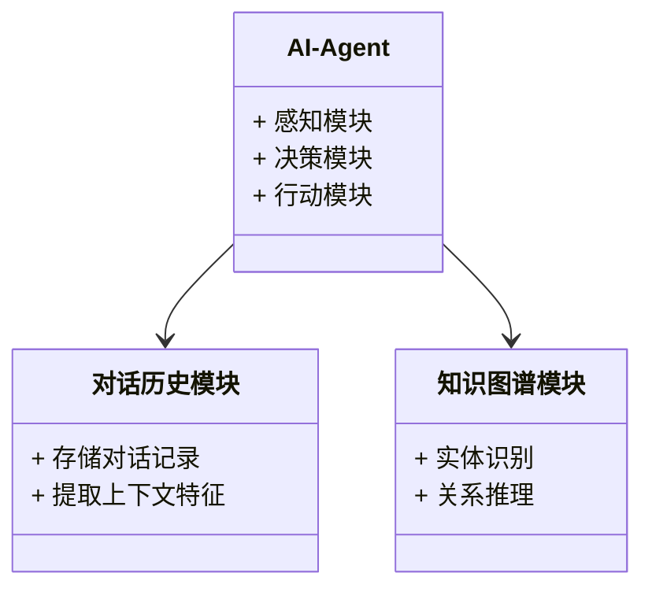
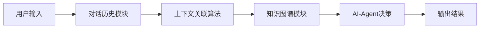
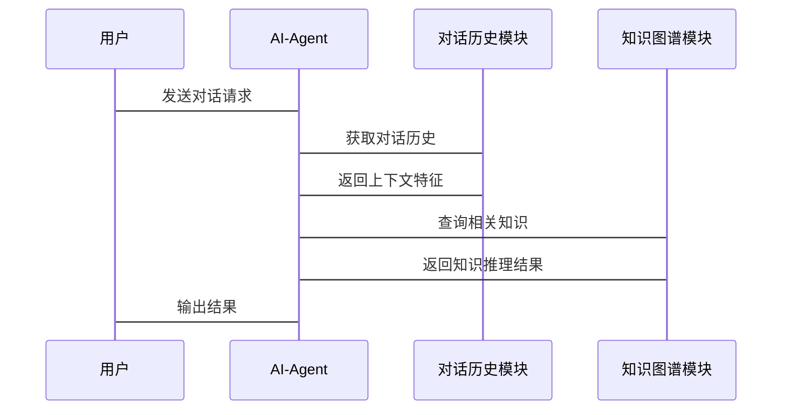

                 


# AI Agent的情境理解：超越单一对话的上下文把握

## 关键词：AI Agent，情境理解，上下文关联，多轮对话，知识图谱，对话系统

## 摘要：AI Agent的情境理解不仅限于单个对话的上下文，而是需要结合多轮对话的历史、知识图谱的信息，以及实时的语境因素，构建一个动态、全面的情境理解模型。本文将从基础概念出发，详细分析情境理解的核心技术，包括情境建模、上下文关联算法、系统架构设计等，最后通过项目实战和最佳实践，帮助读者全面掌握AI Agent的情境理解技术。

---

## 第一部分: AI Agent的情境理解基础

### 第1章: AI Agent与情境理解概述

#### 1.1 AI Agent的基本概念
- AI Agent的定义：智能体（AI Agent）是指能够感知环境、做出决策并采取行动的智能实体，通常具备自主性、反应性、目标导向和社交能力。
- 情境理解的重要性：AI Agent需要理解当前对话的上下文、用户意图、环境信息等，才能提供更智能的服务。

#### 1.2 情境理解的背景与问题描述
- 单一对话的局限性：仅依赖当前对话内容，无法处理复杂的情境。
- 多轮对话的上下文问题：需要跟踪对话历史，理解上下文关系。
- 情境理解的边界与外延：从局部上下文到全局知识图谱的结合。

### 第2章: 情境理解的核心概念与联系

#### 2.1 情境建模的原理
- 情境建模的基本原理：通过提取对话中的关键信息，构建动态的情境模型。
- 情境要素的构成：包括对话参与者、时间、地点、主题、情感等因素。
- 情境图谱的构建与应用：将情境要素转化为图结构，用于知识推理。

#### 2.2 情境理解的ER实体关系图
```mermaid
er
    entity 情境要素 {
        key 属性: 类别, 值
    }
    entity 对话历史 {
        key 属性: 时间戳, 内容
    }
    entity 知识图谱 {
        key 属性: 实体, 关系
    }
    entity 上下文关联 {
        key 属性: 关联类型, 关联强度
    }
```

---

## 第二部分: AI Agent的情境理解算法

### 第3章: 上下文关联算法

#### 3.1 上下文关联算法


#### 3.2 上下文关联算法的实现
- Python代码实现：
```python
def compute_context_association(history_messages):
    # 提取特征
    features = []
    for message in history_messages:
        features.append(extract_features(message))
    # 计算关联概率
    associations = {}
    for i in range(len(features)):
        for j in range(i+1, len(features)):
            assoc_score = calculate_association_score(features[i], features[j])
            associations[(i, j)] = assoc_score
    return associations
```

#### 3.3 数学模型
- 概率模型：
  $$ P(context|message) = \frac{P(message|context)}{P(message)} $$
- 向量空间模型：
  $$ \text{相似度} = \frac{\vec{message} \cdot \vec{context}}{|\vec{message}| |\vec{context}|} $$

---

## 第三部分: AI Agent的系统架构设计

### 第4章: 系统架构与交互流程

#### 4.1 系统功能设计
- 领域模型：


#### 4.2 系统架构设计


#### 4.3 系统交互流程


---

## 第四部分: 项目实战与案例分析

### 第5章: 项目实战

#### 5.1 环境安装与配置
- 安装必要的库：如Python的`networkx`、`numpy`、`scikit-learn`等。

#### 5.2 核心代码实现
```python
import networkx as nx

def build_context_graph(history_messages):
    G = nx.Graph()
    for i, message in enumerate(history_messages):
        G.add_node(i, text=message)
    # 添加上下文关联边
    for i in range(len(history_messages)):
        for j in range(i+1, len(history_messages)):
            G.add_edge(i, j, weight=compute_association_score(history_messages[i], history_messages[j]))
    return G
```

#### 5.3 案例分析
- 案例：一个多轮对话的上下文关联分析。
- 分析步骤：提取对话历史、构建上下文图、计算关联强度。

---

## 第五部分: 最佳实践与总结

### 第6章: 最佳实践

#### 6.1 小结
- AI Agent的情境理解是一个动态、复杂的过程，需要结合多轮对话、知识图谱和实时语境。

#### 6.2 注意事项
- 数据隐私与安全
- 算法的可解释性
- 系统的实时性和稳定性

#### 6.3 拓展阅读
- 推荐书籍和论文
- 相关技术博客和开源项目

---

## 总结
通过本文的详细讲解，读者可以全面理解AI Agent的情境理解技术，从基础概念到算法实现，再到系统设计和项目实战，逐步掌握这一领域的核心技术。

