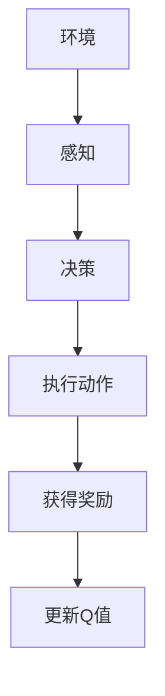
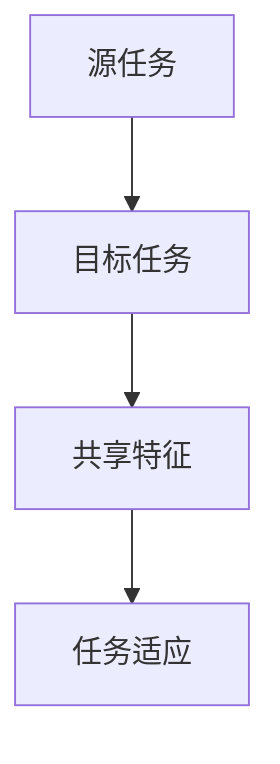
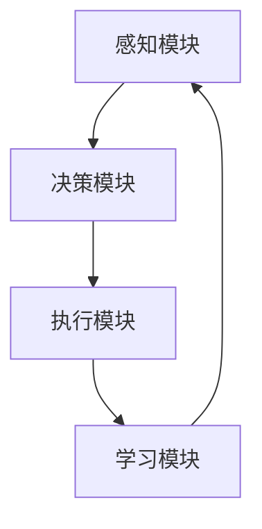
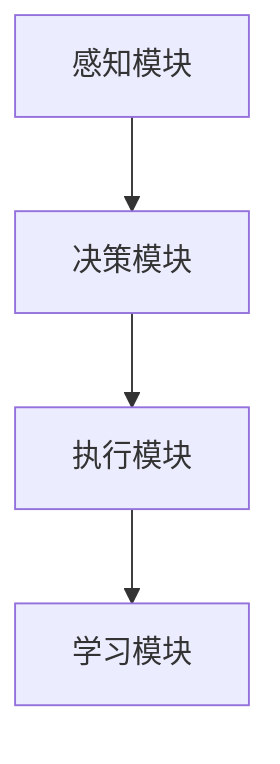
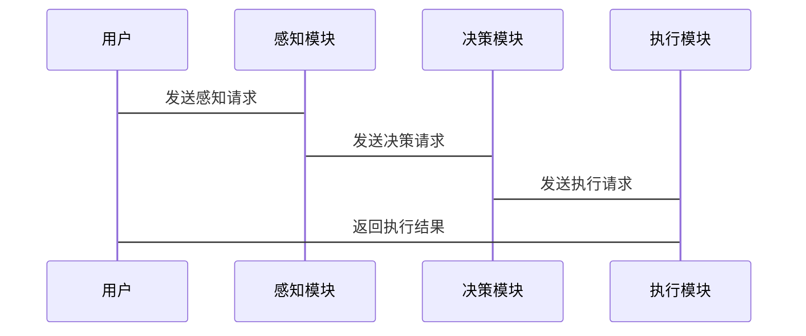

                 


# AI Agent的情境适应学习：提高在复杂环境中的表现

> 关键词：AI Agent，情境适应学习，复杂环境，强化学习，迁移学习，算法实现，系统架构

> 摘要：本文详细探讨了AI Agent在复杂环境中的情境适应学习方法，从基本概念、算法原理到系统架构设计，再到项目实战，全面分析了如何通过情境适应学习提升AI Agent的表现。

---

# 第1章: AI Agent与情境适应学习概述

## 1.1 AI Agent的基本概念

### 1.1.1 什么是AI Agent
AI Agent（人工智能代理）是指能够感知环境、自主决策并执行任务的智能实体。AI Agent可以是软件程序、机器人或其他智能系统，其核心目标是通过与环境交互，完成特定任务。

### 1.1.2 AI Agent的核心特征
- **自主性**：能够在没有外部干预的情况下自主决策。
- **反应性**：能够实时感知环境并做出反应。
- **目标导向性**：基于目标导向的行为决策。
- **学习能力**：通过学习优化自身的行为策略。

### 1.1.3 情境适应学习的定义
情境适应学习是指AI Agent在不同环境中，根据环境的变化动态调整自身行为策略，以适应新的情境和挑战。

---

## 1.2 情境适应学习的背景与意义

### 1.2.1 复杂环境中的AI挑战
复杂环境具有不确定性高、动态变化快、任务多样性强等特点，传统的静态规则无法应对这些挑战。因此，AI Agent需要具备情境适应能力，以应对复杂环境中的各种不确定性。

### 1.2.2 情境适应学习的重要性
- 提高AI Agent的通用性：能够适应不同环境和任务。
- 增强AI Agent的鲁棒性：在复杂环境中表现出更好的稳定性和可靠性。
- 降低开发成本：通过学习而非手动编写规则，减少开发时间和成本。

### 1.2.3 情境适应学习的应用场景
- 智能机器人：在家庭、工业等复杂环境中执行任务。
- 自动驾驶：在交通环境中实时感知和决策。
- 智能助手：在不同用户需求和环境中提供个性化服务。

---

## 1.3 本章小结

本章介绍了AI Agent的基本概念和情境适应学习的背景与意义，强调了在复杂环境中提升AI Agent情境适应能力的重要性。

---

# 第2章: AI Agent的情境适应学习模型

## 2.1 情境适应学习的核心要素

### 2.1.1 知识表示
知识表示是AI Agent理解和表示环境信息的基础。常用的表示方法包括符号表示、概率表示和神经网络表示。

### 2.1.2 状态感知
状态感知是AI Agent通过传感器或其他方式感知环境状态的过程，包括视觉、听觉、触觉等多种感知方式。

### 2.1.3 行为决策
行为决策是AI Agent基于感知到的状态和目标，选择最优或次优行为的过程，通常基于强化学习或决策树等方法。

---

## 2.2 情境适应学习的原理

### 2.2.1 知识更新机制
知识更新机制是AI Agent根据新环境信息不断更新知识库的过程，包括基于规则的更新和基于机器学习的更新。

### 2.2.2 状态评估方法
状态评估方法是AI Agent对当前状态进行评估和判断的过程，包括基于概率的方法和基于强化学习的方法。

### 2.2.3 行为优化策略
行为优化策略是AI Agent通过不断尝试和反馈优化行为的过程，常用的方法包括Q-learning和深度强化学习。

---

## 2.3 情境适应学习的数学模型

### 2.3.1 状态空间模型
状态空间模型描述了AI Agent可能遇到的所有状态，通常表示为一个状态集合，每个状态表示环境中的一个具体情形。

$$ S = \{ s_1, s_2, ..., s_n \} $$

### 2.3.2 动作空间模型
动作空间模型描述了AI Agent在每个状态下可能执行的动作，通常表示为一个动作集合。

$$ A = \{ a_1, a_2, ..., a_m \} $$

### 2.3.3 奖励函数模型
奖励函数模型定义了AI Agent在执行某个动作后所获得的奖励，通常表示为一个实数。

$$ R(s, a) = r $$

---

## 2.4 本章小结

本章详细介绍了情境适应学习的核心要素和基本原理，为后续的算法实现和系统设计奠定了理论基础。

---

# 第3章: 情境适应学习的核心算法

## 3.1 基于强化学习的算法

### 3.1.1 Q-learning算法
Q-learning是一种经典的强化学习算法，通过更新Q值表来学习最优策略。

$$ Q(s, a) = Q(s, a) + \alpha (r + \gamma \max Q(s', a')) - Q(s, a)) $$

### 3.1.2 Deep Q-Network (DQN)算法
DQN算法通过深度神经网络近似Q值函数，提高了算法的表达能力和泛化能力。

### 3.1.3 算法流程图（Mermaid）



---

## 3.2 基于迁移学习的算法

### 3.2.1 迁移学习的基本原理
迁移学习通过将已学习的知识迁移到新任务中，提高了算法的泛化能力。

### 3.2.2 迁移学习在情境适应中的应用
迁移学习可以用于不同环境之间的知识迁移，帮助AI Agent更快地适应新情境。

### 3.2.3 算法流程图（Mermaid）



---

## 3.3 算法实现的Python代码示例

### 3.3.1 Q-learning算法实现

```python
import numpy as np

class QLearning:
    def __init__(self, state_space, action_space, learning_rate=0.1, gamma=0.9):
        self.state_space = state_space
        self.action_space = action_space
        self.lr = learning_rate
        self.gamma = gamma
        self.q_table = np.zeros((state_space, action_space))

    def choose_action(self, state, epsilon=0.1):
        if np.random.random() < epsilon:
            return np.random.randint(self.action_space)
        return np.argmax(self.q_table[state])

    def update_q_table(self, state, action, reward, next_state):
        self.q_table[state][action] = self.q_table[state][action] + self.lr * (reward + self.gamma * np.max(self.q_table[next_state]) - self.q_table[state][action])
```

### 3.3.2 DQN算法实现

```python
import torch
import torch.nn as nn

class DQN:
    def __init__(self, input_dim, hidden_dim, output_dim):
        self.model = nn.Sequential(
            nn.Linear(input_dim, hidden_dim),
            nn.ReLU(),
            nn.Linear(hidden_dim, output_dim)
        )
        self.optimizer = torch.optim.Adam(self.model.parameters())

    def forward(self, x):
        return self.model(x)

    def update(self, inputs, targets):
        outputs = self.forward(inputs)
        loss = nn.MSELoss()(outputs, targets)
        self.optimizer.zero_grad()
        loss.backward()
        self.optimizer.step()
```

---

## 3.4 本章小结

本章介绍了强化学习和迁移学习在情境适应中的应用，详细讲解了Q-learning和DQN算法，并提供了Python代码示例。

---

# 第4章: 情境适应学习的系统架构设计

## 4.1 系统功能设计

### 4.1.1 系统功能模块划分
系统功能模块包括感知模块、决策模块、执行模块和学习模块。

### 4.1.2 系统功能流程图（Mermaid）



---

## 4.2 系统架构设计

### 4.2.1 分层架构设计
系统架构分为感知层、决策层和执行层，每层之间通过接口进行交互。

### 4.2.2 微服务架构设计
系统采用微服务架构，每个服务负责特定的功能模块。

### 4.2.3 系统架构图（Mermaid）


---

## 4.3 系统接口设计

### 4.3.1 API接口定义
API接口包括感知接口、决策接口和执行接口。

### 4.3.2 接口交互流程图（Mermaid）



---

## 4.4 系统交互设计

### 4.4.1 用户与系统交互流程
用户通过图形界面与系统交互，系统根据用户输入执行相应操作。

### 4.4.2 系统内部组件交互流程
系统内部组件通过消息队列进行交互，确保各模块协同工作。

### 4.4.3 交互序列图（Mermaid）



---

## 4.5 本章小结

本章详细介绍了情境适应学习系统的功能设计、架构设计和交互设计，为后续的项目实现提供了指导。

---

# 第5章: 情境适应学习的项目实战

## 5.1 项目背景与目标

### 5.1.1 项目背景
本项目旨在开发一个能够在复杂环境中自主适应的AI Agent，应用于智能机器人和自动驾驶等领域。

### 5.1.2 项目目标
- 实现基于强化学习的情境适应算法。
- 开发一个可扩展的系统架构。
- 在实际场景中验证算法的有效性。

---

## 5.2 环境搭建与配置

### 5.2.1 开发环境要求
- 操作系统：Linux/Windows/MacOS
- Python版本：3.6+
- 依赖库：numpy, torch, gym

### 5.2.2 依赖库安装
```bash
pip install numpy torch gym
```

### 5.2.3 环境配置示例
```bash
export PATH=/path/to/venv/bin:$PATH
```

---

## 5.3 核心功能实现

### 5.3.1 感知模块实现
使用传感器获取环境信息，例如摄像头、激光雷达等。

### 5.3.2 决策模块实现
基于强化学习算法（如DQN）进行行为决策。

### 5.3.3 执行模块实现
根据决策结果执行具体动作，例如控制机器人移动。

---

## 5.4 项目实战案例分析

### 5.4.1 智能机器人导航
在迷宫环境中，AI Agent通过强化学习学习最优路径。

### 5.4.2 自动驾驶中的情境适应
在复杂交通环境中，AI Agent通过情境适应学习实时调整驾驶策略。

---

## 5.5 本章小结

本章通过实际案例分析，详细讲解了情境适应学习在项目中的应用，验证了算法的有效性。

---

# 第6章: 情境适应学习的最佳实践与注意事项

## 6.1 最佳实践

### 6.1.1 算法选择
根据具体任务选择合适的算法，强化学习适用于动态环境，迁移学习适用于跨任务场景。

### 6.1.2 系统优化
通过并行计算和分布式架构优化系统性能。

### 6.1.3 持续学习
在实际应用中，持续更新模型以适应新的环境变化。

---

## 6.2 注意事项

### 6.2.1 数据质量问题
确保训练数据的多样性和代表性，避免过拟合。

### 6.2.2 算法收敛性
注意算法的收敛速度和稳定性，避免陷入局部最优。

### 6.2.3 安全性问题
在实际应用中，确保AI Agent的行为符合安全规范，避免误操作。

---

## 6.3 拓展阅读

### 6.3.1 强化学习经典论文
-《Playing Atari Games Using Deep Reinforcement Learning》

### 6.3.2 情境适应学习最新研究
-《Adaptive Planning in Dynamic Environments》

---

# 第7章: 结语

## 7.1 本章总结

本文详细探讨了AI Agent的情境适应学习方法，从基本概念到算法实现，再到系统设计和项目实战，全面分析了如何在复杂环境中提升AI Agent的表现。

## 7.2 未来展望

未来的研究方向包括更高效的算法设计、更智能的系统架构以及更广泛的应用场景。

---

# 附录: 参考文献

1. Sutton, R. S., & Barto, A. G. (2018). Reinforcement learning: An introduction. MIT press.
2. Mnih, V., et al. (2015). Deep Q-learning from experience replay. Nature.
3. Pan, S. J., & Yang, Q. (2010). A survey on transfer learning. IEEE Transactions on Knowledge & Data Engineering.

