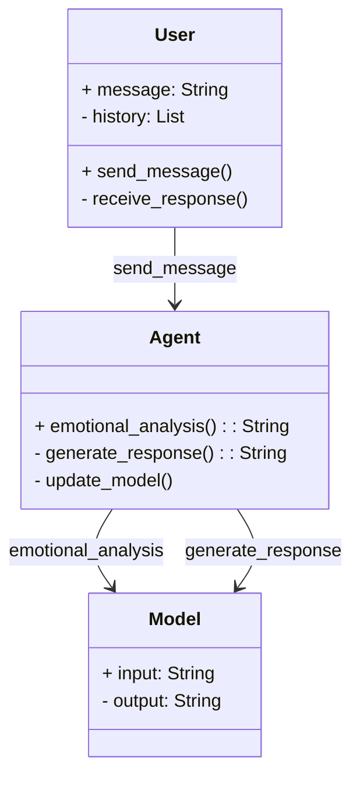
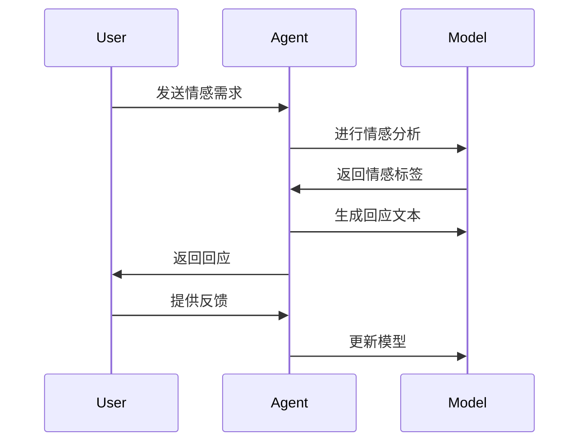

                 


# AI Agent的情感共情：提升LLM的人文关怀能力

> 关键词：AI Agent，情感共情，LLM，人文关怀，大语言模型，情感分析

> 摘要：本文探讨了AI Agent在情感共情能力上的提升，重点分析了如何通过技术手段增强大语言模型（LLM）的人文关怀能力。从情感共情的定义到具体实现方法，详细阐述了情感分析、共情生成等核心算法，并结合实际案例和系统架构设计，展示了如何将情感共情能力应用于实际场景中，提升用户体验和人机交互的自然性。

---

## 第一部分: 情感共情的定义与背景

### 第1章: 情感共情的定义与特征

#### 1.1 情感共情的定义
情感共情是指个体在理解和感受他人情感的基础上，能够产生共鸣并做出相应的反应。在AI Agent的语境中，情感共情能力使其能够理解用户的情感状态，并通过适当的语言和行为给予回应，从而提升用户体验。

#### 1.2 AI Agent的定义与分类
AI Agent是一种智能体，能够感知环境、执行任务并做出决策。根据功能不同，AI Agent可以分为任务驱动型和情感驱动型。情感驱动型AI Agent专注于理解和回应用户的情感需求，是本文的重点。

#### 1.3 大语言模型（LLM）的概述
大语言模型（LLM）是基于深度学习的自然语言处理模型，具有强大的文本生成和理解能力。然而，当前LLM在情感共情能力上仍存在不足，需要通过技术手段进一步提升。

### 第2章: 提升LLM情感共情能力的意义

#### 2.1 当前LLM的局限性
当前LLM虽然在文本生成和理解上表现出色，但在情感共情方面存在以下问题：
- 情感识别不够精准。
- 缺乏对用户情感状态的深度理解。
- 在复杂情感场景下，生成的回应缺乏自然性和连贯性。

#### 2.2 情感共情能力的重要性
情感共情能力的提升能够显著增强人机交互的自然性和用户体验，具体表现在：
- 提升用户满意度。
- 增强AI Agent的可信度和亲和力。
- 扩展LLM在教育、医疗、客服等领域的应用潜力。

#### 2.3 提升LLM情感共情能力的挑战
实现情感共情能力的提升面临以下挑战：
- 数据隐私问题：需要收集大量用户情感数据，可能引发隐私争议。
- 模型复杂性：情感共情涉及多模态数据和复杂的情感推理，增加了模型开发的难度。
- 用户反馈的多样性：用户情感表达方式多样，难以统一建模。

---

## 第二部分: 情感共情的核心概念与联系

### 第3章: 情感共情的核心概念

#### 3.1 情感分析
- **定义**：情感分析是通过自然语言处理技术，对文本中的情感倾向进行识别和分类。
- **算法**：常用的算法包括基于词袋模型的机器学习算法（如SVM、NB）和基于深度学习的模型（如LSTM、BERT）。
- **流程**：包括数据预处理、特征提取、模型训练和结果评估。

#### 3.2 情感生成
- **定义**：情感生成是根据输入的情感信息，生成具有情感倾向的文本。
- **方法**：基于生成对抗网络（GAN）或 transformers（如GPT）的生成模型。
- **挑战**：生成的情感文本需要具备自然性和连贯性。

#### 3.3 共情推理
- **定义**：共情推理是基于上下文和用户情感状态，推断用户的深层需求。
- **算法**：结合规则推理和深度学习模型（如BERT）进行情感推理。

### 第4章: AI Agent与情感共情的关系

#### 4.1 AI Agent作为情感共情的载体
AI Agent通过整合情感分析和生成模块，能够实现对用户情感的理解和回应。

#### 4.2 情感共情对AI Agent性能的提升
- 提高用户交互的自然性。
- 增强用户信任感和满意度。
- 扩展AI Agent的应用场景。

#### 4.3 情感共情与用户需求的匹配
通过情感共情能力，AI Agent能够更精准地理解用户需求，提供更个性化的服务。

---

## 第三部分: 情感共情能力的核心算法与模型

### 第5章: 情感分析算法

#### 5.1 基于传统机器学习的情感分析
- **流程**：
  1. 数据预处理：分词、去停用词、提取特征。
  2. 特征提取：使用词袋模型或词嵌入。
  3. 模型训练：使用SVM、NB等算法进行分类。

#### 5.2 基于深度学习的情感分析
- **模型**：使用LSTM或BERT进行情感分类。
- **优势**：能够捕捉上下文信息，处理复杂的情感语境。

#### 5.3 情感分析的挑战与解决方案
- **挑战**：数据不平衡、情感表达的多样性。
- **解决方案**：数据增强、迁移学习。

### 第6章: 情感共情生成算法

#### 6.1 基于规则的情感生成
- **方法**：根据预设的规则生成回应。
- **优点**：实现简单，但生成文本缺乏灵活性。

#### 6.2 基于深度学习的情感生成
- **模型**：使用GPT系列模型生成情感文本。
- **优化**：通过对抗训练或强化学习提升生成质量。

#### 6.3 情感生成的优化策略
- **策略**：结合情感标签和上下文信息进行生成控制。

### 第7章: 情感共情的数学模型

#### 7.1 情感分析的数学模型
$$ P(y|x) = \frac{P(x|y)P(y)}{P(x)} $$
其中，$y$是情感类别，$x$是输入文本。

#### 7.2 情感生成的数学模型
使用生成对抗网络（GAN）框架：
$$ \min_{G} \max_{D} \mathbb{E}_{x}[\log D(x)] + \mathbb{E}_{z}[\log (1-D(G(z)))] $$

---

## 第四部分: 系统分析与架构设计

### 第8章: 问题场景介绍

#### 8.1 用户场景
- 用户与AI Agent进行对话，表达情感需求。
- AI Agent需要理解用户情感并给予适当回应。

### 第9章: 系统功能设计

#### 9.1 功能模块
- 情感识别模块：分析用户输入文本的情感倾向。
- 情感生成模块：根据情感分析结果生成回应文本。
- 反馈机制：收集用户反馈，优化情感模型。

#### 9.2 领域模型（Mermaid 类图）


### 第10章: 系统架构设计

#### 10.1 系统架构（Mermaid 架构图）
```mermaid
container AI Agent {
    Component 情感识别模块 {
        Algorithm LSTM
    }
    Component 情感生成模块 {
        Algorithm GPT
    }
    Component 反馈机制 {
        Database 用户反馈
    }
}
```

#### 10.2 系统接口设计
- API接口：提供情感分析和生成接口。
- 数据接口：连接用户数据库和模型训练数据。

### 第11章: 系统交互设计

#### 11.1 交互流程（Mermaid 序列图）


---

## 第五部分: 项目实战

### 第12章: 环境安装

#### 12.1 安装依赖
- Python 3.8+
- TensorFlow 2.5+
- Hugging Face transformers库

### 第13章: 核心实现

#### 13.1 情感分析代码
```python
from transformers import pipeline

sentiment_analyzer = pipeline("sentiment-analysis")
result = sentiment_analyzer("I love this product!",)
print(result)  # 输出情感标签和评分
```

#### 13.2 情感生成代码
```python
from transformers import AutoModelForCausalLM, AutoTokenizer

tokenizer = AutoTokenizer.from_pretrained("gpt2")
model = AutoModelForCausalLM.from_pretrained("gpt2")
inputs = tokenizer("I feel sad today.", return_tensors="pt")
outputs = model.generate(inputs.input_ids, max_length=50)
print(tokenizer.decode(outputs[0], skip_special_tokens=True))
```

### 第14章: 实际案例分析

#### 14.1 案例背景
用户与AI Agent进行对话，表达情感需求。

#### 14.2 代码实现
```python
def analyze_emotion(text):
    analyzer = pipeline("sentiment-analysis")
    return analyzer(text)

def generate_response(emotion):
    tokenizer = AutoTokenizer.from_pretrained("gpt2")
    model = AutoModelForCausalLM.from_pretrained("gpt2")
    inputs = tokenizer(f"I feel {emotion} today.", return_tensors="pt")
    outputs = model.generate(inputs.input_ids, max_length=50)
    return tokenizer.decode(outputs[0], skip_special_tokens=True)

user_input = "I'm so stressed."
emotion = analyze_emotion(user_input)[0]['label']
response = generate_response(emotion)
print(response)
```

### 第15章: 项目小结

#### 15.1 核心收获
- 掌握了情感分析和生成的基本方法。
- 理解了AI Agent在情感共情中的应用。

#### 15.2 项目总结
通过实际案例，展示了如何将情感共情能力应用于AI Agent，提升了人机交互的自然性和用户体验。

---

## 第六部分: 最佳实践

### 第16章: 关键点总结

#### 16.1 小结
- 情感共情能力是AI Agent的重要组成部分。
- 提升情感共情能力需要结合情感分析和生成技术。

#### 16.2 注意事项
- 数据隐私问题需要高度重视。
- 模型的泛化能力需要通过大量数据训练提升。

#### 16.3 拓展阅读
- 深度阅读相关论文，如《Affecting Computing》。
- 关注情感共情领域的最新研究进展。

---

## 结语

通过本文的详细讲解，我们深入探讨了AI Agent情感共情能力的提升方法，从理论到实践，展示了如何通过技术手段增强大语言模型的人文关怀能力。希望本文能为相关领域的研究和应用提供有价值的参考和启发。

