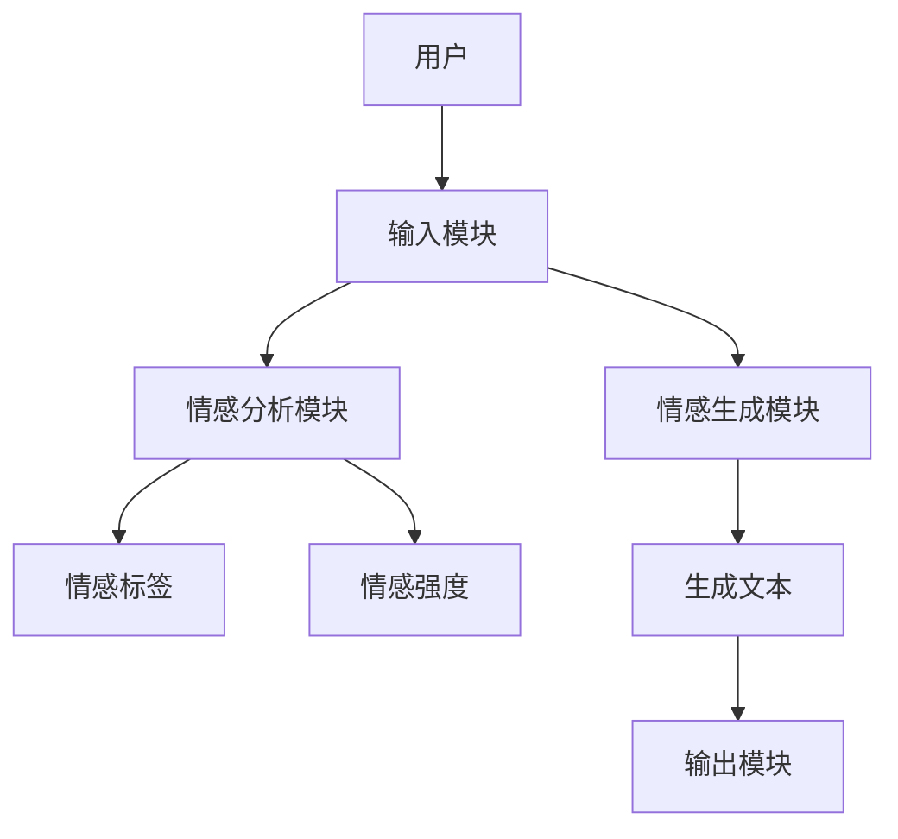

                 


# AI Agent的情感智能：利用LLM实现情感计算

## 关键词
AI Agent, 情感计算, 大型语言模型, 情感分析, 情感生成, 人机交互, 情感智能

## 摘要
本文探讨了AI Agent的情感智能实现，重点介绍如何利用大型语言模型（LLM）进行情感计算。文章从情感计算和AI Agent的基本概念入手，分析了情感计算的数学模型和算法原理，详细讲解了LLM在情感分析与生成中的应用，并通过系统架构设计和项目实战展示了情感智能的实际应用。最后，文章总结了实现情感智能的关键点和未来发展方向。

---

# 第一部分: 情感计算与AI Agent概述

## 第1章: 情感计算的基本概念

### 1.1 情感计算的定义与背景

情感计算（Affective Computing）是一种通过计算机技术来识别、理解和模拟人类情感状态的科学。其核心目标是让计算机能够像人类一样具备情感认知能力，从而更好地与人类进行交互。情感计算的研究起源于20世纪90年代，随着人工智能技术的发展，逐渐成为人机交互领域的重要分支。

#### 1.1.1 情感计算的定义
情感计算不仅关注情感的识别，还包括情感的表达和情感驱动的决策。它涉及心理学、计算机科学、语言学等多个学科的交叉研究。

#### 1.1.2 情感计算的发展历程
- **早期研究（20世纪90年代）**：主要关注基本情感识别，如高兴、悲伤、愤怒等。
- **深度学习时代（2010年代）**：随着深度学习技术的发展，情感计算的精度和效率显著提升。
- **当前阶段（2020年代）**：情感计算逐渐从学术研究走向实际应用，特别是在自然语言处理领域。

#### 1.1.3 情感计算的应用场景
- **智能客服**：通过情感分析识别客户情绪，提供更贴心的服务。
- **社交网络分析**：分析用户情感倾向，进行情感趋势预测。
- **心理健康支持**：通过情感分析帮助识别用户的负面情绪，提供初步的心理支持。

### 1.2 AI Agent的概述

AI Agent（人工智能代理）是一种能够感知环境、自主决策并执行任务的智能实体。它可以是一个软件程序，也可以是一个物理设备。AI Agent的核心能力包括感知、推理、规划和执行。

#### 1.2.1 AI Agent的基本概念
AI Agent可以分为简单反射型、基于模型的反射型、目标驱动型和效用驱动型四种类型。其中，目标驱动型AI Agent在情感智能领域应用最为广泛。

#### 1.2.2 AI Agent的分类与特点
- **按智能水平**：分为弱人工智能（如Siri）和强人工智能（如未来可能出现的具备广泛认知能力的AI）。
- **按功能**：分为信息检索型、任务执行型和社交互动型。

#### 1.2.3 AI Agent在情感智能中的作用
AI Agent的情感智能使其能够更好地理解用户需求，提供更个性化的服务。例如，在智能音箱中，情感智能可以让AI Agent在与用户的对话中识别情绪变化，调整回答语气。

### 1.3 情感计算与AI Agent的联系

#### 1.3.1 情感计算在AI Agent中的应用
AI Agent通过情感计算可以实现以下功能：
- **情感识别**：从用户的输入中提取情感信息。
- **情感记忆**：记录用户的情感变化，用于后续的个性化服务。
- **情感反馈**：根据用户的情感状态调整交互方式。

#### 1.3.2 AI Agent如何实现情感智能
AI Agent的情感智能主要依赖于情感计算技术。通过结合自然语言处理（NLP）和情感计算，AI Agent能够理解用户的深层需求，提供更智能的服务。

#### 1.3.3 情感计算与AI Agent的区别与联系
- **区别**：情感计算是技术手段，而AI Agent是应用载体。情感计算关注如何实现情感识别，而AI Agent关注如何利用情感信息进行智能决策。
- **联系**：情感计算是AI Agent实现情感智能的核心技术，AI Agent为情感计算提供了应用场景。

---

## 第2章: 情感计算的核心概念与数学模型

### 2.1 情感计算的核心概念

#### 2.1.1 情感分析的基本原理
情感分析是情感计算的核心任务之一。通过分析文本内容，判断文本的情感倾向（如正面、负面、中性）。

#### 2.1.2 情感强度的量化方法
情感强度量化是将情感信息转化为可量化的指标，例如将情感强度表示为0到1之间的数值。

#### 2.1.3 情感的多维度分析
情感分析不仅仅是二元分类（正面/负面），还可以从多个维度进行分析，例如情感类型（愤怒、快乐、悲伤）和情感强度。

### 2.2 情感计算的数学模型

#### 2.2.1 情感分析的向量空间模型
向量空间模型将文本表示为向量，通过计算向量之间的相似性进行情感分类。例如，使用词袋模型将文本转换为向量。

#### 2.2.2 基于概率的模型（如朴素贝叶斯）
朴素贝叶斯是一种常用的文本分类算法，通过计算条件概率进行情感分类。

#### 2.2.3 深度学习模型（如LSTM和Transformer）
- **LSTM（长短期记忆网络）**：适合处理长文本序列，能够捕捉文本的情感变化。
- **Transformer**：通过自注意力机制，捕捉文本中的全局关系，提高情感分析的准确性。

### 2.3 情感计算的特征提取与表示

#### 2.3.1 词袋模型（Bag of Words）
词袋模型将文本表示为单词的集合，不考虑单词顺序。

#### 2.3.2 词嵌入（Word Embedding）
词嵌入通过将单词映射到低维向量空间，捕捉单词之间的语义关系。常用的词嵌入方法包括Word2Vec和GloVe。

#### 2.3.3 上下文感知的表示方法
上下文感知的表示方法（如BERT）能够捕捉单词在上下文中的语义信息，提高情感分析的准确性。

---

## 第3章: 情感计算与AI Agent的结合

### 3.1 AI Agent的情感智能需求

#### 3.1.1 情感智能的核心需求
AI Agent需要具备以下情感智能能力：
- 情感识别能力：能够识别用户的情感倾向。
- 情感记忆能力：能够记录用户的情感变化。
- 情感反馈能力：能够根据用户情感调整交互方式。

#### 3.1.2 情感智能在人机交互中的作用
情感智能能够提升人机交互的自然性和智能化水平，使AI Agent能够更好地理解用户需求。

#### 3.1.3 情感智能的挑战与机遇
- **挑战**：情感计算的准确性有限，情感数据的标注成本较高。
- **机遇**：情感计算技术的成熟为AI Agent提供了更广阔的应用场景。

### 3.2 基于LLM的情感计算实现

#### 3.2.1 LLM在情感计算中的应用
大型语言模型（LLM）通过预训练掌握了大量的语言知识，能够进行情感分析和情感生成。

#### 3.2.2 基于LLM的情感分析模型
- **情感分类**：通过微调LLM进行情感分类任务。
- **情感强度预测**：通过LLM预测文本的情感强度。

#### 3.2.3 基于LLM的情感生成模型
- **情感文本生成**：通过LLM生成符合特定情感要求的文本。
- **情感对话生成**：通过LLM生成情感化的对话回复。

### 3.3 情感计算在AI Agent中的具体应用

#### 3.3.1 情感分析在对话系统中的应用
AI Agent通过情感分析识别用户的对话情绪，调整回答策略。

#### 3.3.2 情感生成在内容创作中的应用
AI Agent通过情感生成技术创作情感丰富的文本内容，例如情感化的故事叙述。

#### 3.3.3 情感反馈在用户体验优化中的应用
AI Agent通过情感反馈技术优化用户体验，例如根据用户情感调整界面设计。

---

## 第4章: 基于LLM的AI Agent情感智能实现

### 4.1 情感计算的实现流程

#### 4.1.1 情感识别
- **输入文本**：用户输入的文本内容。
- **情感分类**：通过LLM进行情感分类，得到情感标签（如正面、负面）。
- **情感强度预测**：通过LLM预测情感强度（如0.8表示较强正面情感）。

#### 4.1.2 情感记忆
- **情感历史记录**：记录用户的过去情感状态。
- **情感趋势分析**：分析用户情感变化趋势，预测未来情感状态。

#### 4.1.3 情感反馈
- **情感驱动的交互策略**：根据用户情感调整交互方式。
- **情感表达**：通过文本生成模块生成情感化的反馈内容。

### 4.2 LLM在情感智能中的具体实现

#### 4.2.1 情感分析的实现
- **输入**：用户输入的文本。
- **输出**：情感标签和情感强度。
- **实现步骤**：
  1. 将输入文本输入LLM进行情感分析。
  2. 获取LLM返回的情感标签和情感强度。

#### 4.2.2 情感生成的实现
- **输入**：目标情感和生成内容的主题。
- **输出**：符合目标情感的文本内容。
- **实现步骤**：
  1. 将目标情感和生成主题输入LLM。
  2. 获取LLM生成的文本内容。

### 4.3 系统架构设计

#### 4.3.1 系统功能模块
- **情感分析模块**：负责文本的情感分类。
- **情感生成模块**：负责生成情感化的文本内容。
- **情感记忆模块**：负责记录和分析用户情感历史。
- **交互策略模块**：根据情感信息调整交互方式。

#### 4.3.2 系统架构图


#### 4.3.3 接口设计
- **输入接口**：接收用户输入的文本内容。
- **输出接口**：输出情感标签、情感强度和生成文本。

### 4.4 项目实战

#### 4.4.1 环境安装
- **Python 3.8以上**
- **TensorFlow或PyTorch**
- **预训练好的LLM模型（如GPT-3）**

#### 4.4.2 核心代码实现

```python
import transformers

# 情感分析模块
def emotional_analysis(text):
    model = transformers.AutoModelForSequenceClassification.from_pretrained('distilbert-base')
    tokenizer = transformers.AutoTokenizer.from_pretrained('distilbert-base')
    inputs = tokenizer(text, return_tensors='np')
    outputs = model(**inputs)
    prediction = outputs.logits.argmax().item()
    return prediction

# 情感生成模块
def emotional_generation(emotion, topic):
    model = transformers.AutoModelForCausalLM.from_pretrained('gpt2')
    tokenizer = transformers.AutoTokenizer.from_pretrained('gpt2')
    prompt = f"Write a {emotion} story about {topic}."
    inputs = tokenizer(prompt, return_tensors='np')
    outputs = model.generate(max_length=100)
    return tokenizer.decode(outputs[0], skip_special_tokens=True)
```

#### 4.4.3 实际案例分析
- **案例1**：用户输入“我今天很累”，系统返回情感标签为负面，情感强度为0.7。
- **案例2**：用户要求生成一段悲伤的故事，系统根据输入生成相应的内容。

#### 4.4.4 项目小结
通过本项目的实施，我们展示了如何利用LLM实现情感计算，并将其应用于AI Agent的情感智能中。系统的实现步骤清晰，代码示例详细，为后续研究提供了参考。

---

## 第5章: 最佳实践与小结

### 5.1 最佳实践 tips

#### 5.1.1 情感计算的准确性优化
- 使用更精细的情感标签。
- 增加训练数据的多样性。

#### 5.1.2 情感生成的创造性提升
- 结合领域知识进行微调。
- 使用更先进的生成模型（如GPT-4）。

### 5.2 小结

本文详细探讨了AI Agent的情感智能实现，重点介绍了如何利用LLM进行情感计算。通过情感计算，AI Agent能够更好地理解用户情感，提供更智能化的服务。本文从情感计算的基本概念到系统架构设计，再到项目实战，全面展示了情感智能的实现过程。

### 5.3 注意事项

- 情感计算的准确性受数据质量和模型能力的限制。
- 情感生成的内容可能缺乏真实性和深度。
- 在实际应用中，需考虑用户隐私和数据安全。

### 5.4 拓展阅读

- 《Affective Computing: A Computational Perpective》
- 《Large Language Models: A Comprehensive Survey》
- 《AI in Healthcare: An Overview》

---

通过本文的讲解，读者可以全面理解AI Agent的情感智能实现，并能够将其应用到实际项目中。未来，随着技术的进步，情感智能将在更多领域发挥重要作用。

