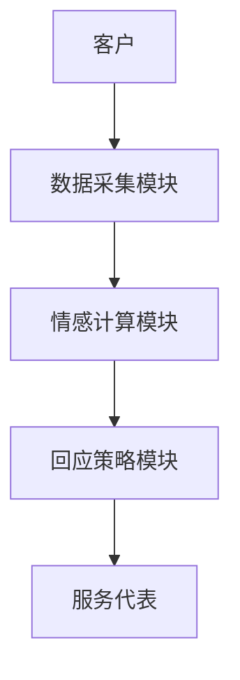
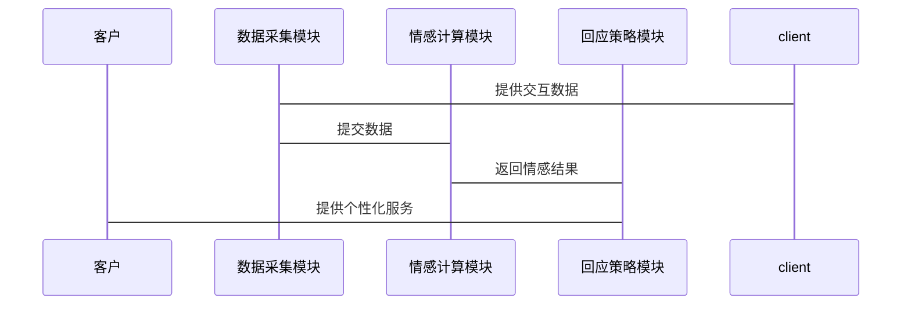

                 


# AI Agent的情感计算在客户服务中的应用

## 关键词：AI Agent, 情感计算, 客户服务, 智能客服, 情感识别

## 摘要：本文深入探讨了AI Agent在客户服务中的情感计算应用。从情感计算和AI Agent的基本概念入手，分析了情感计算的核心原理和算法，详细讲解了系统设计与架构，通过实际案例展示了项目实施过程，并总结了最佳实践和未来发展方向。

---

# 第一部分: AI Agent与情感计算基础

## 第1章: 情感计算与AI Agent概述

### 1.1 情感计算的定义与背景

#### 1.1.1 情感计算的定义
情感计算（Affective Computing）是通过计算机技术识别、理解和响应人类情感的过程。它关注的是人类情感状态的感知和处理，包括情绪识别、情感分类和情感分析。

#### 1.1.2 情感计算的发展历程
情感计算的研究可以追溯到20世纪90年代，随着机器学习和深度学习技术的进步，情感计算逐渐成熟，并在自然语言处理、计算机视觉等领域取得了显著进展。

#### 1.1.3 情感计算在客户服务中的应用背景
在客户服务中，情感计算可以帮助AI Agent理解客户的情感状态，从而提供更个性化的服务。例如，通过分析客户的语气和表情，AI Agent可以识别客户的情绪，调整回应策略，提升客户满意度。

### 1.2 AI Agent的基本概念

#### 1.2.1 AI Agent的定义
AI Agent是一种智能实体，能够感知环境、执行任务并做出决策。它可以在各种场景中模拟人类行为，提供智能化的服务。

#### 1.2.2 AI Agent的核心特征
- **自主性**：能够独立决策和行动。
- **反应性**：能够实时感知环境并做出反应。
- **学习能力**：能够通过数据学习和优化。

#### 1.2.3 AI Agent与传统客服系统的区别
AI Agent能够主动理解客户需求，提供个性化服务，而传统客服系统通常是被动响应，缺乏情感理解和学习能力。

### 1.3 情感计算与AI Agent的结合

#### 1.3.1 情感计算在AI Agent中的作用
情感计算使AI Agent能够理解客户的情感状态，从而提供更贴心的服务。

#### 1.3.2 AI Agent如何实现情感交互
通过自然语言处理和情感识别技术，AI Agent可以识别客户的情感，调整回应策略，提升客户体验。

#### 1.3.3 情感计算与客户服务的结合场景
在客户服务中，情感计算可以帮助识别客户情绪波动，预测客户需求，优化服务流程。

---

## 第2章: 情感计算的核心概念与联系

### 2.1 情感计算的核心原理

#### 2.1.1 情感识别的基本原理
情感识别通过分析语音、语调、语速和语气等方式，判断客户的情感状态。

#### 2.1.2 情感分类的算法原理
情感分类是将文本或语音数据分为不同情感类别（如积极、消极、中性）的过程，常用算法包括支持向量机（SVM）和卷积神经网络（CNN）。

#### 2.1.3 情感计算的数学模型
情感计算的数学模型通常基于概率论和统计学，例如贝叶斯分类器和情感词典。

### 2.2 AI Agent的情感计算实现

#### 2.2.1 情感数据的采集与处理
情感数据可以通过客户与AI Agent的交互记录获取，包括文本、语音和表情等。

#### 2.2.2 情感计算的特征提取
特征提取是情感计算的关键步骤，包括关键词提取、语调分析和情感强度计算。

#### 2.2.3 情感计算的结果应用
情感计算结果用于优化AI Agent的回应策略，提升客户满意度。

### 2.3 情感计算与客户服务的关系

#### 2.3.1 情感计算在客户服务中的应用场景
- 情感识别：识别客户情绪，优化服务流程。
- 情感分类：分类客户情感，提供个性化服务。
- 情感预测：预测客户情绪变化，提前采取措施。

#### 2.3.2 情感计算对客户服务效果的提升
通过情感计算，AI Agent可以更好地理解客户需求，提供更贴心的服务，提升客户满意度。

#### 2.3.3 情感计算与客户满意度的关系
客户满意度与情感计算密切相关，情感计算能够帮助AI Agent更准确地识别客户需求，提升服务质量。

---

## 第3章: 情感计算的算法原理与实现

### 3.1 情感计算的算法概述

#### 3.1.1 基于规则的情感计算算法
基于规则的算法通过预设规则和关键词匹配，判断文本的情感倾向。

#### 3.1.2 基于机器学习的情感计算算法
基于机器学习的算法通过训练数据学习情感特征，分类情感类别。

#### 3.1.3 基于深度学习的情感计算算法
基于深度学习的算法使用神经网络模型，如LSTM和Transformer，进行情感分析。

### 3.2 情感计算的数学模型

#### 3.2.1 情感分类的线性模型
线性模型通常用于情感分类，例如逻辑回归模型。

#### 3.2.2 情感分类的非线性模型
非线性模型如SVM和神经网络模型，能够处理更复杂的特征。

### 3.3 情感计算的流程

1. 数据预处理：清洗和归一化数据。
2. 特征提取：提取情感相关特征。
3. 模型训练：训练情感分类模型。
4. 情感预测：预测客户情感状态。

---

## 第4章: AI Agent在客户服务中的系统设计

### 4.1 问题场景介绍
在客户服务中，常见的问题包括客户情绪波动、需求多样化等。AI Agent需要能够识别客户情感，提供个性化服务。

### 4.2 系统功能设计

#### 4.2.1 领域模型设计
领域模型包括客户、服务代表和情感数据等实体。

#### 4.2.2 系统架构设计
系统架构包括数据采集模块、情感计算模块和回应策略模块。

### 4.3 系统架构图


### 4.4 系统接口设计
系统接口包括数据采集接口、情感计算接口和回应策略接口。

### 4.5 系统交互流程图


---

## 第5章: 项目实战

### 5.1 环境安装
需要安装Python、机器学习库（如scikit-learn、TensorFlow）和NLP库（如spaCy、NLTK）。

### 5.2 核心代码实现

#### 5.2.1 情感计算代码
```python
from sklearn.feature_extraction.text import TfidfVectorizer
from sklearn.svm import SVC

# 数据预处理
texts = ["I love this product!", "This service is terrible."]
labels = [1, 0]

# 特征提取
vectorizer = TfidfVectorizer()
X = vectorizer.fit_transform(texts)

# 模型训练
model = SVC()
model.fit(X, labels)

# 情感预测
new_text = ["The customer service is excellent."]
new_X = vectorizer.transform([new_text])
print(model.predict(new_X))  # 输出情感类别
```

#### 5.2.2 AI Agent实现
```python
class AI-Agent:
    def __init__(self):
        self情感计算模块 = 情感计算模型
        self.回应策略模块 = 回应策略模型

    def 处理客户请求(self, 请求):
        情感状态 = self.情感计算模块.计算情感(请求)
        回应 = self.回应策略模块.生成回应(情感状态)
        return 回应
```

### 5.3 案例分析
通过一个具体案例，展示AI Agent如何通过情感计算优化客户服务流程，提升客户满意度。

---

## 第6章: 最佳实践与总结

### 6.1 最佳实践
- 定期更新情感计算模型，提升准确率。
- 提供多语言支持，满足多样化客户需求。
- 保护客户数据隐私，确保合规性。

### 6.2 小结
AI Agent结合情感计算在客户服务中具有巨大潜力，能够显著提升客户体验和满意度。

### 6.3 注意事项
- 确保情感计算模型的准确性和实时性。
- 定期监控和优化系统性能。
- 注意客户数据的隐私保护。

### 6.4 拓展阅读
推荐相关书籍和论文，供读者深入学习情感计算和AI Agent技术。

---

通过以上内容，您可以系统地了解AI Agent在客户服务中的情感计算应用。

