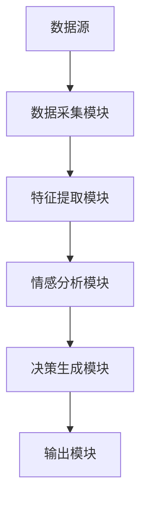

                 


# AI Agent的情感计算：识别、理解和生成情感反应

> 关键词：AI Agent，情感计算，情感识别，情感理解，情感生成，机器学习

> 摘要：本文系统地探讨了AI Agent在情感计算领域的应用，详细分析了情感识别、理解和生成的核心技术与算法原理，结合实际案例，为AI开发者和研究人员提供了深入的技术指导和实践参考。

---

## 第1章: 情感计算的基本概念

### 1.1 情感计算的定义与背景

情感计算（Affective Computing）是人工智能领域的一个重要分支，旨在赋予计算机理解和处理人类情感的能力。情感计算的核心目标是通过分析人类的情感表达（如面部表情、语调、文字）来模拟人类的情感反应，从而实现更自然的交互方式。

AI Agent是一种智能体，能够在特定环境中感知、推理、规划和执行任务。将情感计算与AI Agent结合，能够使AI Agent具备情感识别、理解和生成的能力，从而在与人类交互时更加智能化和人性化。

### 1.2 AI Agent的基本概念

AI Agent（智能体）是指在环境中能够感知并自主行动以实现目标的实体。AI Agent可以是软件程序，也可以是物理设备。AI Agent的核心特征包括：

1. **自主性**：能够在没有外部干预的情况下独立运行。
2. **反应性**：能够根据环境变化动态调整行为。
3. **社交能力**：能够与人类或其他智能体进行交互。
4. **学习能力**：能够通过经验改进自身的性能。

### 1.3 情感计算的核心问题

情感计算的核心问题可以归纳为三个层次：

1. **情感识别**：从输入数据中识别出特定的情感类型或强度。
2. **情感理解**：理解情感背后的意义、原因和背景。
3. **情感生成**：根据理解和情境生成适当的情感反应。

---

## 第2章: 情感计算的关键技术

### 2.1 情感识别技术

情感识别是情感计算的基础，主要通过分析输入数据（如文本、语音、面部表情）来判断情感状态。以下是几种常见的情感识别方法：

1. **基于规则的方法**：通过预定义的情感关键词或规则来判断情感。例如，如果文本中出现“开心”、“愉快”等词汇，则判定为正面情感。
2. **基于机器学习的方法**：利用训练好的分类模型（如SVM、随机森林）对情感进行分类。
3. **基于深度学习的方法**：使用神经网络（如LSTM、Transformer）对情感进行更复杂的建模。

**示例：**

假设我们有一个简单的文本分类任务，目标是判断一条微博的情感倾向（正面、负面、中性）。我们可以使用情感词典和规则来进行初步的情感分类。

```python
import pandas as pd
from sklearn.feature_extraction.text import TfidfVectorizer
from sklearn.svm import SVC

# 加载数据集
data = pd.read_csv('sentiment_data.csv')

# 特征提取
vectorizer = TfidfVectorizer()
X = vectorizer.fit_transform(data['text'])

# 模型训练
model = SVC()
model.fit(X, data['label'])

# 预测
test_text = "这部电影真的太棒了！"
test_X = vectorizer.transform([test_text])
print(model.predict(test_X))
```

### 2.2 情感理解技术

情感理解是对情感背后语义的深度分析，旨在理解情感的来源、背景和潜在含义。以下是几种情感理解技术：

1. **情感分析模型**：通过模型分析文本的情感倾向，并理解其背后的原因。
2. **情感推理模型**：基于上下文推理情感的状态变化，例如从悲伤到愤怒的转变。
3. **情感记忆模型**：记录和关联情感事件，以便在未来的情境中更好地理解和应用。

### 2.3 情感生成技术

情感生成是情感计算的高级阶段，旨在根据输入生成适当的情感反应。以下是几种情感生成方法：

1. **基于规则的方法**：根据预定义的规则生成情感反应，例如“当用户表达感谢时，生成积极的回应”。
2. **基于模板的方法**：使用预定义的模板生成情感化的文本。
3. **基于生成模型的方法**：利用生成对抗网络（GAN）或变(autoencoder)模型生成多样化的情感表达。

**示例：**

使用生成模型生成情感化的回应：

```python
import torch
import torch.nn as nn
from transformers import GPT2Tokenizer, GPT2LMHeadModel

# 加载预训练模型
tokenizer = GPT2Tokenizer.from_pretrained('gpt2')
model = GPT2LMHeadModel.from_pretrained('gpt2')

# 输入
input_text = "我感到非常难过..."

# 生成回应
inputs = tokenizer(input_text, return_tensors='np')
outputs = model.generate(inputs.input_ids, max_length=50, do_sample=True)
print(tokenizer.decode(outputs[0].tolist()))
```

---

## 第3章: 情感计算的算法与数学模型

### 3.1 情感计算的数学模型

情感计算的数学模型主要基于统计学习和深度学习。以下是几种常见的情感计算模型：

1. **朴素贝叶斯模型**：基于概率论的情感分类模型。
2. **支持向量机（SVM）**：用于情感分类的监督学习模型。
3. **长短期记忆网络（LSTM）**：用于序列数据的情感分析模型。

**公式示例：**

朴素贝叶斯模型的概率计算公式为：

$$ P(y|X) = \frac{P(X|y)P(y)}{P(X)} $$

其中，$y$ 是情感类别，$X$ 是输入数据。

---

## 第4章: 情感计算的系统架构

### 4.1 系统功能设计

AI Agent的情感计算系统通常包括以下几个模块：

1. **数据采集模块**：采集输入数据（如文本、语音、图像）。
2. **特征提取模块**：对数据进行特征提取（如TF-IDF、词嵌入）。
3. **情感分析模块**：对情感进行识别、理解和生成。
4. **决策生成模块**：根据情感分析结果生成相应的回应或行动。

### 4.2 系统架构设计

以下是情感计算系统的架构图：



### 4.3 系统接口设计

以下是系统的主要接口：

1. `emotional_recognition(text: str) -> str`：识别输入文本的情感。
2. `emotional_understanding(context: list) -> str`：理解情感的背景和原因。
3. `emotional_response(generated_emotion: str) -> str`：生成情感化的回应。

---

## 第5章: 项目实战——社交媒体情感分析

### 5.1 环境安装

```bash
pip install numpy pandas scikit-learn transformers
```

### 5.2 核心实现

```python
import pandas as pd
from sklearn.model_selection import train_test_split
from sklearn.linear_model import LogisticRegression
from transformers import AutoTokenizer, AutoModelForSequenceClassification

# 加载数据集
data = pd.read_csv('social_media.csv')

# 数据预处理
X = data['text']
y = data['label']

# 划分训练集和测试集
X_train, X_test, y_train, y_test = train_test_split(X, y, test_size=0.2)

# 特征提取
tokenizer = AutoTokenizer.from_pretrained('bert-base-uncased')
model = AutoModelForSequenceClassification.from_pretrained('bert-base-uncased')

# 模型训练
# （此处需要根据具体框架进行调整）

# 模型评估
print(model.evaluate(X_test, y_test))
```

---

## 第6章: 最佳实践与总结

### 6.1 小结

情感计算是AI Agent实现人性化交互的核心技术。通过本文的探讨，我们了解了情感识别、理解和生成的关键技术与算法原理，并通过实际案例展示了如何将这些技术应用于实际场景。

### 6.2 注意事项

1. 数据质量对情感计算的准确性至关重要。
2. 情感生成需要考虑伦理和责任问题。
3. 持续优化模型性能以适应复杂的情感场景。

### 6.3 拓展阅读

1. 《Deep Learning for NLP》
2. 《Affective Computing: A Review of Recent Progress》

---

通过本文的系统介绍，读者可以全面了解AI Agent的情感计算技术，并将其应用于实际项目中。

