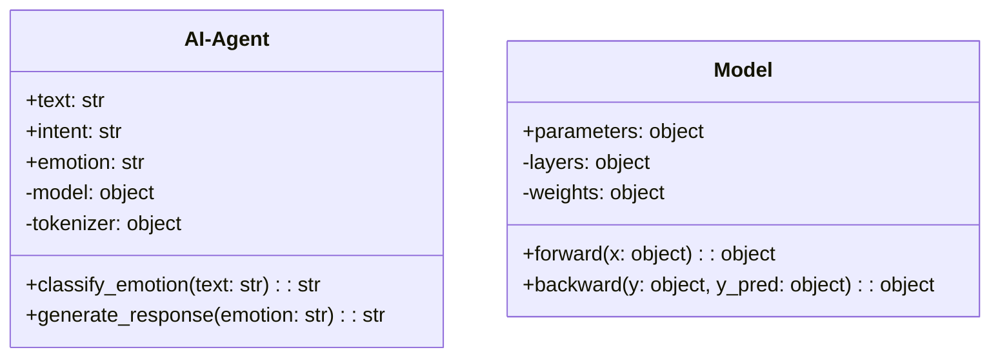

                 


# AI Agent的情感识别与表达能力开发

> 关键词：AI Agent，情感识别，情感表达，深度学习，自然语言处理，人机交互

> 摘要：随着人工智能技术的快速发展，AI Agent在情感识别与表达方面的能力逐渐成为人机交互领域的重要研究方向。本文将从情感识别的基本原理出发，详细探讨其在AI Agent中的应用，结合具体案例分析情感表达的实现方法，最后总结开发过程中的最佳实践和未来发展方向。

---

## 第一部分：AI Agent情感识别与表达的背景介绍

### 第1章：情感识别的背景与重要性

#### 1.1 问题背景
在人机交互中，情感识别技术能够帮助AI Agent理解用户的情感状态，从而提供更加个性化的服务。随着智能设备的普及，用户与AI Agent之间的互动越来越频繁，情感识别的重要性日益凸显。

#### 1.2 问题描述
传统的人机交互主要基于规则和关键词匹配，这种方式难以捕捉用户的深层情感需求。通过情感识别技术，AI Agent能够更好地理解用户的情感，从而提供更智能的服务。

#### 1.3 问题解决
通过深度学习算法，AI Agent可以实时分析用户输入的文本、语音或图像数据，提取情感特征，并生成相应的情感表达。这种技术不仅能够提高用户体验，还能在教育、医疗、客服等领域发挥重要作用。

#### 1.4 边界与外延
情感识别的边界包括数据来源（文本、语音、图像）、情感类别（正面、负面、中性）以及应用场景。外延则扩展到跨模态情感分析和情感生成。

### 第2章：情感表达的核心要素

#### 2.1 情感表达的多样性
情感表达可以通过文本、语音和图像等多种形式实现。例如，AI Agent可以通过调整语气和语速来表达不同的情感。

#### 2.2 情感表达的生成方法
情感表达生成可以基于规则或深度学习模型。基于规则的方法简单但不够灵活，而深度学习方法能够生成更加自然的情感表达。

---

## 第二部分：情感识别与表达的核心概念

### 第3章：情感识别的核心原理

#### 3.1 情感计算的基本原理
情感计算通过分析用户的输入数据，提取情感特征并进行分类。常用的情感分类算法包括支持向量机（SVM）和深度学习模型（如LSTM和Transformer）。

#### 3.2 多模态数据的处理
多模态情感识别结合了文本、语音和图像等多种数据源，能够更全面地捕捉用户的情感状态。例如，结合语音语调和面部表情可以更准确地识别用户的情感。

### 第4章：情感表达的核心要素

#### 4.1 情感表达的生成方法
情感表达生成可以通过预设规则或深度学习模型实现。例如，基于生成对抗网络（GAN）的模型可以生成情感化的文本。

#### 4.2 情感表达的多样性
情感表达可以通过多种方式实现，如调整语调、使用情感词汇等。AI Agent可以根据具体场景选择合适的情感表达方式。

---

## 第三部分：情感识别与表达的算法原理

### 第5章：情感分类算法

#### 5.1 基于深度学习的情感分类模型
深度学习模型如BERT和Transformer在情感分类任务中表现出色。这些模型通过预训练可以快速适应不同的情感分类任务。

#### 5.2 情感分类算法的实现
以下是基于BERT的情感分类实现代码：

```python
from transformers import BertTokenizer, BertModel
import torch

tokenizer = BertTokenizer.from_pretrained('bert-base-uncased')
model = BertModel.from_pretrained('bert-base-uncased')

def classify_emotion(text, model, tokenizer):
    inputs = tokenizer(text, return_tensors='pt')
    with torch.no_grad():
        outputs = model(**inputs)
    last_layer = outputs.last_hidden_state[:, 0, :]
    return last_layer
```

### 第6章：情感表达生成算法

#### 6.1 基于生成对抗网络的情感表达生成
生成对抗网络（GAN）可以用于生成情感化的文本。以下是一个简单的GAN实现示例：

```python
import torch
import torch.nn as nn

class Generator(nn.Module):
    def __init__(self, input_size, hidden_size, output_size):
        super(Generator, self).__init__()
        self.fc = nn.Linear(input_size, hidden_size)
        self.relu = nn.ReLU()
        self.fc2 = nn.Linear(hidden_size, output_size)
        self.sigmoid = nn.Sigmoid()

    def forward(self, x):
        x = self.fc(x)
        x = self.relu(x)
        x = self.fc2(x)
        x = self.sigmoid(x)
        return x

class Discriminator(nn.Module):
    def __init__(self, input_size, hidden_size, output_size):
        super(Discriminator, self).__init__()
        self.fc = nn.Linear(input_size, hidden_size)
        self.relu = nn.ReLU()
        self.fc2 = nn.Linear(hidden_size, output_size)
        self.sigmoid = nn.Sigmoid()

    def forward(self, x):
        x = self.fc(x)
        x = self.relu(x)
        x = self.fc2(x)
        x = self.sigmoid(x)
        return x

# 初始化模型
generator = Generator(100, 256, 1)
discriminator = Discriminator(1, 256, 1)

# 定义损失函数
criterion = nn.BCELoss()

# 定义优化器
optimizer_G = torch.optim.Adam(generator.parameters(), lr=0.001)
optimizer_D = torch.optim.Adam(discriminator.parameters(), lr=0.001)

# 训练过程
for epoch in range(100):
    for _ in range(100):
        # 生成假数据
        noise = torch.randn(64, 100)
        fake = generator(noise)
        
        # 训练判别器
        optimizer_D.zero_grad()
        real = torch.ones(64, 1)
        fake_labels = torch.zeros(64, 1)
        d_real_loss = criterion(discriminator(real), real)
        d_fake_loss = criterion(discriminator(fake), fake_labels)
        d_loss = d_real_loss + d_fake_loss
        d_loss.backward()
        optimizer_D.step()
        
        # 训练生成器
        optimizer_G.zero_grad()
        g_loss = criterion(discriminator(fake), real)
        g_loss.backward()
        optimizer_G.step()
```

---

## 第四部分：系统分析与架构设计

### 第7章：系统功能设计

#### 7.1 领域模型（Mermaid类图）


### 第8章：系统架构设计

#### 8.1 系统架构（Mermaid架构图）
```mermaid
rect angle Top-Level {
    component Data Collector {
        collects text, voice, and image data
    }
    component Preprocessor {
        processes and normalizes data
    }
    component Model {
        performs emotional analysis
    }
    component Postprocessor {
        generates emotional response
    }
}
```

---

## 第五部分：项目实战

### 第9章：环境安装与核心代码实现

#### 9.1 环境安装
安装所需的库：
```bash
pip install transformers torch mermaid4j
```

#### 9.2 核心代码实现
以下是情感识别与表达的实现代码：

```python
import torch
from transformers import BertTokenizer, BertModel

tokenizer = BertTokenizer.from_pretrained('bert-base-uncased')
model = BertModel.from_pretrained('bert-base-uncased')

def get_emotion(text):
    inputs = tokenizer(text, return_tensors='pt')
    with torch.no_grad():
        outputs = model(**inputs)
    last_layer = outputs.last_hidden_state[:, 0, :]
    return last_layer

def generate_response(emotion):
    # 示例：基于情感生成响应
    if emotion == 'positive':
        return "Great to hear! How can I assist you further?"
    elif emotion == 'negative':
        return "I'm sorry to hear that. Let me help you with that."
    else:
        return "Thanks for your message. Here's the information you requested."
```

---

## 第六部分：最佳实践与总结

### 第10章：开发中的注意事项

#### 10.1 注意事项
- 数据质量对情感识别至关重要，需确保数据的多样性和代表性。
- 情感表达的生成需符合上下文，避免生硬。

### 第11章：提高性能的技巧

#### 11.1 技巧
- 使用预训练模型可以显著提高情感识别的性能。
- 结合多模态数据可以提升情感识别的准确性。

### 第12章：拓展阅读

#### 12.1 推荐书籍
- 《Deep Learning》
- 《自然语言处理实战》

#### 12.2 推荐论文
- "BERT: Pre-training of Deep Bidirectional Transformers for Natural Language Processing"
- "Attention Is All You Need"

### 第13章：项目小结

#### 13.1 总结
本文详细介绍了AI Agent的情感识别与表达能力的开发过程，从理论到实践，全面探讨了相关技术。通过具体案例和代码实现，读者可以掌握情感识别与表达的核心方法。

#### 13.2 未来展望
随着深度学习技术的不断进步，情感识别与表达将更加智能化和个性化，为AI Agent的发展提供更多可能性。

---

# 结语

通过本文的详细讲解，读者可以深入了解AI Agent情感识别与表达的能力开发，掌握从理论到实践的全过程。希望本文能为相关领域的研究和开发提供有价值的参考。

