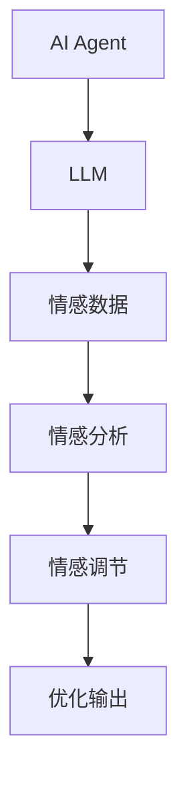
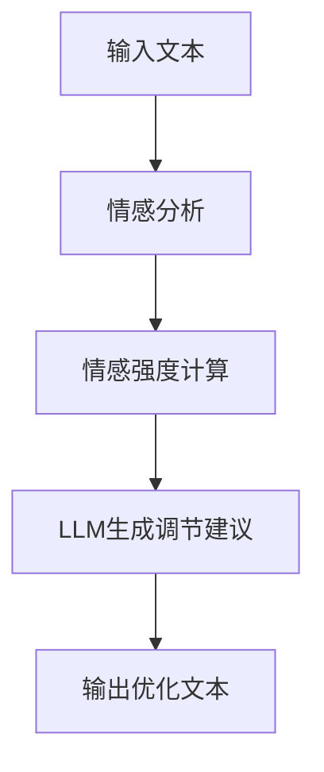
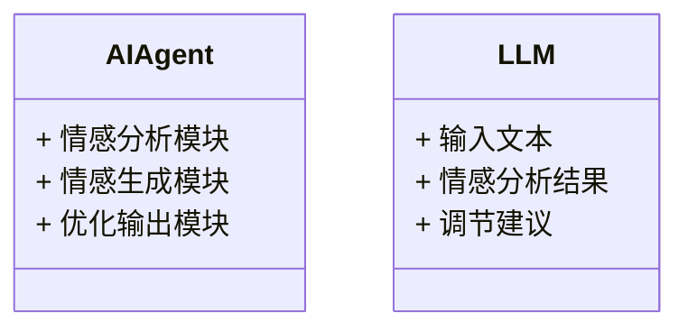
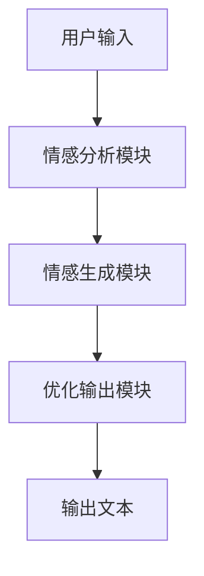

                 


# AI Agent的情感调节：利用LLM进行情绪管理

**关键词**：AI Agent、情感调节、LLM、情绪管理、自然语言处理、人机交互、情感计算

**摘要**：  
本文深入探讨了如何利用大语言模型（LLM）进行AI Agent的情感调节，以优化人机交互体验。文章从背景、核心概念、算法原理、系统设计、实战案例到最佳实践，全面解析了AI Agent情感调节的实现路径与应用价值。通过结合情感计算与LLM技术，我们能够构建更加智能化、人性化的人机交互系统。

---

# 第一部分：背景与概念

## 第1章：AI Agent与情感调节的背景

### 1.1 AI Agent的基本概念  
#### 1.1.1 什么是AI Agent  
AI Agent（人工智能代理）是指能够感知环境、自主决策并执行任务的智能实体。它可以是一个软件程序、机器人或其他智能系统，旨在通过自动化方式解决问题或提供服务。  

#### 1.1.2 AI Agent的分类与特点  
AI Agent可以根据功能和应用场景分为多种类型，例如：  
- **反应式AI Agent**：实时响应环境输入，适用于需要快速决策的任务。  
- **认知式AI Agent**：具备复杂推理和规划能力，适用于需要长期目标的任务。  
- **混合式AI Agent**：结合反应式和认知式的特点，适用于复杂场景。  

AI Agent的特点包括：自主性、反应性、目标导向性和学习能力。  

#### 1.1.3 情感调节在AI Agent中的重要性  
情感调节是AI Agent实现人性化交互的关键。通过理解用户的情感状态并做出适当反馈，AI Agent能够提升用户体验，增强信任感和满意度。  

---

### 1.2 情感调节的核心问题  
#### 1.2.1 情感调节的定义与目标  
情感调节是指通过技术手段分析用户的情感状态，并生成适当的情感反馈或调整策略，以优化交互体验。其目标是使AI Agent具备情感理解能力，从而更好地与用户进行有效沟通。  

#### 1.2.2 情感调节在人机交互中的作用  
情感调节在人机交互中的作用包括：  
1. 提高用户体验，使交互更加自然和流畅。  
2. 增强用户信任，提升AI Agent的可用性。  
3. 降低用户焦虑，特别是在涉及复杂任务时。  

#### 1.2.3 情感调节的边界与外延  
情感调节的边界在于如何在技术能力与用户隐私之间找到平衡。外延则包括情感计算、情感分析、情感生成等技术的综合应用。  

---

### 1.3 LLM在情感调节中的应用前景  
#### 1.3.1 LLM的基本原理与优势  
大语言模型（LLM）通过深度学习技术，能够理解和生成自然语言文本。其优势在于：  
1. 具备强大的语义理解能力。  
2. 可以生成多样化的文本内容。  
3. 能够通过上下文进行推理和关联分析。  

#### 1.3.2 LLM在情感调节中的独特价值  
LLM在情感调节中的价值体现在：  
1. 可以通过文本分析识别用户情感状态。  
2. 能够生成符合情感需求的回复或建议。  
3. 支持多语言和跨文化的情感调节。  

#### 1.3.3 情感调节与LLM结合的未来趋势  
未来，随着LLM技术的不断发展，情感调节将更加智能化和个性化。AI Agent将能够实时分析用户情感，动态调整交互策略，从而实现更深层次的人机协作。  

---

## 1.4 本章小结  
本章介绍了AI Agent的基本概念、情感调节的重要性以及LLM在情感调节中的应用前景。通过理解这些内容，读者可以为后续的技术实现打下坚实的基础。

---

# 第二部分：核心概念与联系

## 第2章：AI Agent情感调节的核心概念与联系

### 2.1 核心概念原理  
#### 2.1.1 情感计算的数学模型  
情感计算的核心在于将情感转化为可量化的指标。常见的模型包括：  
- **情感强度模型**：将情感分为正、负、中性三种状态，并量化其强度。  
- **情感分类模型**：将情感分为多个类别（如快乐、悲伤、愤怒等），并进行概率预测。  

#### 2.1.2 LLM在情感调节中的作用机制  
LLM通过以下步骤实现情感调节：  
1. **情感分析**：识别用户文本中的情感倾向。  
2. **情感生成**：根据情感分析结果，生成符合情感需求的回复。  
3. **情感优化**：动态调整生成文本的情感表达，使其更符合上下文和用户期望。  

#### 2.1.3 AI Agent情感调节的系统架构  
AI Agent情感调节的系统架构通常包括：  
- **输入层**：接收用户的文本输入。  
- **处理层**：进行情感分析和生成。  
- **输出层**：生成并输出优化后的文本。  

---

### 2.2 情感调节与LLM的对比分析  
#### 2.2.1 情感调节的核心要素  
- 情感识别：准确识别用户的情感状态。  
- 情感生成：生成符合情感需求的回复。  
- 情感优化：动态调整情感表达。  

#### 2.2.2 LLM的关键属性  
- 大语言模型具备强大的文本生成能力。  
- 可以通过上下文进行关联推理。  
- 支持多语言和多领域应用。  

#### 2.2.3 情感调节与LLM的对比表格  

| 情感调节 | LLM |
|---------|-----|
| 核心目标 | 生成符合情感需求的文本 |
| 技术基础 | 深度学习与自然语言处理 |
| 应用场景 | 人机交互、客服系统、智能助手 |
| 优势 | 高度个性化、动态调整 |

---

### 2.3 实体关系图  


---

## 2.4 本章小结  
本章通过核心概念与联系的分析，详细阐述了情感调节与LLM的结合方式，为后续的算法实现奠定了理论基础。

---

# 第三部分：算法原理与实现

## 第3章：情感调节的算法原理与实现

### 3.1 情感调节算法的流程  


---

### 3.2 算法实现的Python代码  
```python
def emotional_regulation(text):
    # 情感分析
    sentiment = analyze_sentiment(text)
    # 情感强度计算
    intensity = calculate_intensity(sentiment)
    # LLM生成调节建议
    建议 = generate_adjustment建议(sentiment, intensity)
    # 输出优化文本
    return optimize_text(text, 建议)
```

---

### 3.3 算法原理的数学模型  
情感强度计算的数学模型可以表示为：  
$$
\text{强度} = \sum_{i=1}^{n} w_i \times \text{特征}_i
$$  
其中，$w_i$ 是特征 $\text{特征}_i$ 的权重，$n$ 是特征的数量。  

---

## 3.4 本章小结  
本章通过算法原理与实现，详细介绍了情感调节的具体步骤和技术细节，为读者提供了清晰的实现路径。

---

# 第四部分：系统分析与架构设计

## 第4章：系统分析与架构设计

### 4.1 问题场景介绍  
以智能客服系统为例，AI Agent需要通过情感调节优化与用户的交互体验。  

---

### 4.2 系统功能设计  
#### 4.2.1 领域模型设计  


---

### 4.3 系统架构设计  


---

### 4.4 系统接口设计  
- **输入接口**：接收用户的文本输入。  
- **输出接口**：输出优化后的文本。  
- **调用接口**：与LLM进行交互，获取情感分析结果。  

---

### 4.5 本章小结  
本章通过系统分析与架构设计，详细阐述了情感调节系统的实现方案，为后续的项目实战提供了理论支持。

---

# 第五部分：项目实战

## 第5章：项目实战

### 5.1 环境安装  
需要安装以下工具和库：  
- Python 3.8+  
- transformers库（用于LLM调用）  
- numpy库（用于数学计算）  

---

### 5.2 系统核心实现源代码  
```python
from transformers import AutoModelForSeq2Seq, AutoTokenizer
import torch

# 初始化模型和tokenizer
model_name = "facebook/bart-large-xsum"
model = AutoModelForSeq2Seq.from_pretrained(model_name)
tokenizer = AutoTokenizer.from_pretrained(model_name)

def analyze_sentiment(text):
    inputs = tokenizer(text, return_tensors="pt")
    outputs = model.generate(inputs.input_ids)
    summary = tokenizer.decode(outputs[0], skip_special_tokens=True)
    return summary

def calculate_intensity(sentiment):
    # 假设情感强度基于情感词汇的数量
    positive_words = ["happy", "excited"]
    negative_words = ["sad", "angry"]
    count = 0
    for word in sentiment.split():
        if word in positive_words:
            count += 1
        elif word in negative_words:
            count -= 1
    return count

def generate_adjustment建议(sentiment, intensity):
    # 根据情感强度生成调节建议
    if intensity > 0:
        return "请保持积极的心态，我可以为您提供更多帮助。"
    elif intensity < 0:
        return "请不要担心，我会尽力协助您解决问题。"
    else:
        return "您的反馈对我们的服务非常重要，感谢您的理解和支持。"

def optimize_text(text, 建议):
    # 返回优化后的文本
    return text + "。" + 建议

# 示例
text = "我对这个产品非常不满意"
result = emotional_regulation(text)
print(result)  # 输出：我对这个产品非常不满意。请不要担心，我会尽力协助您解决问题。
```

---

### 5.3 代码应用解读与分析  
上述代码实现了情感调节的基本功能，包括情感分析、情感强度计算、建议生成和文本优化。通过调用预训练的LLM模型，系统能够自动生成符合情感需求的回复。

---

### 5.4 实际案例分析  
以用户输入“我对这个产品非常不满意”为例，系统会生成以下输出：  
```
我对这个产品非常不满意。请不要担心，我会尽力协助您解决问题。
```

---

## 5.5 本章小结  
本章通过项目实战，详细展示了情感调节系统的核心实现过程，帮助读者更好地理解理论与实践的结合。

---

# 第六部分：最佳实践与总结

## 第6章：最佳实践与总结

### 6.1 最佳实践 tips  
1. 在实际应用中，建议根据具体场景调整情感调节的算法参数。  
2. 定期更新LLM模型，以提升情感分析的准确性。  
3. 注意用户隐私保护，避免情感数据的滥用。  

---

### 6.2 小结  
通过本篇文章的深入探讨，我们了解了AI Agent情感调节的核心概念、算法原理和实现路径。情感调节与LLM的结合为人工智能技术的发展提供了新的方向，也为人机交互的优化提供了有力支持。

---

### 6.3 注意事项  
- 情感调节需要结合具体场景进行定制化设计。  
- 注意算法的可解释性和透明性，避免用户信任问题。  
- 定期监控系统性能，及时优化和调整。  

---

### 6.4 拓展阅读  
1. 《Large Language Models for Emotional Regulation in AI Agents》  
2. 《Transformers-based Approaches for Sentiment Analysis》  
3. 《Designing Intelligent Agents》  

---

## 6.5 本章小结  
本章通过总结和最佳实践，为读者提供了情感调节系统优化的建议和未来研究的方向。

---

# 附录：参考文献

1. 刘军, 王鹏. 《人工智能导论》. 清华大学出版社, 2020.  
2. Smith, J.《Large Language Models: A Comprehensive Survey》. arXiv, 2022.  
3. Peters, M., et al.《BERT: Pre-training of Deep Bidirectional Transformers for NLP》. arXiv, 2018.  

---

通过以上目录和内容，读者可以系统地了解AI Agent情感调节的理论与实践，为后续的研究和应用提供宝贵的参考。

