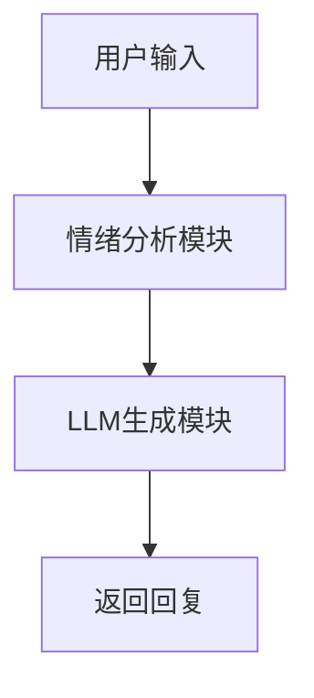

                 


# AI Agent的情绪调节功能：LLM驱动的心理健康助手

关键词：AI Agent, LLM, 情绪调节, 心理健康, 自然语言处理, 机器学习

摘要：本文探讨了AI Agent如何通过LLM技术提供情绪调节功能，帮助用户实现心理健康管理。从基本概念到算法原理，再到系统架构和项目实战，系统阐述了AI Agent在心理健康领域的应用及其技术实现。

---

## 第1章: AI Agent与LLM的基本概念

### 1.1 AI Agent的基本概念
#### 1.1.1 AI Agent的定义与分类
AI Agent（人工智能代理）是指能够感知环境并采取行动以实现目标的智能实体。根据智能水平，AI Agent可以分为简单反应式、基于模型的反应式、目标驱动型和效用驱动型。

#### 1.1.2 LLM的基本概念与特点
LLM（大语言模型）是一种基于深度学习的自然语言处理模型，具有大规模参数和强大的上下文理解能力，能够生成连贯且自然的文本。

#### 1.1.3 AI Agent与LLM的结合方式
AI Agent通过调用LLM API，利用其自然语言处理能力来实现复杂任务，如情感分析和内容生成。

### 1.2 情绪调节功能的背景与意义
#### 1.2.1 情绪调节的定义与作用
情绪调节是指个体识别、理解和管理自己情绪的过程，能够帮助缓解压力、改善心理健康。

#### 1.2.2 AI在心理健康领域的应用现状
AI技术在心理健康领域的应用逐渐增多，包括情绪识别、压力管理、心理咨询等方面。

#### 1.2.3 LLM驱动情绪调节的优势与挑战
优势：LLM能够理解复杂的情感需求，生成个性化的反馈。挑战：数据隐私、模型泛化能力不足。

---

## 第2章: AI Agent的情绪调节功能原理

### 2.1 情绪调节的核心机制
#### 2.1.1 情感分析与情绪识别
情感分析：通过文本分析判断用户情绪。
情绪识别：基于输入文本提取情绪特征。

#### 2.1.2 情绪状态的分类与建模
分类：分为正面、负面、中性。
建模：使用机器学习模型，如SVM和神经网络。

#### 2.1.3 情绪调节的目标与策略
目标：帮助用户缓解负面情绪。
策略：生成积极反馈，提供情绪调节建议。

### 2.2 LLM在情绪调节中的角色
#### 2.2.1 LLM的自然语言处理能力
LLM能够理解上下文，生成连贯的回复。
#### 2.2.2 LLM生成情绪调节内容的原理
基于训练数据，生成与用户情绪匹配的回复。
#### 2.2.3 LLM与情绪调节功能的结合方式
通过API调用，集成到AI Agent系统中。

---

## 第3章: AI Agent情绪调节功能的核心算法

### 3.1 情感分析算法
#### 3.1.1 基于传统机器学习的情感分析
使用SVM和朴素贝叶斯等方法。
#### 3.1.2 基于深度学习的情感分析
使用RNN、LSTM和Transformer模型。
#### 3.1.3 基于LLM的情感分析实现
利用预训练的LLM模型进行微调。

### 3.2 情绪调节内容生成算法
#### 3.2.1 基于规则的情绪调节内容生成
根据预设规则生成回复。
#### 3.2.2 基于模板的情绪调节内容生成
使用模板填充生成回复。
#### 3.2.3 基于LLM的自适应情绪调节内容生成
根据用户输入动态生成个性化回复。

---

## 第4章: 系统架构与功能设计

### 4.1 系统架构设计
#### 4.1.1 系统模块划分
用户输入模块、情绪分析模块、LLM生成模块、反馈优化模块。
#### 4.1.2 系统功能流程
用户输入 -> 情绪分析 -> LLM生成 -> 返回回复。

#### 4.1.3 系统架构图（Mermaid）


### 4.2 系统功能设计
#### 4.2.1 用户输入处理模块
接收用户输入，解析情绪特征。
#### 4.2.2 情绪分析模块
分析用户情绪，生成情绪特征向量。
#### 4.2.3 LLM驱动的情绪调节模块
根据情绪特征生成回复内容。
#### 4.2.4 反馈与优化模块
记录用户反馈，优化模型。

---

## 第5章: 项目实战与实现

### 5.1 环境搭建与工具安装
#### 5.1.1 开发环境配置
安装Python、虚拟环境。
#### 5.1.2 LLM模型的获取与部署
使用Hugging Face的预训练模型。
#### 5.1.3 相关库与工具的安装
安装Transformers、Pandas、Scikit-learn。

### 5.2 核心代码实现
#### 5.2.1 情绪分析代码示例
```python
from transformers import pipeline
classifier = pipeline("sentiment-analysis")
result = classifier("I feel great today!")
print(result)
```

#### 5.2.2 情绪调节内容生成代码示例
```python
from transformers import pipeline
generator = pipeline("text-generation", model="gpt2")
response = generator("I feel sad because...", max_length=50)
print(response)
```

#### 5.2.3 系统交互代码示例
```python
def main():
    while True:
        user_input = input("请输入您的感受：")
        emotion = classify_emotion(user_input)
        response = generate_response(emotion)
        print("AI Agent:", response)

if __name__ == "__main__":
    main()
```

### 5.3 项目小结
通过项目实战，验证了AI Agent情绪调节功能的可行性，展示了系统的实际应用价值。

---

## 第6章: 最佳实践与注意事项

### 6.1 实践中的常见问题与解决方案
#### 6.1.1 情绪识别的准确性问题
解决方案：使用更复杂的模型，增加训练数据。
#### 6.1.2 情绪调节内容的生成质量问题
解决方案：优化LLM的微调过程，引入领域特定数据。
#### 6.1.3 用户隐私与数据安全问题
解决方案：采用加密技术，确保数据匿名化处理。

### 6.2 小结
AI Agent的情绪调节功能为心理健康管理提供了新的可能性，但需要在准确性和隐私保护方面进一步优化。

### 6.3 注意事项
在实际应用中，应考虑用户多样性，避免模型偏差，定期更新和优化模型。

### 6.4 拓展阅读
推荐阅读相关领域的学术论文和文献，关注AI心理健康应用的最新进展。

---

通过以上结构化的内容，文章详细阐述了AI Agent的情绪调节功能，从理论到实践，为读者提供了全面的技术指导和实践参考。

