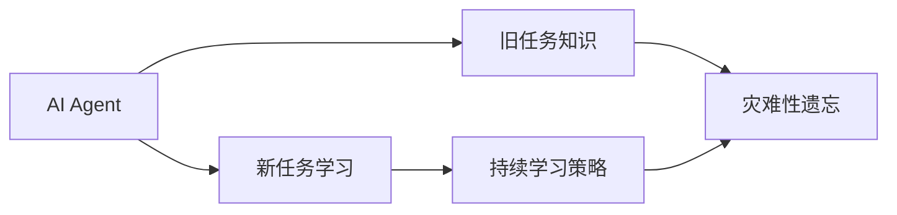

                 

# AI Agent的持续学习与灾难性遗忘防御

> 关键词：AI Agent，持续学习，灾难性遗忘，神经网络，机器学习，模型优化

> 摘要：本文深入探讨了AI Agent在持续学习过程中面临的灾难性遗忘问题，并提出了防御策略。通过分析神经网络的特性，结合具体算法和系统设计，本文为解决持续学习中的知识遗忘问题提供了理论支持和实践指导。

---

# 第一部分: AI Agent的持续学习与灾难性遗忘背景

## 第1章: 问题背景与概念

### 1.1 问题背景介绍

#### 1.1.1 AI Agent的持续学习需求
AI Agent需要在动态环境中不断学习新任务，同时保持对旧任务的记忆和能力。这种持续学习能力是实现通用AI的重要基础。

#### 1.1.2 灾难性遗忘的定义与问题
灾难性遗忘指神经网络在学习新任务时，忘记旧任务知识的现象。这严重影响了AI Agent的持续学习能力。

#### 1.1.3 持续学习与灾难性遗忘的关系
持续学习的目标是在新旧任务间找到平衡，而灾难性遗忘是实现这一目标的主要障碍。

### 1.2 核心概念与问题描述

#### 1.2.1 AI Agent的定义与特征
AI Agent是具备自主决策和学习能力的智能体，需在复杂环境中完成多种任务。

#### 1.2.2 灾难性遗忘的形成机制
神经网络在优化新任务时，参数更新导致旧任务性能下降，从而引发灾难性遗忘。

#### 1.2.3 持续学习的目标与挑战
目标是实现零样本或小样本学习，挑战包括任务间依赖、模型容量限制等。

### 1.3 问题解决与边界

#### 1.3.1 持续学习的解决方案概述
通过权重保持、任务分离、梯度约束等方法，防止灾难性遗忘。

#### 1.3.2 灾难性遗忘防御的边界与限制
探讨方法的有效性、计算效率和模型容量限制。

#### 1.3.3 相关问题的外延与联系
分析迁移学习、终身学习等领域的关联性。

## 第2章: 核心概念与联系

### 2.1 核心概念原理

#### 2.1.1 持续学习的基本原理
通过逐步学习任务序列，更新模型参数，同时保持对旧任务的记忆。

#### 2.1.2 灾难性遗忘的形成机制
模型参数更新导致旧任务权重被稀释，任务间干扰加剧。

#### 2.1.3 两者之间的相互作用
持续学习需要在新旧任务间权衡，灾难性遗忘影响学习效果。

### 2.2 概念对比与特征分析

#### 2.2.1 持续学习与传统学习的对比
| 特性 | 持续学习 | 传统学习 |
|------|----------|----------|
| 数据 | 流式数据 | 批处理数据 |
| 任务 | 多任务 | 单任务 |
| 模型 | 动态调整 | 静态 |

#### 2.2.2 灾难性遗忘与其他遗忘形式的对比
| 类型 | 内容遗忘 | 灾难性遗忘 |
|------|----------|------------|
| 特性 | 随机遗忘 | 任务间干扰引发 |

#### 2.2.3 核心特征的总结与表格对比
总结持续学习与灾难性遗忘的关键特征，并通过对比表格强化理解。

### 2.3 实体关系图

---

# 第二部分: 持续学习与灾难性遗忘的算法原理

## 第3章: 基础算法原理

### 3.1 基本算法概述

#### 3.1.1 现状回顾与分类
介绍持续学习算法的分类，包括基于权重的、基于网络结构的和基于记忆的防御方法。

#### 3.1.2 常见算法
| 算法名称 | 描述 |
|----------|------|
| EWC | 基于权重的重要性评估，限制关键参数变化 |
| Synaptic Intelligence | 动态调整权重更新，防止遗忘 |
| LwF | 利用知识蒸馏和经验重放缓解遗忘 |

---

通过以上结构，我们可以逐步展开每个部分的内容，确保逻辑清晰，内容详实。接下来，每个章节将按照这一逻辑进行详细阐述，确保读者能够系统地理解和掌握AI Agent的持续学习与灾难性遗忘防御的核心内容。

