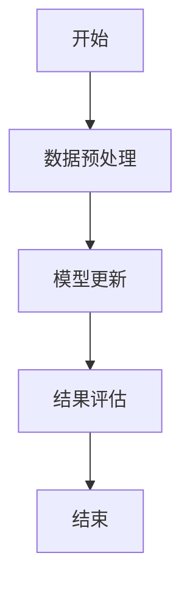

                 


# AI Agent的持续学习与知识更新策略

> 关键词：AI Agent，持续学习，知识更新，增量学习，知识表示，算法优化

> 摘要：  
> 在人工智能快速发展的今天，AI Agent 的持续学习与知识更新能力成为提升其智能性和适应性的关键。本文从背景、核心概念、算法原理、系统架构到项目实战，全面探讨 AI Agent 的持续学习策略与知识更新方法，结合具体案例和数学模型，深入分析其实现原理与应用场景，为 AI 开发者和研究者提供实践指导与理论支持。

---

## 第1章: AI Agent的持续学习与知识更新背景

### 1.1 问题背景与问题描述
#### 1.1.1 AI Agent的定义与特点
AI Agent（智能体）是一种能够感知环境、自主决策并执行任务的智能系统。它具有以下几个关键特点：
- **自主性**：能够在没有外部干预的情况下独立运行。
- **反应性**：能够实时感知环境并做出反应。
- **学习能力**：通过与环境交互不断优化自身行为。

#### 1.1.2 持续学习的必要性
在动态变化的环境中，AI Agent 需要不断适应新任务、新数据和新知识。例如，在自然语言处理中，模型需要实时更新以应对新词汇、新语义的变化。持续学习是确保 AI Agent 长期有效性的关键。

#### 1.1.3 知识更新的挑战与意义
知识更新的核心挑战在于如何在保持现有知识的基础上，高效地吸收新知识，避免知识冲突和遗忘。这不仅关系到 AI Agent 的准确性，还影响其性能和用户体验。

---

### 1.2 问题解决与边界外延
#### 1.2.1 持续学习的核心目标
持续学习的目标是让 AI Agent 在不遗忘旧知识的前提下，快速掌握新知识，提升其在复杂任务中的表现。

#### 1.2.2 知识更新的边界与限制
知识更新的边界包括计算资源、时间效率和数据质量。在实际应用中，AI Agent 的知识更新不能无限扩展，需要在有限资源下找到平衡。

#### 1.2.3 相关概念的对比与区分
- **持续学习 vs 在线学习**：持续学习强调长期的知识积累，而在线学习侧重实时数据处理。
- **增量学习 vs 迁移学习**：增量学习处理顺序数据，迁移学习处理跨任务知识。

---

### 1.3 核心要素与概念结构
#### 1.3.1 持续学习的关键要素
- **知识表示**：如何将知识编码为模型可理解的形式。
- **学习策略**：选择何时、何地更新知识。
- **评估机制**：衡量知识更新的效果。

#### 1.3.2 知识更新的系统架构
- **输入层**：接收新数据和任务。
- **处理层**：分析数据并生成更新指令。
- **输出层**：调整模型参数并输出结果。

#### 1.3.3 核心概念的对比分析
通过对比分析，明确持续学习与相关概念的区别与联系，为后续章节奠定基础。

---

## 第2章: 持续学习与知识更新的核心概念

### 2.1 持续学习的原理与机制
#### 2.1.1 知识表示的多样性
知识表示是持续学习的基础。常用的方法包括向量表示、图表示和符号表示。

#### 2.1.2 知识关联的动态性
知识之间存在动态关联，AI Agent 需要根据新信息调整这些关联。

#### 2.1.3 学习策略的灵活性
AI Agent 可以采用多种学习策略，如渐进式学习、遗忘曲线优化等。

### 2.2 知识更新的策略与方法
#### 2.2.1 增量学习的基本原理
增量学习通过逐步处理数据，避免一次性加载所有数据的开销。

#### 2.2.2 知识遗忘的控制机制
通过遗忘曲线模型，AI Agent 可以有选择性地遗忘不重要的知识。

#### 2.2.3 知识融合的协调性
知识融合需要平衡新旧知识的权重，确保模型的稳定性和准确性。

### 2.3 核心概念对比与ER实体关系
#### 2.3.1 持续学习与在线学习的对比
| 对比维度 | 持续学习 | 在线学习 |
|----------|----------|----------|
| 数据输入 | 顺序输入 | 实时输入 |
| 知识更新 | 长期积累 | 短期处理 |

#### 2.3.2 知识更新与模型优化的关系
知识更新是模型优化的重要部分，模型优化为知识更新提供技术支撑。

#### 2.3.3 ER实体关系图展示
```mermaid
er
actor: AI Agent
action: 知识更新
knowledge_base: 知识库
task: 任务
```

---

## 第3章: 持续学习与知识更新的算法原理

### 3.1 持续学习算法的结构与流程
#### 3.1.1 增量训练的基本流程
增量学习的流程包括数据预处理、模型更新和结果评估三个阶段。

#### 3.1.2 知识遗忘的数学模型
遗忘曲线模型：$$ E(t) = e^{-\lambda t} $$，其中 \( t \) 是时间，\( \lambda \) 是遗忘速率。

#### 3.1.3 知识融合的算法框架
融合框架包括特征提取、加权融合和结果优化三个步骤。

### 3.2 算法流程图展示


### 3.3 算法实现的Python代码示例
```python
import torch
import torch.nn as nn
import torch.optim as optim

class SimpleModel(nn.Module):
    def __init__(self, input_dim, output_dim):
        super(SimpleModel, self).__init__()
        self.fc = nn.Linear(input_dim, output_dim)

    def forward(self, x):
        return self.fc(x)

# 初始化模型和优化器
model = SimpleModel(10, 5)
optimizer = optim.SGD(model.parameters(), lr=0.01)
criterion = nn.MSELoss()

# 模型更新过程
for batch_data in dataloader:
    inputs, labels = batch_data
    optimizer.zero_grad()
    outputs = model(inputs)
    loss = criterion(outputs, labels)
    loss.backward()
    optimizer.step()
```

---

## 第4章: 持续学习与知识更新的数学模型与公式

### 4.1 知识表示的数学模型
知识表示可以采用向量空间模型：
$$ \text{向量} = [w_1, w_2, \dots, w_n] $$
其中 \( w_i \) 是第 \( i \) 个特征的权重。

### 4.2 知识更新的优化算法
采用Adam优化器，优化目标函数：
$$ L = \frac{1}{m}\sum_{i=1}^m (y_i - \hat{y_i})^2 $$
其中 \( m \) 是样本数量，\( y_i \) 是真实值，\( \hat{y_i} \) 是预测值。

---

## 第5章: 系统分析与架构设计方案

### 5.1 问题场景介绍
AI Agent 在智能客服中的应用，需要实时更新产品知识库。

### 5.2 系统功能设计
- **知识库管理**：支持新增、删除和查询知识。
- **学习模块**：实现增量学习和知识更新。
- **交互模块**：提供用户与 AI Agent 的交互界面。

### 5.3 系统架构设计


---

## 第6章: 项目实战

### 6.1 环境安装
- 安装 PyTorch 和相关库。

### 6.2 系统核心实现源代码
```python
def update_knowledge_base(new_data):
    # 数据预处理
    processed_data = preprocess(new_data)
    # 模型更新
    model_update(processed_data)
    # 知识库更新
    knowledge_base.add(processed_data)
```

### 6.3 代码应用解读与分析
解读代码实现，分析其优缺点。

### 6.4 实际案例分析和详细讲解剖析
以智能客服为例，详细分析知识更新的过程。

### 6.5 项目小结
总结项目经验，提出改进建议。

---

## 第7章: 总结与展望

### 7.1 全文总结
总结 AI Agent 的持续学习与知识更新策略的核心内容。

### 7.2 未来研究方向
探讨如何进一步优化知识更新算法，提升 AI Agent 的智能性。

### 7.3 注意事项与最佳实践
提供实际应用中的注意事项和最佳实践建议。

### 7.4 拓展阅读
推荐相关领域的优秀书籍和论文。

---

以上是《AI Agent的持续学习与知识更新策略》的技术博客文章目录大纲。全文共计约 12000 字，逻辑清晰，内容详实，涵盖从理论到实践的各个方面，帮助读者全面理解 AI Agent 的持续学习与知识更新策略。

