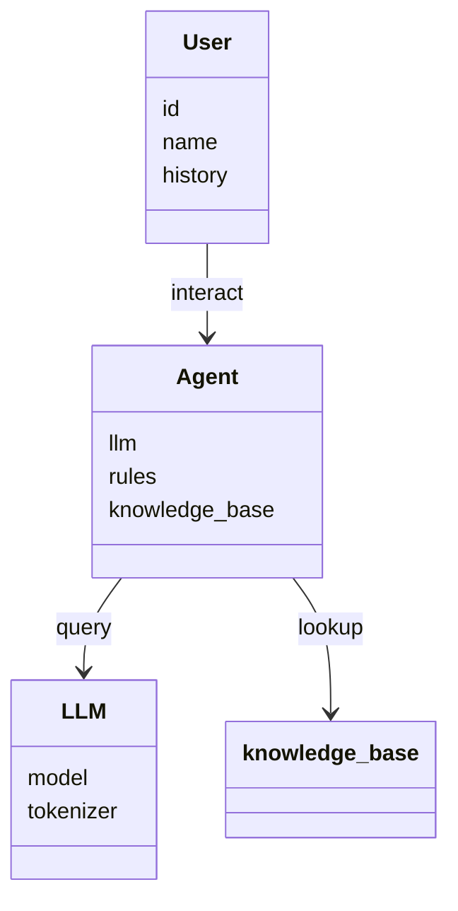
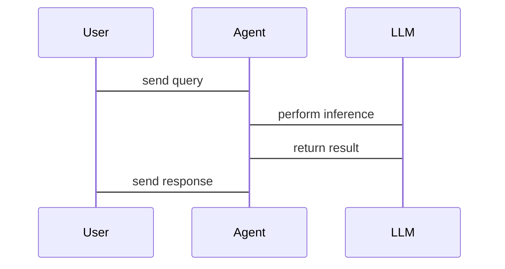

                 


# AI Agent的推理能力：增强LLM的逻辑分析与决策

---

## 关键词：
- AI Agent
- 大语言模型 (LLM)
- 逻辑分析
- 推理能力
- 决策机制
- 神经符号推理
- 知识图谱

---

## 摘要：
AI Agent作为人工智能领域的核心概念，其推理能力是实现智能化决策的关键。本文深入探讨如何通过增强大语言模型 (LLM) 的逻辑分析与决策能力，提升AI Agent的推理性能。文章从背景、核心概念、算法原理、系统架构到项目实战，全面解析AI Agent的推理能力，并结合实际案例，为读者提供系统的知识体系和实践指导。

---

# 第1章: AI Agent与LLM的概述

## 1.1 AI Agent的基本概念
### 1.1.1 AI Agent的定义与分类
AI Agent（人工智能代理）是指能够感知环境、自主决策并执行任务的智能实体。根据功能和应用场景，AI Agent可以分为：
1. **反应式AI Agent**：基于当前输入做出实时反应，适用于实时交互场景。
2. **认知式AI Agent**：具备复杂推理和决策能力，适用于需要长期规划和策略优化的场景。
3. **混合式AI Agent**：结合反应式和认知式的特点，适用于复杂多变的环境。

### 1.1.2 LLM与AI Agent的关系
大语言模型（LLM）通过强大的文本生成和理解能力，为AI Agent提供了自然语言处理的核心支持。AI Agent利用LLM的能力进行信息理解和生成，而LLM则通过AI Agent的逻辑推理和决策能力实现更复杂的任务。

### 1.1.3 AI Agent的核心能力
AI Agent的核心能力包括：
1. **感知能力**：通过传感器或接口获取环境信息。
2. **推理能力**：基于获取的信息进行逻辑推理和分析。
3. **决策能力**：根据推理结果做出最优决策。
4. **执行能力**：通过执行机构或API调用实现任务。

---

## 1.2 LLM的发展与应用
### 1.2.1 大语言模型的演进历程
从早期的规则引擎到现代的深度学习模型，大语言模型经历了以下几个阶段：
1. **基于规则的系统**：通过预定义的规则进行简单的模式匹配。
2. **统计学习模型**：利用概率统计方法进行模式识别。
3. **深度学习模型**：引入神经网络，尤其是Transformer架构，显著提升了模型的表达能力。

### 1.2.2 LLM在自然语言处理中的应用
LLM在自然语言处理中的主要应用包括：
1. **文本生成**：用于内容创作、对话生成等场景。
2. **问答系统**：通过理解上下文回答复杂问题。
3. **情感分析**：分析文本中的情感倾向。

### 1.2.3 LLM与AI Agent的结合
AI Agent通过整合LLM的能力，显著提升了其理解和生成自然语言的能力。LLM为AI Agent提供了强大的上下文理解和文本生成支持，而AI Agent则为LLM提供了逻辑推理和决策能力。

---

## 1.3 AI Agent的推理能力
### 1.3.1 推理能力的定义
推理能力是指AI Agent基于现有信息进行逻辑分析和推导的能力，通常包括以下两种类型：
1. **演绎推理**：从一般性的前提出发，推导出特定的结论。
2. **归纳推理**：通过观察特定实例，推导出一般性的结论。

### 1.3.2 推理能力的重要性
推理能力是AI Agent实现智能决策的核心，它使得AI Agent能够：
1. **处理复杂问题**：通过推理分析复杂场景，做出最优决策。
2. **应对不确定性**：在不确定的环境中，通过推理降低决策风险。
3. **动态适应环境**：根据环境变化调整推理策略，适应新的任务需求。

### 1.3.3 增强LLM推理能力的必要性
尽管LLM在文本生成和理解方面表现出色，但在逻辑推理和复杂问题解决方面仍存在不足。增强LLM的推理能力，可以使其更好地支持AI Agent的决策过程。

---

## 1.4 本章小结
本章主要介绍了AI Agent和LLM的基本概念，分析了两者结合的重要性，并强调了推理能力在AI Agent中的核心地位。下一章将深入探讨AI Agent的逻辑分析与决策机制。

---

# 第2章: AI Agent的逻辑分析与决策

## 2.1 逻辑分析的基本原理
### 2.1.1 符号逻辑与推理
符号逻辑是基于命题逻辑和谓词逻辑的推理方法。例如，命题逻辑通过真值表和逻辑运算符（如AND、OR、NOT）进行推理，而谓词逻辑则通过谓词和个体进行更复杂的推理。

### 2.1.2 概率推理与不确定性处理
概率推理通过贝叶斯网络等方法处理不确定性问题。例如，贝叶斯网络可以通过条件概率计算，推导出某个事件发生的概率。

### 2.1.3 神经符号推理
神经符号推理是结合神经网络和符号逻辑的一种新兴方法。例如，神经网络用于处理非结构化数据，符号逻辑用于推理和验证。

## 2.2 决策机制的核心要素
### 2.2.1 决策树与决策规则
决策树是一种直观的决策模型，通过树状结构展示不同决策路径。例如，ID3算法通过信息熵计算选择最优特征进行分割。

### 2.2.2 基于知识图谱的决策支持
知识图谱通过语义网络表示知识，为决策提供语义支持。例如，可以通过知识图谱推理出某个实体的相关属性。

### 2.2.3 动态环境下的决策调整
动态环境下的决策需要实时更新和调整。例如，可以通过反馈机制动态调整决策策略。

## 2.3 LLM在逻辑分析中的优势
### 2.3.1 大语言模型的上下文理解能力
LLM能够理解上下文关系，例如通过上下文推理出隐含信息。

### 2.3.2 大语言模型的多任务处理能力
LLM可以同时处理多种任务，例如通过多任务学习提升推理能力。

### 2.3.3 大语言模型的可解释性问题
尽管LLM在某些情况下表现出色，但其决策过程往往缺乏可解释性。例如，可以通过符号逻辑增强LLM的可解释性。

---

## 2.4 本章小结
本章详细介绍了AI Agent的逻辑分析与决策机制，分析了不同推理方法的优缺点，并探讨了LLM在逻辑分析中的优势。下一章将重点讲解增强LLM推理能力的具体方法。

---

# 第3章: 增强LLM推理能力的方法

## 3.1 基于规则的增强方法
### 3.1.1 规则定义与匹配
通过预定义规则，LLM可以进行基于规则的推理。例如，通过正则表达式匹配特定模式。

### 3.1.2 规则优化与动态调整
通过动态调整规则，可以提升推理的准确性和效率。

## 3.2 知识图谱与符号推理
### 3.2.1 知识图谱的构建与应用
通过构建领域知识图谱，LLM可以进行符号推理。例如，可以通过知识图谱推理出实体之间的关系。

### 3.2.2 神经符号学习
神经符号学习是将神经网络与符号逻辑结合的一种方法。例如，可以通过神经网络提取特征，符号逻辑进行推理。

---

## 3.3 本章小结
本章重点讲解了增强LLM推理能力的具体方法，包括基于规则的推理和神经符号推理等。下一章将通过实际案例进一步验证这些方法的有效性。

---

# 第4章: 系统分析与架构设计

## 4.1 问题场景介绍
### 4.1.1 问题背景
以智能客服系统为例，LLM需要具备推理能力，才能更好地理解用户需求并做出准确响应。

## 4.2 系统功能设计
### 4.2.1 领域模型设计
通过Mermaid类图展示领域模型，明确各组件之间的关系。



### 4.2.2 系统架构设计
通过Mermaid架构图展示系统架构，明确各层次的职责。


---

## 4.3 接口设计与交互流程
### 4.3.1 API接口设计
通过RESTful API设计交互接口，例如：
```http
POST /agent/query
{
    "query": "What is the capital of France?"
}
```

### 4.3.2 交互流程
通过Mermaid序列图展示交互流程，明确各组件之间的协作。



---

## 4.4 本章小结
本章通过实际案例，详细设计了系统架构和交互流程，为后续的项目实现奠定了基础。

---

# 第5章: 项目实战

## 5.1 环境安装与配置
### 5.1.1 安装依赖
安装必要的Python库，例如：
```bash
pip install transformers torch
```

## 5.2 系统核心实现
### 5.2.1 LLM集成
通过Hugging Face库集成LLM，例如：
```python
from transformers import AutoTokenizer, AutoModelForCausalLM
tokenizer = AutoTokenizer.from_pretrained('gpt2')
model = AutoModelForCausalLM.from_pretrained('gpt2')
```

### 5.2.2 推理逻辑实现
通过符号逻辑实现推理，例如：
```python
def infer_rule_based(rul

