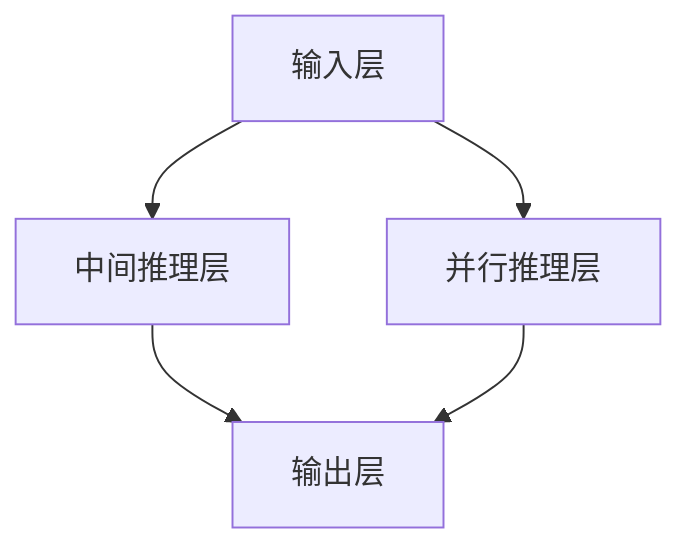
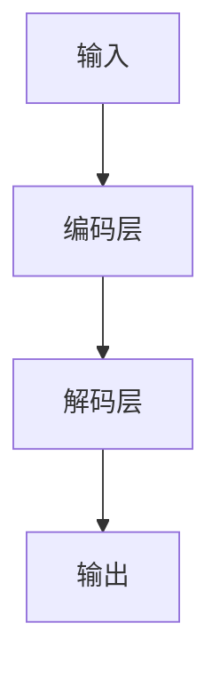
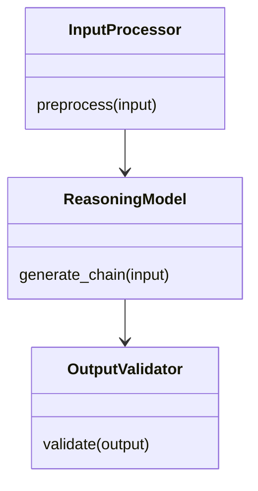
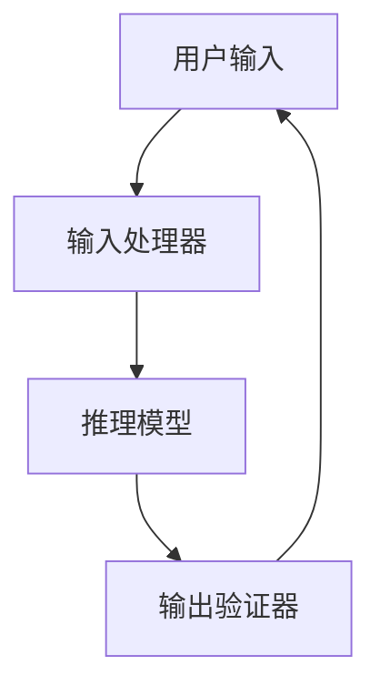

                 


# AI Agent的推理链生成：增强LLM的逐步思考能力

> 关键词：AI Agent，LLM，推理链，逐步思考能力，生成式模型，数学模型，系统架构

> 摘要：AI Agent通过生成推理链，能够增强大语言模型（LLM）的逐步思考能力，使其在复杂问题中表现更出色。本文将从背景介绍、核心概念、算法原理、系统架构、项目实战等多方面详细探讨AI Agent推理链生成的原理与实践。

---

# 第1章: AI Agent与LLM的背景介绍

## 1.1 AI Agent的基本概念

### 1.1.1 AI Agent的定义
AI Agent（人工智能代理）是指能够感知环境并采取行动以实现目标的智能实体。它可以是一个软件程序，也可以是硬件设备，其核心目标是通过自主决策和问题解决来完成特定任务。

### 1.1.2 AI Agent的核心特点
- **自主性**：能够自主决策，无需外部干预。
- **反应性**：能够实时感知环境并做出反应。
- **目标导向性**：所有行动都围绕特定目标展开。
- **学习能力**：通过数据和经验不断优化自身性能。

### 1.1.3 AI Agent与传统程序的区别
传统程序依赖预定义规则，而AI Agent具备学习和推理能力，能够适应新场景并解决问题。

---

## 1.2 LLM的基本原理

### 1.2.1 大语言模型的定义
LLM（Large Language Model）是一种基于深度学习的自然语言处理模型，能够理解和生成人类语言。

### 1.2.2 LLM的主要技术特点
- **基于神经网络**：通常采用Transformer架构。
- **大规模数据训练**：通过海量数据训练，模型能够捕捉语言模式。
- **生成式能力**：能够生成连贯的文本内容。

### 1.2.3 LLM的应用场景
- **文本生成**：新闻、文章、诗歌等。
- **对话系统**：智能客服、聊天机器人。
- **自动摘要**：信息提取和总结。

---

## 1.3 推理链生成的重要性

### 1.3.1 推理链的定义
推理链是指从输入到输出的逻辑推理过程，每一步推理都基于前一步的结果。

### 1.3.2 推理链在LLM中的作用
- **提升准确性**：通过逐步推理，减少错误。
- **增强可解释性**：每一步推理都可追踪。
- **复杂问题解决**：适用于需要多步推理的任务。

### 1.3.3 推理链生成的挑战
- **计算复杂度**：多步推理需要更多计算资源。
- **模型限制**：模型可能无法捕捉所有逻辑关系。
- **动态环境适应**：推理链需要灵活调整以适应变化。

---

## 1.4 本章小结
本章介绍了AI Agent和LLM的基本概念，并强调了推理链生成在增强LLM能力中的重要性。接下来将深入探讨推理链的结构与类型。

---

# 第2章: AI Agent的推理链结构

## 2.1 推理链的基本构成

### 2.1.1 输入层
- **输入数据**：原始问题或数据。
- **输入处理**：对输入数据进行预处理和解析。

### 2.1.2 中间推理层
- **推理步骤**：每一步推理都基于前一步的结果。
- **逻辑关系**：推理链中的逻辑关系需要清晰定义。

### 2.1.3 输出层
- **输出结果**：最终的推理结果。
- **结果验证**：验证结果是否符合预期。

---

## 2.2 推理链的类型

### 2.2.1 单层推理链
- **定义**：只有一个推理步骤。
- **特点**：简单直接，适用于简单问题。

### 2.2.2 多层推理链
- **定义**：包含多个推理步骤。
- **特点**：适用于复杂问题，能够逐步细化推理过程。

### 2.2.3 并行推理链
- **定义**：多个推理步骤同时进行。
- **特点**：适用于需要多维度分析的任务。

---

## 2.3 推理链的属性对比

### 2.3.1 类型对比表

| 类型     | 输入层 | 中间推理层 | 输出层 |
|----------|--------|------------|--------|
| 单层推理链 | 简单输入 | 一步推理 | 简单输出 |
| 多层推理链 | 复杂输入 | 多步推理 | 细化输出 |
| 并行推理链 | 多维度输入 | 多步骤并行推理 | 综合输出 |

### 2.3.2 层级对比表

| 层级     | 特点             |
|----------|----------------|
| 输入层   | 数据预处理       |
| 中间推理层 | 多步推理         |
| 输出层   | 结果验证         |

### 2.3.3 效率对比表

| 类型     | 效率特点       |
|----------|---------------|
| 单层推理链 | 高效，但简单   |
| 多层推理链 | 效率较低，但精确 |
| 并行推理链 | 效率中等，结果全面 |

---

## 2.4 推理链的实体关系图



---

## 2.5 本章小结
本章详细介绍了推理链的基本构成、类型及其属性对比。接下来将探讨如何通过算法生成推理链。

---

# 第3章: 推理链生成的算法原理

## 3.1 生成式模型的工作流程

### 3.1.1 生成式模型的定义
生成式模型是一种能够生成新数据的模型，广泛应用于文本生成、图像生成等领域。

### 3.1.2 生成式模型的流程



---

## 3.2 推理链生成的算法实现

### 3.2.1 基于Transformer的推理链生成

```python
def generate_reasoning_chain(input_text):
    # 输入处理
    processed_input = preprocess(input_text)
    # 推理过程
    reasoning_steps = []
    for step in range(max_steps):
        # 每一步推理
        output = model.generate(processed_input)
        reasoning_steps.append(output)
        # 更新输入
        processed_input = output
    return reasoning_steps
```

### 3.2.2 数学模型与概率分布

$$ P(y|x) = \frac{1}{\sqrt{2\pi\sigma^2}} e^{-\frac{(y-\mu)^2}{2\sigma^2}} $$

---

## 3.3 算法优化与实现

### 3.3.1 基于动态规划的推理链优化

```python
def optimize_reasoning_chain(input_text):
    # 初始化状态
    state = initial_state(input_text)
    # 动态规划过程
    for step in range(max_steps):
        # 状态转移
        state = transition(state)
        # 计算概率
        probability = calculate_probability(state)
        # 更新最优路径
        update_optimal_path(state, probability)
    return optimal_chain
```

### 3.3.2 算法实现的注意事项
- **计算复杂度**：多步推理需要考虑计算资源。
- **模型选择**：选择适合推理任务的模型架构。

---

## 3.4 本章小结
本章详细讲解了生成式模型的流程、推理链生成的算法实现以及数学模型的应用。接下来将探讨系统的架构设计。

---

# 第4章: 系统分析与架构设计

## 4.1 问题场景介绍

### 4.1.1 项目背景
- **项目目标**：通过AI Agent生成推理链，增强LLM的逐步思考能力。
- **应用场景**：复杂问题解决、智能对话系统。

### 4.1.2 问题描述
- **问题**：如何设计一个高效的推理链生成系统。
- **解决方法**：通过系统架构设计优化推理链生成过程。

---

## 4.2 系统功能设计

### 4.2.1 领域模型设计



### 4.2.2 系统架构设计



---

## 4.3 系统接口设计

### 4.3.1 输入接口
- **输入格式**：支持文本和结构化数据。
- **接口功能**：接收输入并进行预处理。

### 4.3.2 输出接口
- **输出格式**：支持文本和JSON格式。
- **接口功能**：输出推理结果并验证。

---

## 4.4 本章小结
本章通过系统架构设计和接口设计，展示了如何实现高效的推理链生成系统。接下来将通过项目实战进一步验证设计的可行性。

---

# 第5章: 项目实战

## 5.1 环境安装

### 5.1.1 安装依赖
- **Python版本**：3.8+
- **依赖库**：安装PyTorch、Hugging Face库。

### 5.1.2 安装命令
```bash
pip install torch transformers
```

---

## 5.2 核心代码实现

### 5.2.1 推理链生成器

```python
class ReasoningChainGenerator:
    def __init__(self, model_name):
        self.model = AutoModelForSeq2Seq.from_pretrained(model_name)
        self.tokenizer = AutoTokenizer.from_pretrained(model_name)

    def generate_chain(self, input_text, max_steps=5):
        processed_input = self.preprocess(input_text)
        for step in range(max_steps):
            inputs = self.tokenizer(processed_input, return_tensors="pt")
            outputs = self.model.generate(**inputs, max_length=50)
            output = self.tokenizer.decode(outputs[0], skip_special_tokens=True)
            processed_input = output
            yield output
```

### 5.2.2 推理链优化器

```python
class ReasoningChainOptimizer:
    def optimize(self, chain):
        optimized_chain = []
        for step in chain:
            if self.is_optimal_step(step):
                optimized_chain.append(step)
        return optimized_chain
```

---

## 5.3 项目实战案例

### 5.3.1 案例分析
假设我们有一个需要推理的任务：计算三角形的面积。

#### 输入
```
计算三角形的面积，底边长为5，高度为4。
```

#### 推理链生成
1. **识别形状**：三角形。
2. **提取参数**：底边长=5，高度=4。
3. **应用公式**：面积=0.5×底×高。
4. **计算结果**：面积=0.5×5×4=10。

#### 最终输出
```
三角形的面积为10。
```

---

## 5.4 本章小结
本章通过项目实战展示了如何在实际场景中应用推理链生成技术。接下来将总结推理链生成的关键点。

---

# 第6章: 总结与展望

## 6.1 本章总结
本文详细探讨了AI Agent推理链生成的背景、核心概念、算法原理和系统架构设计。通过项目实战，展示了如何在实际应用中实现推理链生成。

## 6.2 最佳实践
- **算法选择**：根据任务需求选择合适的生成式模型。
- **系统设计**：合理设计系统架构，确保高效性和可扩展性。
- **模型优化**：通过动态规划等方法优化推理链生成过程。

## 6.3 注意事项
- **计算资源**：多步推理需要充足的计算资源。
- **模型限制**：模型可能存在推理偏差，需谨慎处理。
- **数据质量**：高质量的数据输入是推理链生成的基础。

## 6.4 拓展阅读
- **推荐书籍**：《Deep Learning》、《Effective Python》。
- **推荐论文**：相关领域的最新研究论文。

---

# 作者介绍

作者是一位在人工智能领域有着深厚积累的技术专家，专注于大语言模型和AI Agent的研究与应用。热衷于分享技术知识，致力于推动人工智能技术的普及与进步。

---

感谢您的阅读！希望本文对您理解和应用AI Agent的推理链生成技术有所帮助。

