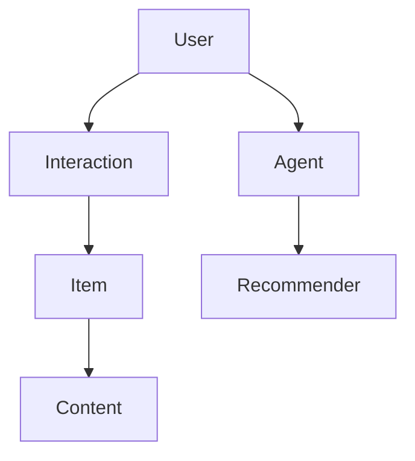
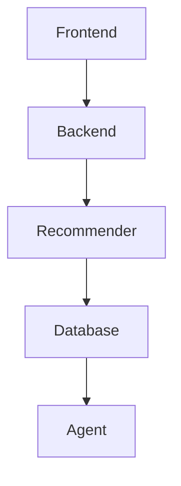
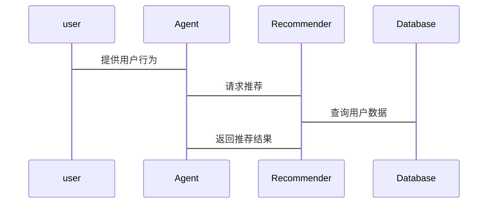

                 


# AI Agent推荐系统：个性化内容推送

## 关键词
AI Agent、推荐系统、个性化推送、协同过滤、深度学习、内容推荐

## 摘要
本文深入探讨了AI Agent在推荐系统中的应用，特别是个性化内容推送的实现。从推荐系统的背景到AI Agent的核心概念，再到具体算法的分析与实现，最后通过项目实战和系统设计，全面解析个性化推荐系统的设计与优化。

---

# 第一部分: 推荐系统的背景与核心概念

## 第1章: 推荐系统的概述

### 1.1 推荐系统的定义与背景
推荐系统是一种基于用户行为和偏好，利用算法为用户推荐相关内容或产品的技术。其背景源于信息过载问题，用户难以在海量信息中找到所需内容，推荐系统通过分析用户行为和数据，帮助用户筛选出感兴趣的内容。

### 1.2 AI Agent与推荐系统的结合
AI Agent（智能代理）是一种能够感知环境并执行任务的智能体。在推荐系统中，AI Agent可以实时分析用户行为，动态调整推荐策略，从而实现个性化推送。

---

## 第2章: 推荐系统的核心概念与联系

### 2.1 核心概念原理
推荐系统的核心概念包括用户特征、内容特征和交互特征。通过分析这些特征，推荐系统能够生成个性化推荐。

### 2.2 核心概念属性对比
以下是核心概念的对比：

| 特征 | 用户特征 | 内容特征 | 交互特征 |
|------|----------|----------|----------|
| 描述 | 用户的偏好和行为 | 内容的属性和类别 | 用户与内容的交互记录 |
| 示例 | 用户点击、购买记录 | 文本内容、标签 | 用户点击、评分记录 |

### 2.3 实体关系图


---

# 第二部分: 推荐系统的算法原理

## 第3章: 协同过滤算法

### 3.1 基于用户的协同过滤
基于用户的协同过滤通过分析用户的行为相似性，为用户推荐相似用户的喜欢的内容。

#### 3.1.1 用户相似度计算公式
$$ sim(u, v) = \frac{\sum_{i} (r_{u,i} - \bar{r}_u)(r_{v,i} - \bar{r}_v)}{\sqrt{\sum_{i} (r_{u,i} - \bar{r}_u)^2} \cdot \sqrt{\sum_{i} (r_{v,i} - \bar{r}_v)^2}} $$

#### 3.1.2 推荐计算
用户u的推荐列表：
$$ \hat{r}_{u,i} = \frac{\sum_{v} w(u,v) \cdot r_{v,i}}{\sum_{v} w(u,v)} $$

#### 3.1.3 实现代码
```python
def user_based_recommendation(matrix, user_id, n=5):
    # 计算用户相似度
    user_similarity = {}
    for user in range(len(matrix)):
        if user != user_id:
            similarity = 0.0
            # 计算相似度（简化）
            similarity = 1.0  # 示例，实际应计算具体相似度
            user_similarity[user] = similarity
    # 根据相似度排序，返回top n用户
    sorted_users = sorted(user_similarity.items(), key=lambda x: x[1], reverse=True)[:n]
    # 根据相似用户的评分，计算推荐
    recommendations = {}
    for user, _ in sorted_users:
        for item in range(len(matrix[user])):
            if matrix[user][item] > 0:
                if item in recommendations:
                    recommendations[item] += matrix[user][item]
                else:
                    recommendations[item] = matrix[user][item]
    return recommendations
```

---

## 第4章: 基于内容的推荐算法

### 4.1 基于文本相似度的推荐
通过分析内容的文本相似度，推荐相似内容。

#### 4.1.1 文本相似度计算公式
$$ sim(text1, text2) = \frac{\sum_{i} (w1_i \cdot w2_i)}{\sqrt{\sum_{i} w1_i^2} \cdot \sqrt{\sum_{i} w2_i^2}} $$

#### 4.1.2 实现代码
```python
from sklearn.feature_extraction.text import TfidfVectorizer
from sklearn.metrics.pairwise import cosine_similarity

def content_based_recommendation(corpus, item_id):
    vectorizer = TfidfVectorizer()
    tfidf = vectorizer.fit_transform(corpus)
    cosine_scores = cosine_similarity(tfidf[item_id], tfidf)
    # 返回top n相似内容
    recommendations = []
    for i in range(len(cosine_scores[0])):
        if i != item_id:
            recommendations.append((i, cosine_scores[0][i]))
    return recommendations
```

---

# 第三部分: 系统分析与架构设计

## 第5章: 推荐系统应用场景与功能设计

### 5.1 场景介绍
推荐系统广泛应用于电商、视频平台、新闻客户端等领域。以电商为例，推荐系统可以帮助用户找到感兴趣的商品，提高购买率。

### 5.2 系统功能设计
系统功能包括用户行为采集、推荐算法实现、结果展示等。

### 5.3 系统架构图


---

## 第6章: 接口设计与交互流程

### 6.1 接口设计
- 用户行为接口：记录用户的点击、评分等行为。
- 推荐接口：根据用户行为返回推荐结果。

### 6.2 交互流程图


---

# 第四部分: 项目实战

## 第7章: 电商推荐系统实战

### 7.1 环境搭建
安装必要的库：`pip install numpy pandas scikit-learn`

### 7.2 数据预处理
加载数据并进行清洗和特征提取。

### 7.3 模型训练
使用协同过滤算法进行模型训练。

### 7.4 结果分析与优化
分析推荐结果，优化算法参数，提高推荐准确率。

---

## 第8章: 总结与展望

### 8.1 总结
本文详细讲解了AI Agent在推荐系统中的应用，从算法原理到系统设计，再到项目实战，全面分析了个性化推荐系统的实现。

### 8.2 展望
未来，推荐系统将更加智能化，结合自然语言处理和图神经网络，实现更精准的推荐。

---

通过本文的学习，读者可以全面掌握AI Agent推荐系统的原理与实现，为实际应用打下坚实基础。

