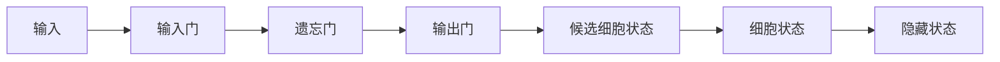
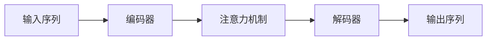

                 


# AI Agent的时序预测能力：理解和预测动态过程

## 关键词：
AI Agent、时序预测、动态过程、时间序列数据、深度学习模型

## 摘要：
AI Agent的时序预测能力是实现智能决策和自主行为的核心技术之一。本文深入探讨了AI Agent在时序预测中的应用，从基本概念到算法原理，再到系统设计和项目实战，全面解析了时序预测的关键技术。文章详细介绍了LSTM和Transformer等深度学习模型在时序预测中的应用，并通过实际案例展示了如何构建高效的AI Agent时序预测系统。通过本文，读者可以全面理解时序预测的原理、方法和实践应用。

---

## 第一部分: AI Agent的时序预测能力概述

### 第1章: AI Agent与时序预测概述

#### 1.1 AI Agent的基本概念
##### 1.1.1 AI Agent的定义
AI Agent（人工智能代理）是指能够感知环境、自主决策并执行任务的智能实体。它通常具备以下核心特征：
- **自主性**：能够在没有外部干预的情况下独立运作。
- **反应性**：能够根据环境变化实时调整行为。
- **目标导向**：通过设定目标来驱动决策和行动。

##### 1.1.2 AI Agent的核心特征
AI Agent的核心特征包括：
1. **感知能力**：通过传感器或数据输入感知环境。
2. **推理能力**：利用推理算法从感知信息中提取有用的知识。
3. **决策能力**：基于推理结果做出最优决策。
4. **执行能力**：通过执行机构或接口将决策转化为实际操作。

##### 1.1.3 AI Agent与传统算法的区别
AI Agent与传统算法的主要区别在于：
- AI Agent具备自主性和目标导向性，能够动态调整行为。
- 传统算法通常是静态的，无法根据环境变化自主调整。

#### 1.2 时序预测的背景与重要性
##### 1.2.1 时序预测的定义
时序预测是指根据历史数据预测未来趋势的过程。它是数据分析和机器学习中的一个重要任务，广泛应用于金融、气象、医疗等领域。

##### 1.2.2 时序预测的应用场景
时序预测的应用场景包括：
1. **金融领域**：股票价格预测、汇率波动预测。
2. **气象领域**：天气预报、气候预测。
3. **工业领域**：设备故障预测、生产优化。
4. **医疗领域**：疾病预测、患者病情监测。

##### 1.2.3 时序预测的挑战与解决方案
时序预测的主要挑战包括：
1. **数据依赖性**：预测结果高度依赖历史数据的质量和数量。
2. **动态变化**：时序数据往往具有动态变化的特点，模型需要具备良好的适应性。
3. **噪声干扰**：数据中可能存在噪声，影响预测准确性。

---

### 第2章: 时序预测的核心概念与模型

#### 2.1 时序预测的基本原理
##### 2.1.1 时间序列数据的特征
时间序列数据通常具有以下特征：
- **趋势性**：数据整体呈现上升或下降的趋势。
- **周期性**：数据呈现一定的周期性规律。
- **随机性**：数据中包含随机噪声。

##### 2.1.2 时序预测的核心要素
时序预测的核心要素包括：
1. **数据预处理**：对数据进行清洗、归一化等处理。
2. **模型选择**：选择适合的模型进行预测。
3. **模型训练**：通过历史数据训练模型。
4. **模型评估**：通过验证集或测试集评估模型性能。

##### 2.1.3 时序预测的数学模型
时序预测的数学模型通常包括以下几种形式：
1. **线性回归模型**：用于简单的时间序列预测。
2. **自回归模型（AR）**：基于过去值的线性组合预测未来值。
3. **移动平均模型（MA）**：基于过去误差的平均值预测未来值。

#### 2.2 常见的时序预测模型
##### 2.2.1 ARIMA模型
ARIMA（自回归积分滑动平均模型）是一种经典的时序预测模型，适用于线性时间序列数据。其基本结构包括自回归部分和滑动平均部分。

##### 2.2.2 LSTM网络
LSTM（长短期记忆网络）是一种基于循环神经网络（RNN）的深度学习模型，特别适用于处理长序列数据。LSTM通过门控机制有效地捕捉时间序列中的长期依赖关系。

##### 2.2.3 Transformer模型
Transformer是一种基于注意力机制的深度学习模型，近年来在自然语言处理和时序预测领域得到了广泛应用。它通过自注意力机制捕捉序列中的全局关系。

#### 2.3 AI Agent中的时序预测
##### 2.3.1 AI Agent与时序预测的关系
AI Agent通过时序预测能力，能够根据历史数据预测未来状态，从而做出更智能的决策。

##### 2.3.2 AI Agent时序预测的独特优势
AI Agent的时序预测能力的独特优势包括：
1. **自主性**：能够在无外部干预的情况下自主预测。
2. **动态适应性**：能够根据环境变化动态调整预测模型。
3. **多任务处理**：能够结合其他感知和决策能力，实现更复杂的任务。

---

## 第二部分: 时序预测的算法原理

### 第3章: 基于LSTM的时序预测算法

#### 3.1 LSTM模型的原理
##### 3.1.1 LSTM的基本结构
LSTM模型的基本结构包括输入门、遗忘门和输出门。通过这些门控机制，LSTM能够有效地捕捉时间序列中的长距离依赖关系。

##### 3.1.2 LSTM的门控机制
LSTM的门控机制包括：
1. **输入门**：决定当前时刻输入的信息。
2. **遗忘门**：决定遗忘哪些旧的信息。
3. **输出门**：决定输出哪些信息。

##### 3.1.3 LSTM的数学公式
LSTM的数学公式如下：
- 遗忘门：$$f_t = \sigma(w_f \cdot [h_{t-1}, x_t] + b_f)$$
- 输入门：$$i_t = \sigma(w_i \cdot [h_{t-1}, x_t] + b_i)$$
- 输出门：$$o_t = \sigma(w_o \cdot [h_{t-1}, x_t] + b_o)$$
- 候选细胞状态：$$\tilde{c}_t = \tanh(w_c \cdot [h_{t-1}, x_t] + b_c)$$
- 细胞状态：$$c_t = f_t \cdot c_{t-1} + i_t \cdot \tilde{c}_t$$
- 隐藏状态：$$h_t = o_t \cdot \tanh(c_t)$$

##### 3.1.4 LSTM的mermaid图


#### 3.2 LSTM在AI Agent中的应用
##### 3.2.1 LSTM的训练过程
LSTM的训练过程包括正向传播和反向传播。正向传播计算预测值，反向传播更新模型参数。

##### 3.2.2 LSTM的预测流程
LSTM的预测流程包括：
1. 输入初始状态。
2. 计算输入门、遗忘门和输出门。
3. 更新细胞状态和隐藏状态。
4. 输出预测结果。

##### 3.2.3 LSTM的优缺点分析
LSTM的优点包括：
- 能够捕捉长距离依赖关系。
- 适合处理时间序列数据。

LSTM的缺点包括：
- 训练过程较复杂。
- 对某些任务可能不如其他模型效果好。

### 第4章: 基于Transformer的时序预测算法

#### 4.1 Transformer模型的原理
##### 4.1.1 Transformer的基本结构
Transformer模型的基本结构包括编码器和解码器。编码器用于将输入序列转换为嵌入表示，解码器用于生成输出序列。

##### 4.1.2 Transformer的注意力机制
Transformer的注意力机制包括：
1. 查询（Query）：表示输入序列的特征。
2. 键（Key）：用于匹配输入序列中的位置。
3. 值（Value）：用于生成输出序列。

##### 4.1.3 Transformer的数学公式
Transformer的注意力机制公式如下：
$$
\text{Attention}(Q, K, V) = \text{softmax}\left(\frac{QK^T}{\sqrt{d_k}}\right)V
$$

##### 4.1.4 Transformer的mermaid图


#### 4.2 Transformer在AI Agent中的应用
##### 4.2.1 Transformer的训练过程
Transformer的训练过程包括正向传播和反向传播。正向传播生成预测值，反向传播更新模型参数。

##### 4.2.2 Transformer的预测流程
Transformer的预测流程包括：
1. 输入初始序列。
2. 编码器生成嵌入表示。
3. 解码器生成输出序列。

##### 4.2.3 Transformer的优缺点分析
Transformer的优点包括：
- 能够捕捉全局关系。
- 适合处理长序列数据。

Transformer的缺点包括：
- 训练过程较复杂。
- 对某些任务可能不如其他模型效果好。

---

## 第三部分: 时序预测的系统设计

### 第5章: 基于AI Agent的时序预测系统设计

#### 5.1 问题场景介绍
本文将通过一个股票价格预测案例，展示如何设计一个基于AI Agent的时序预测系统。

#### 5.2 系统功能设计
系统功能设计包括：
1. 数据预处理模块：对股票价格数据进行清洗和归一化处理。
2. 模型训练模块：训练LSTM或Transformer模型。
3. 模型预测模块：利用训练好的模型进行股票价格预测。

#### 5.3 系统架构设计
系统架构设计包括：
1. 数据预处理模块：负责数据的清洗和归一化。
2. 模型训练模块：负责模型的训练和保存。
3. 模型预测模块：负责模型的加载和预测。

#### 5.4 系统接口设计
系统接口设计包括：
1. 数据输入接口：接收股票价格数据。
2. 模型训练接口：接收训练数据和超参数。
3. 模型预测接口：接收输入数据并返回预测结果。

#### 5.5 系统交互设计
系统交互设计包括：
1. 用户输入股票价格数据。
2. 系统进行数据预处理。
3. 系统训练模型。
4. 系统进行股票价格预测。

---

## 第四部分: 项目实战

### 第6章: 基于AI Agent的股票价格预测项目

#### 6.1 环境安装
项目需要以下环境：
- Python 3.6及以上版本。
- TensorFlow或Keras框架。
- 数据库和可视化工具（可选）。

#### 6.2 系统核心实现源代码
##### 6.2.1 数据预处理代码
```python
import pandas as pd
import numpy as np

# 数据加载
data = pd.read_csv('stock_price.csv')

# 数据清洗
data.dropna(inplace=True)

# 数据归一化
from sklearn.preprocessing import MinMaxScaler
scaler = MinMaxScaler()
data_scaled = scaler.fit_transform(data)
```

##### 6.2.2 模型训练代码
```python
from tensorflow.keras.models import Sequential
from tensorflow.keras.layers import LSTM, Dense, Dropout

# 模型构建
model = Sequential()
model.add(LSTM(128, input_shape=(timesteps, features)))
model.add(Dropout(0.2))
model.add(Dense(1))

# 模型编译
model.compile(loss='mean_squared_error', optimizer='adam')
```

##### 6.2.3 模型预测代码
```python
# 模型训练
model.fit(X_train, y_train, epochs=100, batch_size=32)

# 模型预测
y_pred = model.predict(X_test)
```

#### 6.3 代码应用解读与分析
##### 6.3.1 数据预处理解读
数据预处理是保证模型训练效果的重要步骤。通过数据清洗和归一化，可以提高模型的训练效率和预测准确性。

##### 6.3.2 模型训练解读
模型训练是通过历史数据训练模型参数，使其能够准确预测未来趋势。

##### 6.3.3 模型预测解读
模型预测是利用训练好的模型，对输入数据进行预测，输出预测结果。

#### 6.4 实际案例分析和详细讲解剖析
通过股票价格预测案例，我们可以看到：
1. 数据预处理是关键步骤。
2. LSTM和Transformer模型在时序预测中表现良好。
3. 模型的预测结果需要结合实际业务场景进行解读。

#### 6.5 项目小结
本项目展示了如何利用AI Agent进行时序预测，从数据预处理到模型训练，再到模型预测，完整地展示了时序预测的实现过程。

---

## 第五部分: 总结与展望

### 第7章: 总结与展望

#### 7.1 最佳实践 tips
- 数据预处理是关键，需要仔细清洗和归一化数据。
- 模型选择需要根据具体任务和数据特点进行选择。
- 模型优化需要结合实际业务需求进行调整。

#### 7.2 小结
本文深入探讨了AI Agent的时序预测能力，从基本概念到算法原理，再到系统设计和项目实战，全面解析了时序预测的关键技术。

#### 7.3 注意事项
- 模型训练需要考虑计算资源和训练时间。
- 模型预测需要结合实际业务场景进行解读。
- 模型优化需要不断尝试和调整。

#### 7.4 拓展阅读
- 《Deep Learning》
- 《时间序列分析》
- 《AI Agent设计与实现》

---

通过本文的详细讲解，读者可以全面理解AI Agent的时序预测能力，并能够实际应用这些知识进行时序预测的系统设计和开发。

