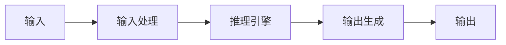
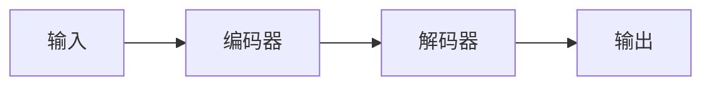
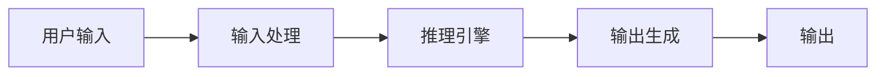

                 


# AI Agent的核心组件：输入处理、推理引擎和输出生成

## 关键词：
AI Agent, 输入处理, 推理引擎, 输出生成, 自然语言处理, 多模态输入, 知识图谱, 推理算法, 生成模型, 系统架构

## 摘要：
本文深入探讨了AI Agent的核心组件，包括输入处理、推理引擎和输出生成。通过分析输入处理的预处理、自然语言处理和多模态输入，推理引擎的知识表示、逻辑推理和深度学习算法，以及输出生成的文本生成和多模态输出，本文提供了全面的技术解析。同时，结合系统架构设计和项目实战，帮助读者理解AI Agent的实现过程，并展望了其未来发展。

---

# 第1章: AI Agent的背景与核心概念

## 1.1 AI Agent的基本概念

### 1.1.1 问题背景与问题描述
AI Agent（人工智能代理）是指能够感知环境、自主决策并执行任务的智能系统。在现代应用中，AI Agent广泛应用于自动驾驶、智能助手、机器人等领域。随着技术进步，AI Agent需要处理复杂多变的任务，涉及大量数据的输入、处理和输出。

### 1.1.2 AI Agent的核心目标与问题解决
AI Agent的核心目标是通过感知环境、理解任务需求，并通过推理和决策生成最优输出。它需要解决的问题包括高效处理多模态输入、准确推理知识、生成高质量输出等。

### 1.1.3 AI Agent的边界与外延
AI Agent的边界在于其感知和行动的能力，外延则包括与外部系统和用户的交互。其能力受限于输入数据的质量和推理引擎的复杂性。

### 1.1.4 AI Agent的概念结构与核心要素组成
AI Agent由输入处理、推理引擎和输出生成三个核心组件组成。这些组件协同工作，共同完成任务。

#### 表1-1: AI Agent核心概念对比

| 组件 | 输入处理 | 推理引擎 | 输出生成 |
|------|----------|----------|----------|
| 功能 | 解释输入数据 | 推导知识 | 生成输出 |
| 技术 | 数据预处理、NLP | 知识图谱、逻辑推理 | 生成模型、文本生成 |

#### 图1-1: AI Agent核心组件关系图（Mermaid）



---

# 第2章: 输入处理组件

## 2.1 输入数据的预处理

### 2.1.1 数据清洗与标准化
数据清洗是输入处理的第一步，包括去除噪声、填补缺失值等。标准化确保数据格式统一。

### 2.1.2 数据格式转换
将输入数据转换为模型可接受的格式，如文本、图像等。

### 2.1.3 数据增强技术
通过增加数据多样性提升模型鲁棒性，如图像旋转、文本同义词替换。

## 2.2 自然语言处理技术

### 2.2.1 分词与词性标注
分词将文本分割为词语，词性标注为每个词添加词性信息。

### 2.2.2 语义理解与意图识别
利用深度学习模型（如BERT）理解文本语义并识别用户意图。

### 2.2.3 基于深度学习的NLP模型
使用预训练语言模型进行文本表示和特征提取。

## 2.3 多模态输入处理

### 2.3.1 图像与文本的联合处理
结合图像和文本信息，利用多模态模型进行联合处理。

### 2.3.2 声音与文本的联合处理
将语音信号转换为文本，并结合上下文进行处理。

### 2.3.3 跨模态数据融合技术
通过融合多模态数据提升模型的理解能力，如使用多模态Transformer。

---

# 第3章: 推理引擎

## 3.1 知识表示与推理基础

### 3.1.1 知识图谱构建
知识图谱通过实体和关系表示知识，用于推理任务。

### 3.1.2 逻辑推理与概率推理
逻辑推理基于规则，概率推理基于概率模型。

### 3.1.3 基于规则的推理方法
通过预定义规则进行简单推理，适用于规则明确的场景。

## 3.2 基于深度学习的推理算法

### 3.2.1 Transformer模型在推理中的应用
Transformer模型用于序列数据的推理，如文本摘要。

### 3.2.2 图神经网络推理方法
图神经网络处理图结构数据，适用于复杂关系推理。

### 3.2.3 对抗训练与元学习在推理中的应用
通过对抗训练和元学习提升模型的泛化能力。

## 3.3 推理引擎的优化与调优

### 3.3.1 基于模型压缩的推理优化
通过模型压缩技术减少计算量。

### 3.3.2 分布式推理架构设计
采用分布式计算提升推理效率。

### 3.3.3 推理结果的可信度评估
通过可信度评估确保推理结果的可靠性。

---

# 第4章: 输出生成组件

## 4.1 文本生成

### 4.1.1 基于生成模型的文本生成
使用GPT等生成模型生成文本，模型结构如图4-1所示。



### 4.1.2 基于规则的文本生成
通过预定义规则生成文本，适用于结构化输出场景。

### 4.1.3 文本生成的优化与调优
通过调整超参数和优化策略提升生成质量。

## 4.2 多模态输出

### 4.2.1 文本与图像的联合生成
结合文本和图像信息生成多模态输出。

### 4.2.2 声音与文本的联合生成
生成与文本内容匹配的语音输出。

### 4.2.3 多模态生成模型的设计与实现
使用多模态生成模型，如多模态GPT。

## 4.3 输出优化

### 4.3.1 基于反馈的输出优化
通过用户反馈优化生成结果。

### 4.3.2 输出结果的格式化与规范化
确保输出格式统一，符合规范。

### 4.3.3 输出结果的可解释性增强
通过可解释性技术提升输出的透明度。

---

# 第5章: 系统架构与设计

## 5.1 系统架构设计

### 5.1.1 系统功能设计
设计模块化的功能架构，如模块化设计图5-1。



### 5.1.2 系统架构图（Mermaid）


## 5.2 模块化设计

### 5.2.1 模块划分与职责
将系统划分为输入处理、推理引擎和输出生成三个模块，明确职责。

### 5.2.2 模块之间的交互
模块之间通过接口进行数据传递和通信。

## 5.3 通信机制

### 5.3.1 本地通信
模块之间通过内部调用进行通信。

### 5.3.2 分布式通信
采用分布式架构，模块之间通过网络进行通信。

## 5.4 容错机制

### 5.4.1 错误检测与恢复
检测错误并采取恢复措施，如重试机制。

### 5.4.2 容错设计
设计容错机制，确保系统稳定性。

---

# 第6章: 项目实战

## 6.1 环境搭建

### 6.1.1 安装依赖
安装Python、深度学习框架等依赖。

### 6.1.2 配置环境
配置开发环境，如虚拟环境。

## 6.2 核心代码实现

### 6.2.1 输入处理代码
实现数据预处理和自然语言处理功能。

```python
import numpy as np
from transformers import BertTokenizer, BertModel

tokenizer = BertTokenizer.from_pretrained('bert-base-uncased')
model = BertModel.from_pretrained('bert-base-uncased')

def preprocess(text):
    inputs = tokenizer(text, return_tensors='np', padding=True, truncation=True)
    return inputs
```

### 6.2.2 推理引擎代码
实现知识表示和推理算法。

```python
def infer knowledge(knowledge_base, query):
    # 实现推理逻辑
    pass
```

### 6.2.3 输出生成代码
实现文本生成和多模态输出。

```python
def generate_text(prompt):
    # 使用生成模型生成文本
    pass
```

## 6.3 案例分析与详细解读

### 6.3.1 实际案例分析
分析实际案例，如智能助手对话系统。

### 6.3.2 代码实现细节
详细解读代码实现，说明每部分的功能。

## 6.4 项目小结

### 6.4.1 项目实现总结
总结项目实现过程中的关键点和经验教训。

### 6.4.2 项目部署与优化
讨论项目的部署方法和优化策略。

---

# 第7章: 总结与展望

## 7.1 全文总结

### 7.1.1 核心内容回顾
回顾全文内容，总结AI Agent的核心组件和技术要点。

## 7.2 经验与教训

### 7.2.1 开发中的关键经验
分享开发过程中的关键经验和最佳实践。

## 7.3 对未来的展望

### 7.3.1 技术发展趋势
展望AI Agent技术的发展方向，如多模态处理、更强大的推理算法。

### 7.3.2 新的应用场景
探讨AI Agent在更多领域的潜在应用。

---

# 参考文献

（此处列出相关技术文献和参考资料）

