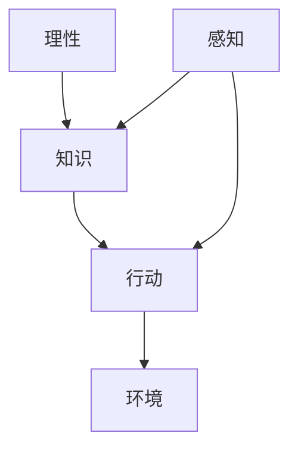
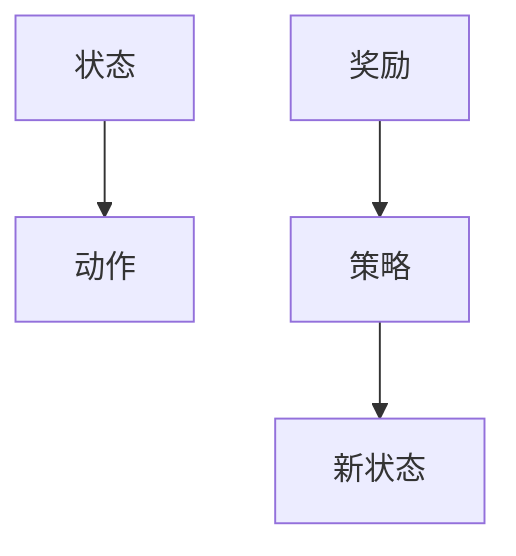
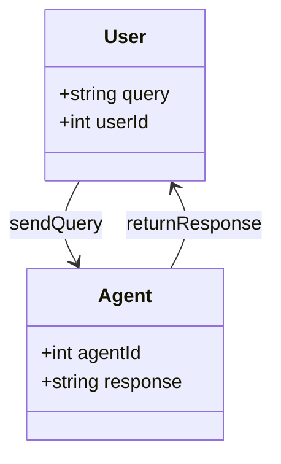
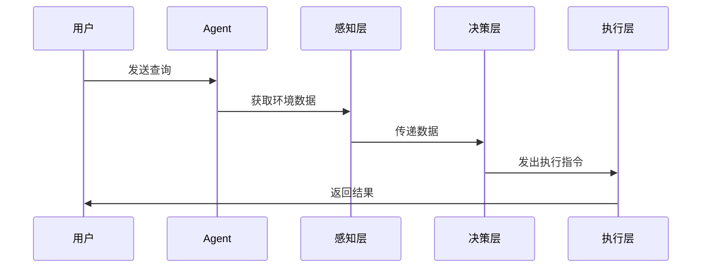

                 


# AI Agent的概念学习：从具体到抽象的认知过程

> 关键词：人工智能、AI Agent、概念学习、认知过程、系统架构、算法原理、项目实战

> 摘要：本文将系统地探讨AI Agent的概念，从具体案例到抽象理论，逐步分析其核心概念、算法原理、系统架构，并结合项目实战，帮助读者深入理解AI Agent的原理与应用。

---

## 第1章: AI Agent的基本概念与背景介绍

### 1.1 AI Agent的定义与特点

#### 1.1.1 AI Agent的定义
AI Agent（人工智能代理）是指能够感知环境、自主决策并采取行动以实现目标的智能实体。它通过传感器获取信息，利用计算模型进行处理，并通过执行器与环境交互。

#### 1.1.2 AI Agent的核心特点
- **自主性**：能够独立决策和行动。
- **反应性**：实时感知环境并做出反应。
- **目标导向**：所有行动均以实现特定目标为导向。
- **社会性**：能够与其他Agent或人类进行交互与协作。

#### 1.1.3 AI Agent与其他智能体的对比
AI Agent与传统软件的区别在于其自主性和智能性。例如，与简单的脚本程序相比，AI Agent能够适应环境变化并做出复杂决策。

### 1.2 从具体到抽象的认知过程

#### 1.2.1 具体案例分析
以智能助手为例，分析其如何通过语音交互感知用户需求，并通过调用API执行任务。

#### 1.2.2 抽象概念的形成
从具体案例中提炼出AI Agent的核心概念，如感知、决策、执行。

#### 1.2.3 认知过程的总结
认知过程是一个从具体实例到抽象理论的螺旋上升过程，需要不断总结和归纳。

---

## 第2章: AI Agent的核心概念与联系

### 2.1 AI Agent的核心要素

#### 2.1.1 理性
理性是指AI Agent在决策过程中遵循逻辑和优化原则的能力。

#### 2.1.2 知识
知识是AI Agent做出决策的基础，包括显式知识（规则）和隐式知识（经验）。

#### 2.1.3 感知
感知是AI Agent通过传感器获取环境信息的能力，如视觉、听觉等。

#### 2.1.4 行动
行动是AI Agent通过执行器与环境交互的过程，如移动、操作物体等。

#### 2.1.5 环境
环境是AI Agent所处的外部世界，可以是静态或动态的。

### 2.2 核心概念的联系与对比

#### 2.2.1 核心要素的属性对比表

| 核心要素 | 描述 | 属性 |
|----------|------|------|
| 理性      | 决策规则 | 确定性、逻辑性 |
| 知识      | 数据与规则 | 显式性、隐式性 |
| 感知      | 输入数据 | 实时性、多样性 |
| 行动      | 输出动作 | 可执行性、可观察性 |
| 环境      | 外部条件 | 静态性、动态性 |

#### 2.2.2 ER实体关系图


---

## 第3章: AI Agent的算法原理

### 3.1 算法原理概述

#### 3.1.1 基于模型的强化学习
基于模型的强化学习通过构建环境模型来优化决策过程。

#### 3.1.2 基于经验的强化学习
基于经验的强化学习通过试错过程直接学习策略。

#### 3.1.3 监督学习与无监督学习的结合
结合监督学习的有标签数据和无监督学习的无标签数据，提高模型的泛化能力。

### 3.2 算法实现与流程图

#### 3.2.1 算法流程图


#### 3.2.2 Python代码实现
```python
def agent_algorithm(state):
    action = policy(state)
    return action
```

#### 3.2.3 数学模型与公式
在强化学习中，Q-learning的更新公式为：
$$ Q(s, a) = Q(s, a) + \alpha (r + \gamma \max Q(s', a') - Q(s, a)) $$
其中：
- $s$ 是当前状态
- $a$ 是当前动作
- $r$ 是奖励
- $s'$ 是新状态
- $\alpha$ 是学习率
- $\gamma$ 是折扣因子

---

## 第4章: AI Agent的系统分析与架构设计

### 4.1 问题场景介绍

#### 4.1.1 问题场景
以智能助手为例，分析其在用户需求识别、任务执行中的应用。

### 4.2 系统功能设计

#### 4.2.1 领域模型


#### 4.2.2 系统架构设计
```mermaid
graph TD
A[用户] --> B[Agent]: 请求
C[感知层] --> B
D[决策层] --> B
E[执行层] --> B
```

### 4.3 系统接口设计

#### 4.3.1 接口描述
- **输入接口**：接收用户的查询请求。
- **输出接口**：返回处理结果。

### 4.4 系统交互流程图



---

## 第5章: 项目实战

### 5.1 环境安装

#### 5.1.1 安装Python
```bash
python --version
pip install requests
pip install beautifulsoup4
```

### 5.2 系统核心实现源代码

#### 5.2.1 代码实现
```python
import requests

def fetch_data(url):
    response = requests.get(url)
    return response.text
```

### 5.3 代码应用解读与分析

#### 5.3.1 代码功能分析
- `fetch_data`函数用于从指定URL获取数据。

### 5.4 实际案例分析

#### 5.4.1 案例分析
以爬取网页信息为例，详细分析代码实现的每一步。

### 5.5 项目小结

#### 5.5.1 小结
总结项目实现的关键点和经验教训。

---

## 第6章: 总结与注意事项

### 6.1 学习小结
AI Agent的学习需要从具体案例出发，逐步理解其核心概念和算法原理。

### 6.2 注意事项
- 确保对数学模型的理解
- 注重实际项目的应用

### 6.3 拓展阅读
推荐相关书籍和论文，进一步深入学习AI Agent的知识。

---

## 第7章: 最佳实践与未来展望

### 7.1 最佳实践
- **理论与实践结合**：通过项目实战巩固理论知识。
- **持续学习**：关注AI领域的最新进展。

### 7.2 未来展望
AI Agent将在更多领域得到应用，如自动驾驶、智能客服等。

---

通过以上内容，读者可以系统地了解AI Agent的概念、算法和应用，从具体案例到抽象理论，逐步掌握其核心知识。

