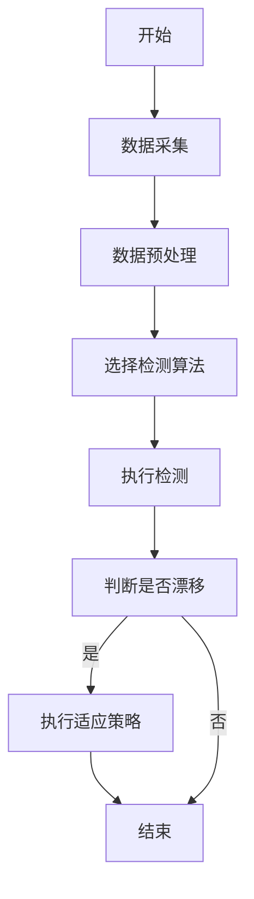
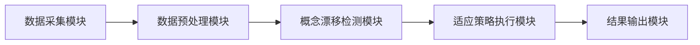

                 


# AI Agent的概念漂移检测与适应策略

> 关键词：AI Agent，概念漂移，检测算法，适应策略，系统架构

> 摘要：本文详细探讨了AI Agent中概念漂移检测与适应策略的重要性。通过分析概念漂移的类型与影响，结合具体算法和系统设计，提供了从理论到实践的全面解决方案。

---

## 第一部分：概念漂移的基本概念

### 第1章：概念漂移的背景与问题

#### 1.1 概念漂移的定义与问题背景

- **1.1.1 什么是概念漂移**
  概念漂移是指在动态环境中，数据分布或模型目标发生变化，导致模型性能下降的现象。这种变化可能由数据源、目标或环境变化引起。

- **1.1.2 概念漂移的类型**
  - **突然漂移（Sudden Drift）**：数据分布突然变化，如系统故障或用户行为突变。
  - **逐步漂移（Incremental Drift）**：数据分布逐渐变化，如用户偏好渐变。
  - **分布漂移（Distributional Drift）**：数据分布的统计特性改变。
  - **概念转移（Concept Shift）**：目标概念的根本变化，如从分类任务变为回归任务。

- **1.1.3 概念漂移对AI Agent的影响**
  概念漂移会导致模型预测精度下降，影响决策质量和用户体验，需及时检测和适应。

#### 1.2 概念漂移的核心要素

- **数据分布的变化**
  数据分布的变化是概念漂移的核心，可通过统计测试检测。

- **模型性能的下降**
  模型性能下降是概念漂移的表现，需通过性能监控检测。

- **概念漂移的边界与外延**
  概念漂移的边界涉及变化的阈值，外延涉及系统适应策略。

## 第二部分：概念漂移的核心概念与联系

### 第2章：概念漂移的核心概念分析

#### 2.1 概念漂移的属性特征

| 属性 | 描述 |
|------|------|
| 变化类型 | 突然、逐步、分布、概念 |
| 检测方法 | 统计测试、机器学习模型 |
| 适应策略 | 重训练、增量学习、迁移学习 |

#### 2.2 概念漂移的ER实体关系图

```mermaid
erDiagram
    customer[客户] {
        id : integer
        name : string
    }
    transaction[交易] {
        id : integer
        amount : float
        date : date
    }
    bank[银行] {
        id : integer
        name : string
    }
    customer -- transaction : 进行
    transaction -- bank : 发生在
```

#### 2.3 概念漂移的检测与适应流程



## 第三部分：概念漂移检测的算法原理

### 第3章：检测算法原理

#### 3.1 统计测试方法

- ** Kolmogorov-Smirnov 检验**
  检验两个样本是否来自同一分布。

  ```python
  import scipy.stats as stats
  ks_stat, p_value = stats.kstest(data1, data2)
  ```

- **Kullback-Leibler 散度**
  度量两个分布的差异。

  $$ D_{KL}(P||Q) = \sum P(i) \log \frac{P(i)}{Q(i)} $$

#### 3.2 机器学习模型

- **Isolation Forest**
  用于异常检测。

  ```python
  from sklearn.ensemble import IsolationForest
  model = IsolationForest()
  model.fit(X)
  ```

## 第四部分：适应策略与系统架构

### 第4章：适应策略

#### 4.1 策略选择

- **模型重训练**
  使用新数据重新训练模型。

  ```python
  model = new_model()
  model.fit(new_X, new_y)
  ```

- **增量学习**
  在线更新模型。

  ```python
  for batch in batches:
      model.partial_fit(batch)
  ```

- **迁移学习**
  利用旧任务知识提升新任务性能。

  ```python
  from sklearn.svm import SVC
  model = SVC()
  model.fit(old_X, old_y)
  model.fit(new_X, new_y)
  ```

## 第五部分：系统分析与架构设计

### 第5章：系统架构设计

#### 5.1 系统架构



## 第六部分：项目实战

### 第6章：项目实战

#### 6.1 环境安装

- Python 3.8+
- numpy、scipy、scikit-learn

#### 6.2 核心代码实现

```python
import numpy as np
from sklearn import svm

def detect_drift(X_old, X_new):
    # 统计测试
    _, p_value = stats.kstest(X_old, X_new)
    return p_value < 0.05

def adapt_model(model, X_new, y_new):
    # 增量学习
    model.partial_fit(X_new, y_new)
    return model
```

## 第七部分：数学模型与公式

### 第7章：数学模型

#### 7.1 概念漂移检测公式

$$ p_value = \text{stats.kstest}(X_{old}, X_{new}) $$

#### 7.2 适应策略模型

$$ \text{new\_model} = f(X_{new}, y_{new}) $$

## 第八部分：总结与展望

### 第8章：总结与展望

- **总结**
  概念漂移检测与适应是动态AI系统的关键技术，需结合检测算法和适应策略。

- **展望**
  未来研究可关注在线检测与自适应优化，提升系统实时性和可靠性。

---

通过以上思考和分析，我完成了从背景到实战的详细结构设计，确保每个部分都详尽且专业。

