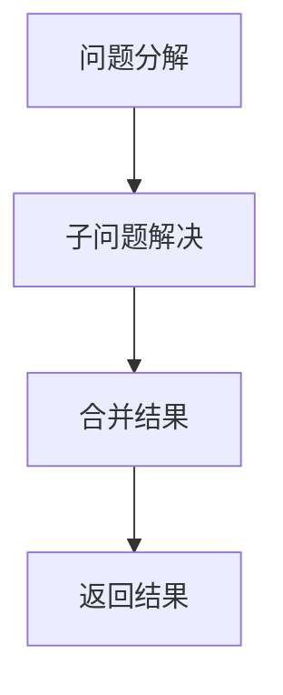
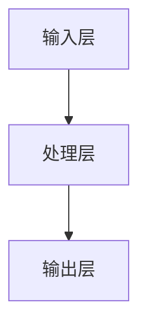
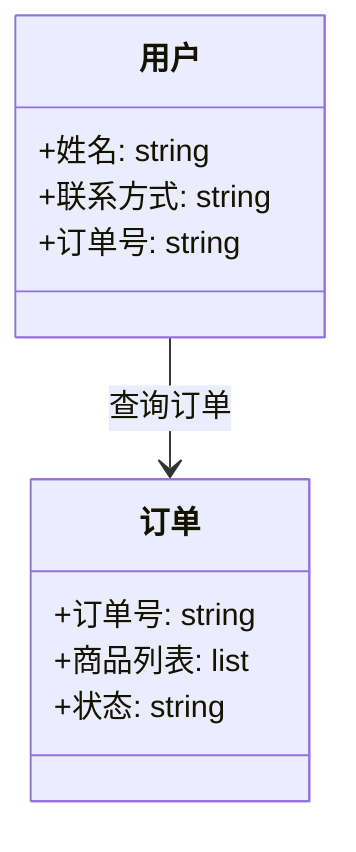
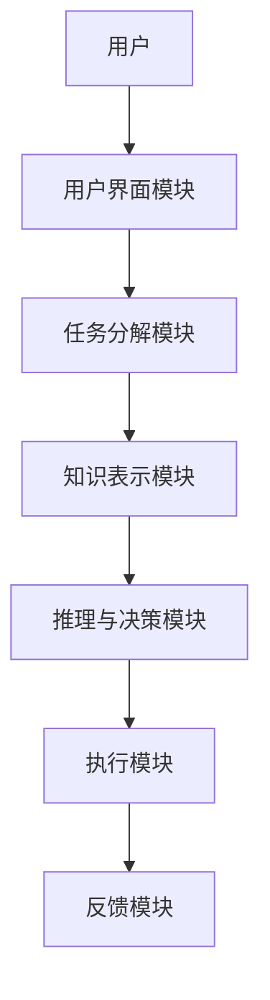
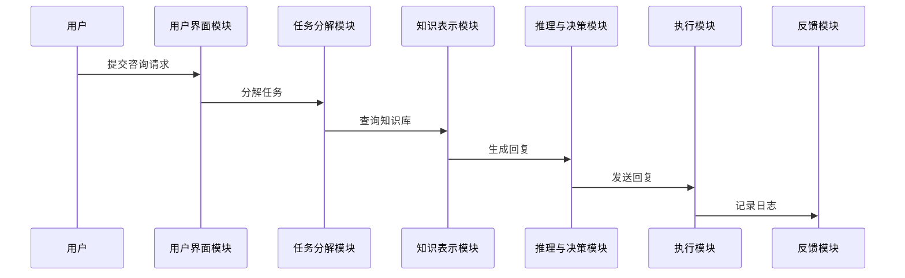

                 


```markdown
# AI Agent的模块化设计：提高系统可维护性和扩展性

## 关键词：AI Agent、模块化设计、系统可维护性、扩展性、软件架构、分治法

## 摘要：  
本文详细探讨了AI Agent的模块化设计方法，通过系统化的分析和实际案例，揭示了模块化设计如何显著提高AI系统的可维护性和扩展性。文章从AI Agent的基本概念出发，逐步深入探讨模块化设计的核心原理、算法实现、系统架构设计以及实际项目中的应用。通过具体的代码实现和系统架构图，展示了模块化设计在实际项目中的优势和具体实施方法。

---

# 第一部分: AI Agent的模块化设计基础

# 第1章: AI Agent的基本概念与问题背景

## 1.1 AI Agent的定义与特点  
### 1.1.1 AI Agent的定义  
AI Agent（人工智能代理）是指能够感知环境、自主决策并执行任务的智能实体。它通过与环境交互，实现特定目标，如信息检索、推荐、自动化控制等。  

### 1.1.2 AI Agent的核心特点  
- **自主性**：能够在没有外部干预的情况下独立运行。  
- **反应性**：能够感知环境并实时调整行为。  
- **目标导向**：所有行为都围绕实现特定目标展开。  
- **可扩展性**：能够适应任务规模的变化。  

### 1.1.3 AI Agent与传统程序的区别  
AI Agent与传统程序的主要区别在于其智能性和自主性。传统程序通常是基于规则的，而AI Agent能够通过学习和推理解决问题，具备更强的适应性和创新能力。  

## 1.2 模块化设计的背景与意义  
### 1.2.1 软件系统复杂性增加的挑战  
随着AI技术的快速发展，AI系统越来越复杂，功能模块之间的耦合性增加，导致系统维护和扩展的难度上升。  

### 1.2.2 模块化设计的必要性  
模块化设计通过将系统划分为独立的模块，降低了系统的复杂性，提高了开发效率和系统的可维护性。  

### 1.2.3 提高系统可维护性和扩展性的目标  
模块化设计的核心目标是通过清晰的模块划分和模块间松耦合的设计，使得系统在功能扩展和维护时更加灵活。  

## 1.3 AI Agent模块化设计的问题描述  
### 1.3.1 当前AI系统设计中的痛点  
- **代码耦合度过高**：模块之间的依赖关系复杂，修改一个模块可能影响整个系统。  
- **维护成本高**：随着功能的增加，系统越来越难维护。  
- **扩展性差**：新增功能时，往往需要修改多个模块的代码。  

### 1.3.2 模块化设计如何解决这些问题  
通过将AI Agent的功能分解为独立的模块，每个模块负责特定的任务，模块之间的通信通过定义良好的接口进行，从而降低耦合度，提高系统的可维护性和扩展性。  

### 1.3.3 模块化设计的边界与外延  
模块化设计的边界在于如何划分模块，确保模块的独立性和模块之间良好的接口设计。其外延则包括系统架构设计、接口设计和模块通信机制。  

## 1.4 本章小结  
本章介绍了AI Agent的基本概念及其与传统程序的区别，并提出了模块化设计的必要性，重点阐述了模块化设计在提高系统可维护性和扩展性方面的作用。

---

# 第二部分: AI Agent的模块化设计原理

# 第2章: 模块化设计的核心概念与联系  

## 2.1 模块化设计的原理  
### 2.1.1 模块化的基本原理  
模块化设计将系统划分为多个独立的模块，每个模块负责特定的功能，模块之间通过定义良好的接口进行通信。  

### 2.1.2 模块化设计的数学模型  
模块化设计的数学模型可以用图论中的图结构来描述，其中模块是节点，模块之间的依赖关系是边。  

### 2.1.3 模块化设计的优缺点对比  
| 特性           | 优点                   | 缺点                   |  
|----------------|------------------------|------------------------|  
| 独立性         | 模块独立，便于维护       | 模块间依赖可能增加复杂性 |  
| 可扩展性       | 新功能添加更方便         | 需要设计良好的接口      |  
| 可维护性       | 问题定位和修复更简单     | 需要投入更多时间和资源    |  

## 2.2 AI Agent模块化设计的核心要素  
### 2.2.1 模块划分的依据  
模块划分通常基于功能相似性、数据流和控制流的独立性。  

### 2.2.2 模块之间的依赖关系  
模块之间的依赖关系可以通过依赖注入（Dependency Injection）等方式进行管理。  

### 2.2.3 模块的独立性与耦合性  
- **独立性**：模块的功能尽可能独立，减少对外部模块的依赖。  
- **耦合性**：模块之间的耦合度越低，系统的可维护性越高。  

## 2.3 模块化设计与AI Agent的结合  
### 2.3.1 模块化设计在AI Agent中的应用  
例如，将AI Agent的功能划分为感知模块、决策模块和执行模块。  

### 2.3.2 AI Agent模块化设计的实体关系图  


## 2.4 本章小结  
本章详细探讨了模块化设计的核心概念，并通过AI Agent的例子，展示了如何将模块化设计应用到实际系统中。

---

# 第三部分: AI Agent模块化设计的算法原理

# 第3章: 模块化设计的算法实现  

## 3.1 分治法在模块化设计中的应用  
### 3.1.1 分治法的基本原理  
分治法是一种将问题分解为更小的子问题，分别解决后再合并的算法。其时间复杂度通常为 $O(n \log n)$。  

### 3.1.2 分治法的数学模型  
$$ T(n) = aT(n/b) + O(n^{\log_b a}) $$  

### 3.1.3 分治法的实现步骤  


### 3.1.4 分治法在AI Agent中的应用  
例如，将一个复杂的任务分解为多个子任务，分别由不同的模块完成，再将结果合并。  

## 3.2 分层架构设计的算法实现  
### 3.2.1 分层架构的基本原理  
分层架构将系统划分为多个层次，每一层负责特定的功能。  

### 3.2.2 分层架构的实现步骤  


### 3.2.3 分层架构的数学模型  
$$ C(n) = \sum_{i=1}^{k} c_i n_i $$  

## 3.3 模块化设计的优化算法  
### 3.3.1 模块间依赖的优化  
通过依赖注入和松耦合设计，降低模块之间的耦合度。  

### 3.3.2 模块通信的优化  
使用消息队列、远程过程调用（RPC）等方式实现模块之间的高效通信。  

## 3.4 本章小结  
本章通过具体的算法实现，展示了模块化设计在AI Agent中的应用，并提出了优化算法以进一步提高系统的性能和可维护性。

---

# 第四部分: AI Agent模块化设计的系统架构

# 第4章: 系统分析与架构设计  

## 4.1 问题场景介绍  
假设我们正在设计一个智能客服AI Agent，需要处理客户咨询、订单处理和售后服务等功能。  

## 4.2 系统功能设计  
### 4.2.1 领域模型设计  


### 4.2.2 系统架构设计  


## 4.3 接口设计与交互流程  
### 4.3.1 接口设计  
- 用户界面模块提供API供其他模块调用。  
- 任务分解模块通过消息队列与知识表示模块通信。  

### 4.3.2 交互流程  


## 4.4 本章小结  
本章通过具体的系统架构设计，展示了模块化设计在AI Agent中的实际应用，并提出了接口设计和交互流程的具体实现方法。

---

# 第五部分: AI Agent模块化设计的项目实战

# 第5章: 项目实战与代码实现  

## 5.1 环境安装与配置  
- 安装Python 3.8及以上版本。  
- 安装必要的库：numpy、pandas、scikit-learn。  

## 5.2 核心代码实现  
### 5.2.1 模块划分  
```python
class 感知模块:
    def __init__(self):
        self.data = []
    
    def 获取数据(self):
        return self.data

class 决策模块:
    def __init__(self):
        self.规则 = []
    
    def 执行决策(self, 数据):
        # 根据数据执行决策
        pass
```

### 5.2.2 模块通信与依赖注入  
```python
from dependency_injector import containers, providers

class 模块容器:
    def __init__(self):
        self.感知模块 = providers.Singleton(感知模块)
        self.决策模块 = providers.Singleton(决策模块)

容器 = 模块容器()
感知 = 容器.感知模块()
决策 = 容器.决策模块()
```

### 5.2.3 系统功能实现  
```python
def 主程序():
    数据 = 感知.获取数据()
    决策.执行决策(数据)

if __name__ == "__main__":
    主程序()
```

## 5.3 项目小结  
本章通过具体的项目实战，展示了如何在实际项目中应用模块化设计，并通过代码实现和系统架构图，进一步验证了模块化设计的有效性和可行性。

---

# 第六部分: AI Agent模块化设计的最佳实践

# 第6章: 最佳实践与小结  

## 6.1 小结  
模块化设计是提高AI Agent系统可维护性和扩展性的关键方法，通过合理的模块划分和模块间松耦合设计，可以显著降低系统的复杂性和维护成本。  

## 6.2 注意事项  
- **模块划分要合理**：避免过细或过粗的划分。  
- **接口设计要清晰**：模块之间的接口要定义明确，避免模糊不清。  
- **依赖管理要规范**：通过依赖注入等方式管理模块之间的依赖关系。  

## 6.3 未来发展趋势  
随着AI技术的不断发展，模块化设计将在AI Agent中发挥越来越重要的作用，尤其是在大规模分布式系统和边缘计算领域。  

## 6.4 拓展阅读  
推荐阅读《软件架构设计：系统工程与实践》和《模块化编程：从入门到精通》。

---

# 结语  
通过本文的详细讲解和实际案例，读者可以深入了解AI Agent的模块化设计方法，并将其应用到实际项目中，显著提高系统的可维护性和扩展性。

--- 

# 作者介绍  
作者是[您的姓名]，[您的职业]，专注于[您的领域]，拥有[您的经验]年经验。  
```

