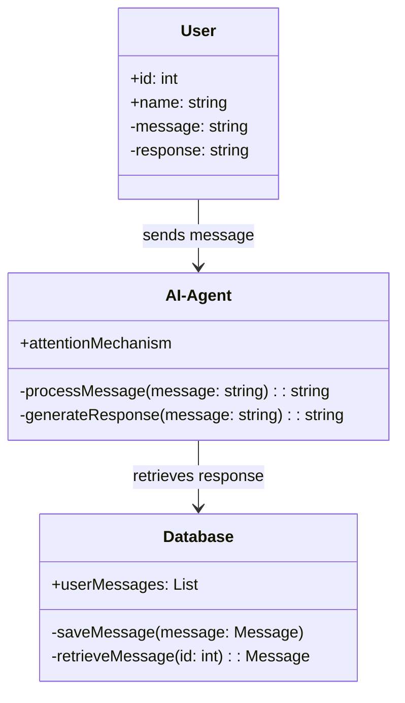
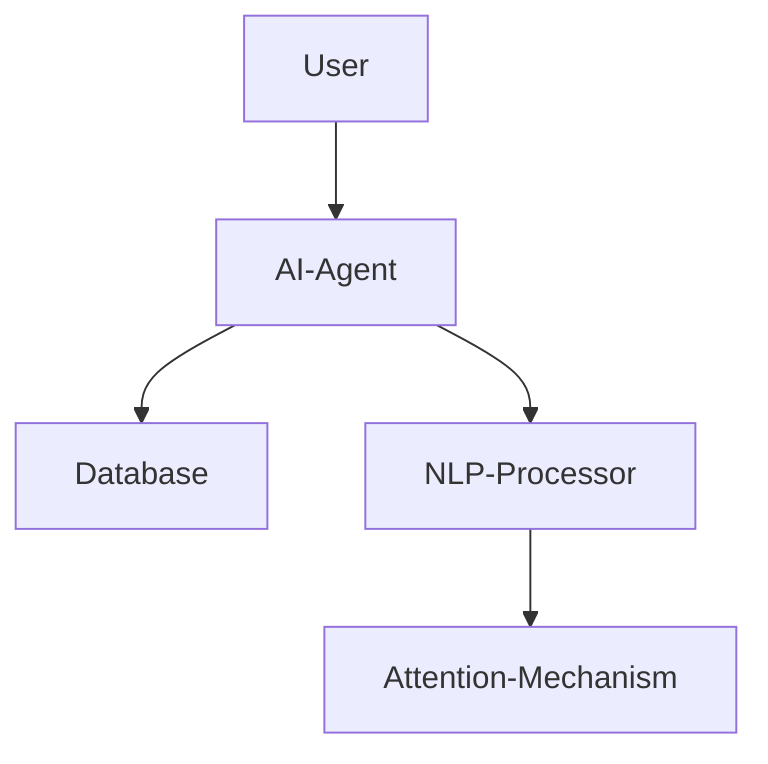
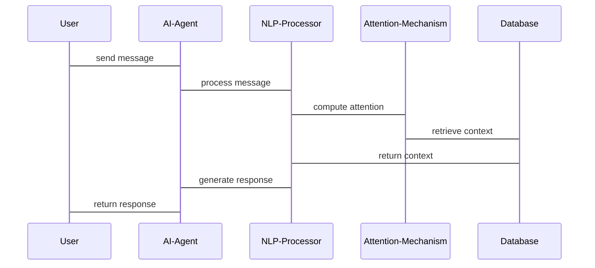

                 


# AI Agent的注意力机制：提高信息处理效率

> 关键词：AI Agent, 注意力机制, 信息处理效率, 自注意力机制, 多头注意力机制

> 摘要：本文深入探讨了AI Agent中的注意力机制，分析其在提高信息处理效率中的作用。通过背景介绍、核心概念、算法原理、系统架构、项目实战和最佳实践，全面解析了注意力机制的原理与应用，帮助读者理解并有效应用这一技术。

---

# 第一部分: AI Agent的注意力机制基础

## 第1章: 注意力机制的背景与概念

### 1.1 信息处理效率的重要性

#### 1.1.1 信息过载与处理效率
在信息爆炸的时代，AI Agent需要处理海量数据。信息过载导致效率低下，传统的处理方式难以应对。注意力机制帮助模型聚焦关键信息，提升处理效率。

#### 1.1.2 注意力机制的定义
注意力机制是一种模拟人类注意力的机制，通过加权分配关注模型处理的不同部分。它使模型能够聚焦重要信息，提高处理效率。

#### 1.1.3 AI Agent的核心目标
AI Agent的目标是高效处理信息，做出智能决策。注意力机制是其实现这一目标的关键技术，帮助模型优化信息处理流程。

### 1.2 注意力机制的背景

#### 1.2.1 从传统算法到注意力机制的演进
传统算法在处理序列数据时存在局限性，注意力机制的出现解决了这些问题，提高了模型的表达能力。

#### 1.2.2 大模型中的注意力机制发展
随着大模型的兴起，注意力机制成为核心组件。它帮助模型在长序列中保持语义一致性，提升处理效率。

#### 1.2.3 提高信息处理效率的意义
注意力机制通过聚焦关键信息，显著提高了信息处理效率，使模型在复杂任务中表现更佳。

### 1.3 AI Agent与注意力机制的关系

#### 1.3.1 AI Agent的基本概念
AI Agent是具有自主决策能力的智能体，能够感知环境并执行任务。注意力机制是其实现高效信息处理的关键技术。

#### 1.3.2 注意力机制在AI Agent中的作用
注意力机制帮助AI Agent聚焦重要信息，提升信息处理效率，增强决策能力。

#### 1.3.3 提高信息处理效率的核心要素
注意力机制通过加权分配关注模型的不同部分，优化信息处理流程，提升效率。

## 第2章: 注意力机制的核心概念

### 2.1 自注意力机制原理

#### 2.1.1 自注意力机制的基本概念
自注意力机制允许模型在处理每个位置时考虑整个序列的信息，通过计算查询、键、值向量生成注意力权重矩阵。

#### 2.1.2 查询、键、值的计算
通过线性变换生成查询、键、值向量，这些向量用于计算注意力权重矩阵，从而确定每个位置的关注程度。

#### 2.1.3 注意力权重的计算与应用
通过查询与键的点积归一化计算注意力权重，再将其应用到值向量上，生成最终的加权和。

### 2.2 多头注意力机制

#### 2.2.1 多头机制的定义
多头注意力机制将查询、键、值向量分成多个子空间，分别计算注意力权重，最后将结果合并，提升模型的表达能力。

#### 2.2.2 并行计算的优势
多头机制通过并行计算多个子空间的注意力，显著提高了计算效率，优化了模型性能。

#### 2.2.3 多头机制的实现细节
通过分解查询、键、值向量到多个子空间，分别计算注意力权重，并将结果合并，生成最终的输出。

### 2.3 位置编码与相对位置

#### 2.3.1 绝对位置编码
绝对位置编码为每个位置赋予固定的编码，帮助模型理解绝对位置信息。

#### 2.3.2 相对位置编码
相对位置编码计算相邻位置的相对关系，使模型能够处理相对位置信息，提升表达能力。

#### 2.3.3 位置编码在注意力机制中的作用
位置编码将位置信息融入注意力机制，帮助模型捕捉序列中的位置关系，提升处理效率。

## 第3章: 注意力机制的算法原理

### 3.1 自注意力机制的数学模型

#### 3.1.1 查询、键、值的计算公式
通过线性变换生成查询(Q)、键(K)、值(V)向量：
$$ Q = W_q X $$
$$ K = W_k X $$
$$ V = W_v X $$

#### 3.1.2 注意力权重的计算公式
通过查询与键的点积计算注意力权重，并进行归一化：
$$ attention(Q, K) = \text{softmax}(\frac{Q K^T}{\sqrt{d}}) $$
其中，d是维度数，用于缩放以稳定计算。

### 3.2 多头注意力机制的实现

#### 3.2.1 多头机制的实现步骤
将查询、键、值向量分解为多个子空间，分别计算注意力权重，最后合并输出。

#### 3.2.2 多头机制的数学模型
通过分解向量到多个子空间，分别计算注意力权重，并进行合并：
$$ \text{Multi-head}(Q, K, V) = \text{Concat}(h_1, h_2, ..., h_n) W^o $$
其中，$h_i$是第i个子头的注意力输出，$W^o$是输出权重矩阵。

---

# 第二部分: 系统分析与架构设计

## 第4章: 系统分析与架构设计

### 4.1 问题场景介绍

#### 4.1.1 项目背景
设计一个AI Agent，用于智能客服系统，帮助处理用户咨询，提高信息处理效率。

#### 4.1.2 项目目标
通过引入注意力机制，优化信息处理流程，提升客服响应速度和准确性。

### 4.2 系统功能设计

#### 4.2.1 领域模型类图
使用Mermaid绘制领域模型类图，展示系统中各组件及其关系。



#### 4.2.2 系统架构图
使用Mermaid绘制系统架构图，展示系统各模块及其交互。



#### 4.2.3 系统接口设计
定义系统接口，如API接口，用于接收用户输入，返回处理结果。

#### 4.2.4 系统交互流程
使用Mermaid序列图展示系统交互流程。



### 4.3 系统实现细节

#### 4.3.1 数据流分析
分析数据在系统中的流动情况，确保各模块协同工作。

#### 4.3.2 模块划分与交互
明确各模块功能，设计模块间交互流程，确保系统高效运行。

## 第5章: 项目实战与代码实现

### 5.1 环境安装与配置

#### 5.1.1 Python环境配置
安装Python 3.8及以上版本，确保环境支持深度学习框架。

#### 5.1.2 安装依赖库
安装必要的库，如TensorFlow、PyTorch、Transformers等，用于模型实现。

#### 5.1.3 安装与配置指南
详细指导读者安装所需库，并配置开发环境。

### 5.2 系统核心实现

#### 5.2.1 AI Agent注意力机制核心代码
实现自注意力机制和多头注意力机制，提供代码示例。

```python
import torch
import torch.nn as nn
import torch.nn.functional as F

class MultiHeadAttention(nn.Module):
    def __init__(self, embed_dim, num_heads, dropout=0.1):
        super().__init__()
        self.num_heads = num_heads
        self.head_dim = embed_dim // num_heads
        self.W_q = nn.Linear(embed_dim, embed_dim)
        self.W_k = nn.Linear(embed_dim, embed_dim)
        self.W_v = nn.Linear(embed_dim, embed_dim)
        self.dropout = nn.Dropout(dropout)
    
    def forward(self, x, mask=None):
        batch_size, seq_len, embed_dim = x.size()
        # 分解为多个子空间
        q = self.W_q(x).view(batch_size, seq_len, self.num_heads, self.head_dim)
        k = self.W_k(x).view(batch_size, seq_len, self.num_heads, self.head_dim)
        v = self.W_v(x).view(batch_size, seq_len, self.num_heads, self.head_dim)
        
        # 计算注意力权重
        attention_weights = (q @ k.transpose(-2, -1)) / (self.head_dim ** 0.5)
        if mask is not None:
            attention_weights = attention_weights.masked_fill(mask == 0, -float('inf'))
        attention_weights = F.softmax(attention_weights, dim=-1)
        attention_weights = self.dropout(attention_weights)
        
        # 应用注意力权重到值向量
        output = (attention_weights @ v).view(batch_size, seq_len, embed_dim)
        return output
```

#### 5.2.2 数据预处理与模型训练
介绍数据预处理步骤，如分词、编码等，并指导读者进行模型训练。

### 5.3 实际案例分析

#### 5.3.1 案例背景与数据准备
选择一个具体案例，如智能客服，准备相关数据集。

#### 5.3.2 模型训练与评估
训练注意力机制模型，并评估其性能，分析结果。

#### 5.3.3 模型优化与调优
根据评估结果，优化模型参数，提升性能。

### 5.4 项目总结与经验分享

#### 5.4.1 项目小结
总结项目实现的关键点，分享开发经验。

#### 5.4.2 问题分析与解决
分析开发过程中遇到的问题，并分享解决方案。

---

# 第三部分: 最佳实践与总结

## 第6章: 最佳实践与注意事项

### 6.1 小结与总结

#### 6.1.1 重点回顾
总结注意力机制的核心概念和实现方法，强调其在AI Agent中的重要性。

#### 6.1.2 关键点总结
突出注意力机制的关键点，如自注意力、多头机制、位置编码等。

### 6.2 注意事项与建议

#### 6.2.1 注意力机制的计算效率
优化注意力机制的计算，减少计算量，提升效率。

#### 6.2.2 模型调优与优化
通过参数调整和模型优化，提升注意力机制的性能。

#### 6.2.3 实际场景中的应用
根据具体场景选择合适的注意力机制，确保最佳效果。

### 6.3 拓展阅读与深入学习

#### 6.3.1 推荐资源
推荐相关书籍、论文和在线资源，帮助读者深入学习。

#### 6.3.2 前沿研究
介绍注意力机制的最新研究，如稀疏注意力、相对位置编码等。

---

# 结语

通过本文的详细讲解，读者可以全面理解AI Agent中的注意力机制，并掌握其在提高信息处理效率中的应用。希望本文能为相关领域的开发者和研究者提供有价值的参考，助力他们在实际项目中有效应用注意力机制，提升系统性能。

---

感谢您的阅读，期待您的反馈与交流！

