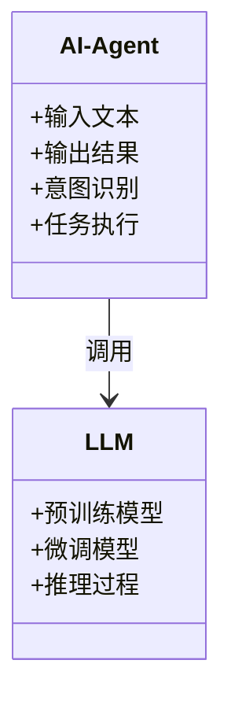
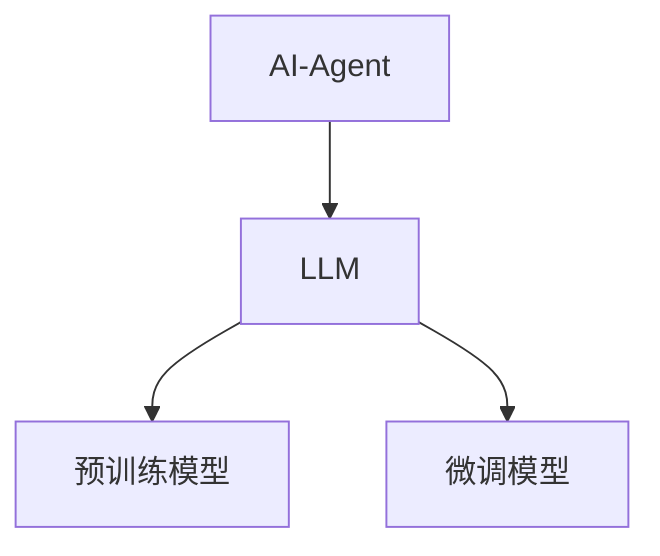
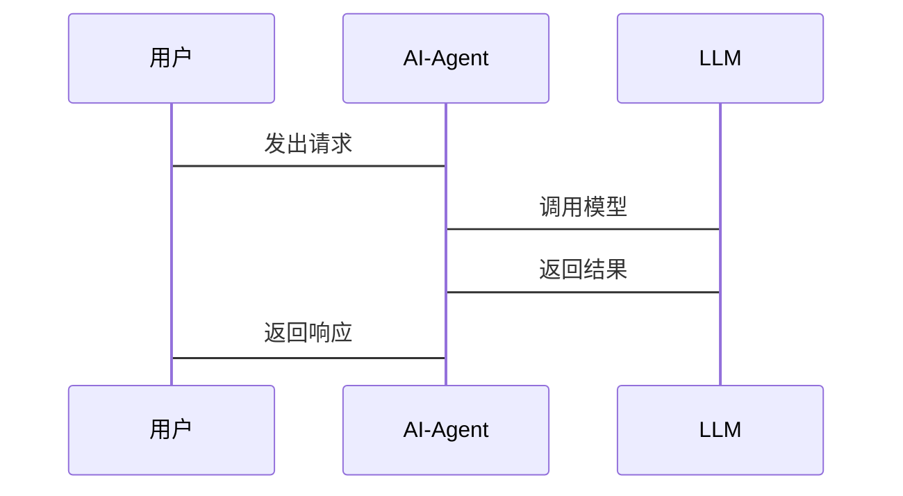

                 


# AI Agent的深层语义理解：提升LLM的隐含信息提取

> 关键词：AI Agent, 深层语义理解, LLM, 隐含信息提取, 语境理解, 注意力机制, 系统架构

> 摘要：本文深入探讨了AI Agent在深层语义理解中的应用，重点分析了如何通过提升大语言模型（LLM）的隐含信息提取能力，实现更精准的语境理解和任务处理。文章从核心概念、算法原理、系统架构到项目实战，全面解析了深层语义理解的关键技术，并通过具体案例展示了其在实际场景中的应用价值。

---

# 第1章：AI Agent与深层语义理解概述

## 1.1 AI Agent的基本概念

### 1.1.1 AI Agent的定义与特点
AI Agent（人工智能代理）是指能够感知环境、自主决策并执行任务的智能实体。其特点包括：
- **自主性**：能够在没有外部干预的情况下独立运作。
- **反应性**：能够实时感知环境并做出响应。
- **目标导向**：通过设定目标来驱动行为。
- **社会能力**：能够与其他Agent或人类进行交互和协作。

### 1.1.2 AI Agent的核心功能与应用场景
AI Agent的核心功能包括信息处理、决策制定、任务执行和交互能力。其应用场景广泛，例如智能助手、推荐系统、自动化客服、自动驾驶等。

### 1.1.3 深层语义理解在AI Agent中的重要性
深层语义理解是AI Agent实现高效信息处理和任务执行的关键。通过理解输入文本的深层含义，AI Agent能够更好地完成用户的意图识别、信息检索和决策支持。

## 1.2 大语言模型（LLM）的基本原理

### 1.2.1 LLM的定义与技术基础
大语言模型（LLM）是指基于深度学习构建的大型神经网络模型，旨在通过大量数据训练来理解和生成人类语言。其技术基础包括词嵌入、注意力机制和Transformer架构。

### 1.2.2 LLM的训练与推理机制
- **训练**：通过监督学习和无监督学习，模型在大规模语料库上进行预训练，学习语言的分布规律。
- **推理**：在给定输入的基础上，生成符合语境的输出，例如文本生成、翻译或问答。

### 1.2.3 LLM在语义理解中的优势
- **上下文理解**：能够捕捉文本中的上下文信息，进行语境推理。
- **语义多样性**：能够理解语言的多义性和模糊性，提供多样化的语义解释。

## 1.3 深层语义理解的定义与目标

### 1.3.1 什么是深层语义理解
深层语义理解是指对文本的内在含义进行分析，超越表面的字面意思，挖掘隐藏在语境中的信息。

### 1.3.2 深层语义理解的核心目标
- **意图识别**：准确理解用户的意图。
- **实体识别**：提取文本中的关键实体信息。
- **隐含信息提取**：挖掘文本中未明确表达但隐含的信息。

### 1.3.3 深层语义理解与浅层理解的区别
- **浅层理解**：基于词法和句法分析，提取表面信息。
- **深层理解**：基于语境和上下文，提取隐含信息。

---

# 第2章：深层语义理解的核心概念与联系

## 2.1 深层语义理解的层次分析

### 2.1.1 表层理解与深层理解的对比
| 对比维度 | 表层理解 | 深层理解 |
|----------|----------|----------|
| 分析层次 | 词法、句法 | 语义、语境 |
| 信息深度 | 表面信息 | 隐含信息 |
| 应用场景 | 信息检索 | 意图识别 |

### 2.1.2 深层语义理解的多维度分析
深层语义理解可以从语义角色分析、语境推理和情感分析等多个维度进行分析。

### 2.1.3 上下文在深层理解中的作用
上下文是深层语义理解的核心，通过上下文分析，模型能够更好地理解文本的隐含含义。

## 2.2 隐含信息提取的关键要素

### 2.2.1 隐含信息的定义与分类
隐含信息是指文本中未明确表达但可以通过上下文推理得出的信息。其分类包括意图、实体关系和背景知识。

### 2.2.2 隐含信息提取的挑战与难点
- **语义多样性**：文本中的隐含信息可能具有多种解释。
- **上下文依赖性**：隐含信息的理解依赖于上下文。
- **模型限制**：模型的训练数据和架构可能限制其隐含信息提取能力。

### 2.2.3 隐含信息与语境的关系
隐含信息的理解高度依赖于语境，语境提供了隐含信息的背景和上下文。

## 2.3 深层语义理解与AI Agent的结合

### 2.3.1 AI Agent中深层理解的应用场景
- **智能对话系统**：通过深层语义理解实现更自然的对话交互。
- **任务型AI Agent**：通过深层理解用户需求，执行复杂任务。

### 2.3.2 深层理解对AI Agent性能的提升
- **意图识别准确率**：通过深层语义理解，提高意图识别的准确率。
- **任务执行效率**：通过理解用户意图，优化任务执行流程。

### 2.3.3 深层理解与任务目标的关系
深层理解是AI Agent实现任务目标的核心能力，通过理解用户需求，AI Agent能够更好地完成任务。

---

# 第3章：深层语义理解的核心算法与原理

## 3.1 基于上下文的注意力机制

### 3.1.1 注意力机制的定义与作用
注意力机制是一种基于上下文信息的权重分配机制，用于关注输入中的重要部分。

### 3.1.2 基于上下文的注意力模型
$$
\text{权重计算} = \text{softmax}(\text{Query} \cdot \text{Key})
$$

### 3.1.3 注意力机制在LLM中的应用
通过注意力机制，模型能够更好地捕捉上下文信息，提升语义理解能力。

## 3.2 隐含信息提取的模型优化

### 3.2.1 模型优化的目标
优化模型参数，提升隐含信息提取的准确率。

### 3.2.2 基于预训练的微调策略
- **预训练**：在大规模语料库上进行预训练。
- **微调**：针对特定任务进行微调。

### 3.2.3 模型优化的数学表达
$$
\text{损失函数} = \text{交叉熵损失} + \lambda \cdot \text{正则化项}
$$

---

# 第4章：系统分析与架构设计方案

## 4.1 问题场景介绍

### 4.1.1 系统目标
实现AI Agent的深层语义理解能力，提升隐含信息提取的准确率。

### 4.1.2 系统功能
- **信息处理**：对输入文本进行语义分析。
- **隐含信息提取**：提取文本中的隐含信息。
- **任务执行**：根据隐含信息执行相关任务。

## 4.2 系统设计

### 4.2.1 系统功能设计（领域模型）


### 4.2.2 系统架构设计（系统架构图）


### 4.2.3 系统接口设计
- **输入接口**：接收用户输入的文本。
- **输出接口**：输出语义分析结果和隐含信息。

### 4.2.4 系统交互设计（交互流程图）


---

# 第5章：项目实战

## 5.1 环境安装

### 5.1.1 安装Python
```bash
python --version
```

### 5.1.2 安装依赖库
```bash
pip install transformers
```

## 5.2 核心代码实现

### 5.2.1 注意力机制实现
```python
import torch
class AttentionMechanism(torch.nn.Module):
    def __init__(self, embed_dim, key_dim):
        super(AttentionMechanism, self).__init__()
        self.W_q = torch.nn.Linear(embed_dim, key_dim)
        self.W_k = torch.nn.Linear(embed_dim, key_dim)
    def forward(self, query, key):
        scores = torch.mul(self.W_q(query), self.W_k(key))
        scores = torch.sum(scores, dim=-1)
        attention = torch.softmax(scores, dim=-1)
        return attention
```

### 5.2.2 隐含信息提取实现
```python
def extract_inference(text):
    # 输入文本处理
    inputs = tokenizer(text, return_tensors='pt')
    # 调用LLM进行推理
    outputs = model.generate(**inputs)
    # 解析输出结果
    return tokenizer.decode(outputs[0])
```

## 5.3 案例分析

### 5.3.1 案例场景
用户输入：“我需要在下周五之前完成这个项目。”

### 5.3.2 系统输出
- **意图识别**：完成项目。
- **时间信息**：下周五之前。
- **隐含信息**：项目截止日期为下周五。

---

# 第6章：最佳实践与未来展望

## 6.1 最佳实践 tips

### 6.1.1 模型选择
选择适合任务的模型，并进行针对性的微调。

### 6.1.2 数据质量
确保训练数据的多样性和高质量，以提升模型的泛化能力。

### 6.1.3 优化策略
通过参数调优和模型压缩，提升模型的性能和效率。

## 6.2 小结

### 6.2.1 深层语义理解的核心价值
通过提升深层语义理解能力，AI Agent能够更好地实现任务目标。

### 6.2.2 本文的主要内容总结
本文从概念、算法、系统架构到项目实战，全面解析了深层语义理解的关键技术。

## 6.3 注意事项

### 6.3.1 模型局限性
目前的模型仍存在理解能力的局限性，需要进一步优化和改进。

### 6.3.2 数据隐私
在实际应用中，需要注意数据隐私和模型安全。

## 6.4 未来展望

### 6.4.1 技术发展趋势
随着大语言模型的不断发展，深层语义理解能力将不断提升。

### 6.4.2 应用前景
深层语义理解将在更多领域得到应用，推动AI Agent的智能化发展。

---

# 附录：参考文献

1. Vaswani, A., et al. "Attention Is All You Need." Advances in Neural Information Processing Systems, 2017.
2. Brown, T., et al. "Language Models Are Few-Shot Learners." arXiv preprint arXiv:1909.01037, 2019.
3. Devlin, J., et al. "BERT: Pre-training of Deep Bidirectional Transformers for Natural Language Processing." arXiv preprint arXiv:1810.0469, 2018.

---

# 结语

通过本文的深入探讨，我们不仅了解了AI Agent和深层语义理解的核心概念，还掌握了提升LLM隐含信息提取的关键技术。未来，随着技术的不断进步，AI Agent的深层语义理解能力将更加智能化，为更多领域带来创新和变革。

