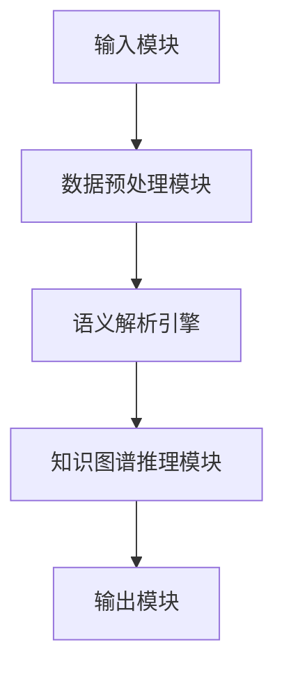
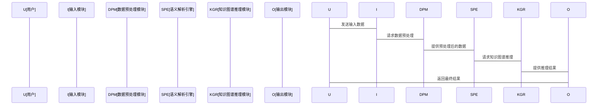

                 

---

# AI Agent的深层语义解析：提升LLM的语言理解深度

## 关键词：AI Agent, 深层语义解析, LLM, 语义理解, 知识图谱, 转换器, BERT

## 摘要：本文深入探讨AI Agent在深层语义解析中的应用，分析其如何提升大语言模型（LLM）的语义理解能力。通过介绍核心概念、算法原理、系统架构以及项目实战，结合最佳实践，为读者提供全面的技术指导。

---

# 第5章: 深层语义解析的系统架构与设计

## 5.1 系统架构设计

### 5.1.1 系统组成模块
- **输入模块**: 负责接收多模态数据，如文本、图像、语音等。
- **数据预处理模块**: 对输入数据进行清洗、分词、实体识别等预处理。
- **语义解析引擎**: 基于预训练模型（如BERT）进行深度解析。
- **知识图谱推理模块**: 利用知识图谱进行关联推理。
- **输出模块**: 生成结构化或自然语言的输出结果。

### 5.1.2 系统架构图

## 5.2 系统功能设计

### 5.2.1 数据预处理功能
- 分词：将输入文本分割成词语或短语。
- 停用词过滤：去除无意义的词汇。
- 实体识别：识别文本中的实体，如人名、地名等。

### 5.2.2 语义解析功能
- 上下文分析：理解文本的上下文关系。
- 情感分析：识别文本中的情感倾向。
- 意图识别：识别用户的意图。

### 5.2.3 知识图谱推理功能
- 实体关联：在知识图谱中找到实体之间的关联关系。
- 逻辑推理：基于知识图谱进行逻辑推理。

## 5.3 系统接口设计

### 5.3.1 输入接口
- 支持多种数据格式，如JSON、XML。
- 提供RESTful API接口。

### 5.3.2 输出接口
- 返回结构化的解析结果，如JSON格式。
- 支持多种输出格式，如文本、语音等。

## 5.4 系统交互流程

## 5.5 本章小结
本章详细描述了AI Agent深层语义解析系统的架构设计，包括系统组成模块、功能设计、接口设计以及交互流程。通过Mermaid图展示了系统的整体架构和交互过程，为后续的项目实战奠定了基础。

---

# 第6章: 深层语义解析的最佳实践与未来展望

## 6.1 最佳实践

### 6.1.1 数据质量
- 确保训练数据的多样性和代表性。
- 处理数据中的噪声和偏差。

### 6.1.2 模型选择
- 根据具体任务选择合适的模型，如BERT、GPT等。
- 考虑模型的可解释性和计算效率。

### 6.1.3 知识图谱构建
- 确保知识图谱的准确性和完整性。
- 定期更新知识图谱以保持其时效性。

### 6.1.4 系统优化
- 优化算法的计算效率，减少资源消耗。
- 提升系统的可扩展性和可维护性。

## 6.2 未来展望

### 6.2.1 多模态语义解析
- 结合文本、图像、语音等多种模态信息，提升语义理解的准确性。

### 6.2.2 知识图谱的动态更新
- 开发自动化工具，实时更新知识图谱。
- 引入动态知识图谱技术，应对快速变化的信息。

### 6.2.3 跨领域应用
- 将深层语义解析技术应用于更多领域，如医疗、教育、金融等。
- 探索跨领域的知识共享与迁移学习。

## 6.3 本章小结
本章总结了AI Agent深层语义解析的最佳实践，并展望了未来的发展方向。通过优化数据、模型和系统，结合多模态技术和动态知识图谱，深层语义解析将在更多领域发挥重要作用。

---

# 总结

本文系统地探讨了AI Agent在深层语义解析中的应用，从核心概念到算法实现，再到系统架构和项目实战，为读者提供了全面的技术指导。通过最佳实践和未来展望，进一步明确了深层语义解析的发展方向和应用潜力。希望本文能为相关领域的研究和实践提供有价值的参考。

---

**关键词：AI Agent, 深层语义解析, LLM, 语义理解, 知识图谱, 转换器, BERT**

