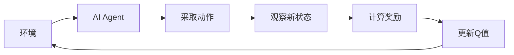

                 


# AI Agent的深度强化学习实现与优化

> 关键词：AI Agent, 深度强化学习, 强化学习, 神经网络, 算法优化

> 摘要：本文将详细探讨AI Agent在深度强化学习中的实现与优化方法。从基础概念到算法原理，再到系统架构和项目实战，结合数学模型和实际案例，全面解析深度强化学习在AI Agent中的应用。通过优化策略和高级主题的探讨，为读者提供深入的技术指导。

---

## 第一部分：AI Agent与深度强化学习概述

### 第1章：AI Agent的基本概念

#### 1.1 AI Agent的定义
AI Agent（人工智能代理）是指能够感知环境、自主决策并执行任务的智能体。它可以是一个软件程序或硬件设备，通过与环境交互来实现特定目标。

#### 1.2 AI Agent的核心特征
- **自主性**：AI Agent能够自主决策，无需外部干预。
- **反应性**：能够实时感知环境并做出反应。
- **目标导向**：所有行为都围绕实现特定目标展开。
- **学习能力**：通过经验改进性能。

#### 1.3 AI Agent的应用场景
- 游戏AI：在电子游戏中做出决策。
- 机器人控制：实现自主导航和任务执行。
- 推荐系统：根据用户行为推荐内容。
- 自动交易：在金融市场上进行自动交易。

### 第2章：深度强化学习的背景与意义

#### 2.1 强化学习的基本原理
强化学习是一种通过试错机制来优化决策过程的学习方法。AI Agent通过与环境交互，学习采取最优动作以获得最大累计奖励。

#### 2.2 深度强化学习的优势
- **处理高维状态空间**：深度神经网络能够处理复杂的高维输入。
- **非线性关系建模**：深度模型可以捕捉复杂的非线性关系。
- **端到端学习**：可以直接从输入到输出进行端到端优化。

#### 2.3 深度强化学习在AI Agent中的作用
通过深度强化学习，AI Agent能够从经验中学习，不断优化决策策略，提升任务执行效率和准确性。

---

## 第二部分：深度强化学习的核心概念与数学模型

### 第3章：强化学习的基本原理

#### 3.1 状态、动作、奖励的定义
- **状态（State）**：环境在某一时刻的描述，例如游戏中的棋盘状态。
- **动作（Action）**：AI Agent在某一状态下采取的行为，例如移动棋子。
- **奖励（Reward）**：AI Agent采取动作后获得的反馈，通常是一个数值，用于评估动作的好坏。

#### 3.2 Q-learning算法的数学模型
Q-learning是一种经典的强化学习算法，通过更新Q值表来学习最优策略：
$$ Q(s,a) = r + \gamma \max Q(s',a') $$
其中，$s$是当前状态，$a$是当前动作，$s'$是下一状态，$\gamma$是折扣因子。

### 第4章：深度强化学习的数学框架

#### 4.1 神经网络在强化学习中的应用
深度神经网络用于近似Q值函数或策略函数：
$$ Q(s,a) = \phi(s) \cdot \theta $$
其中，$\phi(s)$是状态的特征表示，$\theta$是网络参数。

#### 4.2 策略梯度方法的数学表达
策略梯度方法直接优化策略，通过梯度上升最大化目标函数：
$$ \nabla \theta \log \pi(a|s) \cdot Q(s,a) $$

#### 4.3 DQN算法的数学模型
DQN（Deep Q-Network）通过神经网络近似Q值函数，引入经验回放和目标网络：
$$ Q_{target}(s',a') = r + \gamma Q_{main}(s',a') $$

### 第5章：深度强化学习的核心算法

#### 5.1 DQN算法的流程图


#### 5.2 PPO算法的数学表达
PPO（Proximal Policy Optimization）通过限制策略更新幅度来确保稳定性：
$$ \theta_{t+1} = \arg \max_{\theta} \left( J(\theta) - \beta D_{KL}( \pi_{\theta} \| \pi_{\theta_t}) ) \right) $$

---

## 第三部分：深度强化学习的系统架构设计

### 第6章：系统架构概述

#### 6.1 系统功能模块划分
- **感知模块**：处理环境输入，提取特征。
- **决策模块**：基于特征进行动作选择。
- **学习模块**：更新模型参数，优化策略。

#### 6.2 系统架构的层次结构
```mermaid
classDiagram
    class 环境 {
        状态
        奖励
    }
    class AI Agent {
        神经网络
        动作选择
    }
    环境 <--o> AI Agent
```

#### 6.3 系统接口设计
- **输入接口**：接收环境状态和奖励。
- **输出接口**：输出动作和模型参数更新。

---

## 第四部分：深度强化学习的项目实战

### 第7章：项目实战

#### 7.1 环境安装
安装必要的库，例如TensorFlow、Keras、OpenAI Gym。

#### 7.2 系统核心实现源代码
```python
import gym
import numpy as np
import tensorflow as tf

# 定义DQN网络
class DQNetwork:
    def __init__(self, state_space, action_space, lr=0.001):
        self.model = tf.keras.Sequential([
            tf.keras.layers.Dense(64, activation='relu', input_dim=state_space),
            tf.keras.layers.Dense(action_space)
        ])
        self.optimizer = tf.keras.optimizers.Adam(learning_rate=lr)
    
    def predict(self, state):
        return self.model.predict(state)
    
    def train(self, states, targets):
        with tf.GradientTape() as tape:
            predictions = self.model.predict(states)
            loss = tf.keras.losses.mean_squared_error(targets, predictions)
        gradients = tape.gradient(loss, self.model.trainable_weights)
        self.optimizer.apply_gradients(zip(gradients, self.model.trainable_weights))
```

#### 7.3 代码应用解读与分析
通过训练一个简单的游戏AI，展示深度强化学习在实际项目中的应用。

---

## 第五部分：深度强化学习的优化方法

### 第8章：优化方法

#### 8.1 超参数调整
- 学习率：通常在0.001到0.01之间。
- 批处理大小：根据硬件能力调整。
- 折扣因子：通常设置在0.9到0.99之间。

#### 8.2 网络架构优化
- 使用更深的网络结构。
- 添加Dropout层防止过拟合。
- 使用Batch Normalization加速训练。

#### 8.3 训练技巧
- 经验回放：存储和复用历史经验。
- 目标网络：稳定训练过程。
- 多样化动作选择：平衡探索与利用。

---

## 第六部分：高级主题

### 第9章：多智能体强化学习

#### 9.1 多智能体系统中的协调问题
- 协作与竞争：多个智能体之间的关系。
- 共享与独有目标：多个智能体的目标可能不同。

#### 9.2 分布式训练
- 分布式训练架构：使用多台设备并行训练。
- 参数服务器：集中管理模型参数。

---

## 第七部分：附录

### 第10章：参考资料与工具

#### 10.1 常用深度学习框架
- TensorFlow
- PyTorch

#### 10.2 强化学习库
- OpenAI Gym
- RLlib

#### 10.3 推荐书籍和论文
- 《Deep Reinforcement Learning》
-《Reinforcement Learning: Theory and Algorithms》

---

通过以上详细的内容结构，您可以逐步展开每一部分的写作，确保逻辑清晰、内容丰富，帮助读者全面理解AI Agent的深度强化学习实现与优化。

