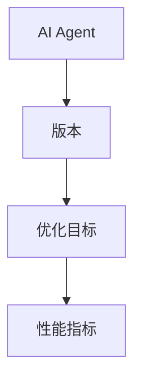
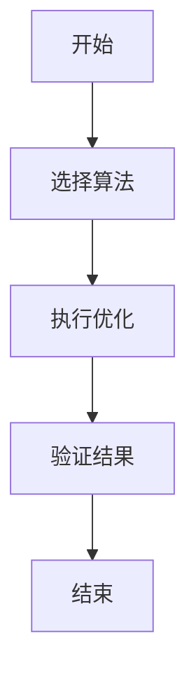
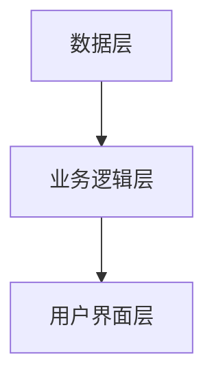
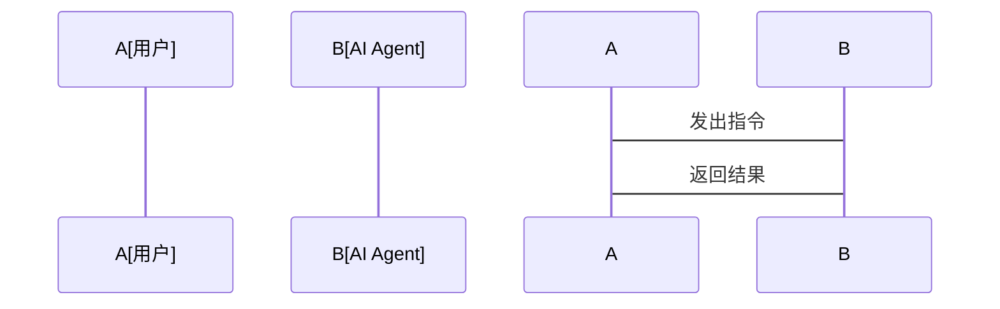

                 


# AI Agent的版本控制与迭代优化流程

> 关键词：AI Agent, 版本控制, 迭代优化, 算法原理, 系统架构, 项目实战

> 摘要：本文深入探讨AI Agent的版本控制与迭代优化流程，从基本概念到算法原理，再到系统架构和项目实战，全面解析如何有效管理和优化AI Agent的版本，提升其性能和稳定性。

---

## 第1章 AI Agent的背景与概念

### 1.1 AI Agent的基本概念
- **1.1.1 什么是AI Agent**
  - AI Agent（人工智能代理）是指能够感知环境并采取行动以实现目标的智能实体。
  - AI Agent可以是软件程序、机器人或其他智能系统。

- **1.1.2 AI Agent的类型**
  - 简单反射型Agent：基于当前感知直接行动，不考虑后续影响。
  - 计划型Agent：具有目标和计划，能够根据环境动态调整行动。
  - 学习型Agent：能够通过经验改进性能，具备自适应能力。

- **1.1.3 AI Agent的核心特征**
  - 感知环境：通过传感器或其他输入方式获取信息。
  - 制定策略：基于当前状态和目标，选择最优行动。
  - 执行行动：通过执行器或输出模块采取行动。
  - 学习优化：通过反馈改进自身策略和性能。

### 1.2 AI Agent的版本控制与迭代优化的必要性
- **1.2.1 为什么需要版本控制**
  - AI Agent的复杂性要求对其代码、模型和配置进行有效管理。
  - 版本控制帮助记录每次更新，便于回溯和修复问题。
  - 通过版本控制，可以实现多人协作开发，避免冲突。

- **1.2.2 迭代优化的重要性**
  - AI Agent的性能需要通过不断优化算法、模型和参数来提升。
  - 迭代优化能够帮助AI Agent适应动态变化的环境。
  - 通过迭代优化，可以降低错误率，提高准确性和效率。

- **1.2.3 版本控制与迭代优化的关系**
  - 版本控制为迭代优化提供基础，确保每次优化都有记录可查。
  - 迭代优化推动版本更新，版本控制保障优化过程的可追溯性。

### 1.3 本章小结
- 本章介绍了AI Agent的基本概念、类型及其核心特征，强调了版本控制与迭代优化的重要性，并分析了两者之间的关系。

---

## 第2章 AI Agent版本控制的核心概念与联系

### 2.1 版本控制的原理
- **2.1.1 版本控制的基本原理**
  - 版本控制通过记录文件的变化，支持多人协作开发和历史追溯。
  - 常见的版本控制工具包括Git、 SVN等。

- **2.1.2 版本控制的关键要素**
  - **仓库（Repository）**：存储所有文件和版本历史的数据库。
  - **分支（Branch）**：代表代码的不同开发路径。
  - **合并（Merge）**：将不同分支的代码整合到一起。
  - **标签（Tag）**：标记重要的版本点。

- **2.1.3 版本控制的优缺点对比**
  - **优点**：
    - 支持多人协作开发。
    - 可以回溯和恢复代码。
    - 便于管理不同版本的功能。
  - **缺点**：
    - 增加了开发复杂性。
    - 学习和使用有一定门槛。

### 2.2 迭代优化的原理
- **2.2.1 迭代优化的基本原理**
  - 迭代优化通过多次迭代改进算法或模型，逐步逼近最优解。
  - 每次迭代基于前一次的结果进行调整和优化。

- **2.2.2 迭代优化的关键步骤**
  1. 确定优化目标。
  2. 制定优化策略。
  3. 执行优化步骤。
  4. 评估优化效果。
  5. 决定是否终止或继续优化。

- **2.2.3 迭代优化的数学模型**
  - 优化目标可以表示为函数 \( f(x) \)，其中 \( x \) 是优化变量。
  - 约束条件可以用不等式表示，例如 \( g(x) \leq 0 \)。

### 2.3 版本控制与迭代优化的联系
- **2.3.1 版本控制对迭代优化的影响**
  - 版本控制为迭代优化提供了一个可靠的版本管理机制。
  - 每次迭代优化的结果可以作为一个新的版本进行记录。

- **2.3.2 迭代优化对版本控制的促进作用**
  - 迭代优化帮助版本控制系统更高效地管理代码和模型。
  - 通过优化版本控制流程，可以提高开发效率。

- **2.3.3 两者的协同优化机制**
  - 在迭代优化过程中，每次版本更新都记录在版本控制系统中。
  - 版本控制帮助迭代优化过程中的版本回溯和修复。

### 2.4 实体关系图（ER图）


### 2.5 本章小结
- 本章详细讲解了版本控制和迭代优化的核心概念，分析了它们之间的联系，并通过ER图展示了实体关系。

---

## 第3章 AI Agent版本控制与迭代优化的算法原理

### 3.1 版本控制算法
- **3.1.1 分支与合并算法**
  - 分支（Branch）：创建一个新的开发线，用于独立开发。
  - 合并（Merge）：将分支的代码合并到主分支，解决冲突。

- **3.1.2 版本回滚算法**
  - 回滚（Rollback）：恢复到某个特定版本的代码状态。

- **3.1.3 版本冲突解决算法**
  - 冲突检测：在合并过程中识别冲突。
  - 冲突解决：手动或自动解决冲突，确保代码一致性。

### 3.2 迭代优化算法
- **3.2.1 遗传算法**
  - **基本步骤**：
    1. 初始化种群。
    2. 计算适应度。
    3. 选择适应度高的个体。
    4. 进行交叉和变异。
    5. 重复迭代直到满足条件。

- **3.2.2 梯度下降算法**
  - **基本步骤**：
    1. 初始化参数。
    2. 计算损失函数。
    3. 计算梯度。
    4. 更新参数。
    5. 重复迭代直到收敛。

- **3.2.3 贪婪算法**
  - **基本步骤**：
    1. 确定优化目标。
    2. 在每一步选择当前最优解。
    3. 逐步逼近全局最优解。

### 3.3 算法流程图


### 3.4 算法实现代码
```python
def version_control(branch):
    # 简单版本控制示例
    pass

def iteration_optimization(target):
    # 简单迭代优化示例
    pass
```

### 3.5 本章小结
- 本章介绍了版本控制和迭代优化的主要算法及其流程图，展示了如何通过算法实现版本管理和性能优化。

---

## 第4章 AI Agent版本控制与迭代优化的数学模型

### 4.1 版本控制的数学模型
- **4.1.1 版本号的表示**
  - 版本号可以用整数表示，例如 \( v_i \) 表示第 \( i \) 个版本。

- **4.1.2 依赖关系的数学表示**
  - 依赖关系可以用图论中的边表示，例如 \( (A, B) \) 表示 \( A \) 依赖 \( B \)。

- **4.1.3 合并操作的数学模型**
  - 合并操作可以用布尔逻辑表示，例如 \( A \cup B \) 表示合并 \( A \) 和 \( B \)。

### 4.2 迭代优化的数学模型
- **4.2.1 优化目标的数学表达**
  - 优化目标可以用函数 \( f(x) \) 表示，其中 \( x \) 是优化变量。

- **4.2.2 约束条件的数学表示**
  - 约束条件可以用不等式表示，例如 \( g(x) \leq 0 \)。

- **4.2.3 收敛性分析**
  - 收敛性分析研究算法是否能够收敛到最优解。

### 4.3 数学公式
- **版本号递增公式**：$$ v_{i+1} = v_i + 1 $$
- **优化目标的函数表示**：$$ f(x) = \text{损失函数} $$
- **约束条件表示**：$$ g(x) \leq 0 $$

### 4.4 本章小结
- 本章通过数学模型展示了版本控制和迭代优化的内在逻辑，为后续的系统设计和项目实现奠定了理论基础。

---

## 第5章 AI Agent的系统分析与架构设计

### 5.1 问题场景介绍
- AI Agent需要在复杂环境中完成任务，版本控制和迭代优化是其实现高效运行的关键。

### 5.2 系统功能设计
- **领域模型设计**：
  - 定义AI Agent的组成部分，例如感知模块、决策模块、执行模块。

- **系统架构设计**：
  - 使用分层架构，包括数据层、业务逻辑层和用户界面层。

### 5.3 系统架构设计mermaid图


### 5.4 系统接口设计
- **输入接口**：接收环境数据和用户指令。
- **输出接口**：发送执行命令和反馈信息。

### 5.5 系统交互mermaid序列图


### 5.6 本章小结
- 本章通过系统分析和架构设计，明确了AI Agent的实现路径和关键接口设计。

---

## 第6章 AI Agent的项目实战

### 6.1 环境安装
- 安装必要的开发工具和库，例如Git、Python、机器学习框架等。

### 6.2 系统核心实现源代码
```python
# 简单版本控制示例
def create_branch(branch_name):
    # 创建分支
    pass

# 简单迭代优化示例
def optimize_model(model):
    # 迭代优化模型
    pass
```

### 6.3 代码应用解读与分析
- 通过代码示例，展示版本控制和迭代优化的具体实现步骤。

### 6.4 实际案例分析
- 以一个具体的AI Agent项目为例，详细分析版本控制和迭代优化的全过程。

### 6.5 项目小结
- 总结项目实现的经验和教训，提出改进建议。

### 6.6 本章小结
- 本章通过项目实战，展示了如何将理论应用于实际开发中。

---

## 第7章 总结与展望

### 7.1 本章总结
- 总结全书的核心内容，强调版本控制和迭代优化的重要性。

### 7.2 最佳实践 tips
- 提供一些实用的开发建议和技巧，帮助读者提高开发效率。

### 7.3 小结
- 回顾全书，总结主要知识点和关键结论。

### 7.4 注意事项
- 提醒读者在开发过程中需要注意的事项，避免常见错误。

### 7.5 拓展阅读
- 推荐相关领域的书籍和资源，供读者进一步学习。

### 7.6 本章小结
- 本章通过总结与展望，帮助读者更好地理解和应用所学知识。

---

## 附录

### 附录A 常用工具与库
- 列出常用的版本控制工具、编程语言和机器学习框架。

### 附录B 参考文献
- 列出书中的参考文献和相关资源。

---

通过以上目录大纲，读者可以系统地学习AI Agent的版本控制与迭代优化流程，从基础概念到算法实现，再到系统设计和项目实战，逐步掌握相关技能。

