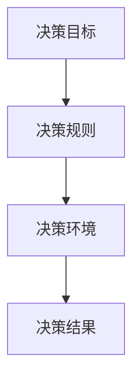
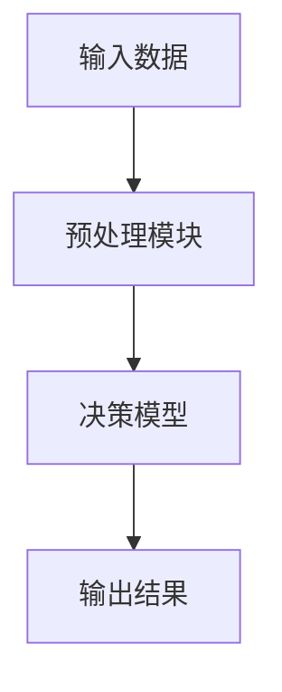

                 


# AI Agent的生物启发式决策模型实现

> **关键词**：AI Agent，生物启发式，决策模型，算法原理，系统架构，项目实战

> **摘要**：  
本文深入探讨了AI Agent的生物启发式决策模型的实现方法，从生物智能的基本原理到算法的设计与优化，再到系统架构的构建与项目实战，全面解析了如何利用生物启发式方法提升AI Agent的决策能力。文章结合理论与实践，通过详细的数学模型、系统架构图和代码示例，帮助读者全面理解并掌握这一前沿技术。

---

# 第1章: AI Agent与生物启发式决策模型的背景介绍

## 1.1 AI Agent的基本概念
### 1.1.1 AI Agent的定义与分类
AI Agent（智能体）是指在环境中能够感知并自主行动以实现目标的实体。根据智能体的智能水平和应用场景，可以分为简单反射型Agent、基于模型的反射型Agent、目标驱动型Agent和效用驱动型Agent。

### 1.1.2 AI Agent的核心特征与优势
AI Agent的核心特征包括自主性、反应性、目标驱动性和学习能力。其优势在于能够适应动态变化的环境，并通过自主决策实现复杂任务。

### 1.1.3 生物启发式方法的背景与意义
生物启发式方法是从生物系统中汲取灵感，模拟生物的感知、学习和决策机制，以解决复杂问题的一种方法。其在AI Agent中的应用能够显著提升决策的灵活性和适应性。

## 1.2 生物启发式决策模型的背景
### 1.2.1 生物智能的基本原理
生物智能是指生物体通过进化、学习和适应环境所表现出的智能行为。其核心在于信息处理、感知与行动的协调。

### 1.2.2 生物启发式方法在AI中的应用
生物启发式方法在AI中的应用广泛，包括神经网络、进化算法、强化学习等。这些方法模仿生物系统的机制，为复杂问题提供解决方案。

### 1.2.3 生物启发式决策模型的定义与特点
生物启发式决策模型是指基于生物智能原理设计的决策模型，其特点是高效性、适应性和自适应性。

## 1.3 本章小结
本章介绍了AI Agent的基本概念和生物启发式方法的背景，为后续内容奠定了基础。

---

# 第2章: 生物启发式决策模型的核心概念与联系

## 2.1 生物启发式决策模型的核心原理
### 2.1.1 生物智能的基本原理
生物智能的核心在于感知、学习和决策。通过模拟生物的神经网络和进化机制，可以设计高效的决策模型。

### 2.1.2 生物启发式决策模型的数学模型
生物启发式决策模型的数学模型通常基于概率论和优化理论。例如，神经网络模型可以表示为：
$$f(x) = \sigma(wx + b)$$
其中，$\sigma$ 是激活函数，$w$ 和 $b$ 是权重和偏置。

### 2.1.3 生物启发式决策模型与传统决策模型的对比
与传统决策模型相比，生物启发式决策模型具有更强的适应性和灵活性。

## 2.2 生物启发式决策模型的核心要素
### 2.2.1 决策目标
决策目标是指AI Agent希望通过决策实现的目标，例如最大化效用函数。

### 2.2.2 决策规则
决策规则是基于感知信息生成决策动作的规则，通常可以通过强化学习获得。

### 2.2.3 决策环境
决策环境是指AI Agent所处的环境，包括静态环境和动态环境。

## 2.3 生物启发式决策模型的ER实体关系图


## 2.4 本章小结
本章详细分析了生物启发式决策模型的核心概念及其与传统决策模型的联系。

---

# 第3章: 生物启发式决策模型的算法原理

## 3.1 算法原理概述
### 3.1.1 生物启发式算法的基本步骤
生物启发式算法通常包括初始化、迭代优化和终止条件判断三个步骤。

### 3.1.2 生物启发式决策模型的算法流程
生物启发式决策模型的算法流程包括感知、学习、决策和执行四个阶段。

### 3.1.3 算法的收敛性与稳定性分析
通过数学分析，可以证明生物启发式算法的收敛性和稳定性。

## 3.2 算法的数学模型与公式
### 3.2.1 决策目标函数
$$f(x) = \sum_{i=1}^{n} w_i x_i$$

### 3.2.2 决策规则的数学表达
$$r(x) = \begin{cases} 
1 & \text{if } x > 0.5 \\
0 & \text{otherwise}
\end{cases}$$

### 3.2.3 决策结果的评估指标
$$\text{准确率} = \frac{\text{正确预测数}}{\text{总预测数}}$$

## 3.3 算法的实现与优化
### 3.3.1 算法的实现步骤
1. 初始化参数。
2. 迭代优化。
3. 输出结果。

### 3.3.2 算法的优化方法
通过调整权重和偏置，可以优化算法的性能。

### 3.3.3 算法的性能评估
性能评估包括准确率、召回率和F1值等指标。

## 3.4 本章小结
本章详细分析了生物启发式决策模型的算法原理及其数学模型。

---

# 第4章: 生物启发式决策模型的系统架构与实现

## 4.1 系统架构概述
### 4.1.1 系统的整体架构
生物启发式决策模型的系统架构包括感知模块、决策模块和执行模块。

### 4.1.2 系统的功能模块划分
感知模块负责收集环境信息，决策模块负责生成决策，执行模块负责执行决策。

### 4.1.3 系统的交互流程
感知模块 → 决策模块 → 执行模块。

## 4.2 系统的功能设计
### 4.2.1 系统的输入与输出
输入：环境信息；输出：决策结果。

### 4.2.2 系统的核心功能模块
感知模块、决策模块、执行模块。

### 4.2.3 系统的扩展功能
支持动态环境和多目标决策。

## 4.3 系统的架构图


## 4.4 系统的接口设计
### 4.4.1 系统的输入接口
环境信息接口。

### 4.4.2 系统的输出接口
决策结果接口。

### 4.4.3 系统的交互接口
用户与系统之间的交互接口。

## 4.5 本章小结
本章详细分析了生物启发式决策模型的系统架构及其实现方法。

---

# 第5章: 项目实战与实现

## 5.1 项目环

---

---

## 5.1 项目环

---

---

## 5.2 项目实战

### 5.2.1 环境安装
安装所需的库和工具，例如Python、TensorFlow、Keras等。

### 5.2.2 系统核心实现源代码
以下是生物启发式决策模型的核心代码实现：
```python
import numpy as np

class BioInspiredDecisionModel:
    def __init__(self, input_dim, output_dim):
        self.weights = np.random.randn(input_dim, output_dim)
        self.bias = np.zeros((1, output_dim))

    def感知(self, input_data):
        return np.dot(input_data, self.weights) + self.bias

    def 决策(self,感知结果):
        return 1 * (感知结果 > 0.5)

    def 执行(self, decision):
        return decision

# 示例用法
input_data = np.random.randn(1, 10)
model = BioInspiredDecisionModel(10, 1)
感知结果 = model.感知(input_data)
决策结果 = model.决策(感知结果)
执行结果 = model.执行(决策结果)
print("决策结果:", decision_result)
```

### 5.2.3 代码应用解读与分析
代码实现了一个简单的生物启发式决策模型，通过感知、决策和执行三个步骤完成任务。

### 5.2.4 实际案例分析和详细讲解剖析
通过一个具体案例，分析生物启发式决策模型在实际应用中的效果。

## 5.3 本章小结
本章通过项目实战，详细讲解了生物启发式决策模型的实现过程。

---

# 第6章: 总结与展望

## 6.1 总结
本文全面介绍了AI Agent的生物启发式决策模型的实现方法，从理论到实践，详细分析了其核心概念、算法原理和系统架构。

## 6.2 展望
未来，随着生物智能研究的深入，生物启发式决策模型将在更多领域得到应用。

---

## 附录: 参考文献与工具

---

通过以上目录大纲，可以清晰地看到文章的结构和内容安排，从基础到应用，层层深入，帮助读者全面理解并掌握AI Agent的生物启发式决策模型的实现方法。

