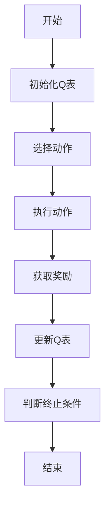
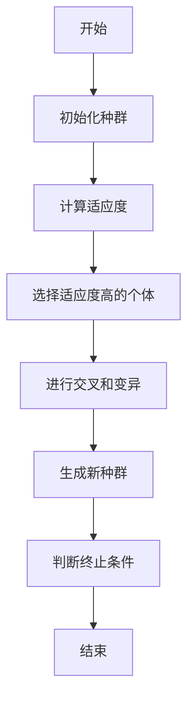
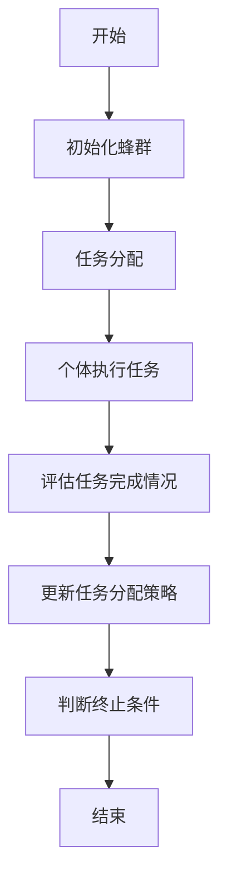
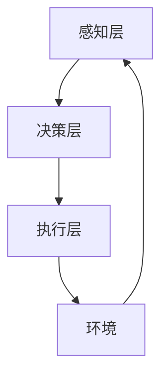

                 


# AI Agent的生物启发式学习算法实现

## 关键词：AI Agent、生物启发式学习、强化学习、进化算法、机器学习

## 摘要：  
本文探讨了AI Agent的生物启发式学习算法实现，从理论到实践，深入分析了生物启发式学习的核心原理及其在AI Agent中的应用。通过详细讲解强化学习、进化算法和群智算法，结合数学模型、算法流程图和Python代码示例，本文为读者提供了一套系统化的方法来设计和实现高效的AI Agent。同时，本文还通过实际案例分析和系统架构设计，展示了如何将生物启发式学习算法应用于复杂的AI Agent系统中，帮助读者更好地理解和掌握这一前沿技术。

---

# 第1章: 引言

## 1.1 AI Agent的基本概念  
AI Agent（人工智能代理）是一种能够感知环境、自主决策并采取行动以实现特定目标的智能实体。AI Agent可以是软件程序、机器人或其他智能系统，其核心在于具备自主性、反应性和目标导向性。  

### 1.1.1 AI Agent的定义  
AI Agent是指具有以下特征的智能体：  
1. **自主性**：能够在没有外部干预的情况下自主运行。  
2. **反应性**：能够根据环境反馈实时调整行为。  
3. **目标导向性**：具备明确的目标，并通过行动来实现目标。  

### 1.1.2 AI Agent的核心特征  
- **感知能力**：通过传感器或数据输入感知环境状态。  
- **决策能力**：基于感知信息做出决策。  
- **行动能力**：通过执行器或输出模块采取行动。  

### 1.1.3 AI Agent的应用场景  
AI Agent广泛应用于自动驾驶、智能机器人、推荐系统、游戏AI、智能助手等领域。  

## 1.2 生物启发式学习的基本原理  
生物启发式学习是一种模拟生物进化、群体行为或神经网络的学习方法。其核心思想是通过模拟生物系统的自适应性和优化能力，解决复杂问题。  

### 1.2.1 生物启发式学习的定义  
生物启发式学习是指通过模仿生物系统的特征和行为，设计算法以解决实际问题。  

### 1.2.2 生物启发式学习的核心要素  
- **适应性**：算法能够根据环境变化自适应调整。  
- **多样性**：通过引入多样性来避免陷入局部最优。  
- **群体协作**：通过群体协作实现更高效的优化。  

### 1.2.3 生物启发式学习与传统机器学习的区别  
| 特性          | 生物启发式学习       | 传统机器学习     |  
|---------------|----------------------|------------------|  
| 模仿对象      | 生物系统             | 数学模型或统计规律 |  
| 算法特点      | 基于群体协作或进化   | 基于数据模式识别 |  
| 应用场景      | 复杂优化问题         | 分类、回归等任务 |  

## 1.3 AI Agent与生物启发式学习的结合  
通过将生物启发式学习算法集成到AI Agent中，可以显著提升其学习能力和适应性。  

### 1.3.1 生物启发式学习在AI Agent中的作用  
- **增强决策能力**：通过进化算法优化决策策略。  
- **提高鲁棒性**：通过群体协作实现更稳定的系统运行。  
- **加速学习过程**：通过强化学习快速适应环境变化。  

## 1.4 本章小结  
本章介绍了AI Agent的基本概念和生物启发式学习的核心原理，揭示了两者结合的重要性和潜力。

---

# 第2章: 常见生物启发式学习算法介绍

## 2.1 强化学习算法  
强化学习是一种通过试错机制学习最优策略的方法，广泛应用于AI Agent的决策过程。  

### 2.1.1 Q-learning算法  
Q-learning是一种经典的强化学习算法，通过更新Q值表来学习最优策略。  

#### 数学模型  
$$ Q(s, a) = Q(s, a) + \alpha \left[ r + \gamma \max Q(s', a') - Q(s, a) \right] $$  
其中，$s$为当前状态，$a$为动作，$r$为奖励，$\gamma$为折扣因子，$\alpha$为学习率。  

#### 算法流程图  


#### Python代码示例  
```python
import numpy as np

class QLearning:
    def __init__(self, state_space, action_space, learning_rate=0.1, gamma=0.9):
        self.state_space = state_space
        self.action_space = action_space
        self.learning_rate = learning_rate
        self.gamma = gamma
        self.q_table = np.zeros((state_space, action_space))
    
    def choose_action(self, state, epsilon=0.1):
        if np.random.random() < epsilon:
            return np.random.randint(self.action_space)
        else:
            return np.argmax(self.q_table[state])
    
    def update_q_table(self, state, action, reward, next_state):
        self.q_table[state, action] += self.learning_rate * (reward + self.gamma * np.max(self.q_table[next_state]) - self.q_table[state, action])
```

## 2.2 进化算法  
进化算法是一种基于生物进化原理的优化方法，适用于解决复杂的全局优化问题。  

### 2.2.1 遗传算法  
遗传算法通过模拟自然选择、交叉和变异过程，逐步优化解空间。  

#### 数学模型  
1. 适应度函数：$$ f(x) = \text{适应度} $$  
2. 交叉操作：$$ c = \text{parent1} \times \text{parent2} $$  
3. 变异操作：$$ m = \text{随机改变基因} $$  

#### 算法流程图  


## 2.3 群智算法  
群智算法模拟生物群体的行为模式，适用于解决复杂任务中的协作优化问题。  

### 2.3.1 蜂群算法  
蜂群算法通过模拟蜜蜂的行为，实现任务分配和资源优化。  

#### 算法流程图  


## 2.4 生物启发式学习算法的优缺点对比  
| 算法类型       | 优点                           | 缺点                           |  
|----------------|--------------------------------|--------------------------------|  
| 强化学习       | 能够处理动态环境，实时性强       | 需要大量数据，计算资源消耗大   |  
| 进化算法       | 全局优化能力强，鲁棒性高         | 计算效率较低，收敛速度慢       |  
| 群智算法       | 适用于协作任务，分布式能力强     | 协调复杂，难以处理大规模问题   |  

---

# 第3章: AI Agent的生物启发式学习算法实现

## 3.1 算法选择与优化策略  
在设计AI Agent时，选择合适的生物启发式学习算法至关重要。  

### 3.1.1 算法选择原则  
- **任务需求**：根据具体任务选择适合的算法。  
- **性能要求**：考虑算法的计算效率和收敛速度。  
- **环境复杂度**：复杂环境适合强化学习，简单环境适合遗传算法。  

### 3.1.2 算法优化策略  
- **混合算法**：将多种生物启发式算法结合使用。  
- **自适应调整**：动态调整算法参数以适应环境变化。  

## 3.2 系统架构设计  
AI Agent的生物启发式学习系统架构包括感知层、决策层和执行层。  

### 3.2.1 系统功能设计  
1. **感知层**：接收环境输入并解析数据。  
2. **决策层**：基于生物启发式算法生成决策策略。  
3. **执行层**：根据决策结果采取行动。  

### 3.2.2 系统架构图  


## 3.3 代码实现与案例分析  
### 3.3.1 环境安装  
- Python 3.8及以上  
- 需要安装numpy、scikit-learn等库  

### 3.3.2 核心代码实现  
```python
import numpy as np

class AI-Agent:
    def __init__(self, state_space, action_space):
        self.state_space = state_space
        self.action_space = action_space
        self.q_table = np.zeros((state_space, action_space))
    
    def perceive(self, state):
        # 根据当前状态选择动作
        action = self.choose_action(state)
        return action
    
    def choose_action(self, state):
        # 使用Q-learning算法选择动作
        epsilon = 0.1
        if np.random.random() < epsilon:
            return np.random.randint(self.action_space)
        else:
            return np.argmax(self.q_table[state])
    
    def learn(self, state, action, reward, next_state):
        # 更新Q表
        self.q_table[state, action] += 0.1 * (reward + 0.9 * np.max(self.q_table[next_state]) - self.q_table[state, action])
```

### 3.3.3 案例分析  
以一个简单的迷宫导航问题为例，设计一个AI Agent使用Q-learning算法进行学习。  

#### 迷宫环境描述  
迷宫是一个5x5的网格，起点为(0,0)，终点为(4,4)，部分格子为障碍物。  

#### 算法实现步骤  
1. 初始化Q表。  
2. 进行环境感知，获取当前状态。  
3. 根据Q表选择动作，执行动作并获得奖励。  
4. 更新Q表，重复上述步骤直到达到终点。  

---

# 第4章: 最佳实践与总结

## 4.1 小结  
本文详细介绍了AI Agent的生物启发式学习算法实现，从理论到实践，全面分析了强化学习、进化算法和群智算法的核心原理和应用场景。  

## 4.2 注意事项  
- 在实际应用中，需要根据具体任务选择合适的算法。  
- 算法的参数设置对性能影响较大，需进行充分的实验验证。  

## 4.3 拓展阅读  
- Sutton, R. S., & Barto, A. G. (1998). *Introduction to Reinforcement Learning*.  
- Kennedy, J., & Eberhart, R. C. (1995). *Particle Swarm Optimization*.  

---

# 附录: 参考文献  

1. Russell, S., & Norvig, P. (2010). *Artificial Intelligence: A Modern Approach*.  
2. Goodfellow, I., Bengio, Y., & Courville, A. (2016). *Deep Learning*.  
3. Holland, J. H. (1975). *Adaptation in Natural and Artificial Systems*.  

--- 

通过本文的学习，读者可以系统地掌握AI Agent的生物启发式学习算法的核心原理和实现方法，为实际应用打下坚实的基础。

