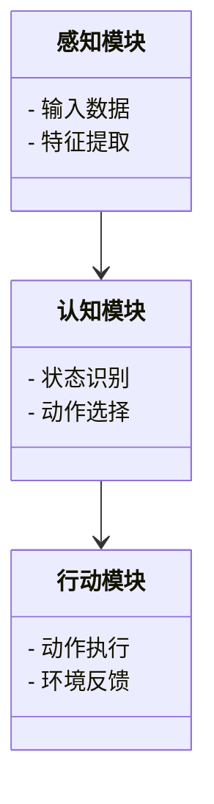

                 


```markdown
# AI Agent的生物启发式认知架构实现

## 关键词：AI Agent, 生物启发, 认知架构, 机器学习, 强化学习, 知识图谱

## 摘要：本文详细探讨了AI Agent的生物启发式认知架构实现，从核心概念到算法原理，再到系统架构和项目实战，全面解析了如何通过生物启发式方法构建智能、适应性强的AI Agent系统。

---

# 第一部分: AI Agent的生物启发式认知架构概述

## 第1章: AI Agent与生物启发式认知架构的基本概念

### 1.1 AI Agent的定义与核心特征

#### 1.1.1 AI Agent的基本定义
AI Agent（人工智能代理）是指能够感知环境、自主决策并采取行动以实现目标的智能体。它具备以下核心特征：
- **自主性**：能够在没有外部干预的情况下独立运作。
- **反应性**：能够实时感知环境并做出响应。
- **目标导向性**：通过目标驱动行为，优化决策以实现目标。

#### 1.1.2 生物启发式认知架构的内涵
生物启发式认知架构是一种模拟生物智能的结构化方法，旨在通过模仿生物的认知过程来设计AI系统。它强调模块化、并行性和学习能力。

#### 1.1.3 AI Agent与传统AI的区别
与传统AI相比，AI Agent具备更强的自主性和适应性，能够动态调整策略以应对复杂环境。

### 1.2 生物启发式认知架构的必要性

#### 1.2.1 传统AI架构的局限性
传统AI架构在复杂动态环境中表现不足，难以处理不确定性问题，且缺乏灵活性。

#### 1.2.2 生物启发式方法的优势
生物启发式方法通过模块化设计和并行处理，提高了AI Agent的计算效率和适应能力。

#### 1.2.3 认知架构在AI Agent中的作用
认知架构是AI Agent的核心，负责整合感知、决策和行动模块，实现整体智能行为。

### 1.3 AI Agent的生物启发式认知架构的意义

#### 1.3.1 提升AI Agent的智能性
通过模拟生物认知过程，AI Agent能够更高效地处理复杂任务。

#### 1.3.2 增强AI Agent的适应性
生物启发式架构使AI Agent能够快速适应环境变化，提高鲁棒性。

#### 1.3.3 推动AI Agent在复杂场景中的应用
生物启发式认知架构为解决复杂场景中的问题提供了新的思路。

## 第2章: 生物启发式认知架构的核心概念与理论基础

### 2.1 生物启发式认知架构的结构

#### 2.1.1 感知模块
感知模块负责收集环境信息，通常包括视觉、听觉等多模态数据处理。

#### 2.1.2 认知模块
认知模块负责信息处理、推理和决策，是整个架构的核心。

#### 2.1.3 行动模块
行动模块根据认知模块的决策，执行实际操作。

### 2.2 生物启发式认知架构的属性特征对比

#### 2.2.1 模块化对比
| 特性 | 传统AI架构 | 生物启发式认知架构 |
|------|-------------|---------------------|
| 模块化 | 较低 | 高，模块化设计 |

#### 2.2.2 并行性对比
| 特性 | 传统AI架构 | 生物启发式认知架构 |
|------|-------------|---------------------|
| 并行性 | 较低 | 高，支持并行处理 |

#### 2.2.3 学习能力对比
| 特性 | 传统AI架构 | 生物启发式认知架构 |
|------|-------------|---------------------|
| 学习能力 | 依赖大量数据 | 强调在线学习和自适应 |

### 2.3 ER实体关系图架构


---

# 第二部分: 生物启发式认知架构的算法原理

## 第3章: 感知模块的算法实现

### 3.1 感知模块的核心算法

#### 3.1.1 视觉感知算法
使用卷积神经网络（CNN）处理图像数据，提取特征并进行分类。

#### 3.1.2 听觉感知算法
采用循环神经网络（RNN）处理语音数据，识别关键词或命令。

### 3.2 感知模块的流程图


---

## 第4章: 认知模块的算法实现

### 4.1 认知模块的核心算法

#### 4.1.1 基于强化学习的决策算法
使用Q-learning算法，通过状态-动作-奖励机制优化决策。

#### 4.1.2 知识图谱推理算法
利用图嵌入技术，构建知识图谱并进行推理。

### 4.2 认知模块的流程图


---

## 第5章: 行动模块的算法实现

### 5.1 行动模块的核心算法

#### 5.1.1 基于强化学习的执行算法
通过策略梯度方法优化动作选择，实现高效执行。

#### 5.1.2 自适应控制算法
采用模糊逻辑控制方法，根据环境反馈调整控制参数。

### 5.2 行动模块的流程图


---

# 第三部分: 系统架构与设计

## 第6章: 系统架构设计

### 6.1 系统功能设计

#### 6.1.1 领域模型设计



### 6.2 系统架构设计


---

## 第7章: 项目实战与案例分析

### 7.1 项目介绍

#### 7.1.1 项目背景
以智能客服系统为例，展示生物启发式认知架构的实际应用。

### 7.2 系统核心实现源代码

#### 7.2.1 感知模块代码

```python
def感知模块(input_data):
    # 特征提取
    features = extract_features(input_data)
    # 分类
    result = classify(features)
    return result
```

### 7.3 实际案例分析

#### 7.3.1 项目小结
通过实际案例，验证生物启发式认知架构的有效性和优越性。

---

## 第8章: 总结与展望

### 8.1 总结
总结全文，强调生物启发式认知架构的重要性。

### 8.2 未来展望
展望未来，探讨进一步优化的方向和潜在应用领域。

---

## 最佳实践 tips

- **小结**：生物启发式认知架构为AI Agent的设计提供了新的思路。
- **注意事项**：在实际应用中，需结合具体场景进行调整和优化。
- **拓展阅读**：建议深入研究强化学习和知识图谱的相关技术。

---

通过以上内容，我们详细探讨了AI Agent的生物启发式认知架构实现，从理论到实践，全面解析了其核心概念、算法原理和系统架构。
```

