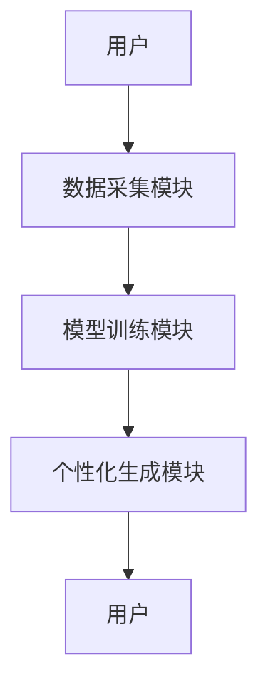
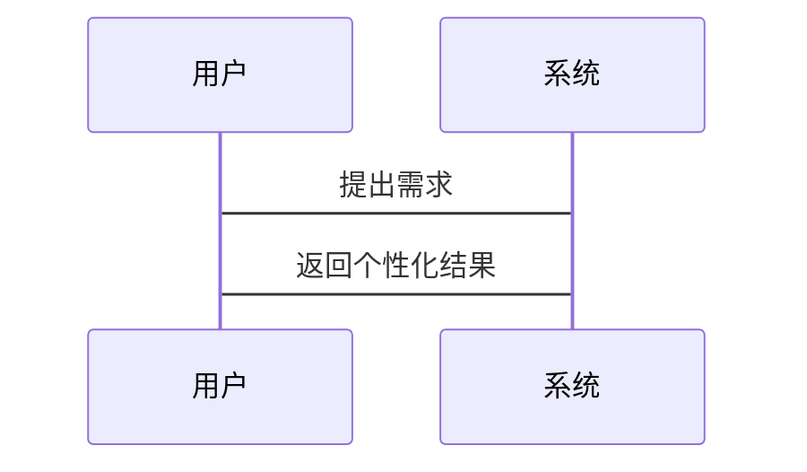
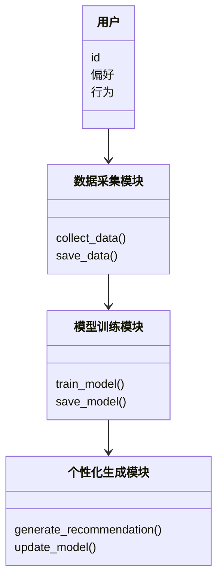

                 


好的，让我们逐步构建这篇文章。首先，我们需要确保文章的结构清晰、内容丰富且符合技术博客的特点。以下是文章的完整结构和内容：

---

# AI Agent的用户体验优化与个性化

> 关键词：AI Agent, 用户体验优化, 个性化推荐, 智能对话系统, 机器学习, 用户行为分析

> 摘要：本文从AI Agent的基本概念出发，详细探讨了其在用户体验优化与个性化服务中的应用。通过分析AI Agent的核心概念、算法原理、系统架构以及实际项目案例，展示了如何利用AI技术提升用户体验。文章还总结了最佳实践和未来发展趋势，为读者提供了全面的视角。

---

## 第一部分: AI Agent的背景与核心概念

### 第1章: AI Agent的基本概念与背景

#### 1.1 AI Agent的定义与核心要素

AI Agent（人工智能代理）是指能够感知环境、执行任务并优化结果的智能系统。它通过数据采集、模型训练和个性化生成等过程，为用户提供高效、个性化的服务。

**核心要素：**

1. **数据采集**：通过传感器、API等方式获取用户行为数据。
2. **模型训练**：利用机器学习算法对数据进行建模。
3. **个性化生成**：基于模型生成个性化内容或决策。
4. **反馈优化**：根据用户反馈调整模型，提升用户体验。

#### 1.2 用户体验优化与个性化概述

用户体验优化的核心是通过技术手段提升用户满意度和使用效率。AI Agent在其中扮演了关键角色，通过个性化推荐、智能对话等方式，为用户提供定制化服务。

**个性化服务的实现方式：**

1. **推荐系统**：基于用户历史行为推荐相关内容。
2. **对话系统**：通过自然语言处理技术与用户交互。
3. **动态调整**：根据实时数据优化服务流程。

### 第2章: AI Agent的发展背景与现状

#### 2.1 AI技术的演进历程

AI技术从传统的规则引擎到现代的大模型，经历了以下几个阶段：

1. **规则引擎时代**：基于预定义规则进行简单决策。
2. **机器学习时代**：利用数据训练模型，实现自动化的决策。
3. **大模型时代**：通过深度学习和大模型提升性能和泛化能力。

#### 2.2 AI Agent在用户体验优化中的应用现状

当前，AI Agent在多个领域得到了广泛应用：

1. **个性化推荐系统**：如Netflix的电影推荐。
2. **智能对话系统**：如Siri、Alexa等语音助手。
3. **教育与医疗**：通过AI Agent为学生提供个性化学习计划，为患者提供医疗建议。

### 第3章: AI Agent的核心概念与原理

#### 3.1 AI Agent的工作原理

AI Agent的工作流程可以分为以下几个步骤：

1. **数据采集**：获取用户行为、偏好等数据。
2. **模型训练**：利用机器学习算法对数据进行建模。
3. **个性化生成**：基于模型生成个性化内容或决策。
4. **反馈优化**：根据用户反馈调整模型，提升用户体验。

**核心原理：**

AI Agent通过数据驱动的方式，不断优化自身的决策能力，从而实现个性化的用户体验。

#### 3.2 用户体验优化的数学模型

**个性化推荐的数学模型：**

推荐系统的核心是协同过滤算法，公式如下：

$$
similarity(i, j) = \frac{\sum_{k} (r_{ik} - \bar{r_i})(r_{jk} - \bar{r_j})}{\sqrt{\sum_{k} (r_{ik} - \bar{r_i})^2} \cdot \sqrt{\sum_{k} (r_{jk} - \bar{r_j})^2}}
$$

其中，$similarity(i, j)$ 表示用户i和用户j之间的相似性，$r_{ik}$ 和 $r_{jk}$ 分别表示用户i和用户j对物品k的评分，$\bar{r_i}$ 和 $\bar{r_j}$ 分别表示用户i和用户j的平均评分。

### 第4章: AI Agent的系统架构与设计

#### 4.1 系统架构设计

AI Agent的系统架构可以分为以下几个模块：

1. **数据采集模块**：负责采集用户行为数据。
2. **模型训练模块**：对数据进行建模和训练。
3. **个性化生成模块**：根据模型生成个性化内容。

**系统架构图：**



#### 4.2 系统交互设计

**用户界面设计：**

用户与AI Agent的交互主要通过以下方式：

1. **文本输入**：用户输入问题或需求。
2. **语音交互**：通过语音助手进行交互。
3. **图形界面**：通过可视化界面进行操作。

**交互流程图：**



---

## 第二部分: AI Agent的算法原理与实现

### 第5章: 推荐算法原理与实现

#### 5.1 推荐算法概述

推荐算法是AI Agent实现个性化服务的核心技术之一。常见的推荐算法包括：

1. **协同过滤算法**：基于用户相似性推荐。
2. **基于内容的推荐算法**：基于物品特征推荐。
3. **混合推荐算法**：结合协同过滤和内容推荐。

**协同过滤算法的实现步骤：**

1. **数据预处理**：对数据进行标准化处理。
2. **计算相似性**：计算用户之间的相似性。
3. **生成推荐**：基于相似性生成推荐列表。

#### 5.2 基于大模型的推荐算法

大模型推荐算法的核心是利用深度学习技术，通过多层神经网络捕捉数据的深层特征。

**生成模型的数学公式：**

$$
P(y|x) = \prod_{i=1}^{n} P(y_i | x, y_{<i})
$$

其中，$y$ 表示生成的目标序列，$x$ 表示输入序列，$y_{<i}$ 表示生成序列的前i-1个元素。

### 第6章: AI Agent的系统架构与设计

#### 6.1 系统功能设计

AI Agent的系统功能设计可以分为以下几个部分：

1. **数据采集模块**：负责采集用户行为数据。
2. **模型训练模块**：对数据进行建模和训练。
3. **个性化生成模块**：根据模型生成个性化内容。

**系统功能图：**



#### 6.2 系统架构设计

AI Agent的系统架构可以分为以下几个层次：

1. **数据层**：存储用户数据和模型数据。
2. **服务层**：提供数据处理和模型训练服务。
3. **应用层**：提供用户交互界面和个性化服务。

**系统架构图：**


---

## 第三部分: 项目实战与优化

### 第7章: 个性化推荐系统的实现

#### 7.1 项目背景与目标

本项目旨在通过实现一个个性化推荐系统，展示AI Agent在用户体验优化中的应用。

#### 7.2 环境配置与安装

```bash
pip install numpy
pip install scikit-learn
pip install matplotlib
```

#### 7.3 核心代码实现

**协同过滤算法的实现：**

```python
from sklearn.metrics.pairwise import cosine_similarity

def collaborative_filtering(X):
    X_mean = X.mean(axis=1).reshape(-1, 1)
    X_centered = X - X_mean
    similarity_matrix = cosine_similarity(X_centered)
    return similarity_matrix
```

**基于内容的推荐算法的实现：**

```python
from sklearn.feature_extraction.text import TfidfVectorizer
from sklearn.metrics.pairwise import cosine_similarity

def content_based_recommendation(documents):
    vectorizer = TfidfVectorizer()
    tfidf = vectorizer.fit_transform(documents)
    similarity_matrix = cosine_similarity(tfidf)
    return similarity_matrix
```

#### 7.4 项目总结与优化

通过实现个性化推荐系统，我们展示了AI Agent在用户体验优化中的应用。未来，可以通过引入大模型技术进一步提升推荐系统的性能。

---

## 第四部分: 最佳实践与未来展望

### 第8章: 最佳实践与注意事项

#### 8.1 数据隐私与安全

在实际应用中，需要特别注意用户数据的隐私和安全问题。

#### 8.2 模型的可解释性

模型的可解释性是用户体验优化的重要因素，需要在模型设计中予以重视。

### 第9章: 未来展望

随着大模型技术的不断进步，AI Agent在用户体验优化中的应用将更加广泛和深入。未来，我们可以期待更多基于大模型的创新应用。

---

通过以上结构和内容的逐步构建，我们可以确保文章逻辑清晰、内容丰富且符合技术博客的特点。希望这篇文章能为读者提供有价值的技术见解和实践指导。

